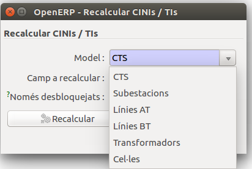

# Documentació dels mòduls de dins de CNMC

Continguts:

* [INF/DE/0066/44](#modul-per-generar-el-fixer-csv-segons-cnmc-infde006644-per-distribuidora)
* [Circular 1/2005](resoluciones/circular_1-2005.md#circular-12005)
* [Circular 4/2014](resoluciones/circular_4-2014.md#circular-42014)
* [Circular 4/2015](resoluciones/circular_4-2015.md#circular-42015)
* [Circular 2/2016](resoluciones/circular_2-2016.md#generacio-de-informes-sobre-reclamacions-de-consumidors)
* [Inventari 4131 (2014)](resoluciones/4131.md)
* [Inventari 5784 (4666/2017)](resoluciones/5784.md#inventari-5784)
* [Plans d'inversió 4667](resoluciones/4667.md)

## Mòdul per generar el fixer CSV segons CNMC INF/DE/0066/44 per distribuïdora

### Introducció

Per poder fer una auditoria de canvis de comercialitzadora, la CNMC demana un
CSV amb el format definit a INF/DE/0066/14

### Generació

Per generar el fitxer, hem d'executar l'assistent que trobarem a
**Administració pública > CNMC > Informe INF/DE/0066/14**

Només caldrà introduïr l'any del qual es vol fer l'informe, que per defecte ja
és 2013 i prèmer el botó **Exportar**.

Des de **Fitxer** es podrà obrie el CSV i descarregar-lo a disc

### Dades utilitzades

Per omplir el fitxer es tenen en compte totes les pólisses creades dins l'any
escollit que tinguin la corresponent modificació contractual de tipus `alta`.

Així doncs, el fitxer generat serà correcte si les altes a la comercialitzadora
es registren com a modificació contractual de la pòlissa de tipus `alta`
correctament.

| Nom del camp               | Valor del camp                                 |
|----------------------------|------------------------------------------------|
| **CODIGO_INFORMANTE**      | Camp `Codi R2` de la companyia                 |
| **CODIGO_CUPS**            | CUPS                                           |
| **FECHA_ACTIVACION**       | Data inici de la modificació contractual nova  |

!!! Info "Nota"
    Codi R2 (R2-xxx) de la CNMC gestionable en el camp `Ref2` de la fitxa de
    l'empresa comercialitzadora accessible des del menú `Empreses`

--------------------------------------------------------------------------------

## Fitxers d'intercanvi

Pels usuaris de GISCE-ERP que no utilitzin el mòdul de facturació de distribució
es defineixen uns fitxers d'intercanvi per actualitzar dades referents als
formularis amb següent format.

### Format CUPS CSV

* Sense capçalera
* Columnes separades per punt i coma (**;**) i sense cometes.
* El separador de decimals de les **energies i la potencia** serà un
 **punt (.)**

Camp                             | Descripció
:--------------------------------|:----------------------------------------------
CUPS                             | Codi universal del punt de subministrament
Energia activa anual consumida   | Energia activa anual facturada el 2014
Energia reactiva anual consumida | Energia reactiva anual facturada el 2014
Potencia facturada               | Potencia facturada el mes 12 any circular o si la pòlisa està de baixa, l'últim mes facturat
Número de lecturas any circular  | Número de lectures d'activa efectuadas en l'any de la circular.

### Format Comptadors CSV

* Sense capçalera
* Columnes separades per punt i coma (**;**) i sense comentes.

Camp            | Descripció
:---------------|:----------------------------------------------
Número de sèrie | Número de sèrie del comptador
CINI            | Codi CINI del comptador

## Assistent per actualitzar CINIs i TIs

### Introducció

Per tal de facilitar l'actualització de tots els codis CINI's i els TI's, es pot fer
desde l'assistent corresponent, aquest permet actualitzar tant els codis TI com
els codis CINI.

### Localització de l'assistent

** Administració pública > CNMC > Circulars > Recalcular CINIs / Tis **

### Instruccións de l'assistent

Seleccionar el model d'entre les següents opcions:

  * CTS.
  * Subestacions.
  * Línies de baixa tensió.
  * Línies d'alta tensió.
  * Transformadors
  * Cel·les

Seleccionar el camp que es vol recalcular:

  * CINI
  * TI

!!! Info "Nota"
    El requadre de selecció ens permet indicar si volem canviar el codi
    seleccionat per tots els elements o només per els que no estiguin
    bloquejats, en el cas que volguem mantenir alguns codis.
    

Finalment premem el boto recalcular per que es recalculin els camps
seleccionats:  

CINIs actualitzats                                |TIs actualitzats
:-------------------------------------------------|:-----------------------------------------------
|

### Dades a recalcular

Camp a recalcular| Descripció                                        | Longitud| Tipus
:----------------|:--------------------------------------------------|:-------:|:------
CINI             | Codi d'identificació normalitzada d'instal·lacions|   8     | cadena
TI               | Tipus d'instalació de la CNMC                     |   -     | cadena

## Generació de fitxers oficials CNMC SIPS

Segons la llei 24/2013 del 26 de desembre esmentada en el [BOE 2013/13645](https://www.boe.es/boe/dias/2013/12/27/pdfs/BOE-A-2013-13645.pdf) i juntament amb el 3r article del Reial decret 1011/2009
esmentat en el [BOE 2009/10220](https://www.boe.es/boe/dias/2009/06/20/pdfs/BOE-A-2009-10220.pdf) del 19 de juny, amb la finalitat de tenir una base de
dades actualitzada de consumidors i punts de subministrament la CNMC requereix
l'enviament d'una sèrie de fitxers per part de les distribuïdores.

### Tipus de fitxers CNMC SIPS

- **Consums:** Fitxer filtrat per codis **CUPS** amb els consums efectuats
separats per períodes.

- **Punts de subministrament:** Fitxer filtrat per codis **CUPS** amb informació
sobre els punts de subministrament donats d'alta.

### Assistent per a la generació de fitxers CNMC SIPS

L'assistent facilita la generació d'un fitxer **ZIP** amb els dos
fitxers especificats anteriorment.

Per localitzar l'assistent es pot fer a
**Administració pública > CNMC > SIPS > Exportación fichero CNMC SIPS**

L'assistent obre una finestra amb el botó **Exportar**. Prement el botó es genera el fitxer **ZIP**.

Un cop a la darrera finestra, amb el botó **Obrir** s'accedeix al contingut del **ZIP** generat.

## Check regulatori

- Als models involucrats en els informes d'administracio pública existeix el camp **Criteri regulatori**. Aquest camp ens permet personalitzar els elements que apareixen als informes. Aquest te tres opcions:

   - **Segons criteri**: Es fa servir el criteri descrit al [BOE](https://www.boe.es/boe/dias/2017/04/28/pdfs/BOE-A-2017-4666.pdf). Es el valor per defecte i es pot consutlar en el fitxer de la resolució implicada.
   - **Forçar inclusio**: L'element selecionat s'incluira al fitxer tot i que el criteri del [BOE](https://www.boe.es/boe/dias/2017/04/28/pdfs/BOE-A-2017-4666.pdf) no l'inclogui. Util per forçar elements que no apareixen degut a algun valor d'un camp i no es vol canviar el valor del camp.
   - **Forçar exclusio**: L'element selectionat no apareixera al fitxer tot i el criteri del [BOE](https://www.boe.es/boe/dias/2017/04/28/pdfs/BOE-A-2017-4666.pdf) l'inclogui. Util per excloure infrastructures que no es vol que apareguin.