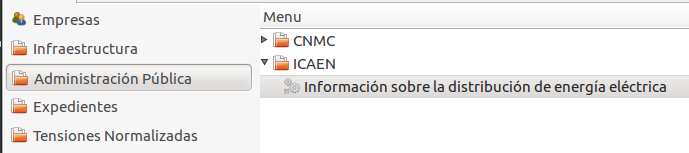
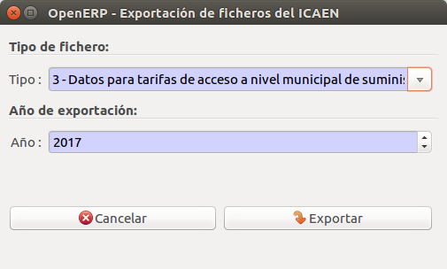
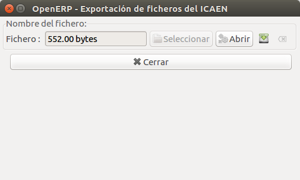

# Documentació dels mòduls de dins de Gencat

## Mòdul per generar fixer CSV d'informació de la distribució segons l'ICAEN

### Introducció

L'ICAEN demana una sèrie de documents per poder portar un contol de la
distribució d'energia.

### Fitxers

* **Tipus 1:** Dades individualitzades de subministraments a clients a mercat
lliure amb potència major o igual a 50kW.

* **Tipus 3:** Dades agrupades per tarifa d'accés a nivell municipal de
subministraments a tots els clients acollits al mercat lliure.

* **Tipus 4:** Dades agrupades per sectors d'activitat econòmica a nivell
municipal de subministraments a tots els clients acollits al mercat lliure.

### Generació

Executant l'assistent que trobarem a
**Administració pública > ICAEN > Informació de la distribució d'energia
elèctrica**.

Sel·leccionar el tipus de fitxer que es vol generar i l'any
per el qual ho volem fer, per defecte l'any serà l'actual.

Una vegada generat el fitxer, hi ha l'opció d'obrir-lo o desar-lo.

