# Índex

- [Càrrega de fitxers 4666](#carrega-de-fitxers-4666)
- [Generació de fitxers 4666](#generacio-dels-informes)
- [Descripció dels diferents Fitxers de l'inventari](#descripcio-dels-diferents-fitxers-de-linventari)
    - [Línies AT](#linies-at-inventario_r1-xxx_1txt)
    - [Línies BT](#linies-bt-inventario_r1-xxx_2txt)
    - [Subestació](#subestacio-inventario_r1-xxx_3txt)
    - [Posicions amb interruptor en subestacions](#posicions-equipades-amb-interruptor-en-subestacions-inventario_r1-xxx_4txt)
    - [Màquina](#maquines-inventario_r1-xxx_5txt)
    - [Despatx](#despatxos-inventario_r1-xxx_6txt)
    - [Equips de millora de la fiabilitat](#equips-de-millora-de-la-fiabilitat-inventario_r1-xxx_7txt)
    - [Centres de transformació](#centres-de-transformacio-inventario_r1-xxx_8txt)
    - [Condensadors i Reactàncies](#condensadors-inventario_r1-xxx_9txt)
    - [Modificacions](#modificacions-modificaciones_r1-xxxtxt)

# Inventari 4666

## Introducció

Aquest mòdul permet la generació dels formularis de la Resolució 4666 relatius
a l’inventari de les instal·lacions en format TXT.

El mòdul permet generar 8 fitxers .txt corresponents als Fitxers d'inventari descrits
a [la resolució 4666](https://www.boe.es/boe/dias/2017/04/28/pdfs/BOE-A-2017-4666.pdf).

!!! note
    Relacionats amb aquest módul hi ha el módul de subestacions, cel·les i
    elements de tall, despatxos, posicions, Catàleg de cables AT,
    Catàleg de cables BT, Expedients i Condensadors.

!!! note
    Els CINI's i TIs (Codi CCUU) utilitzats són els publicats a la resolució
    4666/2017

!!! note
    A totes les fitxes s'ha inclós el camp `CNMC Tipus Instal·lació` i el
    camp `Bloquejar CNMC Tipus Instal·lació`. Amb aquest camp es poden
    intorduïr els camps **TI-XXX** que es defineixen a la _Taula 3_ de la
    resolució 4666. Si es marca la variable `Bloquejar Tipus`, no s'aplica la
    modificació automàtica del camp `CNMC Tipus Instal·lació` i no es
    modificarà el valor entrat de forma manual.

!!! note
    Els informes de Màquines i condensadors s'han d'unificar en un sol
    fitxer. S'han separat en dos per facilitar-ne la seva traçabilitat.
    Seran el fitxer 5 i el fitxer 9

!!! note
    El camp que s'agafarà per a Tipus d'instal·lació és el `Tipologia CNMC`
    (del desplegable)

## Càrrega de fitxers 4666

Per tal que el ERP pugui fer el càlcul del camp estat de la 4666 de l'any 2017
s'han de carregar els fitxers presentats de la 4131 de l'any 2015.
El format dels fitxers que s'han de carregar es _format ZIP_ el qual contindrà
els 8 fitxers entregats(no incloure el fitxer de transmisions).

** Els fitxers han d'estar en codificacio UTF-8 **

El menú de càrrega es troba a "_Administració Pública/CNMC/Resolucions/Resolucio
4666/2017/Carregar Fitxer presentat 4131_"

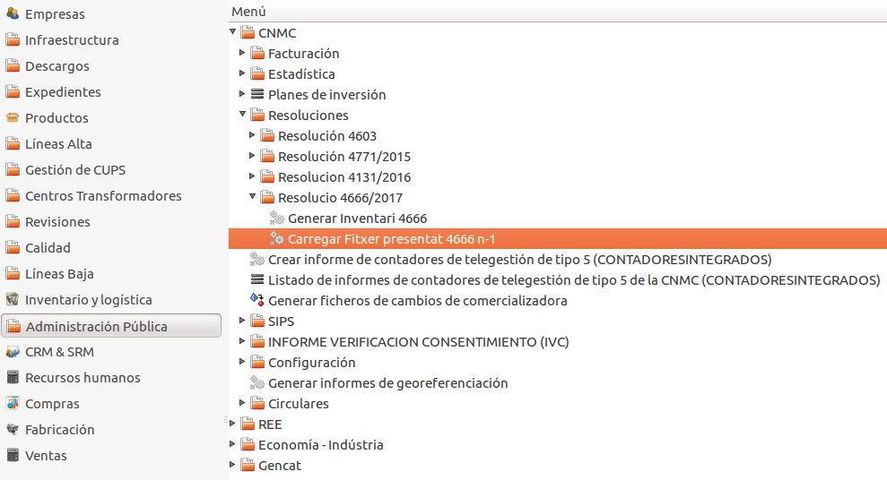

### Generació dels informes

**Menú**

Per accedir a l'assistent per generar els fitxers CSV i el XML cal anar al menú
**Administració pública / CNMC / Resolucions / Resolucio 4666/2016 / Generar Inventari 4666**

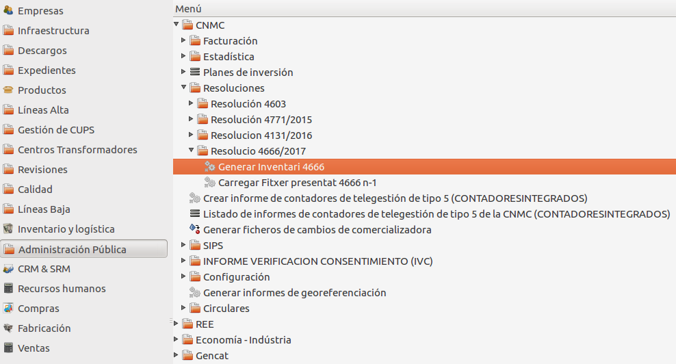

A través d'aquest assistent podem generar els fitxers csv que demana la resolució.

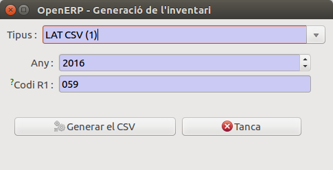

* **Tipus** En el desplegable tipus es pot seleccionar el fitxer .csv que es vol generar

|Fitxer          | Num | Descripció                                        |                        |
|----------------|-----|---------------------------------------------------|------------------------|
|LAT CSV         | 1   | LINIES AT                                         | Inventario_R1-XXX_1.txt|
|BT CSV          | 2   | LINIES BT                                         | Inventario_R1-XXX_2.txt|
|Subestacions CSV| 3   | SUBESTACIONS                                      | Inventario_R1-XXX_3.txt|
|Posicions CSV   | 4   | POSICIONS EQUIPADES AMB INTERRUPTOR DE SUBESTACIÓ | Inventario_R1-XXX_4.txt|
|Maquines CSV    | 5   | MAQUINES EN SE, RESERVA I MOBILS                  | Inventario_R1-XXX_5.txt|
|Condensadors CSV| 5   | CONDENSADORS I REACTANCIES                        | Inventario_R1-XXX_9.txt|
|Despatx CSV     | 6   | DESPATXOS                                         | Inventario_R1-XXX_6.txt|
|Fiabilitat CSV  | 7   | EQUIPS DE MILLORA DE LA FIABILITAT                | Inventario_R1-XXX_7.txt|
|CTS CSV         | 8   | CENTRES DE TRANSFORMACIÓ                          | Inventario_R1-XXX_8.txt|

* **Any**: Automàticament s'escull l'any anterior a l'any en curs
* **R1**: Automàticament s'agafa el valor del camp `ref2` de la empresa
  associada a la nostra companyia

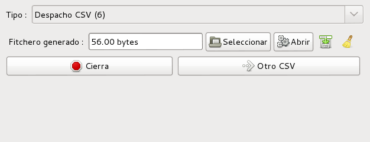

Una vegada generat el fitxer csv es pot analitzar per validar-lo i veure
quines dades falten a la base de dades o fer modificacions directament al
fitxer.txt

Es pot generar un altre fitxer prement en el botó **Un altre CSV**

# Descripció dels diferents fitxers de l'inventari

## FITXER: LINIES

### LINIES AT, Inventario_R1-XXX_1.txt

!!! note
    Tots els camps referents a les línies provenen dels models de  **trams,**
    **linies,** **conductors,** i **expedient** per tant hauran d'estar ben
    complimentats tots els camps que fa servir. Aquest fitxer es genera en 2
    fitxers csv, un per línies AT i un altre per les línies BT

!!! note
    Ha d'existir el cable "DESCONEGUT" del tipus "INDEFINIT" sinó no generarà
    el fitxer

##### ELEMENTS SELECCIONATS

Només s'inclouran els Trams que compleixin les següents condicions de la fitxa
de **Trams**. També es trindran en compte les dades de la fitxa **Linia AT** de
la línia a la qual pertany

**De Línia AT, els camps:**

* **Propietari**: Ha d'estar marcat com a propietari perquè apareixi als llistats.

**De Trams, els camps:**

* **Actiu**:
    * Ha d'estar actiu
    * Si no està actiu, hi ha d'haver el camp **data baixa** amb la data posterior
      a 1 de Gener de l'any sol·licitat.
* **Data APM**: Data de posta en marxa posterior al final de l'any sol·licitat,
  a 1 de Gener. ( p.e. per l'any 2014 data_APM < 01/01/2015)
* **Conductor**: El tipus del cable associat al tram i **NO** ha de ser
  **EMBARRAT** (E)

!!! note
    S'han de comprovar tots els registres que tenen data_APM de l'any en que
    es genera el fitxer (en aquest cas 2016) perquè no sortiran als fitxers .csv.
    S'han de comprovar les instal·lacions **reformades** durant l'any en que
    es genera el fitxer i comprovar les dates_APM dels registres en questió
    per veure si han de sortir o no als .csv i si cal modificar la data_APM per
    que apareixin en la generació dels fitxers.

* **Tensió màxima de disseny**: És la tensió per la que està dissenyat el
  tram de línia (V). Aquest camp permet classificar els trams de línia AT en
  funció de la tensió màxima per la que ha estat dissenyat i no per la tensió
  a la que està treballant actualment. Si aquest està buit,
  agafarà la tensió de la línia a la qual pertany.

*ORÍGEN:*

A continuació es detalla d'on s'obtenenen els valors dels camps d'aquest fitxer:

Camps obtinguts directament dels camps de la fitxa de **TRAMS**

| CAMP                        | CAMP DE LA BASE DE DADES                                                             |
|-----------------------------|--------------------------------------------------------------------------------------|
| IDENTIFICADOR               | IDENTIFICADOR DEL TRAM                                                               |
| CINI                        | CINI DEL TRAM                                                                        |
| ORIGEN                      | ORIGEN TRAM                                                                          |
| DESTINO                     | FINAL TRAM                                                                           |
| CODIGO_CCUU                 | TIPUS D'INSTAL·LACIO, TI-XXX                                                         |
| PARTICIPACION               | 100-%FINANÇAMENT PAGAT PER TERCERS                                                   |
| FECHA APS                   | DATA APM DEL TRAM                                                                    |
| FECHA BAJA                  | DATA DE BAIXA,SI ES EN L'ANY ACTUAL NO APAREIX                                       |
| NUMERO_CIRCUITOS            | CIRCUITS                                                                             |
| NUMERO_CONDUCTORES          | CAMP FIX=1                                                                           |
| NIVEL_TENSION               | CAMP TENSIÓ MÁXIMA DE DISSENY (SI HI ÉS) O TENSIÓ DE LA LÍNIA ASSOCIADA AL TRAM EN CAS DE NO ESTAR CONFIGURADA. / 1000 PER TENIR-LA EN kV |
| LONGITUD                    | LONGITUD DEL TRAM/1000                                                               |
| INTENSITAT MÁXIMA           | INTENSITAT MÁXIMA DEL CABLE ASSOCIAT AL TRAM                                         |
| SECCION                     | VALOR NUMÉRIC DEL CAMP **SECCIÓ** DE LA FITXA DEL CONDUCTOR ASSOCIAT AL TRAM         |

Camps **CALCULATS**: En aquests casos el valor no existeix físicament com a
camp de la BD i s'han de calcular a partir de valors entrats a la BD i alguns
càlculs addicionals.

+---------------+--------------------------------------------------------------+
| CAMP          | CAMP DE LA BASE DE DADES                                     |
+===============+==============================================================+
| CODIGO_CCAA_1 | EN FUNCIÓ DEL MUNICIPI DE LA LAT I LA CCAA RELACIONADA A LA  |
|               | TAULA 4 DE LA RESOLUCIÓ 4666                                 |
+---------------+--------------------------------------------------------------+
| CODIGO_CCAA_2 | Aquest camp sempre serà igual a CODIGO_CCAA_1                |
+---------------+--------------------------------------------------------------+
|               | VALOR FUNCIÓ DEL CAMP **INTESITAT MÀXIMA** DE LA FITXA DEL   |
|               | CONDUCTOR ASSOCIAT AL TRAM_BT I LA TENSIÓ DEL TRAM AL CAMP   |
| CAPACIDAD     | **VOLTATGE**.                                                |
|               |                                                              |
|               | `c = Tensió · Int.max. · √3`                                 |
+---------------+--------------------------------------------------------------+
| ESTADO        | SI S'HA DONAT D'ALTA EL TRAM EN AQUEST ANY SERA 2 ALTRAMENT 0|
+---------------+--------------------------------------------------------------+

CODIGO_CCAA_2 aquest camp es només pels trams de línia que comencen en una
comunitat autónoma i acaben en una altra de diferent orígen.

!!! Note
    En aquests casos es pot contemplar de crear una línia nova quan es faci un
    canvi de comunitat autónoma. Així no podran existir línies i trams que
    comparteixin comunitats autònomes diferents.

**Catàleg de Cables AT**

Des del menú "_Linies AT / Manteniment / Cables / Cable_".

S'ha de cumplimentar correctament el catàleg de cables AT per poder calcular
correctament els camps **SECCIO** i **CAPACITAT** d'aquest fitxer.

La intensitat del cable **INTENSITAT ADMISIBLE** estarà indicada en Ampers,
aquest valor serà el de catàleg, o en tot cas la capacitat s'ha de correspondre
amb la capacitat de l'hivern, per a una temperatura ambient de 10ºC segons
indica l'annex 1 de la resolució. El camp **SECCIO** es cumplimenta amb un valor
numèric.

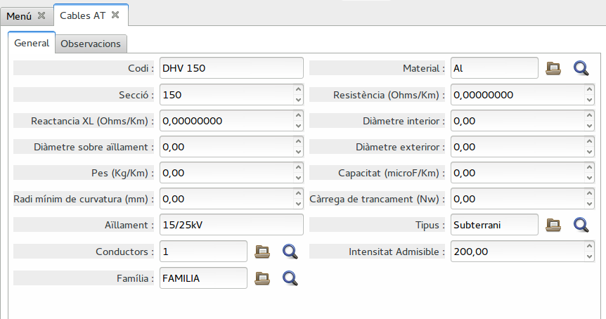

*CRITERI ESTADO:*

Feta la comparació dels elements amb el fitxer de la 4131, es defineixen els 3
estats diferents:

Estat = 0	Element sense  modificacions en relació a n-1

Estat = 1	Element amb alguna modificació en algun d’aquests camps:

* Longitud
* CINI
* Seccio
* Codi CCUU
* Tensio

Estat = 2	Element nou que no apareix al inventari de l’any n-1

### LINIES BT, Inventario_R1-XXX_2.txt

!!! note
    Tots els camps referents a les línies BT provenen dels models de
    **Elements BT** i **CT** per tant hauran d'estar ben cumplimentats tots
    els camps que fa servir.

!!! note
    Ha d'existir el cable "DESCONEGUT" del tipus "INDEFINIT" sinó no generara
    el fitxer

*ELEMENTS SELECCIONATS:*

Només s'inclouran els Trams BT que compleixin les següents
condicions de la fitxa de **Elements bt**:

* **Actiu**:
    * Ha d'estar actiu
    * Si no està actiu, hi ha d'haver el camp **data baixa** amb la data posterior
      a 1 de Gener de l'any sol·licitat.
* **Cable**: El `Tipus` del Cable seleccionat **NO** és **Embarrat** (E)
* **Propietari**: Ha d'estar marcat com a propietari.
* **Data APM**: Data de posta en marxa posterior al final de l'any sol·licitat,
  a 1 de Gener. ( p.e. per l'any 2014 data_APM < 01/01/2015)

*ORÍGEN:*

Camps obtinguts directament de la fitxa de **ELEMENTS_BT**

| CAMP                          | CAMP DE LA BASE DE DADES                                                             |
|-------------------------------|--------------------------------------------------------------------------------------|
| IDENTIFICADOR                 | IDENTIFICADOR DEL TRAM BT                                                            |
| CINI                          | CINI DEL TRAM BT                                                                     |
| ORIGEN                        | NUS INICI, (INTERN DE LA TOPOLOGIA)                                                  |
| DESTINO                       | NUS FINAL, (INTERN DE LA TOPOLOGIA)                                                  |
| CODIGO_CCUU                   | TIPUS D'INSTAL·LACIO DEL TRAM BT                                                     |
| CODIGO_CCAA_1                 | EN FUNCIÓ DEL **MUNICIPI** DEL TRAM_BT I LA CCAA RELACIONADA A LA TAULA 4 DE LA RESOLUCIÓ 4666 |
| CODIGO_CCAA_2                 | Aquest camp sempre serà igual a CODIGO_CCAA_1                                        |
| PARTICIPACION                 | 100-%FINANÇAMENT PAGAT PER TERCERS                                                   |
| FECHA APS                     | DATA APM DEL TRAM BT                                                                 |
| FECHA BAJA                    | DATA DE BAIXA DEL TRAM DE BT                                                         |
| NUMERO_CIRCUITOS              | CAMP FIX=1                                                                           |
| NUMERO_CONDUCTORES            | CAMP FIX=1                                                                           |
| LONGITUD                      | LONGITUD DEL TRAM_BT/1000                                                            |
| INTENSITAT MÁXIMA             | INTENSITAT MÁXIMA DEL CABLE ASSOCIAT AL TRAM BT                                      |
| SECCION                       | VALOR NUMÉRIC DEL CAMP **SECCIÓ** DE LA FITXA DEL CONDUCTOR ASSOCIAT AL TRAM_BT      |

Camps **CALCULATS**: En aquests casos el valor no existeix, físicament, com a
camp de la BD i s'han de calcular a partir de valors entrats en la BD i
altres càlculs addicionals.

+---------------+--------------------------------------------------------------+
| CAMP          | CAMP CALCULAT                                                |
+===============+==============================================================+
|               | VALOR FUNCIÓ DEL CAMP **INTESITAT MÀXIMA** DE LA FITXA DEL   |
|               | CONDUCTOR ASSOCIAT AL TRAM_BT I LA TENSIÓ DEL TRAM AL CAMP   |
| CAPACIDAD     | **VOLTATGE**.                                                |
|               |                                                              |
|               | `c = Tensió · Int.max. · √3`                                 |
+---------------+--------------------------------------------------------------+
| ESTADO        | SI S'HA DONAT D'ALTA EN L'ANY ACTUAL SERA 2 ALTRAMENT 0      |
+---------------+--------------------------------------------------------------+

**Catàleg de Cables BT**

Des del menú "_Linies BT / Manteniment / Cables / Cable_".

S'ha de cumplimentar correctament el catàleg de cables BY per poder calcular
correctament els camps **SECCIO** i **CAPACITAT** d'aquest fitxer.

La intensitat del cable **INTENSITAT ADMISIBLE** estarà indicada en Ampers,
aquest valor serà el de catàleg, o en tot cas la capacitat s'ha de correspondre
amb la capacitat de l'hivern, per a una temperatura ambient de 10ºC segons
indica l'annex 1 de la resolució. El camp **SECCIO** es cumplimenta amb un
valor numèric.

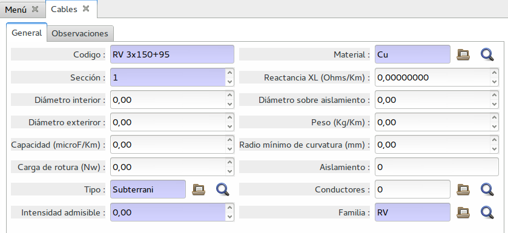

A la fitxa del catàleg de cables s'ha afegit el camp:

* **Data acta posada en marxa**: Aquesta data correspondria amb la data en
  que es presenta a indústria la legalització de la línia BT.

Quedant el camp existent

* **Data alta**: Aquesta data correspon a la data en que es va instal·lar.
  (data de realització de la obra)

*CRITERI ESTADO:*

Feta la comparació dels elements amb el fitxer de la 4131, es defineixen els 3 estats diferents:

Estat = 0 Element sense  modificacions en relació a n-1

Estat = 1	Element amb alguna modificació en algun d’aquests camps:

* Longitud
* CINI
* Seccio
* Codi CCUU
* Tensio

Estat = 2	Element nou que no apareix al inventari de l’any n-1

--------------------------------------------------------------------------------

## Subestació, Inventario_R1-XXX_3.txt

!!! note
    Per obtenir aquest fitxer cal tenir configurat, al ERP, el mòdul de
    subestacions.   

*ELEMENTS SELECCIONATS:*

Només s'inclouran les Subestacions que compleixin les següents condicions
de la fitxa de **Subestacions**:

* **Actiu**:
    * Ha d'estar actiu
    * Si no està actiu, hi ha d'haver el camp **data baixa** amb la data posterior
      a 1 de Gener de l'any sol·licitat.
* **Propietari**: Ha d'estar marcat com a propietari.
* **Data APM**: Data de posta en marxa posterior al final de l'any sol·licitat,
  a 1 de Gener. ( p.e. per l'any 2014 data_APM < 01/01/2015)

*ORÍGEN:*

Camps obtinguts directament dels camps de la fitxa de **SUBESTACIONS**

| CAMP                  |CAMP DE LA BASE DE DADES                                                             |
|-----------------------|-------------------------------------------------------------------------------------|
|IDENTIFICADOR          |IDENTIFICADOR DE LA SUBESTACIÓ                                                       |
|CINI                   |CINI DE LA SUBESTACIÓ                                                                |
|DENOMINACIÓN           |NOM DE LA SUBESTACIÓ                                                                 |
|CODIGO_CCAA            |EN FUNCIÓ DEL MUNICIPI DE LA SE I LA CCAA RELACIONADA A LA TAULA 4 DE LA RESOLUCIÓ   |
|PARTICIPACION          |100-%FINANÇAMENT PAGAT PER TERCERS                                                   |
|FECHA APS              |DATA APM DE LA SUBESTACIÓ                                                            |
|FECHA BAJA             |DATA DE BAIXA DE LA SUBESTACIO                                                       |
|POSICIONES             |SUMA EL NOMBRE DE POSICIONS QUE TE LA SE A LA PESTANYA POSICIONS EQUIPADES AMB INTERUPTOR |

Camps **CALCULATS**: En aquests casos el valor no existeix, físicament, com a
camp de la BD i s'han de calcular a partir de valors entrats en la BD i
altres càlculs addicionals.

| CAMP                        |CAMP CALCULAT                                                                  |
|-----------------------------|-------------------------------------------------------------------------------|
|ESTADO                       |SI S'HA DONAT D'ALTA EN L'ANY ACTUAL SERA 2 ALTRAMENT 0                        |

*CRITERI ESTADO:*

Feta la comparació dels elements amb el fitxer de la 4131, es defineixen els 3
estats diferents:

Estat = 0 Element sense  modificacions en relació a n-1

Estat = 1	Element amb alguna modificació en algun d’aquests camps:

* CINI
* Participació

Estat = 2	Element nou que no apareix al inventari de l’any n-1

--------------------------------------------------------------------------------

## Posicions equipades amb interruptor en subestacions, Inventario_R1-XXX_4.txt

!!! note
    Per obtenir aquest fitxer cal tenir configurat, al ERP, el mòdul de
    subestacions.

*ELEMENTS SELECCIONATS:*

Només s'inclouran les posicions  que compleixin les següents
condicions de la fitxa de **Posicions**:

* **Tipus Interruptor**: Ha de ser del tipus **Interruptor automàtic** (2)
* **Actiu**:
    * Ha d'estar actiu
    * Si no està actiu, hi ha d'haver el camp **data baixa** amb la data posterior
      a 1 de Gener de l'any sol·licitat.
* **Propietari**: Ha d'estar marcat com a propietari.
* **Data APM**: Data de posta en anterior anterior al final de l'any sol·licitat,
  a 1 de Gener ( p.e. per l'any 2014 data_APM < 01/01/2015)

*ORÍGEN:*

Camps obtinguts directament dels camps de la fitxa de **POSICIONS**

| CAMP                  |CAMP DE LA BASE DE DADES                                                             |
|-----------------------|-------------------------------------------------------------------------------------|
|IDENTIFICADOR          |IDENTIFICADOR DE LA POSICIÓN                                                         |
|CINI                   |CINI DE LA POSICIÓN                                                                  |
|DENOMINACIÓN           |NOM DE LA SUBESTACIÓ                                                                 |
|CODIGO_CCUU            |CNMC Tipus Instal·lació DE LA POSICIÓ. VALORS DE LA TAULA 3 DE RESOLUCIÓ 4666        |
|CODIGO_CCAA            |EN FUNCIÓ DEL MUNICIPI DE LA SE I LA CCAA RELACIONADA A LA TAULA 4 DE LA RESOLUCIÓ   |
|NIVEL_TENSION          |CAMP TENSIÓ DE LA POSICIÓ / 1000                                                     |
|PARTICIPACION          |100-%FINANÇAMENT PAGAT PER TERCERS                                                   |
|FECHA APS              |DATA DE POSADA EN MARXA DE LA POSICIÓ                                                |
|FECHA BAJA             |DATA DE BAIXA DE L'INTERRUPTOR                                                       |

Camps **CALCULATS**: En aquests casos el valor no existeix, físicament, com a
camp de la BD i s'han de calcular a partir de valors entrats en la BD i
altres càlculs addicionals.

| CAMP                   |CAMP CALCULAT                                                                       |
|------------------------|------------------------------------------------------------------------------------|
|ESTADO                  |SI S'HA DONAT D'ALTA EN L'ANY ACTUAL SERA 2 ALTRAMENT 0                             |

!!! Note
    Per defecte, el tipus de posició d'intemperie serà a la convencional i el
    tipus interior serà posició blindada.

*CRITERI ESTADO:*

Feta la comparació dels elements amb el fitxer de la 4131, es defineixen els 3 estats diferents:

Estat = 0 Element sense  modificacions en relació a n-1

Estat = 1	Element amb alguna modificació en algun d’aquests camps:

* CINI
* Codi CCUU
* Tensio
* Participació
* CT (Denominació)

Estat = 2	Element nou que no apareix al inventari de l’any n-1

--------------------------------------------------------------------------------

## Màquines, Inventario_R1-XXX_5.txt

*ELEMENTS SELECCIONATS:*

Només s'inclouran els Transformadors que compleixin les següents condicions de
la fitxa de **Transformadors**:

* **Estat**: Els transformadors associats a un estat que el camp **apareix a
  l'inventari** estigui marcat (veure la següent nota).
* **Actiu**:
    * Ha d'estar actiu
    * Si no està actiu, hi ha d'haver el camp **data baixa** amb la data
      posterior a 1 de Gener de l'any sol·licitat.
* **Propietari**: Ha d'estar marcat com a propietari.
* **Data APM**: Data de posta en marxa anterior al final de l'any sol·licitat,
  a 1 de Gener. ( p.e. per l'any 2014 data_APM < 01/01/2015)
* **Ordre dins CT**: Tots els transformadors en funcionament que _ordre dins el
  CT_ sigui major de 2 (_>2_)
* **Reductor**: Tots els transformadors que tinguin el camp `Reductor` marcat i
  estiguin en un estat inclòs en l'inventari

!!! note
    Apareixeran en aquest inventari tots els transformadors que l'estat en què
    es troben té marcada la casella **apareix a l'inventari**, tal com s'indica
    a la imatge següent, i tots el que el seu estat es `NULL`.
    Cada empresa pot indicar que apareixin en aquest llistat els transformadors
    que es troben en diferents estats modificant el checkbox corresponent.

!!! note
    Els Transformadors Reductors també estan inclosos en el llistat si
    compleixen les condicions especificades.

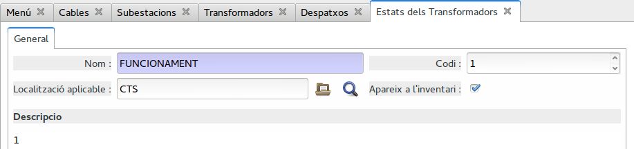

!!! note
    Els diferents **Tipus de transformadors** que han de sortir com **mòbils**,
    **reguladors de tensió**, **Condensadors** i **Reactàncies** s'han de
    configurar de forma que compleixin alguna de les condicions esmentades, p.e.
    amb un estat marcat com a **apareix a l'inventari**

!!! note
    Apareixen en aquest inventari els condensadors d'AT,de BT i bateries fixes i
    automàtiques. Aquests s'han d'entrar al menú de l'EPR de condensadors
    ("_Centres Transformadors/Manteniment/Cel·les i elements de
    tall/Condensadors_").   
    **Comprovar que no estiguin entrats a Cel·les**

*ORÍGEN:*

Camps obtinguts directament dels camps de la fitxa de **TRANSFORMADORS**
i **CONDENSADORS**

>TRANSFORMADORS:

+------------------+--------------------------------------------------------------+
| CAMP             |CAMP DE LA BASE DE DADES                                      |
+==================+==============================================================+
| IDENTIFICADOR    | CÓDIGO INTERNO DEL TRANSFORMADOR                             |
+------------------+--------------------------------------------------------------+
| CINI             | CINI DEL TRANSFORMADOR                                       |
+------------------+--------------------------------------------------------------+
|                  | DESCRIPCIO DE LA SUBESTACIÓ A LA QUE PERTANY. SI NO          |
| DENOMINACIÓN     | INSTAL·LAT O RESERVA, POSA `ALMACEN` . SI INSTAL·LAT EN CT   |
|                  | (RESERVA O TERCER), AFEGEIX SUFIX `-CT`                      |
+------------------+--------------------------------------------------------------+
| CODIGO_CCUU      | CNMC Tipus Instal·lació DE LA POSICIÓ. VALORS DE LA TAULA 3  |
|                  | DE RESOLUCIÓ 4666                                            |
+------------------+--------------------------------------------------------------+
| CODIGO_CCAA      | EN FUNCIÓ DEL MUNICIPI DEL CT/SE I LA CCAA RELACIONADA A LA  |
|                  | TAULA 4 DE LA RESOLUCIÓ                                      |
+------------------+--------------------------------------------------------------+
| TENSION_PRIMARIO | SEGONS ELS CAMPS P1 i P2 DE LES CONNEXIONS I NORMALITZADA    |
|                  | SEGONS TAULA TENSIONS                                        |
+------------------+--------------------------------------------------------------+
|TENSION_SECUNDARIO| SEGONS ELS CAMPS B1, B2 i B3 DE LES CONNEXIONS I NORMALITZADA|
|                  | SEGONS TAULA TENSIONS                                        |
+------------------+--------------------------------------------------------------+
| PARTICIPACION    | 100-%FINANÇAMENT PAGAT PER TERCERS                           |
+------------------+--------------------------------------------------------------+
| FECHA APS        | DATA APM DEL TRANSFORMADOR                                   |
+------------------+--------------------------------------------------------------+
| FECHA BAJA       | DATA DE BAIXA DEL TRANSFORMADOR                              |
+------------------+--------------------------------------------------------------+
|                  | VALOR FUNCIÓ DEL CAMP **INTESITAT MÀXIMA** DE LA FITXA DEL   |
|                  | CONDUCTOR ASSOCIAT AL TRAM_BT I LA TENSIÓ DEL TRAM AL CAMP   |
| CAPACIDAD        | **VOLTATGE**.                                                |
|                  |                                                              |
|                  | `c = Tensió · Int.max. · √3`                                 |
+------------------+--------------------------------------------------------------+

Camps **CALCULATS**: En aquests casos el valor no existeix, físicament, com a
camp de la BD i s'han de calcular a partir de valors entrats en la BD i
altres càlculs addicionals.

| CAMP          | CAMP CALCULAT                                             |
|---------------|-----------------------------------------------------------|
| ESTADO        | SI S'HA DONAT D'ALTA EN L'ANY ACTUAL SERA 2 ALTRAMENT 0   |

!!! note
    El camp **TENSION_PRIMARIO** escollirà la tensió més alta dels camps _P1
    i P2_ de les connexions **connectades** del llistat de connexions de la
    fitxa del transformador. Després la normalitzarà segons les Tensions
    Normalitzades o la deixarà igual si no en troba cap.

!!! note
    El camp **TENSION_SECUNDARIO** escollirà la tensió més alta dels camps
    _B1, B2 i B3_ de les connexions **connectades**
    del llistat de connexions de la fitxa del transformador. Després la
    normalitzarà segons les Tensions Normalitzades o la deixarà igual si
    no en troba cap.

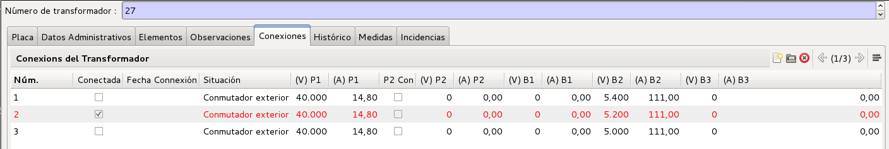

>Llistat de connexions d'un transformador

--------------------------------------------------------------------------------

# Despatxos, Inventario_R1-XXX_6.txt

_ELEMENTS SELECCIONATS:_

Només s'inclouran els Despatxos que compleixin les següents
condicions de la fitxa de la fitxa accessible a "_Infraestructura / Despatxos_":

* **Any_PS**: L'any de posada en servei ha de ser inferior o igual al
  sol·licitat

_ORÍGEN:_

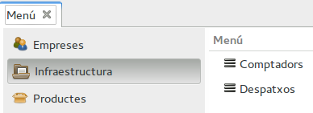

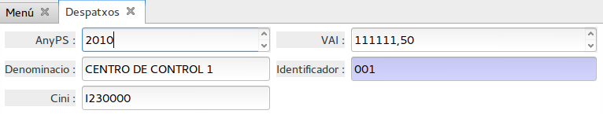

Camps obtinguts directament dels camps de la fitxa de **DESPATXOS**

| CAMP                  |CAMP DE LA BASE DE DADES                        |
|-----------------------|------------------------------------------------|
|IDENTIFICADOR          |IDENTIFICADOR                                   |
|CINI                   |CINI DEL DESPATX                                |
|DENOMINACIÓN           |DESCRIPCIÓ DE LA INSTAL·LACIÓ                   |
|FECHA APS              |DATA DE POSADA EN MARXA DE LA INSTAL·LACIÓ      |
|FECHA BAJA             |DATA DE BAIXA DE AL INSTAL·LACÍO                |
|VALOR DE LA INVERSIÓN  |VALOR DE LA INVERSIÓ EN €                       |

Camps **CALCULATS**: En aquests casos el valor no existeix, físicament, com a
camp de la BD i s'han de calcular a partir de valors entrats en la BD i
altres càlculs addicionals.

| CAMP              |CAMP CALCULAT                                            |
|-------------------|---------------------------------------------------------|
|ESTADO             |SI S'HA DONAT D'ALTA EN L'ANY ACTUAL SERA 2 ALTRAMENT 0  |

*CRITERI ESTADO:*

Feta la comparació dels elements amb el fitxer de la 4131, es defineixen els 3 estats diferents:

Estat = 0 Element sense  modificacions en relació a n-1

Estat = 1	Element amb alguna modificació en algun d’aquests camps:

* CINI

Estat = 2	Element nou que no apareix al inventari de l’any n-1

--------------------------------------------------------------------------------

# Equips de millora de la fiabilitat, Inventario_R1-XXX_7.txt

_ELEMENTS SELECCIONATS:_

Només s'inclouran les Cel·les i elements de Tall que compleixin les següents
condicions de la fitxa de **Cel·les i elements de Tall** associades a CT's i
suports:

* **Categoria inventari**: Ha de ser **Fiabilitat** tant si està associat a CT
  com si està associat a suports de línies AT/MT (seccionadors, interruptors,
  fusibles, ...).
* **Actiu**:
    * Ha d'estar actiu
    * Si no està actiu, hi ha d'haver el camp **data baixa** amb la data posterior
      a 1 de Gener de l'any sol·licitat.
* **Propietari**: Ha d'estar marcat com a propietari.
* **Data APM**: Data de posta en marxa anterior al final de l'any sol·licitat,
  a 1 de Gener

*ORÍGEN:*

Camps obtinguts directament dels camps de la fitxa de **CEL·LES I ELEMENTS DE TALL**

| CAMP                  |CAMP DE LA BASE DE DADES                                                             |
|-----------------------|-------------------------------------------------------------------------------------|
|IDENTIFICADOR          |CODI DE LA CEL·LA O ELEMENT DE TALL                                                  |
|CINI                   |CINI DEL CEL·LA O ELEMENT DE TALL                                                    |
|ELEMENTO_ACT           |NOM DEL CT `CT-XXX`, SUBESTACIÓ `SE-XXX` O TRAM del seccionador                      |
|CODIGO_CCUU            |TIPO D'INSTAL·LACÍO CNMC                                                             |
|CODIGO_CCAA            |EN FUNCIÓ DEL MUNICIPI DEL CT/LAT I LA CCAA RELACIONADA A LA TAULA 4 DE LA RESOLUCIÓ |
|FECHA APS              |DATA APM DE LA CEL·LA                                                                |
|FECHA BAJA             |DATA DE BAIXA DE LA CEL·LA                                                           |

Camps **CALCULATS**: En aquests casos el valor no existeix, físicament, com a
camp de la BD i s'han de calcular a partir de valors entrats en la BD i
altres càlculs addicionals.

| CAMP      |  CAMP CALCULAT                                                 |
|-----------|----------------------------------------------------------------|
|ESTADO     |  SI S'HA DONAT D'ALTA EN L'ANY ACTUAL SERA 2 ALTRAMENT 0       |

*CRITERI ESTADO:*

Feta la comparació dels elements amb el fitxer de la 4131, es defineixen els 3 estats diferents:

Estat = 0 Element sense  modificacions en relació a n-1

Estat = 1	Element amb alguna modificació en algun d’aquests camps:

* CINI
* CODIGO_CCUU
* Elemento_ACT  (SE, CT, tram)

Estat = 2	Element nou que no apareix al inventari de l’any n-1

--------------------------------------------------------------------------------

# Centres de transformació, Inventario_R1-XXX_8.txt

_ELEMENTS SELECCIONATS_

Només s'inclouran els Centres Transformadors que compleixin les següents
condicions de la fitxa de **CT**:

* **Tipus Instal·lació**: Qualsevol excepte Subestacions (**SE**). Inclou CH,
  CP, CM, CR ...
* **Actiu**:
    * Ha d'estar actiu
    * Si no està actiu, hi ha d'haver el camp **data baixa** amb la data posterior
      a 1 de Gener de l'any sol·licitat.
* **Propietari**: Ha d'estar marcat com a propietari.
* **Data APM**: Data de posta en marxa anterior al final de l'any sol·licitat,
  a 1 de Gener

_ORÍGEN:_

Camps obtinguts directament dels camps de la fitxa de **CTS**

| CAMP                  |CAMP DE LA BASE DE DADES                                                             |
|-----------------------|---------------------------------------------------------------------------------|
|IDENTIFICADOR          |CODI DEL CT                                                                      |
|CINI                   |CINI DEL CT                                                                      |
|DENOMINACIÓN           |DESCRIPCIÓ DEL CT                                                                |
|CODIGO_CCUU            |TIPO D'INSTAL·LACIÓ CNMC DEL TRANSFORMADOR                                       |
|CODIGO_CCAA            |EN FUNCIÓ DEL MUNICIPI DEL CT I LA CCAA RELACIONADA A LA TAULA 4 DE LA RESOLUCIÓ |
|PARTICIPACION          |100-%FINANÇAMENT PAGAT PER TERCERS                                               |
|FECHA APS              |ANY DATA APM DEL CT                                                              |
|FECHA BAJA             |DATA DE BAIXA DEL CT                                                             |

Camps **CALCULATS**: En aquests casos el valor no existeix, físicament, com a
camp de la BD i s'han de calcular a partir de valors entrats en la BD i
altres càlculs addicionals.

| CAMP      |  CAMP CALCULAT                                                 |
|-----------|----------------------------------------------------------------|
| ESTADO    |  SI S'HA DONAT D'ALTA EN L'ANY ACTUAL SERA 2 ALTRAMENT 0       |

*CRITERI ESTADO:*

Feta la comparació dels elements amb el fitxer de la 4131, es defineixen els 3 estats diferents:

Estat = 0 Element sense  modificacions en relació a n-1

Estat = 1	Element amb alguna modificació en algun d’aquests camps:

* CINI
* CODIGO_CCUU

Estat = 2	Element nou que no apareix al inventari de l’any n-1

--------------------------------------------------------------------------------

## CONDENSADORS, Inventario_R1-XXX_9.txt

+------------------+--------------------------------------------------------------+
| CAMP             |CAMP DE LA BASE DE DADES                                      |
+==================+==============================================================+
| IDENTIFICADOR    | CÓDIGO INTERNO DEL CONDENSADOR                               |
+------------------+--------------------------------------------------------------+
| CINI             | CINI DEL CONDENSADOR                                         |
+------------------+--------------------------------------------------------------+
|                  | DESCRIPCIO DE LA SUBESTACIÓ A LA QUE PERTANY. SI NO          |
| DENOMINACIÓN     | INSTAL·LAT O RESERVA, POSA `ALMACEN` . SI INSTAL·LAT EN CT   |
|                  | (RESERVA O TERCER), AFEGEIX SUFIX `-CT`                      |
+------------------+--------------------------------------------------------------+
| CODIGO_CCUU      | CNMC Tipus Instal·lació DE LA POSICIÓ. VALORS DE LA TAULA 3  |
|                  | DE RESOLUCIÓ 4666                                            |
+------------------+--------------------------------------------------------------+
| CODIGO_CCAA      | EN FUNCIÓ DEL MUNICIPI DEL CT/SE I LA CCAA RELACIONADA A LA  |
|                  | TAULA 4 DE LA RESOLUCIÓ                                      |
+------------------+--------------------------------------------------------------+
| TENSION_PRIMARIO | TENSIO DEL CONDENSADOR                                       |
+------------------+--------------------------------------------------------------+
|TENSION_SECUNDARIO| SEGONS ELS CAMPS B1, B2 i B3 DE LES CONNEXIONS I NORMALITZADA|
|                  | SEGONS TAULA TENSIONS                                        |
+------------------+--------------------------------------------------------------+
| PARTICIPACION    | 100-%FINANÇAMENT PAGAT PER TERCERS                           |
+------------------+--------------------------------------------------------------+
| FECHA APS        | DATA APM DEL TRANSFORMADOR                                   |
+------------------+--------------------------------------------------------------+
| FECHA BAJA       | DATA DE BAIXA DEL TRANSFORMADOR                              |
+------------------+--------------------------------------------------------------+
|                  | VALOR FUNCIÓ DEL CAMP **INTESITAT MÀXIMA** DE LA FITXA DEL   |
|                  | CONDUCTOR ASSOCIAT AL TRAM_BT I LA TENSIÓ DEL TRAM AL CAMP   |
| CAPACIDAD        | **VOLTATGE**.                                                |
|                  |                                                              |
|                  | `c = Tensió · Int.max. · √3`                                 |
+------------------+--------------------------------------------------------------+

Camps **CALCULATS**: En aquests casos el valor no existeix, físicament, com a
camp de la BD i s'han de calcular a partir de valors entrats en la BD i
altres càlculs addicionals.

| CAMP       | CAMP CALCULAT                                             |
|------------|-----------------------------------------------------------|
| ESTADO     | SI S'HA DONAT D'ALTA EN L'ANY ACTUAL SERA 2 ALTRAMENT 0   |

**Tensions normalitzades**

Els camps **TENSION_PRIMARIO** i **TENSION_SECUNDARIO** es converteixen a una
tensió normalitzada. Per a fer-ho cal tenir correctament configurada la taula
de tensions normalitzades que podeu trobar en el menú corresponent. La tensió
normalitzada que es posarà en el fitxer serà el camp tensió que inclogui la
tensió del transformador dins la fitxa de la tensió normalitzada.

Des del menú "_Tensions Normalitzades / Manteniment / Tensions_" es pot accedir
a les tensions normalitzades que es configuren de la següent forma:

* **Códi tensió normalitzada**: Camp textual per identificar la tensió
  normalitzada
* **Llindar inferior**: Llindar inferior de la tensió normalitzada
* **Llindar superior**: Llindar superior de la tensió normalitzada
* **Tensió a aplicar**: Valor de Tensió que s'utilitzarà per aquesta tensió
  normalitzada
* **Tipus**: AT si > 1 kV i BT < 1 kV

En el cas de la resolució 4666, s'agafarà el valor de tensió **Tensió a
aplicar** que correspongui per quan la tensió (T) compleixi:

`Llindar_inferior <= (T) < Llindar superior`

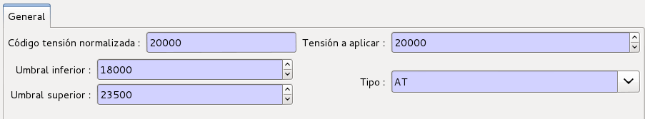

>Fitxa de tensió normalitzada

*CRITERI ESTADO:*

Feta la comparació dels elements amb el fitxer de la 4131, es defineixen els 3
estats diferents:

Estat = 0 Element sense  modificacions en relació a n-1

Estat = 1	Element amb alguna modificació en algun d’aquests camps:

* CINI
* Codi CCUU
* Tensio primari
* Tensio secundari
* Participacio
* Capacitat
* CT(Denominacion)

Estat = 2	Element nou que no apareix al inventari de l’any n-1

## MODIFICACIONS - MODIFICACIONES_R1-XXX.txt

Aquest fitxer s'especifica per la CNMC en el [Real Decret 1048/2013](https://sede.cnmc.gob.es/tramites/energia/mandatos-real-decreto-10482013)
amb l'enllaç "[Información adicional inventario.docx](https://sede.cnmc.gob.es/sites/default/files/2017-05/Informaci%C3%B3n%20adicional%20inventario.docx)".

Per tal de detectar aquelles instal·lacions que hagin canviat de tipologia respecte
a l'inventari de instal·lacions el 31 de Desembre de 2014 respecte l'inventari del 2016.
D'aquesta manera es podrà procedir a la actualització de la retribució per operació i
manteniment d'aquestes instal·lacions.

Per a aquests casos, les empreses titulars d'instal·lacions que hagin estat modificades
respecte la tipologia declarada en l'inventari d'instal·lacions en data 31/12/2014,
incloguin aquestes en el fitxer `MODIFICACIONES_R1-XXX.txt`, amb el següent format:

+------------------+--------------------------------------------------------------+
| CAMP             | CAMP DE LA BASE DE DADES                                     |
+==================+==============================================================+
| IDENTIFICADOR    | IDENTIFICADOR ÚNIC DE LA INSTAL·LACIÓ AMB EL QUE ES VA       |
| EN LA BASE       | DECLARAR LA INSTAL·LACIÓ EN DATA 31/12/2014                  |
+------------------+--------------------------------------------------------------+
|                  | IDENTIFICADOR ÚNIC DE LA INSTAL·LACIÓ EN LA DECLARACIÓ ACTUAL|
| IDENTIFICADOR    | DE L'INVENTARI EN DATA 31/12/2016, ÚNICAMENT EN EL CAS DE QUE|
| ACTUAL           | NO COINCIDEIXI AMB EL DECLARAT EN L'INVENTARI 31/12/2014, JA |
|                  | QUE EN AQUESTA DECLARACIÓ LA EMPRESA HAURIA DUPLICAT         |
|                  | IDENTIFICADORS                                               |
+------------------+--------------------------------------------------------------+
| CODIGO_CCUU      | CODI DENOMINATIU DE LA TIPOLOGIA DE LA INSTAL·LACIÓ D'ACORD  |
| EN LA BASE       | AMB L'ORDRE IET/2660/2015 AMB EL QUE ES VA DECLARAR LA       |
|                  | INSTAL·LACIÓ EN L'INVENTARI DEL 31/12/2014                   |
+------------------+--------------------------------------------------------------+
| CODIGO_CCUU      | CODI DENOMINATIU DE LA TIPOLOGIA DE LA INSTAL·LACIÓ D'ACORD  |
| ACTUAL           | AMB L'ORDRE IET/2660/2015 AEN LA DECLARACIÓ ACTUAL DE        |
|                  | L'INVENTARI DEL 31/12/2016                                   |
+------------------+--------------------------------------------------------------+

!!! Note
    El camp `IDENTIFICADOR ACTUAL` únicament es requereix per les empreses que
    haguessin duplicat identificadors en la declaració de l'inventari del 31/12/2014

Aquest fitxer s'ha d'adjuntar amb els altres fitxers declarats en la resolució
del 26/05/2017, de la Direcció General de Política Energètica i Mines, pel que
s'estableixen els criteris que hauràn de seguir les empreses distribuidores
d'energia delètrica per la remisió del inventari auditat d'instal·lacions de
distribució d'energia elèctrica que s'hagin posat en servei abans del 1 de Gener
de 2017, en el fitxer aportat en format ZIP.

Per generar aquest fitxer amb GISCE-ERP, cal primer introduïr al ERP dos fitxers
ZIP corresponents als inventaris.

Per una banda, fa falta entrar el fitxer generat per l'inventari del 31/12/2014,
és a dir, el fitxer corresponent a la [resolució 4771](4131.md#carrega-de-fitxers-de-la-4771)

Per altra banda, cal [carregar els fitxers de l'inventari 4666](#carregar-fitxer-inventari-4666-n)
del 31/12/2016, és a dir, els d'aquesta resolució.

Seguidament podrem procedir a generar el fitxer utilitzant l'assistent
"_Administració Pública > CNMC > Resolucions > Resolució 4666/2017 > Generar
Inventari 4666_" i sel·leccionant l'opció `MODIFICACIONS`

### Carregar Fitxer Inventari 4666 n

Per poder carregar el fitxer, primer s'ha de generar el fitxer ZIP amb els
inventaris de la resolució 4666, descrits en aquesta pàgina (fitxers del 1 al 8).
Seguidament accedint per l'ERP a "_Administració Pública > CNMC > Resolucions >
 Resolució 4666/2017 > Carregar Fitxer presentat n_".

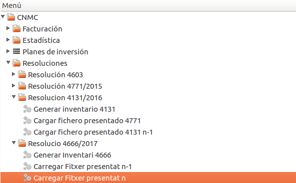

Aquí trobarem l'assistent que ens permet carregar l'inventari del 31/12/2016.
Senzillament cal sel·leccionar el fitxer que desitgem introduïr i polsar sobre
"Carregar fitxer"

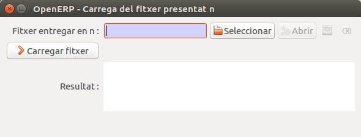

Aquest procés pot tardar uns minuts, depenent de la quantitat de dades entrada.
