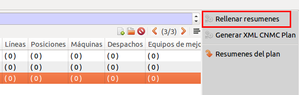
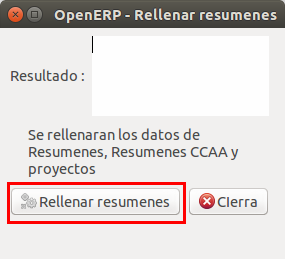

# Índex

- [Introducció](#introduccio)
- [Omplir resums](#omplir-resums)
- [Generar fitxers](#generar-fitxers)

# Introducció

Aquest mòdul permet la generació dels formularis de la Resolució 4667 relatius
a l’inventari de les instal·lacions en format ZIP.

El mòdul permet generar 12 fitxers .txt corresponents als Fitxers d'inventari descrits
a [la resolució 4667](http://www.boe.es/boe/dias/2017/04/28/pdfs/BOE-A-2017-4667.pdf)
i el [BOE 5932](https://www.boe.es/boe/dias/2016/06/17/pdfs/BOE-A-2016-5932.pdf).

# Omplir dades

Es poden entrar les dades dels plans d'inversio a Administració Pública/CNMC/Plans d'inversió

1. Crear un pla d'inversio

2. Omplir el codi R1(1) , el any (2) i crear els tres anys (3)

3. Crear els projectes de l'any
4. Omplir les dades de indicadors macroeconomics(Macro)

    Valors de les macros:

    | Any    | Valor PIB | PIB Nominal        | Límit              | Increment |
    |--------|-----------|--------------------|--------------------|-----------|
    | 2018   | 4,00      | 1209197000000,00   | 1571956100,00      | 1,75      |
    | 2019   | 4,40      | 1262401668000,00   | 1641122168,00      | 1,75      |
    | 2020   | 4,00      | 1312897734720,00   | 1706767055,00      | 1,75      |

    Exemple per el 2018:

    

    **Dades macroeconòmiques:**

    - Creixement PIB per 2019: 4,4%
    - PIB previst general per 2018: 1.209,197 Milers d'€
    - PIB previst general per 2019: 1.262,401 Milers d'€
    - LÍMIT d'inversió total sectorial 2018: 1.572 Milers d'€
    - LÍMIT d'inversió total sectorial 2019: 1.641 Milers d'€
    - Increment de demanda del sistema: 1,75%
    - Factor de retard distributiu: 1,09911406
    - Límit d'inversió per empresa: aprox. 25% de la retribució de la empresa al 2016

5. Omplir les dades de resums
    - Any
    - Limit de inversió per empresa (€)
    - Demanda prevista el any previ (MWh)
    - Increment de la demanda prevista any n (MWh)
    - Factor de Retard retrubit de la inversió
    - VPI superat

    Exemple valors:

    

    _Dades extretes del [BOE 5932](https://www.boe.es/boe/dias/2016/06/17/pdfs/BOE-A-2016-5932.pdf)_

    

6. Omplir les dades de LAT(1), LBT(2), Altres(3), Posicions(4), Maquines(5), Despatxos(6), Fiabilitat(7), CTs(8)

    **Exemple: entrar una LAT**

    - ID: I-TRAM. El tram que es veurà afectat. Exemple: el tram que es donarà de
    baixa amb aquesta actuació.
    - NOTA: No es posa cap ID ja que no es pot saber quin codi tindrà.
    - CINI / TI: el que tindrà el nou tram.
    - CCAA 2: Deixar buit.
    - Any previst: el mateix que el projecte
    - Capacitat: calcular o bé obtenir el valor d'un tram amb característiques semblants.

    

    !!! note
	    Els elements de menys de 36 kV **no han de constar** a la pestanya **Altres**

# Omplir resums

Les dades restants dels resums , resums CCAA i projectes es re-calcularan usant l'assistent. Per fer-ho s'ha de:

1. Anar a l'assistent

2. Apretar l'opcio d'omplir

# Generar fitxers

L'assistent ens permet generar el ZIP amb els fitxers descrits en el BOE. Per fer-ho s'ha de:

 1. Anar a l'assistent
 
 2. Generar el ZIP
 
