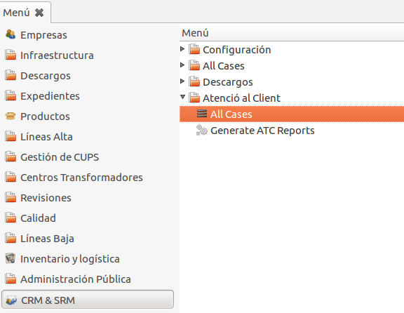

# Generació de Informes sobre Reclamacions de Consumidors

La principal funcionalitat del modul d'Atenció al Client és la de poder generar de forma
automatitzada fitxers amb la informació sobre les reclamacions demanats per la
CNMC. Es tracta de un fitxer .csv el format i la informació del qual segueixen
les directrius definides en la circular [2/2016](http://www.boe.es/diario_boe/txt.php?id=BOE-A-2016-7979).

Mitjançant la opció "**Generate ATC Reports**" situada a  "**CRM -> Atenció al
Client**"  s'obrirà un assitent per generar l'informe:

Aquest assistent funciona de la següent manera:

* Es selecciona un trimestre i un any (per defecte seran el trimestre i l'any
  actuals) i es clica "**Generar**".

* Automàticament es generarà un fitxer '.csv' amb tota la informació sobre les
  reclamacions. Aquest fitxer es pot obrir o guardar.

* Al guardar el fitxer s'assignarà un nom amb el següent format:

        "AAAA-MM-DD_electricidad_reclamaciones.csv"

     on AAAA-MM-DD és la data en que s'ha generat l'informe. Aquest nom no s'ha
     de modificar ja que és el demanat per la CNMC.

Les reclamacions que son incloses en aquest informe son totes aquelles
corresponents als casos d'atenció al client que no estiguin en estat 'esborrany'
i que pertanyin al trimestre i any seleccionats.

Al trobar-nos en una distribuidora, també s'inclouran les reclamacions
corresponents als casos **R1** de **Gestió ATR** que ja tinguin un pas 02 creat
(es a dir, que ja han estat  acceptats o rebutjats per la ditribuidora).

En la situació en que els casos R1 tenen un pas 02 amb rebuig s'indicarar en
l'informe que el resultat de la reclamació és "No Gestionable".    
Per altra banda, si ja s'ha tancat el cas ATR sense haver generat un pas 02 amb
rebuig s'indicarà el resultat de la reclamació com a "Procedente / Favorable".
