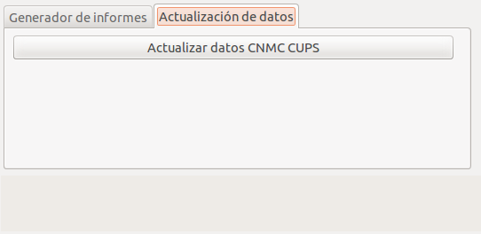
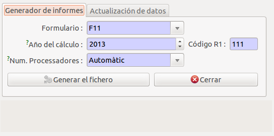
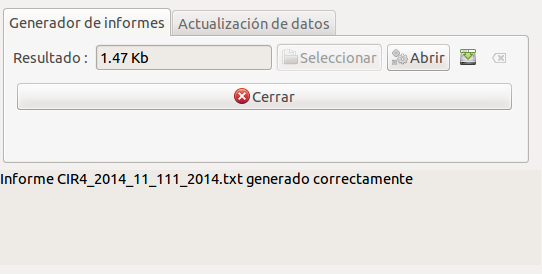

## Circular 4/2014

### Introducció

Aquest mòdul genera els formularis _F1, F1bis i F11_ de la _Circular 4/2014_

!!! note
    Aquest mòdul va ser afegit a partir de la versió **v2.44** on es van afegir
    una sèrie de camps nous a la base de dades per tal de complementar la
    informació requerida en els formularis

### Nous camps a la base de dades

#### CUPS

!!! note
    Tots els camps referents a dades de la **CNMC** s'han mogut a una pestanya
    anomendada **Estadistiques** dins del formulari del CUPS.

    

S'han afegit nous camps estadístics de la CNMC:

* **Número de lectures (CNMC)**: És el número de lectures efectuades en el CUPS
  en l'any de generació de la circular.
* **Potència facturada (CNMC)**: És l'última potència facturada a aquest CUPS en
  l'any de generació de la circular.

#### Comptador

S'afegeix el codi CINI al comptador

* **Bloquejar CINI**: Un cop assignat un CINI de forma manual ens permet
  bloquejar-lo per tal d'evitar una modificació.
* **CINI**: És el codi CINI d'aquest comptador.
* **Calcular CINI (auto.)**: Aquest camp permet el càlcul del codi CINI mitjançant
  el lloguer del comptador.

!!! note
    El sistema de càlcul de CINI automàtic només està disponible utilitzant el
    mòdul de facturació de distribució de GISCE-ERP.

Es poden visualitzar tots els comptadors que no disposen de CINI entrat a través
del menú: **Infraestructura > Comptadors > Comptadors sense CINI**

**Càlcul CINI automàtic segons el lloguer**

S'ha realitzat una taula d'equivalència entre els lloguers dels comptador i els
CINIS:

Codi de lloguer |  CINI
:--------------:|:------:
   ALQ01        | I31011A
   ALQ02        | I31011B
   ALQ03        | I31011C
   ALQ04        | I31011G
   ALQ05        | I31011H
   ALQ06        | I31011D
   ALQ07        | I31011E
   ALQ08        | I31011F
   ALQ14        | I31011K
   ALQ15        | I31011L
   ALQ16        | I31011N
   ALQ17        | I31011O
   ALQ18        | I31011P
   ALQ19        | I31013P
   ALQ20        | I31013Q
    (\*)        | I31011U

(\*) L'utilitza per tota la resta que no pot identificar a través del producte
de lloguer, ja sigui perquè no el té definit o perquè no correspont a cap
codi dels anteriors.

Si el comptador té seleccionat que la propietat és de **client** es marcarà la
posició 5 del CINI automàticament amb 2.

Si es té activat el mòdul de **telegestió** GISCE-TG, es detectarà es marcarà
la posició 6 del CINI automàticament amb 3.

#### Centre transformador

Se ha añadido el campo **Número máximo de máquinas**

!!! note
    En el procés d'actualització aquest camp s'inicialitza de forma automàtica
    segons el número de transformadors instal·lats el CT. Després s'ha de
    **revisar** que el valor sigui el corresponent.

### Generació dels informes

Els informes es poden generar a través del menú: **Administració pública >
CNMC > Circulares > Circular 4/2014**

A través d'aquest assistent podem realitzar dues operacions:

1. Generar els informes
2. Actualitzar dades estadístiques de la CNMC que s'utilitzen en aquests
   informes

!!! note
    Abans de generar els informes, hem d'haver actualtizat les dades de la CNMC
    amb l'aque que volem realitzar l'informe.

#### Actualització de dades

Aquesta pestanya és diferent segons es tingui instal·lat el mòdul de facturació
de distribució de GISCE-ERP o no.

**Amb mòdul de facturació**

En el cas que el tinguem instal·lat, només ens apareix un botó per recalcular aquest
valors depenguent de l'any que tinguem introduït en la pestanya "Generador d'informes".

**Sense mòdul de facturació**

Tenim dues accions disponibles:

* **CUPS CSV**: Hem de seleccionar el fitxer CSV amb el contingut adequat per
  tal d'actualitzar els valors CNMC del CUPS i després apretar el botó
  **Actualitzar CUPS**. Veure el [format dels cups en el csv](../cnmc.md#format-cups-csv)
* **Comptadors CSV**: Hem de seleccionar el fitxer CSV amb el contingut
  adequat per tal d'actualitzar els CINIS dels comptadors i després apretar el
  botó **Actualitzar CINIS**. Veure el [format dels comptadors en els csv](../cnmc.md#format-comptadors-csv)

#### Generació dels informes

* **Formulari**: Ens permet seleccionar quin informe volem generar. Els
  disponibles són: F1, F1bis i F11.
* **Any del càlcul**: En quin any volem realitzar el càlcul. Aquest camp també
  ens serviex per l'actualització de dades del CUPS.
* **Codi R1**: Em d'introduïr el codi R1 de la nostra empresa, només els 3 digits.
* **Núm. Procesos**: Hem de seleccionar el número de processos que volem
  utilitzar alhora de generar l'informe.

Podem apretar el botó **Generar el ficher** per tal que comenci el procés de
generació de l'informe.

!!! note
    Depenguent de la quantitat de dades els informes poden tardar força temps
    en generar-se.

Una vegada hagi finalitzat el procés podrem descarregar l'informe geneat

