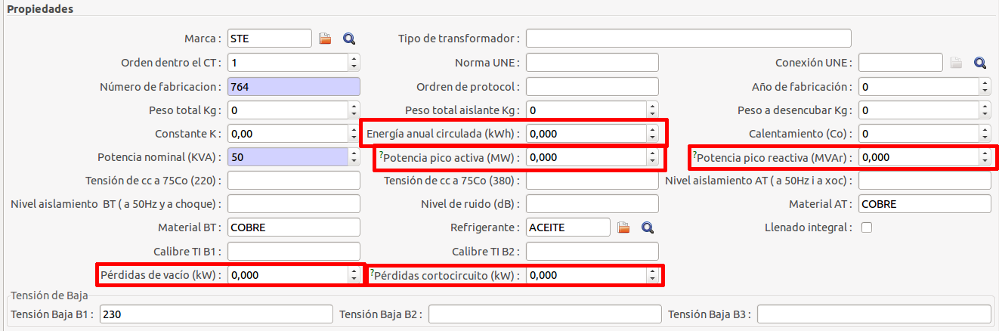
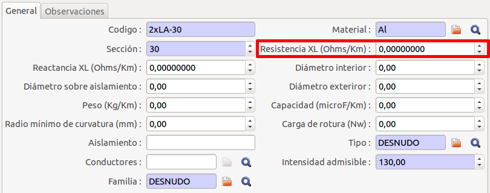
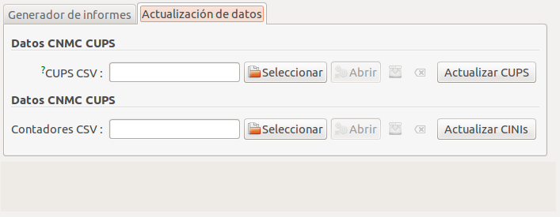

## Circular 4/2015

### Introducció

Aquest mòdul permet la generació dels formularis F1, F1bis, F9, F10, F11, F12,
F12bis, F13, F13bis, F13c, F14 , F15 i F20 de la Circular 4/2015.

* [Disposición 8624 del BOE núm. 182 de 2015](http://www.boe.es/boe/dias/2015/07/31/pdfs/BOE-A-2015-8624.pdf)

!!! note
    Aquest mòdul va ser afegit a partir de la versió **v2.55** on es van afegir
    una sèrie de camps nous a la base de dades per tal de cumplimentar la
    informació requerida en els formularis.

### Nous camps a la base de dades: circular 4/2015

#### Transformador



S'han afegit nous camps a la fitxa de **transformadors**:

* **Pèrdues de buit**
* **Pèrdues de curtcircuit a potencia nominal**
* **Potència pic d'activa costat de baixa**
* **Potència pic de rectiva costat de baixa**
* **Energia anual circulada**

#### Cables Baixa Tensió



S'ha afegit un nou camp a la fitxa de **cables baixa tensió**:

* **Resistència**

### Generació dels informes

Els informes es poden generar a través del menú: **Administració pública >
CNMC > Circulares > Circular 4/2015**

A través d'aquest assistent podem realitzar dues operacions:

  1. Generar els informes
  2. Actualitzar dades estadístiques de la CNMC que s'utilitzen en aquests
     informes

!!! note
    Abans de generar els informes, hem d'haver actualtizat les dades de la CNMC
    amb l'aque que volem realitzar l'informe.

#### 1. Actualització de dades

Aquesta pestanya és diferent segons es tingui instal·lat el mòdul de facturació
de distribució de GISCE-ERP o no.

**Amb mòdul de facturació**


En el cas que el tinguem instal·lat, només ens apareix un botó per recalcular aquest
valors depenguent de l'any que tinguem introduït en la pestanya "Generador d'informes".

**Sense mòdul de facturació**



Tenim dues accions disponibles:

* **CUPS CSV**: Hem de seleccionar el fitxer CSV amb el contingut adequat per
  tal d'actualitzar els valors CNMC del CUPS i després apretar el botó
* **Actualitzar CUPS**. Veure el [format dels cups en el csv](../cnmc.md#format-cups-csv)


* **Comptadors CSV**: Hem de seleccionar el fitxer CSV amb el contingut
  adequat per tal d'actualitzar els CINIS dels comptadors i després apretar el
  botó **Actualitzar CINIS**. Veure el [format dels comptadors en els csv](../cnmc.md#format-comptadors-csv)

#### 2. Generacio dels informes


* **Formulari**: Ens permet seleccionar quin informe volem generar. Els
  disponibles són: F1, F1bis, F9, F10, F11, F12, F12bis, F13, F13bis, F13c, F14
  , F15 i F20.
* **Any del càlcul**: En quin any volem realitzar el càlcul. Aquest camp també
  ens serviex per l'actualització de dades del CUPS.
* **Codi R1**: Em d'introduïr el codi R1 de la nostra empresa, només els 3 digits.
* **Núm. Processos**: Aquesta opció permet seleccionar el número de processos
  a assignar al processador del servidor. Amb un número més elevat de processos
  la generació dels informes és més rapida. Per defecte es selecciona **automàtic**,
  el qual ja escull el número òptim de processos.

Podem polsar el botó **Generar el fitxer** per tal que comenci el procés de
generació de l'informe.

!!! note
    Depenguent de la quantitat de dades els informes poden tardar força temps
    en generar-se.

Una vegada hagi finalitzat el procés podrem descarregar l'informe generat


### Formularis suportats

Format dels formularis:

* Sense capçalera
* Camps separats per punt i coma (**;**) i sense cometes.

#### F1: Informació relativa a la demanda excepte subministraments a distribuidors

S'inclourà informació relativa dels CUPS que compleixin les següents
característiques:

* **Actiu**: El **CUPS** ha d'estar actiu.
* **Data de creació**: La data de creació del **CUPS** ha de ser inferior al 01/01/2015 o estar buida.

També s'inclourà informació de les **pòlisses** dels CUPS que compleixin les
següents característiques:

* **Data d'alta de la pòlissa**: Ha de ser més petita o igual que l'últim dia de l'any (31/12/2014).
* **Data de baixa de la pòlissa**: Ha de ser superior a l'ultim dia de l'any (31/12/2014) o bé ha
  pot estar buida.
* **Estat de la pòlissa**: No pot ser ni "esborrany" ni "validar".

El formulari F1 està format pels següents camps:


Camp                             | Descripció
:--------------------------------|:---------------------------------------------------------------------------------------------------
Node                             | Node del graf
Coordenades UTM                  | Coordenades UTM (X, Y, Z) del node
CNAE                             | Codi CNAE de la pòlissa.
Equip de mesura                  | Codi de l'equip de mesura, el qual serà SMT, MEC o CNA
COD_TFA                          | Codi de tarifa
Zona de qualitat                 | Codi referent a la zona de qualitat. Prendrà el valor de U, RC, RD o SU.
CUPS                             | CUPS de la pòlissa
COD_DIS                          | Codi de la distribuidora. S'obté a través de l'assistent
Municipi                         | Codi INE del municipi del node
Provincia                        | Codi INE de la provincia del node
Connexió                         | Pot prendre dos valors: A (aèria) o S (subterrània)
Tensió d'alimentació             | La tensió de l'alimentació, expressada en kV
Estat del contracte              | 0: amb contracte en vigor el 31/12/20XX
                                 | 1: sense contracte en vigor el 31/12/20XX
Potencia contractada             | Potencia contractada a la pòlissa, expressada en kW
Potencia facturada               | Potencia facturada del CUPS, expressada en kW
Potencia adscrita instal·lació   | Potència màxima admissible del butlletí, expressada en kW. Si no en té és la potència contractada.
Energia activa anual consumida   | Energia activa anual consumida del CUPS, expressada en kWh
Energia reactiva anual consumida | Energia reactiva anual consumida del CUPS, expressada en kVArh
Any d'informació                 | Any del qual es genera aquest formulari.

!!! note
    Per tal d'evitar problemes de validació, veure documentació del camp
    [**CNAE**](../../../base/polizas.md#cnae)


#### F1bis: Informació relativa a la lectura dels equips de mesura dels clients

Aquest formulari ens mostrarà la informació relativa als CUPS actius que la seva
data de creació és inferior a 01/01/2015.

S'inclourà informació relativa dels CUPS que compleixin les següents
característiques:

* **Actiu**: El **CUPS** ha d'estar actiu.
* **Data de creació**: La data de creació del **CUPS** ha de ser inferior al 01/01/2015 o estar buida.

També s'inclourà informació de les **pòlisses** dels CUPS que compleixin les
següents característiques:

* **Data alta de la pòlissa**: Ha de ser més petita o igual que l'últim dia de l'any (31/12/2014).
* **Estat de la pòlissa**: No pot ser ni "esborrany" ni "validar".

Per obtenir els comptadors de les pòlisses s'han de complir els requisits
següents:

* **Data d'alta del comptador**: La data d'alta ha de ser inferior a 01/01/2015.

El formulari F1 bis està format pels següents camps:

Camp                             | Descripció
:--------------------------------|:----------------------------------------------
CUPS                             | CUPS de la pòlissa
CINI equip de mesura             | CINI del comptador
Instal·lació equip de mesura     | Data de la instal·lació del comptador
Numero de lectures efectuades    | Numero total de lectures efectuades pel comptador durant tot l'any. S'obté de la pestanya **Estadístiques** del CUPS.
Canvi de titularitat             | 0: No hi ha hagut cap canvi de titularitat durant l'any
                                 | 1: Hi ha hagut algun canvi de titularitat  durant l'any
Baixa del subministre            | 0: El punt de subministrament no s'ha donat de baixa durant l'any
                                 | 1: El punt de subministrament s'ha donat de baixa durant l'any
Any d'informació                 | Any del qual es genera aquest formulari.

#### F9: Topologia de la xarxa real

Aquest formulari conté la informació dels trams d'alta i baixa tensió que formen
la xarxa real. El fitxer resultant és codificat en ASCII mitjançant l'estàndard
"Arc/Info Generate Format".

S'inclourà informació dels trams d'alta i baixa tensió que compleixin les
següents característiques:

* **Actiu**: S'inclouran en el fitxer només els trams AT/BT que tenen la
    casella "Actiu" marcada.
* **Data APM**: Data de posta en marxa anterior al final de l'any sol·licitat,
  a 31 de Desembre. ( p.e. per l'any 2014 data_APM < 01/01/2015) o bé
  estar buida. S'ha de complir tant per els trams **d'alta tensió**
  com els de **baixa tensió**.
* **Data de baixa**: Ha de ser superior a l'últim dia de l'any. ( p.e per l'any
  2014, la data de baixa > 31/12/2014). S'ha de complir tant per els trams
  **d'alta tensió** com els de **baixa tensió**.
* **Codi CINI**: Per els trams **d'alta tensió** el cini ha de ser diferent de
  "000000".
* **Longitud del cable**: Per els cables embarrats dels trams **d'alta tensió** es
  comprova que la longitud < 100 metres.
* **Tipus de cable**: Per els trams de **baixa tensió** es comprova que els cables
  siguin del tipus tipus **trenat, despullat, subterrani o embarrat**.

Cada tram és identificat per una sèrie de línies: la primera es reserva per el
**codi de tram** i les següents per enumerar els **vèrtexs dels segments** dels
que consta cada tram de la xarxa. El final del tram s'indica amb la paraula
**'END'**. El final del fitxer s'indica de la mateixa manera.

Exemple: fitxer amb dos trams

```
A1234

x1;y1;z1

x2;y2;z2

x3;y3;z3

END

B4321

x1;y1;z1

x2;y2;z2

x3;y3;z3

x4;y4;z4

END

END
```

#### F10: Informació relativa a les línies d'AT i BT (Alta i Baixa tensió)

El formulari 10 conté informació sobre les instal·lacions d'alta i baixa tensió,
tot dins d'un sol fitxer.

Només s'inclouràn les **línies d'AT** que compleixin les següents
condicions:

* **Actiu**:
    * Ha d'estar actiu
    * Si no està actiu, hi ha d'haver el camp **data baixa** amb una data
      entrada.
* **CINI**: CINI diferent de '000000'
* **Data APM**: Data de posta en marxa anterior al final de l'any sol·licitat,
  a 31 de Desembre. ( p.e. per l'any 2014 data_APM < 01/01/2015) o bé estar
  buida.
* **Data de baixa**: Data de baixa ha de ser superior a l'ultim dia de l'any.
  ( p.e. per l'any 2014, data_baixa > 31/12/2014) o bé estar buida.
* **Longitud del cable**: Si el tram és embarrat, ha de tenir una longitud <= 100.

Per les **línies de BT** s'inclouràn les que compleixin el següent:

* **Actiu**:
    * Ha d'estar actiu
    * Si no està actiu, hi ha d'haver el camp **data baixa** amb una data
     entrada.
* **Tipus de cable**: El tipus del cable ha de ser un dels següents codis: **T,
  D, S, E o I**.
* **Data APM**: Data de posta en marxa anterior al final de l'any sol·licitat,
  a 31 de Desembre. ( p.e. per l'any 2014 data_APM < 01/01/2015) o bé estar
  buida.
* **Data de baixa**: Data de baixa ha de ser superior a l'ultim dia de l'any.
  ( p.e. per l'any 2014, data_baixa > 31/12/2014) o bé estar buida.

Les dades referents a **l'alta tensió** estàn formades pels següents camps:

Camp                             | Descripció
:--------------------------------|:----------------------------------------------
Tram                             | Codi del tram
Node inicial                     | Codi del node d'origen del tram
Node final                       | Codi del node final del tram
CINI                             | CINI del tram
Provincia                        | Codi INE de la província de la línia AT
Nivell de tensió                 | Tensió de la línia AT. És la tensió màxima de
                                 | disseny del tram. Expressada en kV
Longitud                         | Longitud del tram d'AT. Expressada en km
Número de circuits               | Numero de circuits del tram d'AT
Tipus                            | Tipus de cable emprat, que pot ser: T (aeri-trenat), D (aeri-despullat), S (subterrani)
R                                | Resistencia del cable AT(en Ohms)
X                                | Reactancia del cable AT(en Ohms)
Intensitat màxima                | Intensitat admissible del cable AT. Expressada en Ampers
Estat d'operació habitual        | Valor fixe 1, doncs sempre és obert
COD_DIS                          | Codi R1 de la companyia distribuidora. S'obté de l'assistent
Propietat                        | 0: Pertany a tercers, 1: pertany a la companyia
Any d'informació                 | Any del qual es genera aquest formulari

Les dades referents a **baixa tensió** estàn formades pels següents camps:

Camp                             | Descripció
:--------------------------------|:----------------------------------------------
Tram                             | Codi del tram
Node inicial                     | Codi del node d'origen del tram
Node final                       | Codi del node final del tram
CINI                             | CINI del tram
Provincia                        | Codi INE de la província de la línia BT
Nivell de tensió                 | Tensió de la línia AT. És la tensió màxima de disseny del tram. Expressada en kV
Longitud                         | Longitud del tram d'AT. Expressada en km
Número de circuits               | Numero de circuits del tram d'BT. Valor fix 1.
Tipus                            | Tipus de cable emprat, que pot ser: T (aeri-trenat), D (aeri-despullat), S (subterrani)
R                                | Resistencia del cable BT(en Ohms)
X                                | Reactancia del cable BT(en Ohms)
Intensitat màxima                | Intensitat admissible del cable AT. Expressada en Ampers
Estat d'operació habitual        | Valor fixe 1, doncs sempre és obert
COD_DIS                          | Codi R1 de la companyia distribuidora. S'obté de l'assistent
Propietat                        | 0: Pertany a tercers, 1: pertany a la companyia
Any d'informació                 | Any del qual es genera aquest formulari


Per el càlcul del camp **tipus** s'efectuen les següents operacions:

* tipus línia = subterrània -- tipus de cable = N/A -- el valor serà S
* tipus línia = aeri -- tipus de cable = trenzado = T -- el valor serà T
* tipus línia = aeri -- tipus de cable = desnudo = D -- el valor serà D
* tipus línia = aeri -- tipus de cable = subterráneo = S -- el valor serà S
* tipus línia = aeri -- tipus de cable = INDEFINIDO = I -- el valor serà T
* tipus línia = aeri -- tipus de cable = EMBARRADO = E -- el valor serà S

#### F11: Característiques de centres de transformació

Només s'inclouràn els **CTs** que compleixin les següents
condicions:

* **Actiu**:
    * El **CT** Ha d'estar actiu
    * Si no està actiu, hi ha d'haver el camp **data baixa** amb una data
      entrada.
* **ID de la instal·lació del CT**: Ha de ser diferent de 'SE'.
* **Data APM del CT**: Data de posta en marxa anterior al final de l'any sol·licitat,
  a 31 de Desembre. ( p.e. per l'any 2014 data_APM < 01/01/2015) o bé estar
  buida
* **Data de baixa del CT**: Data de baixa ha de ser superior a l'ultim dia de l'any.
  ( p.e. per l'any 2014, data_baixa > 31/12/2014) o bé estar buida.

El formulari F11 està format pels següents camps:

Camp                             | Descripció
:--------------------------------|:----------------------------------------------
Node alta                        | Codi del node d'alta tensió
CT                               | Codi del CT
CINI                             | CINI del centre de transformació
Coordenades UTM                  | X, Y i Z, separades per ';'
Municipi                         | Codi INE del municipi del CT
Provincia                        | Codi INE de la provincia del CT
Nivell de tensió costat alta     | Nivell de tensió, obtingut del camp Tensió primària de la pestanya Dades del CT. Expressat en kV
Tipus                            | Tipus de CT, que pot ser: I (intemperie), C (caseta), L (local) o S (subterrani)
Potencia total instal·lada       | La potencia total del CT, expressada en kVA
Energia anual circulada          | L'energia anual circulada del cups, obtinguda de la solapa Estadístiques del cups. Expressada en kWh
Demanda pic activa costat baixa  | Expressada en kW
Demanda puc reactiva cost. baixa | Expressada en kVAr
Número de sortides utilitzades   | El número de sortides utilitzades per el CT. Es calcula a partir del número d'interruptors de baixa tensió que tenen alguna línia de baixa connectada. Expressat en unitats.
Número màxim de sortides         | El número de fusibles de baixa tensió del CT, expressat en unitats.
COD_DIS                          | Codi R1 de la companyia distribuidora. S'obté de l'assistent.
Propietat                        | 0: pertany a tercers, 1: pertany a la companyia
Màx. de màquines instal·lables   | El número màxim de màquines instal·lables.
Any d'informació                 | Any del qual es genera aquest formulari.

#### F12: Composició de centres de transformació (Màquines)

Només s'inclouràn els **transformadors** que compleixin les següents
condicions:

* **Actiu**:
    * El transformador ha d'estar actiu
    * Si no està actiu, hi ha d'haver el camp **data baixa** amb una data
      entrada.
* **Estat del transformador**: L'estat del transformador ha de tenir marcat el
  checkbox "Apareix a l'inventari".
* **Data APM del transformador**: Data de posta en marxa anterior al final de
  l'any sol·licitat, a 31 de Desembre. ( p.e. per l'any 2014 data_APM <
  01/01/2015) o bé estar buida.
* **Data de baixa del transformador**: Data de baixa ha de ser superior a
  l'ultim dia de l'any.    
  ( p.e. per l'any 2014, data_baixa > 31/12/2014) o bé estar buida.
* **Reductor**: Ha de tenir desmarcat el checkbox **reductor**.

El formulari F12 està format pels següents camps:

Camp                             | Descripció
:--------------------------------|:----------------------------------------------
Node                             | Codi del node de baixa tensió
CT                               | Codi del CT
CINI                             | CINI del centre de transformació
Màquina                          | Codi del transformador
Potencia màquina                 | Potència nominal del transformador, expressada en kVA
Pèrdues de buit                  | Pèrdues de buit del transformador, en kW
Pèrdues de curtcircuit nominals  | Pèrdues de curtcircuit a potencia nominal del transformador, en kW
Propietat                        | 0: pertany a tercers, 1: pertany a la companyia
Any d'informació                 | Any del qual es genera aquest formulari.

#### F12 bis: Posicions en centres de transformació

Només s'inclouràn les **cel·les i elements de tall** que compleixin les següents
condicions:

* **Instal·lació**: Només s'inclouràn les **cel·les i elements de tall** que la
  instal·lació sigui un CT.
* **Actiu**:
    * La **cel·la** ha d'estar activa
    * Si no està activa, hi ha d'haver el camp **data baixa** amb una data
      entrada.
* **Data APM de la cel·la**: Data de posta en marxa anterior al final de l'any
  sol·licitat, a 31 de Desembre. ( p.e. per l'any 2014 data_APM < 01/01/2015) o
  bé estar buida.
* **Data de baixa de la cel·la**: Data de baixa ha de ser superior a l'ultim dia
  de l'any.    
  ( p.e. per l'any 2014, data_baixa > 31/12/2014) o bé estar buida.

Per obtenir el codi del transformador, aquest ha de complir els
següents requisits:

* **Estat del transformador**: El transformador ha d'estar en funcionament.

El formulari F12 bis està format pels següents camps:

Camp                             | Descripció
:--------------------------------|:----------------------------------------------
Node                             | Codi del node de baixa tensió
Màquina                          | Codi del transformador
Posició                          | Codi de la cel·la de la posició
CINI                             | CINI del centre de transformació
Propietat                        | 0: pertany a tercers, 1: pertany a la companyia
Data de posada en marxa          | Data APM de la cel·la de la posició. Es pot trobar a la pestanya Datos Administrativos de la cel·la.
Any d'informació                 | Any del qual es genera aquest formulari

#### F13: Subestacions

Només s'inclouràn les **subestacions** que compleixin les següents
condicions:

* **Propietari de la subestació**: Només s'inclouràn les **subestacions** que
  pertanyin a la companyia.
* **Activa**:
    * La **subestació** a d'estar activa
    * Si no està activa, hi ha d'haver el camp **data baixa** amb una data
      entrada.
* **Data APM de la subestació**: Data de posta en marxa anterior al final de
  l'any sol·licitat, a 31 de Desembre o bé estar buida.    
  ( p.e. per l'any 2014 data_APM < 01/01/2015)
* **Data de baixa de la subestació**: Data de baixa ha de ser superior a l'ultim
  dia de l'any o bé estar buida.    
  ( p.e. per l'any 2014, data_baixa > 31/12/2014)

El formulari F13 està format pels següents camps:

Camp                             | Descripció
:--------------------------------|:----------------------------------------------
Subestació                       | Codi de la subestació
CINI                             | CINI de la subestació
Denominació                      | Descripció de la subestació
Coordenades UTM                  | X, Y i Z, separades per ';'
Municipi                         | Codi INE del municipi de la subestació
Provincia                        | Codi INE de la provincia de la subestació
COD_DIS                          | Codi R1 de la companyia distribuidora. S'obté de l'assistent.
Propietat                        | 0: pertany a tercers, 1: pertany a la companyia
Any d'informació                 | Any del qual es genera aquest formulari

#### F13 bis: Composició de subestacions: parcs

Només s'inclouràn els **parcs** que compleixin les següents
condicions:

* **Tensió del parc**: Hi ha d'haver una tensió entrada.
* **Actiu**:
    * El **parc** ha d'estar actiu
    * Si no està actiu, hi ha d'haver el camp **data baixa** amb una data
      entrada.
* **Data APM del parc**: Data de posta en marxa anterior al final de l'any
  sol·licitat, a 31 de Desembre o bé estar buida.    
  ( p.e. per l'any 2014 data_APM < 01/01/2015)
* **Data de baixa del parc**: Data de baixa ha de ser superior a l'ultim dia de
  l'any o bé estar buida.    
  ( p.e. per l'any 2014, data_baixa > 31/12/2014)

El formulari F13 bis està format pels següents camps:

Camp                             | Descripció
:--------------------------------|:----------------------------------------------
Subestació                       | Codi de la subestació
Parc                             | Codi del parc de la subestació
Node                             | Codi del node de la subestació
CINI                             | CINI de la subestació
Tipus de parc                    | 0: Transformador de distribució
                                 | 1: de maniobra
                                 | 2: de condensadors
                                 | 3: de generació
Tensió del parc                  | Tensió del parc de la subestació, expressada en kV
Propietat                        | 0: pertany a tercers, 1: pertany a la companyia
Any d'informació                 | Any del qual es genera aquest formulari


#### F13 C: Posicions

Només s'inclouràn les **posicions** que compleixin les següents
condicions:

* **Interruptor de la posició**: La **posició** ha de tenir un interruptor del
  tipus **automàtic**.
* **Activa**:
    * La **posició** ha d'estar activa
    * Si no està activa, hi ha d'haver el camp **data baixa** amb una data
      entrada.
* **Data APM de la posició**: Data de posta en marxa anterior al final de l'any
  sol·licitat, a 31 de Desembre o bé estar  buida.    
  ( p.e. per l'any 2014 data_APM < 01/01/2015)
* **Data baixa de la posició**: Data de baixa ha de ser superior a l'ultim dia
  de l'any o bé estar buida.    
  ( p.e. per l'any 2014, data_baixa > 31/12/2014)

El formulari F13 C està format pels següents camps:

Camp                             | Descripció
:--------------------------------|:----------------------------------------------
Subestació                       | Codi de la subestació
Parc                             | Codi del parc de la subestació
Posició                          | Codi de la posició de la subestació
CINI                             | Codi del CINI de la subestació
Propietat                        | 0: pertany a tercers, 1: pertany a la companyia
Data de posada en marxa          | Data APM de la subestació de la posició. Es pot trobar a la pestanya Datos Administrativos de la subestació.
Any d'informació                 | Any del qual es genera aquest formulari

#### F14: Màquines

Només s'inclouràn els **transformadors** que compleixin les següents
condicions:

* **Reductor**: El **transformador** ha de tenir marcat el checkbox **reductor**
  a la fitxa transformador de l'ERP.
* **Estat del transformador**: L'estat del **transformador** ha de tenir marcat
  el checkbox "Apareix a l'inventari" a la fitxa transformador de l'ERP.

El formulari F14 està format pels següents camps:

Camp                             | Descripció
:--------------------------------|:----------------------------------------------
Subestació                       | Codi de la subestació
Màquina                          | Codi del transformador de la subestació
CINI                             | CINI de la subestació
Parc costat alta                 | Codi de la tensió primària del transformador
Parc costat baixa                | Codi de la tensió b1 del transformador
Potencia instal·lada màquina     | Potència nominal del transformador, en MVA
Potència pic activa costat baixa | La potència de pic d'activa de costat baixa del transformador
Pot. pic reactiva costat baixa   | La potència de pic reactiva de costat baixa del transformador
Energia anual circulada          | Energia anual circulada del transformador, expressada en kWh
Pèrdues de buit                  | Pèrdues del transformador, en kW
Pèrdues de curtcircuit nominals  | Pèrdues de curtcircuit a potencia nominal del transformador, en kW
Propietat                        | 0: pertany a tercers, 1: pertany a la companyia
Estat de funcionament            | 1: operatiu, 0: en reserva freda
Any d'informació                 | Any del qual es genera aquest formulari

#### F15: Fiabilitat

Només s'inclouràn les **cel·les i elements de tall** que compleixin les següents
condicions:

* **Instal·lació**: Només s'inclouràn les **cel·les i elements de tall** que la
  instal·lació estigui en un suport.

El formulari F15 està format pels següents camps:

Camp                             | Descripció
:--------------------------------|:----------------------------------------------
Node                             | Codi del node de l'equip de fiabilitat
Element de fiabilitat            | Identificatiu de l'element de fiabilitat, obtingut del camp Categorització Inventari de la cel·la.
Tram                             | Codi del tram
CINI                             | CINI de la cel·la de l'element de fiabilitat
Coordenades UTM                  | X, Y i Z, separades per ';'
Municipi                         | Codi INE del municipi de l'equip de fiabilitat
Provincia                        | Codi INE de la provincia de l'equip de fiabilitat
Nivell de tensió                 | Tensió de la línia d'AT de l'equip de fiabilitat, en kV
COD_DIS                          | Codi R1 de la companyia distribuidora. S'obté de l'assistent.
Propietat                        | 0: pertany a tercers, 1: pertany a la companyia
Any d'informació                 | Any del qual es genera aquest formulari

#### F20: Informació relativa a la connectivitat dels clients

Només s'inclouràn els **CUPS** que compleixin les següents
condicions:

* **Actiu**: El **CUPS** ha d'estar actiu.
* **Data de creació del CUPS**: La data de creació ha de ser inferior al
  01/01/2015 o estar buida.

El formulari F20 conté, per cadascún dels clients de l'empresa distribuidora,
la relació amb les instal·lacions a les que es troba connectat. Conté 4 camps,
separats per punts i comes ';'.

Els camps són:

* Codi R1 de la companyia distribuidora
* CUPS
* CINI del CT
* Codi del CT

Exemple:

>`R1-000;ES9658748563012408ZF;I224511A;234dew56sd`    
> On cada camp està separat per ';'

Aquest fitxer contindrà el mateix numero de línies com clients té la
distribuidora.

### Casos habituals

En aquest apartat trobareu informació sobre els casos o motius més habituals
pels quals no apareixen certs elements als formularis.

!!! note
    Les caselles que no tenen cap data APM, es considera que son **més petites
    o iguals** a l'últim dia de l'any informat.

Actiu | Data APM   | Baixa | Data de baixa | Apareix | Observacions
:-----|:-----------|:------|:--------------|:--------|:--------------------------
   ✓  |            |   ✗   |               |    ✓    |
   ✗  |            |   ✓   |               |    ✗    |
   ✓  |  2017      |   ✗   |               |    ✗    | L'element s'ha donat d'alta al 2017.
   ✗  |            |   ✓   |   2017        |    ✓    | Element donat de baixa al 2017. Els nusos es mostren com 1234_0, 1234_1. Al F9 surten sense coordenades.

**Altres casos:**

Aquest casos són molt poc probables que es puguin ocasionar, ja que implica
incongruències a les dades. S'haurien de corregir per tal de poder generar
correctament els fitxers.

Actiu | Data APM   | Baixa | Data de baixa | Apareix | Observacions
:-----|:-----------|:------|:--------------|:--------|:--------------------------
   ✗  |            |   ✗   |   2016        |    ✗    |
   ✗  |            |   ✗   |   2017        |    ✓    |
   ✗  |            |   ✗   |   Buit        |    ✗    |
   ✗  |            |   ✗   |   2000        |    ✗    |
   ✓  |            |   ✓   |   2017        |    ✓    |
   ✓  |            |   ✓   |   2016        |    ✗    |
   ✓  |            |   ✓   |   Buit        |    ✓    |
   ✓  |            |   ✗   |   2016        |    ✗    | Cal revisar la data de baixa de l'element i esborrar-la.
   ✓  |            |   ✗   |   2017        |    ✓    |
   ✓  |   Buit     |   ✗   |               |    ✓    | Cal revisar la data APM de **tots** els elements, ja que si se'n crea un durant el 2017, apareixerà al fitxer si no té data APM.
