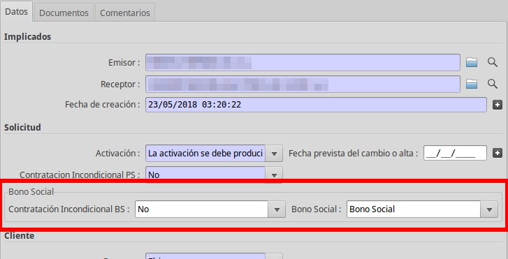

# Gestió ATR

## Gestió Bo Social

### Descripció

A partir de la versió 1.1 ATR de la CNMC, els processos ATR s'informa de l'estat
de Bo Social del contracte. Aquesta informació l'ha de gestionar la
distribuidora a partir de la informació subministrada per la comercialitzadora
d'últim recurs.

És responsabilitat de la distribuidora anar actualitzant la informació que
posteriorment s'inclourà en els fitxers SIPS.

Existeixen rebuigs específics per evitar la contractació per part de
comercialitzadores de mercat lliure i indicadors per permetre-ho encara que
estigui en Bo Social

### Bo Social en els fitxers ATR

Els casos afectats són C1, C2 i M1.

#### BonoSocial

Informa si el contracte sol·licitat està adherit al bo social

La etiqueta informada és `BonoSocial` i pot tenir els valors indicats en la
Taula adjunta (TAULA 116):

| CODI | DESCRIPCIÓ |
|-|-|
| 0 | No Bono Social – Retirada del BS |
| 1 | Bono Social |

* **Pas 01**: Informa si el contracte s'ha adherit al bo social

* **Pas 02**: Informa si el contracte està adherit al bo social només si s'ha
indicat en el pas 01

* **Pas 05**: Informa si el contracte està adherit al bo social només si s'ha
indicat en el pas 01

### ContratacionIncondicionalBS

Informa que es vol contractar o modificar el contracte encara que estigui
adherit al bo social i el sol·licitant sigui una Comercialitzadora del Mercat
Lliure.

!!! warning "Atenció"
    En el cas que es sol·liciti, el client perd els beneficis d'estar adherit al
    bo social

Nomé en els processos de canvi de Comercialitzadora (C1/C2)

La etiqueta informada és `ContratacionIncondicionalBS` i pot tenir els valors
indicats en la Taula adjunta (TAULA 26):

| CODI | DESCRIPCIÓ | COMENTARIS |
|-|-|-|
| S | Si | Contractar encara que tingui Bo Social |
| N | No | No contractar si té Bo Social (valor per defecte si no s'informa)|

* **Pas 01**: Permet o no la contractació si el contracte està adherit al bo
social

### IndBonoSocial

Informa que el contracte sortint està adherit al bo social o no

La etiqueta informada és `IndBonoSocial` i pot tenir els valors
indicats en la Taula adjunta (TAULA 26):

| CODI | DESCRIPCIÓ | COMENTARIS |
|-|-|-|
| S | Si | Contracte adherit al bo social |
| N | No | Contracte No adherit al bo social|

* **Pas 06**: Informa si el contracte sortint té *(S)* o no *(N)* Bo social

* **Pas 11**: Informa si el contracte sortint té *(S)* o no *(N)* Bo social

Aquest camp s'omple automàticament amb el valor del camp Bo Social del contracte
en el moment de generar el pas.

### Bo Social en els contractes

Els contractes disposen d'un camp per poder gestionar si un contracte està
adherit o no al Bo Social. El camp **Bo Social** es pot trobar a la pestanya
general de la fitxa del contracte i pot tenir els mateixos valors que la taula
_BonoSocial_

Està controlat per modificació contractual per poder controlar a partir de quin
moment el contracte es va adherir al bo social.

### Rebuigs automàtics relacionats amb el Bo Social

S'ha automatitzat el rebuig **D1: Suministro acogido a bono social**

* **Rebuig D1**: Es genera un rebuig automàtic si el C1/M1 el genera una
si no porta el camp `contratacionIncondicionalBS` i el contracte està habilitat
per el Bo Social.

### Gestió del Bo Social mitjançant ATR

Actualment, la distribuidora ha de gestionar manualment el camp Bo Social a
partir de la informació subministrada per els casos ATR.

Per facilitar-ho, hem afegit la informació al camp `informació addicional`

El procediment és el següent:

* Analitzar si el cas C1/C2/M1 entrant porta el camp `BonoSocial` mitjançant el
camp d'informació adicional o entrant dins el pas

* Si no hi ha cap rebuig, es podrà crear el pas 02 d'acceptació. El camp
`BonoSocial` es copiarà del pas 01 corresponent

* Un cop fetes les tasques necessàries, la modificació contractual ha de
modificar el camp *Bo Social* del contracte amb la informació del pas

* El pas 05 ja llegirà aquesta informació segons el valor del contracte per
omplir el camp *IndBonoSocial*
