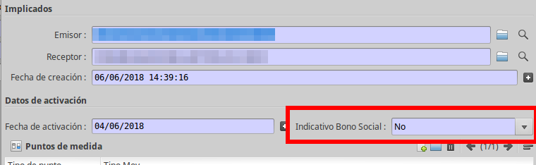

# Gestió ATR

## Gestió Bo Social

### Descripció

A partir de la versió 1.1 ATR de la CNMC, els processos ATR s'informa de l'estat
de Bo Social del contracte. Aquesta informació l'ha de gestionar la
distribuidora a partir de la informació subministrada per la comercialitzadora
d'últim recurs.

És responsabilitat de la distribuidora anar actualitzant la informació que
posteriorment s'inclourà en els fitxers SIPS.

Existeixen rebuigs específics per evitar la contractació per part de
comercialitzadores de mercat lliure i indicadors per permetre-ho encara que
estigui en Bo Social

### Bo Social en els fitxers ATR

Els casos afectats són C1, C2 i M1.

#### BonoSocial

Informa si el contracte sol·licitat està adherit al bo social

La etiqueta informada és `BonoSocial` i pot tenir els valors indicats en la
Taula adjunta (TAULA 116):

| CODI | DESCRIPCIÓ |
|-|-|
| 0 | No Bono Social – Retirada del BS |
| 1 | Bono Social |

* **Pas 01**: Informa si el contracte s'ha adherit al bo social

* **Pas 02**: Informa si el contracte està adherit al bo social només si s'ha
indicat en el pas 01

* **Pas 05**: Informa si el contracte està adherit al bo social només si s'ha
indicat en el pas 01

### ContratacionIncondicionalBS

Informa que es vol contractar o modificar el contracte encara que estigui
adherit al bo social i el sol·licitant sigui una Comercialitzadora del Mercat
Lliure.

!!! warning "Atenció"
    En el cas que es sol·liciti, el client per els beneficis d'estar adherit al
    bo social

Nomé en els processos de canvi de Comercialitzadora (C1/C2)

La etiqueta informada és `ContratacionIncondicionalBS` i pot tenir els valors
indicats en la Taula adjunta (TAULA 26):

| CODI | DESCRIPCIÓ | COMENTARIS |
|-|-|-|
| S | Si | Contractar encara que tingui Bo Social |
| N | No | No contractar si té Bo Social (per defecte si no existeix)|

* **Pas 01**: Permet o no la contractació si el contracte està adherit al bo
social

### IndBonoSocial

Informa que el contracte sortint està adherit al bo social o no

La etiqueta informada és `IndBonoSocial` i pot tenir els valors
indicats en la Taula adjunta (TAULA 26):

| CODI | DESCRIPCIÓ | COMENTARIS |
|-|-|-|
| S | Si | Contracte adherit al bo social |
| N | No | Contracte No adherit al bo social|

* **Pas 06**: Informa si el contracte sortint té *(S)* o no *(N)* Bo social

* **Pas 11**: Informa si el contracte sortint té *(S)* o no *(N)* Bo social

### Bo Social en els contractes

Els contractes tenen disposen d'un camp per poder gestionar si un contracte està
adherit o no al Bo Social. El camp **Bo Social** es pot trobar a la pestanya
general de la fitxa del contracte i pot tenir els mateixos valors que la taula
_BonoSocial_

Està controlat per modificació contractual per poder controlar a partir de quin
moment el contracte es va adherir al bo social.

### Gestió del Bo Social mitjançant ATR

Actualment, la distribuidora ha de gestionar manualment el camp Bo Social a
partir de la informació subministrada per els casos ATR.

Per facilitar-ho, hem afegit la informació al camp `informació addicional`

Podem generar casos ATR de forma automatica si utilitzem un wizard. Per tal d'utilitzar
aquest wizard hem d'anar a *Gestió de Pòlisses>Pòlisses* (Figura 1).

Allà haurem de seleccionar una pòlissa i premer el botò d'accions, on haurem de
seleccionar *Generar cas Gestió ATR* (Figura 2).

Altrament podem entrar a la polissa i també premer el botò que diu *Generar cas Gestió ATR* (Figura 3).

Això ens obrirà la següent finestra amb el wizard:

Des d'aqui podrem crear diferents casos segons l'estat de la polissa.
Aquestses són les condicions que haurem de complir per crear un cas:

 * **C1/C2/A3**: La polissa ha d'estar en estat borrador
 * **M1/B1**: La polissa ha d'estar en estat actiu
 * **W1**: La polissa ha d'estar en estat actiu i amb autolectures

A més, mai no pot haver-hi un altre cas de gestió ATR actiu si en volem crear un de nou.

Per tal de crear el cas que volem simplement hem de premer el botò corresponent.

### Wizard per M1 i C2

Si seleccionem que volem crear un M1 o un C2 la pantalla del wizard canviarà i podrem
entrar les dades necessaries per crear-lo.

Podem crear un canvi de tarifa o potència, un canvi de titular o un canvi de totes
dues a la vegada. Segons el que seleccionem haurem d'entrar unes dades o altres.

Les primeres dades que hem d'entrar són sobre qui serà el contacte per la pòlissa.
Si premem la lupa i seleccionem una altre persona ens hauria d'omplir correctament la
resta de camps, però sempre es preferible comprovar-ho.

Tot seguit tenim l'opció de canviar de tarifa comercialitzadora. Per defecte no es
canviarà i es deixarà la que té assignada la polissa però si no és possible s'haurà
de seleccionar quina tarifa volem aplicar. Si només existeix una tarifa comercialitzadora
per la tarifa ATR seleccionada aquesta es triarà automaticament.

Llavors, si hem seleccionat un canvi de tarifa o potència, ens apareixarà la part del
formulari per triar la tarifa que vol el client, si vol anar per ICP o Maxímetre i
les potencies de la tarifa. A l'hora d'entrar les potencies ens avisarà si estem posant
un valor de potencia incorrecte, ja sigui perquè el valor és massa gran o massa petit
per la tarifa seleccionada, perquè els valors de potència no tenen valors ascendents
en una tarifa que ho demana o perquè algun valor de potència no està normalitzat.
Es permeten crear casos amb valors de potència no normalitzats però si que s'han de
complir les dues altres condicions. També destacar que un canvi en la tarifa ATR seleccionada
ens pot fer canviar la tarifa comercialitzadora o borrar la que teniem assignada.

Si hem seleccionat un canvi de propietari també ens apareixarà el formulari per fer un
canvi de titular. Aqui podem seleccionar el tipus de canvi que volem fer, un document
d'identitat i el titular. Si posem el mateix document d'identitat que un dels clients
que tenim entrats s'assignarà automaticament a aquest titular. El mateix passa en
l'altre sentit, de manera que si triem un titular s'omplirà automaticament el document
d'identitat. A més, sempre que no haguem canviat el contacte aquest s'actualitzarà
automàticament al assignar un titular.

Finalment tenim un quadre de text per afegir comentaris, que poden tenir fins a un
màxim de 120 caracters.

Un cop entrades totes les dades podem premer el botò que apareixarà a sota, que dirà
**M1-Modificació contractual** o **C2-Canvi de comercialitzadora amb canvis** segons
el cas que estiguem intentant crear. Això comprovarà totes les dades entrades i
intentarà crear el cas corresponent. Finalment el wizard ens dirà si ha pogut crear
el cas correctament o no i en cas que hi hagui hagut algún error ens indicarà la
raò per la qual ha fallat. A més, ens permetrà obrir els casos creats si premem el
botò de **Obrir casos generats**.

