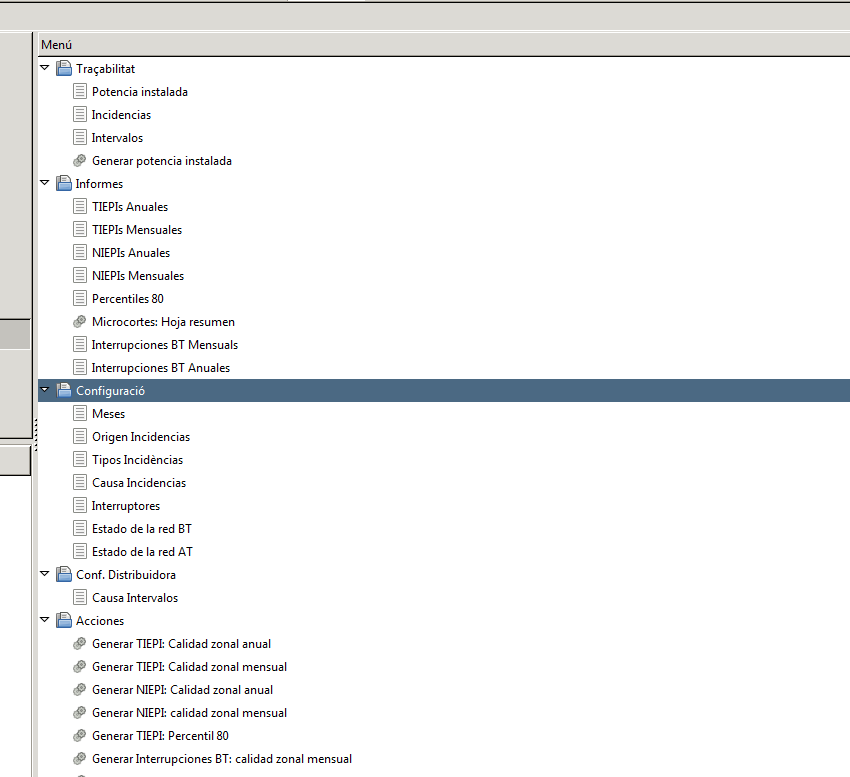

# Model de qualitat per a la qualitat en ús

Aquest apartat defineix el model de qualitat per qualitat en ús. Els atributs
de qualitat en ús es categoritzen en quatre característiques: efectivitat,
productivitat, seguretat d’accés i satisfacció. Tal com s’indica a ala figura
5 de la norma UNE-ISO/IEC 9126-1.

La qualitat en ús es la qualitat des del punt de vista de l’usuari.
Arribar a la qualitat en ús depend de que s’arribi a la qualitat externa
necessària, i que a la vegada depèn d’arribar a la qualitat interna necessària

## Qualitat en ús

Es la capacitat del producte software per permetre a determinats usuaris
assolir objectius especificats amb efectivitat, productivitat, seguretat i
satisfacció, en contexts d’ús especificats.

### Efectivitat

Es la capacitat del producte software per permetre als usuaris assolir
objectius especificats amb exactitud i completitud, en un context d’ús
especificat.

### Productivitat

La capacitat del producte software per permetre als usuaris gastar una
quantitat adequada de recursos amb relació a la efectivitat assolida, en un
context d’ús especificat.

### Seguretat física

Es la capacitat del producte software per assolir nivells acceptables del
risc de fer mal a persones, al negoci, al software, a les propietats o al medi
ambient en un context d’ús especificat.

## Menú principal GISCE-ERP_QS

En la figura següent apareix les opcions de configuració, traçabilitat,
informes, Configuració de la distribuïdora i accions, que composen tots els
apartats de GISCE-ERP_QS.

* Mesos: En aquest menú apareixen els 12 mesos en que es divideix l’any.
* Origen Incidències: Veure [apartat 3.2](./terminos_y_definicion.md#recollida-dinformacio)
* Tipus Incidències: Veure [apartat 3.7](./terminos_y_definicion.md#desagregacio-de-les-dades-de-la-interrupcio)
* Causa Incidències: Veure [apartat 3.7](./terminos_y_definicion.md#desagregacio-de-les-dades-de-la-interrupcio)
* Interruptors: Llistat dels interruptors maniobrables d’AT.
* Estat de la xarxa AT: Indica els interruptors oberts en l’estat normal
  d’explotació de la xarxa en cada moment amb els punts frontera.
* Estat de la xarxa BT: Elements de tall en BT ( Fusibles BT, interruptors,
  etc.) oberts en condicions normals d’explotació de la xarxa.
