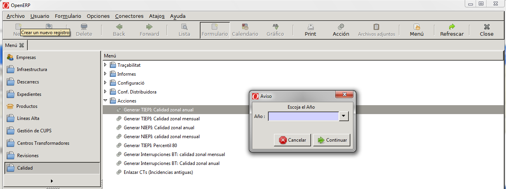
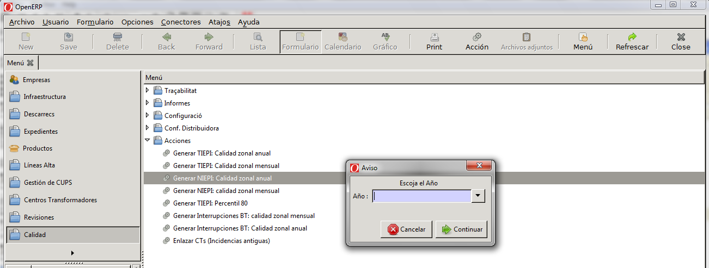
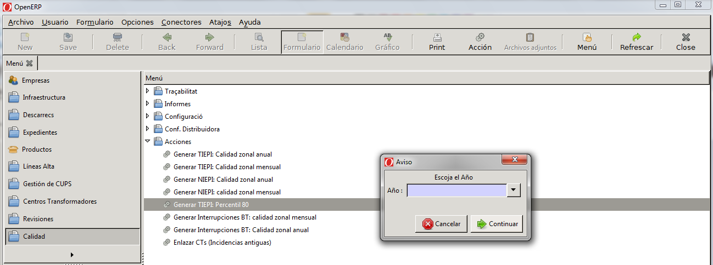

# Obtenció de resultats
## TIEPI zonal anual

Per obtenir els llistats de TIEPI s’accedeix al menú "_Qualitat → Accions →
Generar TIEPI_": Qualitat zonal anual.

Seleccionant aquesta opció apareix el quadre de diàleg següent en el qual es
selecciona l’any del que es vol treure el llistat desagregat, i polsant el
boto de continuar es genera en format pdf el llistat desagregat del valors
del TIEPI segon indica la **ECO/797/2002** en el seu annex "_Formato datos de
TIEPI y NIEPI debido a interrupciones largas_".

## NIEPI zonal anual

Per obtenir els llistats de NIEPI s’accedeix al menú "_Qualitat → Accions →
Generar NIEPI_": Qualitat zonal anual.

Seleccionant aquesta opció apareix el quadre de diàleg en el qual es selecciona
l’any del que es vol treure el llistat desagregat, i polsant el boto de
continuar es genera en format pdf el llistat desagregat del valors del NIEPI
segon indica la **ECO/797/2002** en el seu annex " _Formato datos de TIEPI y
NIEPI debido a interrupciones largas_".

## Obtenció del indicador percentil 80 del TIEPI

Per obtenir els llistats de l’indicador percentil 80 del TIEPI s’accedeix al
menú "_Qualitat → Accions → Generar TIEPI_": Percentil 80.

Seleccionant aquesta opció apareix el quadre de diàleg en el qual es selecciona
l’any del que es vol treure el llistat desagregat, i polsant el boto de
continuar es genera en format pdf el llistat desagregat del valors del
percentil 80 del TIEPI segons indica la **ECO/797/2002**.
