# Termes i Definicions

En la descripció del procés d'obtenció dels indicadors de continuitat de
subministre aparèixen alguns termes amb les següents definicions:

* _Red de Transporte_: La definida en l'article **5 del Reial Decret 1955/2000
  de 1 de desembre** per el que es regulen les activitats de transport,
  distribució, comercialització, subministre i procediments d'autorització
  d'instal·lacions d'energia eléctrica.
* _Red de Distribución_: La definida en l'article **38 del Reial Decret
  1955/2000**
* _Alta Tensión de Distribución (AT)_: Conjunt d'instal·lacions de distribució
  de tensió nominal superior a 36kV.
* _Media Tensión (MT)_: Conjunt d'instal·lacions de distribució amb tensió
  nominal compresa entre 1kV i 36kV.
* _Baja Tensión (BT)_: Conjunt d'instal·lacions de distribució amb tensió
  nominal de fins a 1kV.
* _Subestación de Transformación_: Conjunt d'instal·lacions ubicades en un
  emplaçament comú aprovisionat amb un o diversos transformadors amb MT en el
  secundari, amb l'aparamenta i obra complementaria precises.
* _Centro de Maniobra_: Conjunt d'instal·lacions MT situades en un mateix lloc,
  de l'aparamenta eléctrica i dels edificis necessaris per realitzar, al menys,
  la funció de connexió de dos o més línies i la seva maniobra.
* _Centro de Transformación (CT)_: Instal·lació aprovisionada d'un o diversos
  transformadors reductors a BT, amb aparamenta i obra complementaria precises.
* _Línea MT_: Conjunt d'instal·lacions (fundamentalment, circuits constituïts
  per segments de conductor) connectats eléctricament i amb la mateixa tensió
  nominal, que es troben darrera d'un interruptor automàtic equipat amb
  proteccions, o compreses entre dos interruptors automàtics equipats amb
  proteccions
* _Interrupcin de Alimentación_: Condició en la que el valor eficaç de la tensió
  en els punts de subministre no supera el 10% de la tensió declarada. ([Article 100 del Reial Decret 1955/2000](http://noticias.juridicas.com/base_datos/Admin/rd1955-2000.t6.html#a100))
* _Continuidad de Suministro_: Contingut de la qualitat de servei relatiu al
  número i duració de les interrupcions de duració superior a tres minuts.
* _Incidéncia_: Tots els events, i les seves conseqüéncies associades, originat
  en els sistemes de Generació, Transport o Distribució, que sigui causa d'una o
  varies interrupcions imprevistes de subministre amb instal·lacions afectades
  relacionades temporal i eléctricament.
* _Interrupción Programada_: Una interrupció es considera programada quan s'han
  complert els requisits d'informació, notificació i autorització previstos en
  la legislació vigent, degudament justificats.
* _Interrupción Imprevista_: Tota interrupció que no s'ajusta a la definició
  d'interrupció Programada
* _Indicadores de Continuidad de subministro_: Índex numérics definits al efecte
  de medir el número i/o duració de les interrupcions de duració major de tres
  minuts que afecten als clients.
* _TIEPI_: Es el temps de interrupció equivalent a la Potència instalada a mitja
  tensió (1kV i 36kV). Aquest índex es defineix mitjançant la següent expressió:

    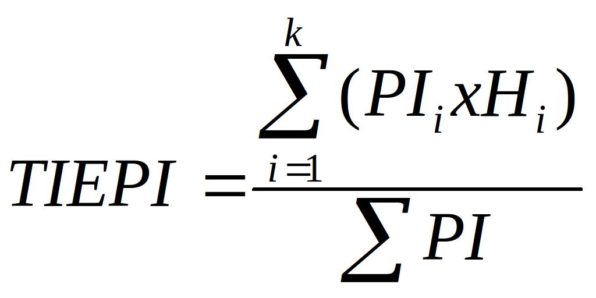

    On:

      * **∑PI** = Suma de la Potència
        instal·lada dels centres de transformació MT/BT del distribuïdor més la
        Potència contractada a MT (en kVA).
      * **PIi** = Potència instal·lada en els centres de transformació MT/BT del
        distribuidor més la Potència contractada en MT, afectada per la
        interrupció _i_ de duració _Hi_ (en kVA).
      * **Hi** = Temps d'interrupció del subministre que afecta a la Potència
        _Pi_, (en hores).
      * **K** = Número total d'interrupcions durant el període considerat.
      * Les interrupcions que es consideraràn en el càlcul del _TIEPI_ seran les
        de duració superior a tres minuts.

* _Percentil 80 del TIEPI_: Es el valor del _TIEPI_ que no es superat pel 80%
  dels municipis d'àmbit provincial, dins de cada tipus de zona.
* _NIEPI_: Es el número d'interrupcions equivalent de la potència instal·lada en
  MT (1kV < V <= 36kV). Aquest índex es defineix mitjançant la següent
  expressió:

    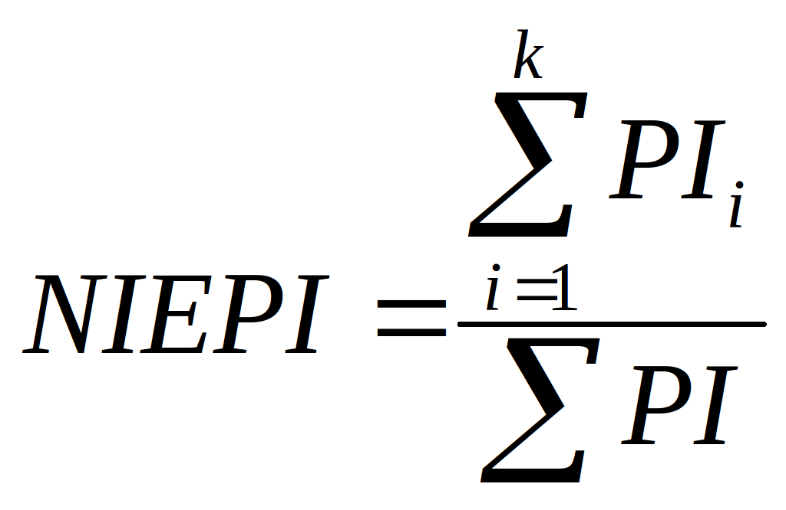

    On:

      * **∑PI** = Suma de la potència
        instal·lada dels centres de transformació MT/BT del distribuïdor més la
        potència contractada a MT (en kVA).
      * **PIi** = Potència instal·lada dels centres de transformació MT/BT del
        distribuidor més la potència contractada en MT, afectada per la
        interrupció _i_ (en kVA).
      * **K** = Número total d'interrupcions durant el periode considerat.
      * Les interrupcions que es consideraràn en el càlcul del _NIEPI_ seran les
        de duració superior a tres minuts. A efectes de _NIEPI_, es computarà
        una interrupció per cada incidència.

* _Punto de Connexión de Red (PCR)_: Es el punt físic en el que es situa la
  frontera de responsabilitat del distribuïdor: la entrada de la caixa general
  de proteccions per clients de BT i el dispositiu de maniobra frontera per
  clients de AT i MT.
* _Relación cliente-red_: Es el víncle que es pot establir entre el client i les
  instal·lacions des de les que es subministra. Consta de dos parts, la relació
  client-PCR, soportada i mantinguda per la organització comercial i la
  regulació entre el PCR, les instal·lacions de xarxa soportada i mantinguda per
  la part tècnica. Segons el grau d'informació de la xarxa en els sistemes, la
  relació client-xarxa podrà establir-se a nivell de diferents elements de la
  xarxa (Centre de Transformació, de Transformador, de Quadre de BT o
  d'escomesa).
* _Punto de agregación_: Element de la xarxa en el que s'estableix la relació
  client-xarxa.

## Definició de zones

Als efectes de qualitat de subministrament, el Real Decreto 1955/2000 estableix
la següent clasificació de zones:

* **Zona Urbana**: Conjunt de municipis d’una província amb més de 20.000
  subministraments, incloent capitals de província, encara que no arribin a la
  xifra anterior.
* **Zona Semi-urbana**: Conjunt de municipis d’una província amb un número de
  subministraments comprès entre 2.000 i 20.000, excloent capitals de província.
* **Zona Rural**:
  * **_Zona Rural Concentrada_**: Conjunt de municipis d’una província amb un
    nombre de subministraments comprès entre 200 i 2.000.
  * **_Zona Rural Dispersa_**: Conjunt de municipis d’una província amb menys de
    200 subministraments així como els subministraments ubicats fora dels nuclis
    de població que no siguin polígons industrials o residencials.

La definició de zones està en l’apartat “_Centres Transformadors → Manteniment →
CT’S → Zona_”, que s’indica en la figura següent:

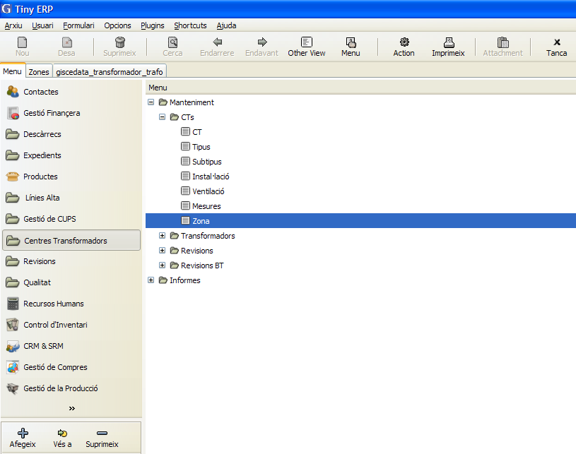

Al accedir apareixen les 4 zones definides.

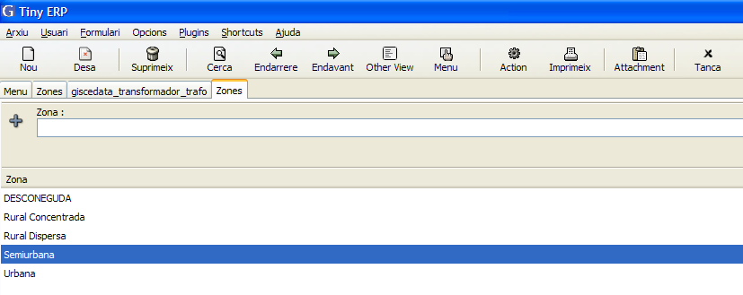

Al seleccionar-ne una d’elles apareixerà la seva fitxa en la que definirem les
següents dades. Es important veure que els valors admissibles es poden anar
afegint a mesura que aquests vagin variant. Es important així mateix definir
correctament les dates en que son vigents els valors indicats.

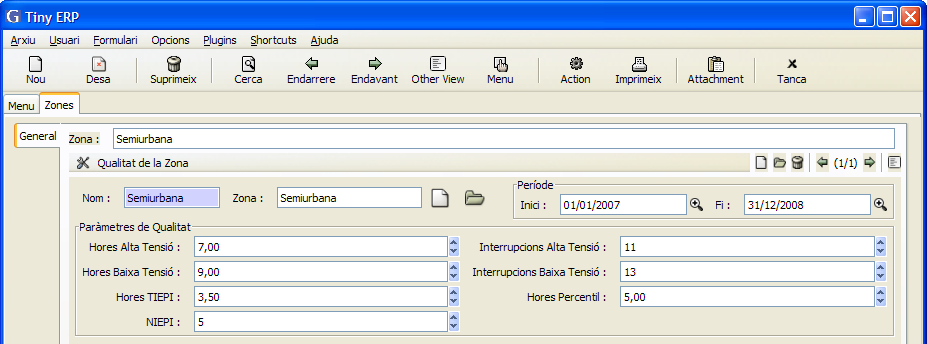

En la fitxa de cada zona es defineix.

**Paràmetres de Qualitat**:

* **Hores Alta tensió**: Nombre d’hores màxim d’interrupció en MT ( de 1 a 36
  kV.)
* **Interrupcions Alta tensió**: Nombre d’interrupcions màxim en MT ( de 1 a 36
  kV.)
* **Hores Baixa Tensió**: Nombre d’hores màxim d’interrupció en BT
* **Interrupcions Baixa tensió**: Nombre d’interrupcions màxim en BT
* **Hores TIEPI**: Valor màxim de l’índex TIEPI
* **Hores percentil**:  Valor màxim de l’índex percentil 80
* **NIEPI**: Valor màxim de l’índex NIEPI

**Període**:

* **Inici**: Data d’inici de la vigència dels valors  dels paràmetres de
  qualitat
* **Fi**: Data de fi de vigència dels valors dels paràmetres de qualitat

Els valors límits estan definits en l’article **104.2 del “Real Decreto
1955/2000”**.  “_REAL DECRETO 1634/2006, de 29 de diciembre, por el que se
establece la tarifa eléctrica a partir de 1 de enero de 2007._ (BOE
30-12-2006)”, que modifica els límits establerts

Quan es modifiquen els valors dels paràmetres de qualitat individual i zonal amb
un nou  RD es crea un nou període polsant el botó “nou registre”.

Una vegada creat s’introdueixen els valors dels paràmetres de qualitat i les
dates d’inici i fi del període de vigència dels valors.

## Recollida d'informació

La recollida d’informació procedeix de 3 fonts diferents:

* Sistema de telecontrol (SCADA)
* Actuació manual.
* Centre d’atenció al client.

L’origen de les incidències està definit en l’apartat “_Qualitat → Configuració
→ Origen d’incidències_".

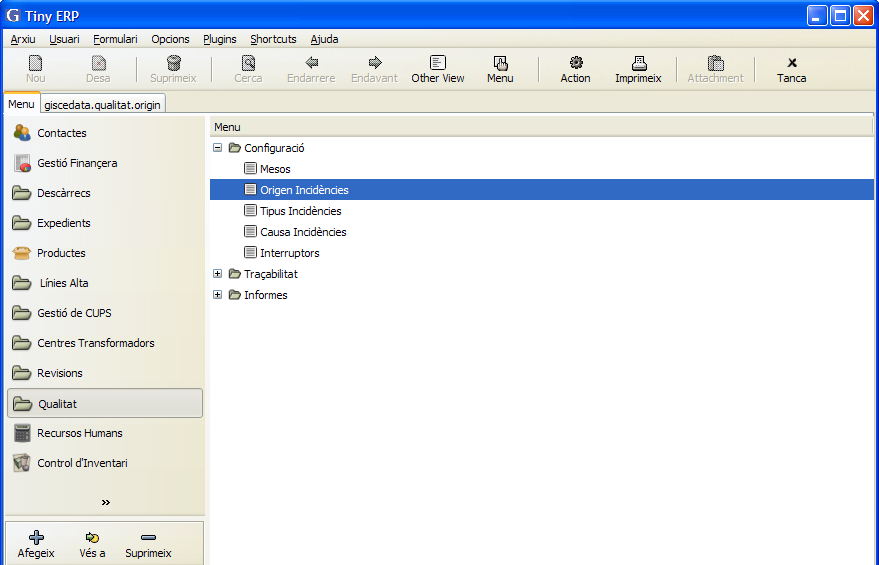

En aquest apartat hi ha definits els 3 origen de les incidències:

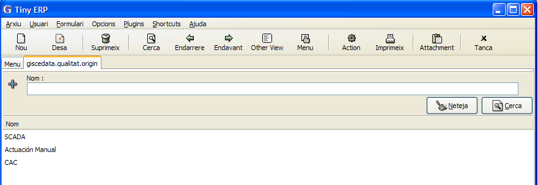

## Obtenció de la potencia total

Mensualment s’obté la potencia total instal·lada de la base de dades de
GISCE-ERP, de transformadors i dels clients en alta tensió, i es el denominador
pel càlcul dels índex TIEPI, NIEPI.    
Per generar la potencia instal·lada del mes corresponent s’hi accedeix des del
menú, “_Qualitat → traçabilitat → Generar potència instal·lada_".

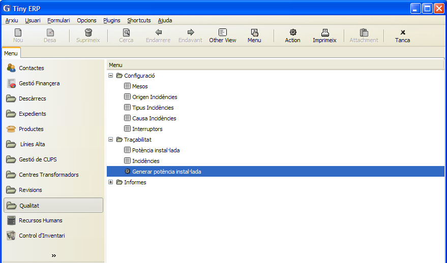

Al fer doble clic s’accedeix a l’assistent que ens guia per obtenir la potencia
instal·lada.

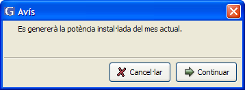

S’ha de seleccionar el mes i l’any que desitgem guardar la potencia instal·lada.

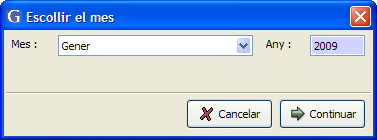

A continuació s’indicarà el valor del cos fi. Aquest valor s’utilitzarà per
convertir les potencies contractades en AT ( kW ) en kVA.

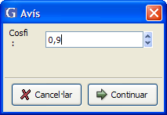

Per comprovar lles potencies instal·lades en cada mes es pot accedir a l’apartat
“_Qualitat → traçabilitat → Potència instal·lada_” tal com es veu a la imatge
següent.

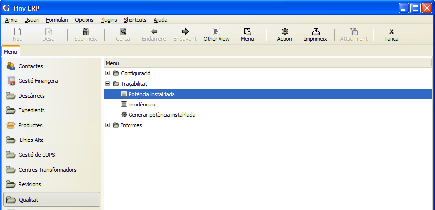

Al fer doble clic apareixen les potencies instal·lades en els diferents mesos, i
podem veure-les per realitzar les comprovacions necessàries.

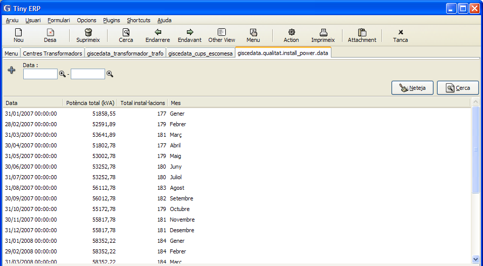

Al seleccionar un mes determinat apareix la potencia instal·lada amb una llista
de tots els transformadors i tots els subministraments en AT. Així com la
potencia total en kVA, i el nombre total d’instal·lacions.

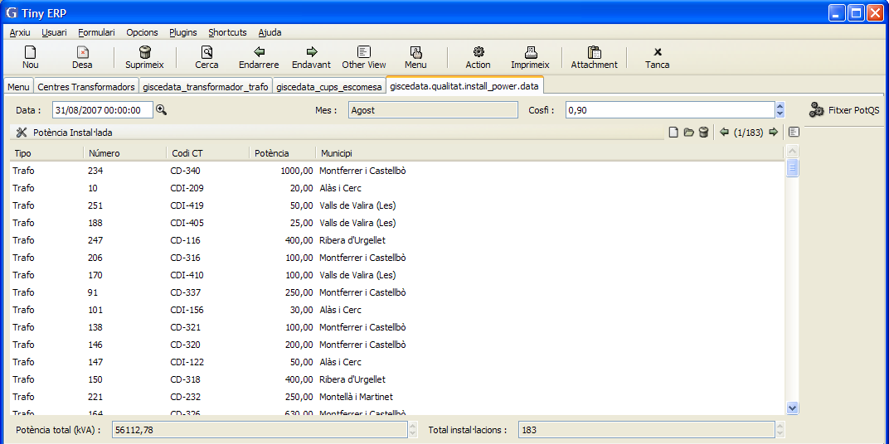

On:

* **Data**: es la data en que es va guardar la potencia instal·lada.
  Aquesta data indica a quin mes i any correspon potencia instal·lada. Per
  defecte el programa posa la data de l’últim dia del mes pel qual es genera la
  potencia instal·lada.

* **Cosfi**: Es el valor del cosinus de fi utilitzat per calcular la potència
  total instal·lada en kVA, convertint la potencia contractada en AT que es en
  kW.    
  Si es desitja canviar el cos fi, al canviar-lo i guardar es recalcula la
  potencia total (kVA).
* **Mes**: Mes al que afecta la potencia instal·lada

Fent doble clic a sobre d’una instal·lació apareix la seva fitxa resumida.

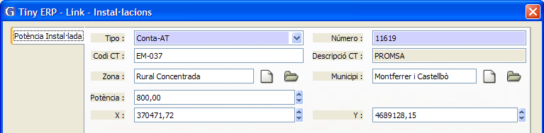

A continuació  es descriu com es determina la potencia total instal·lada.
Si es va a la fitxa dels transformadors al GISCE-ERP, "_Menú → Centres
Transformadors → Manteniment → Transformadors → Transformador_” i s’obre la
fitxa d’un transformador apareixen les seves dades.    
Al generar la potencia instal·lada del mes, selecciona només els transformadors
que:

* Estan marcats com a **TIEPI = SI**
* Estan en la **localització = CTS**
* Estan en **estat = Funcionament**

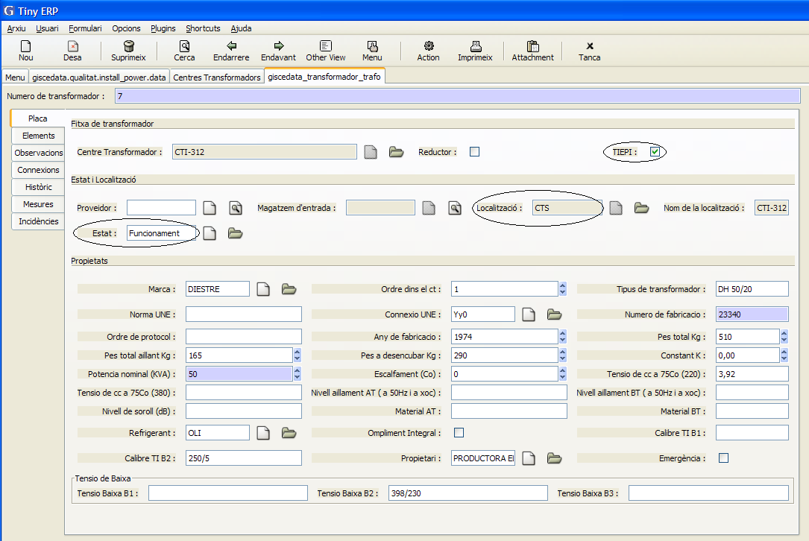

Com que amb el programa GISCE-ERP es porta el manteniment de les instal·lacions
de centres transformadors i de les màquines que hi tenen instal·lades, només
caldrà fer algun llistat de comprovació per veure si les dades estan
actualitzades. ( per exemple des de “_Centres transformadors →
Manteniment → transformadors_”) i filtrar els transformadors que estan en
funcionament, estan a la **localització CTS** i **TIEPI = SI**.

Per obtenir la potencia contractada en AT, es busquen les escomeses que son del
tipus _CONTA-AT_, es comprova el CUPS que te associat i la potencia de la
pòlissa associada. Per poder fer comprovacions es pot accedir al menú “_Gestió
de CUPS → Manteniment → CUPS → Escomesa_”, i buscar les escomeses del tipus
_CONTA-AT_, i accedir a la fitxa de l’escomesa tal com es veu a la imatge
següent:

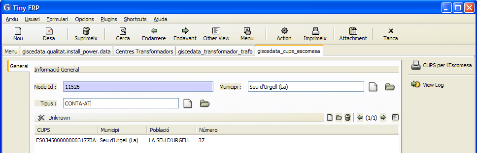

Si es fa doble click sobre el CUPS associat a l’escomesa es pot veure la fitxa
del CUPS tal com s’observa en la imatge següent.

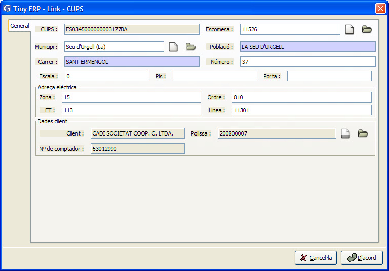

La Pòlissa associada a aquest CUPS es la que indica la potencia contractada en
AT que es tindrà en compte a l’hora d’obtenir la potencia instal·lada.
Fent  clic sobre la fitxa de la pòlissa associada al CUPS apareixen les dades de
la tarifa i potència contractada.

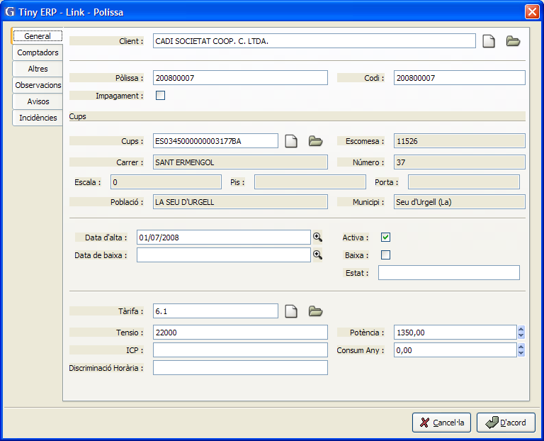

Totes les escomeses del tipus _CONTA-AT_ son les que es tindran en compte com a
potència instal·lada.

## Emmagatzematge de dades

Existeixen 2 categories per les dades que son necessàries per la informació
completa i correcta d’una incidència.

**Dades de continuïtat**: Es la informació dels intervals horaris d’interrupció
de subministrament i de les instal·lacions afectades associades.

**Dades complementaries**: Es la informació sobre les característiques de la
incidència ( causa, instal·lació origen, etc.)

Les dades de continuïtat emmagatzemades en el programa GISCE-ERP_QS son
auditables i tenen traçabilitat.

GISCE-ERP_QS està dissenyada de forma que permeti a un tercer independent
verificar tot el procés de captació, modificació transmissió, suport i
tractament de la informació necessària en el període d’anàlisi així com
comprovar la compatibilitat i correcta relació dels sistemes de la companyia
afectats, ( Sistema de registre de incidències, base de dades comercial, base de
dades tècnica. Etc)  de manera que es pugui afirmar amb una seguretat raonable
que la informació el·laborada per la companyia correspon amb la realitat.

GISCE-ERP_QS garanteix la possibilitat de verificar el control dels riscos de
confidencialitat, integritat, disponibilitat i rellevància de la informació.

GISCE-ERP_QS per cada una de les incidències i intervals associats a aquesta,
reflexa exactament les instal·lacions afectades i les maniobres que modifiquen
l’estat d’afectació de les instal·lacions. També es detallen les escomeses i els
CUPS relacionats amb aquesta, que han quedat afectats en cada interval  de la
incidència i les pòlisses relacionades amb cada escomesa.

## Informació associada a una incidència

La informació associada a cada incidència es la següent:

* **Identificació de la incidència**: codi únic de la incidència i descripció de
  la incidència.
* **El codi de la incidència** es alfanumèric i únic al model de dades de
  incidències.
* **Origen de la Incidència**: A cada incidència se li associa un  dels tres
  orígens que pot tenir, SCADA, Manual o Centre d’atenció al client.
* **Tipus de incidència**: L’usuari indicarà el tipus d’incidència, que pot ser
  Imprevista o Programada.
* **Causa**: S’ha d’indicar la causa que pot ser una de les següents. Transport,
  distribució, generació, tercers, força major o pròpies.
* **Data**: Data d’inici de la incidència.
* **Xarxa afectada**: S’ha d’indicar si es una incidència AT  o BT.

Una fitxa de una incidència registrada amb GISCE-ERP_QS es tal com es pot veure
a la imatge següent:

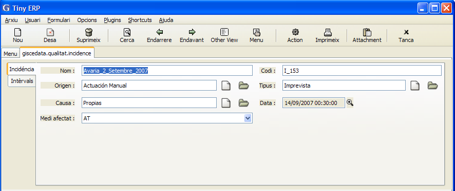

A la pestanya de “Intervals” de la fitxa de la incidència es poden veure els
diferents intervals que s’han produït dins la mateixa incidència tal com indica
la ECO 797.

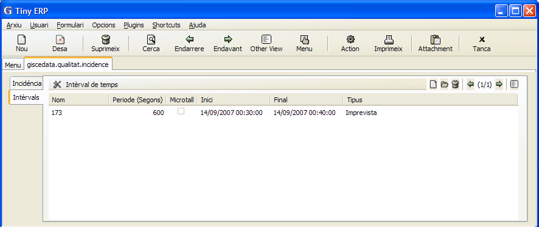

**Intervals horaris amb instal·lacions afectades**

Una incidència té un o varis intervals horaris en els que queden afectades una o
varies instal·lacions.    
En cada interval horari hi poden haver diferents instal·lacions afectades, o bé
una mateixa instal·lació pot estar afectada en varis intervals d’una mateixa
incidència.    
Una incidència compren una sèrie de intervals horaris, amb diferents grups
d’instal·lacions afectades, que estan temporalment i elèctricament relacionades.    
La relació temporal implica que des del inici fins al final de la
incidència no existeix cap interval de temps superior a 10 minuts sense
instal·lacions afectades.    
La relació elèctrica implica que les instal·lacions estan connectades
elèctricament, i que l’origen primer de la incidència es únic.

Si es fa doble clic sobre l’interval desitjat apareix la seva fitxa, que consta
de 4 pestanyes, interval, Clients afectats, Instal·lacions afectades, i punts de
tall.

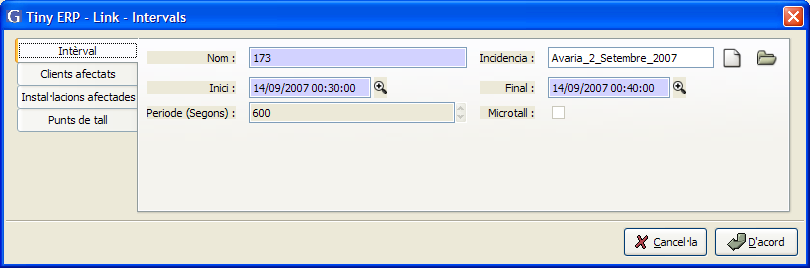

Cada interval consta dels següents camps:

* **Nom del interval**: Codi o nom únic de la incidència.

Incidència a la que pertany el interval:

* **Hora d’inici del interval**: En format DD/MM/AAAA HH:MM:SS.
* **Hora final del interval**: En format DD/MM/AAAA HH:MM:SS.
* **Període**:  Temps de durada del interval, en segons, calculat automàticament
  a partir dels 2 camps anteriors.

La pestanya “Instal·lacions afectades” indica quines instal·lacions han quedat
afectades per la interrupció.

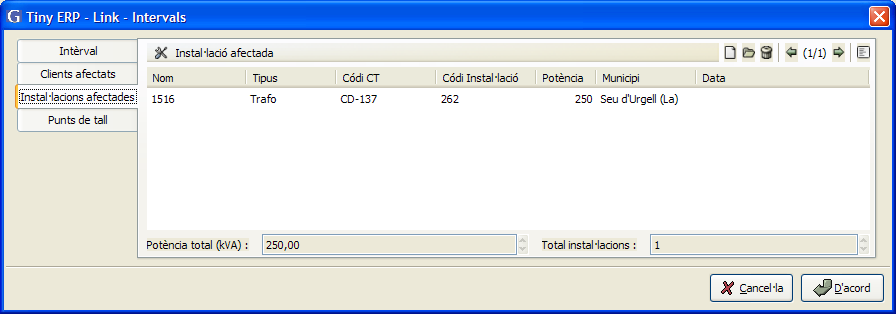

**Instal·lacions afectades**
Es consideren instal·lacions afectades els centres de transformació i les
instal·lacions dels clients  que es troben en funcionament en el moment de la
incidència.    
Es considera una instal·lació de client en funcionament quan existeix una
relació contractual vàlida i en vigor en el moment de la interrupció.    
En el cas de centres transformadors de companyia amb mes d’un transformadors,
s’especifica quin o quins son els transformadors afectats, i sempre que s’hagi
actuat en un element de maniobra de MT.

Així GISCE-ERP_QS garanteix que quedin registrades les interrupcions que hi ha
hagut en cada centre transformador o de client de MT, amb el seu interval
d’interrupció.

La topologia de la xarxa proporcionada pel sistema GIS associat al programa
GISCE-ERP, es la base del càlcul de les afectacions de incidències a partir de
la connectivitat dels elements de maniobra de la xarxa.    
Les simulacions efectuades en el programa de GIS GISCE-ERP permeten veure de una
forma visual les instal·lacions, tant de centres transformadors, clients MT com
de línies MT afectades per cada interval de la incidència.

El Sistema GIS manté la associació Client - Xarxa a nivell d’escomesa, Aquesta
informació i el programa d’anàlisi de grafos permet assignar correctament les
instal·lacions i clients afectats durant un interval d’una incidència assegurant
la traçabilitat de la incidència.

Pel càlcul dels índex de qualitat de subministrament , quan una incidència
tingui com origen la instal·lació d’un client en MT, no es considerarà la
potencia instal·lada d’aquest client en les potencies afectades per la
incidència, però si la potencia de la resta d’instal·lacions afectades.    
Aquest tipus d’incidència està classificada com a causa de “tercers”
(instal·lació particular).

La obertura accidental de trams de línia MT provocada per elements no
telecomandats (fusibles, seccionadors, etc.) es comptabilitzarà a partir del
primer avís que es rebi en la companyia a través d’un client afectat per la
incidència a través del centre d’atenció al client o a través de qualsevol
altra via.

La pestanya “Clients afectats” indica quins clients han quedat afectades per la
interrupció.

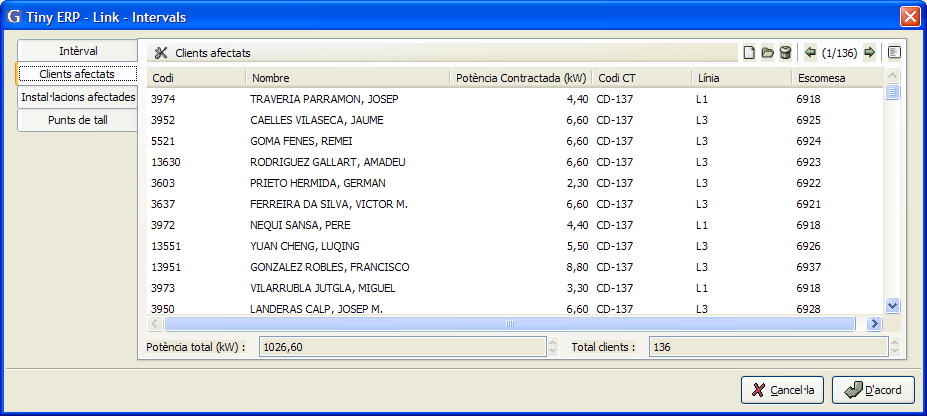

Aquest apartat permet obtenir la qualitat individual i poder determinar que cap
client superi els nombre i el temps màxim indicats per cada una de les zones
definides a [l’apartat 3.1](#definicio-de-zones)

La pestanya “Punts de tall” indica tots els interruptors que hi havia oberts en
el moment de produir-se la interrupció, inclosos els que estan oberts en
condicions normals d’explotació.

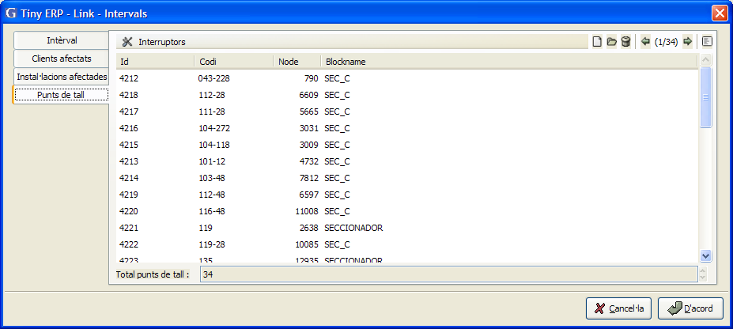

## Criteris per la determinació del nombre i duració de les interrupcions

Pel càlcul dels indicadors de la continuïtat del subministrament es segueixen
els següents criteris:

* Les interrupcions de duració igual o inferior a 3 minuts no es tindran en
  compte a cap efecte.
* La incidència es la unitat bàsica de càlcul per l’índex NIEPI i agrupa, segons
  la definició, a totes les interrupcions que pateixin les instal·lacions de la
  mateixa zona connectades elèctricament per causa del mateix motiu i a partir
  del mateix instant.    
  L’agrupació de les interrupcions en la mateixa incidència, havent de complir
  en tot cas les relacions temporal i elèctrica comentades en el apartat 5.4
  s’estendrà fins la reposició total del servei, moment en el qual es procedeix
  al tancament de la incidència per haver se informat completament.    
  Totes aquelles maniobres que s’executen orientades a la reposició del servei
  no han de ser computades com NIEPI.
* La comptabilitat de temps pel càlcul del TIEPI motivat per una incidència
  tindrà en compta les potències interrompudes amb intervals de temps majors de
  tres minuts.

## Desagregació de les dades de la interrupció

Les dades de la interrupció es desagregaran conforme a lo indicat en el quadre
següent:

+-------------------------+----------------------------------------------+
| Programada              | Imprevista                                   |
+-----------+-------------+-----------+-----------+--------+-------------+
| Transport | Distribució | Generació | Transport | Tercer | Força Major |
+-----------+-------------+-----------+-----------+--------+-------------+

Que es correspon amb els següents criteris:

* **Tipus de la interrupció**: S’indicarà el tipus de la interrupció
  calcificant-la en els següents conceptes:

    * **Programada**: La classificació d’una interrupció com a programada
      requerirà conservar la documentació necessària.
    * **Imprevista**: En cas de no complir la condició assenyalada en l’apartat
      anterior la interrupció es considerarà com imprevista.

    El centre de control farà una primera assignació de la causa de la
    incidència, que podrà ser modificada amb la informació recollida
    posteriorment.

!!! Note
    Per definir els tipus d’incidència s’ha d’accedir a “_Menú → Qualitat →
    Configuració → Tipus Incidències_”.

    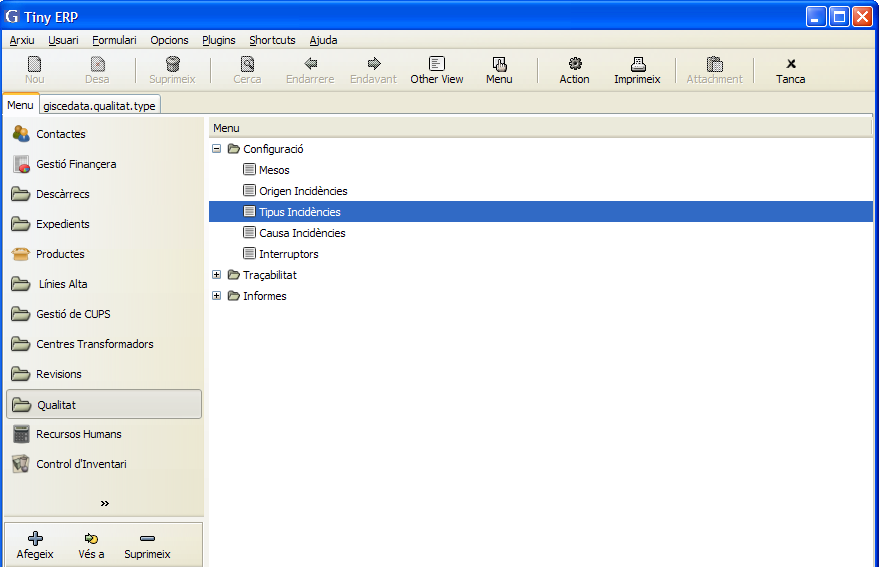

    Al accedir a aquest apartat apareixen els tipus d’incidència definits.

    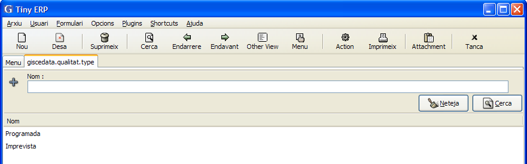

* **Causa de la incidència**: S’indicarà la causa que se suposa ha originat la
  incidència, com a mínim amb el nivell de detall de la següent classificació.

    * **Generació**: Les incidències causades per la generació hauran de ser
      comptabilitzades, sempre i quant produeixin talls de mercat.
    * **Transport**: Les incidències causades en la xarxa de transport i que
      afecten a la xarxa de distribució, sempre i quant afectin al
      subministrament a clients, es comptabilitzen conjuntament en el sistema de
      registre d’incidències.    
      Serà necessari establir el procediment de repercussió al transportista de
      las penalitzacions en que incorri, per aquest motiu, el distribuïdor.
    La classificació de la causa de la interrupció com transport s’acreditarà
    mitjançant informe de l’operador del sistema.

    * **Tercers**: Les causades per persones físiques i jurídiques alienes a
      l’empresa distribuïdora.    
      En aquest concepte s’inclouen:

        * **Una altra empresa distribuïdora**.
        * **Instal·lació particular**: Incidències degudes a instal·lacions de
          clients o de productors en règim especial.
        * Accions intencionades o accidentals de tercers, coneguts o no, sobre
          instal·lacions de la pròpia empresa distribuïdora o transportista
          (pala excavadora, vehicle, actes de vandalisme o terrorisme, etc.).
        * **Accions de vagues legals**.
        * **Força major**: Incidències degudes a causes de força major,
          acceptades com a tal per l’Administració Competent, entre altres, les
          decisions governatives o dels Serveis de Protecció Civil i els
          fenòmens atmosfèrics extraordinaris que excedeixen els límits
          establerts en el Reglamento de riscos extraordinaris sobre persones i
          bens (_Real Decreto 2022/1986_). No podran ser al·legats com a causa
          de força major els fenòmens atmosfèrics que es consideren habituals o
          normals en cada zona geogràfica, d’acord amb les dades estadístiques
          de que es disposi.

Cada una de las causes anteriors vindrà identificada amb un “_Codi de la Prova_”
que farà referència a l’existència de _prova per l’exoneració_, en el seu cas,
de les **conseqüències de d’incompliment dels índex de qualitat**.

* **Pròpies**: En aquest apartat s’inclouen les interrupcions les causes de les
  quals no responguin a lo establert en els apartats transport, tercers, força
  major, o be no degudament justificades.

* **Atmosfèriques**: Inclouen les causes amb origen en fenòmens atmosfèrics tals
  com pluja, inundació, tormenta, neu, gel, granis, boira, vent, contaminació,
  pol·lució, etc., sempre que no excedeixin els límits establerts en el
  "_Reglamento de Riesgos Extraordinarios_", en aquest cas es consideraran de
  força major.
* **Agents Externs**: Inclouen causes amb origen en animals, arbrat, moviments
  de terreny, etc.
* **Internes**: Inclouen fallades d’equips i materials, corrosió, defecte de
  disseny o de muntatge, us inadequat, connexió i desconnexió de instal·lacions
  pròpies, manteniment, obres pròpies, repartiment de càrregues, etc.

* **Desconegudes**.

Les causes de la incidència estan definides a “_Menú → Qualitat → Configuració →
Causa Incidències_”, on apareixen les 7 causes possibles.    
Aquestes no s’han de modificar si no apareix cap modificació de la **ECO
797/2002** que així ho requereixi.

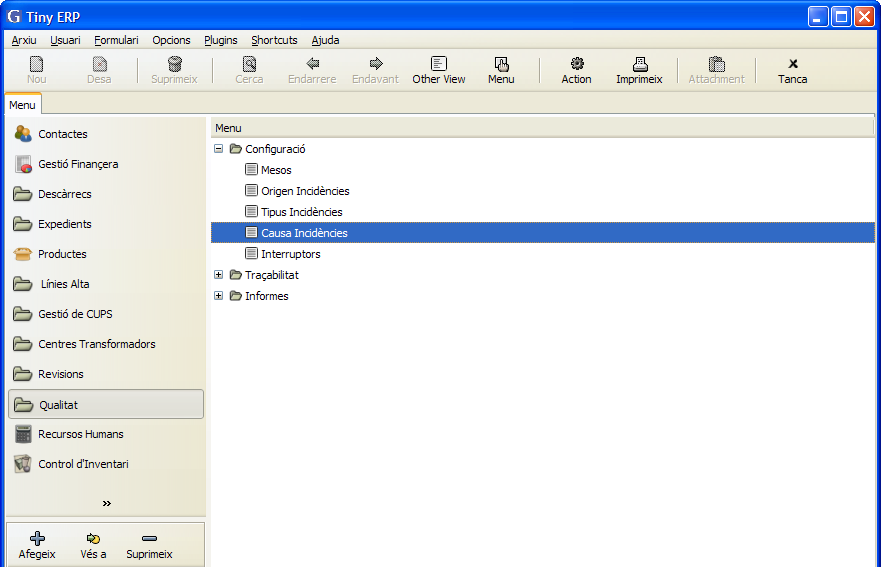

Al accedir al menú de causes, apareixen les causes definides en el sistema, i
que es poden ampliar i/o modificar.

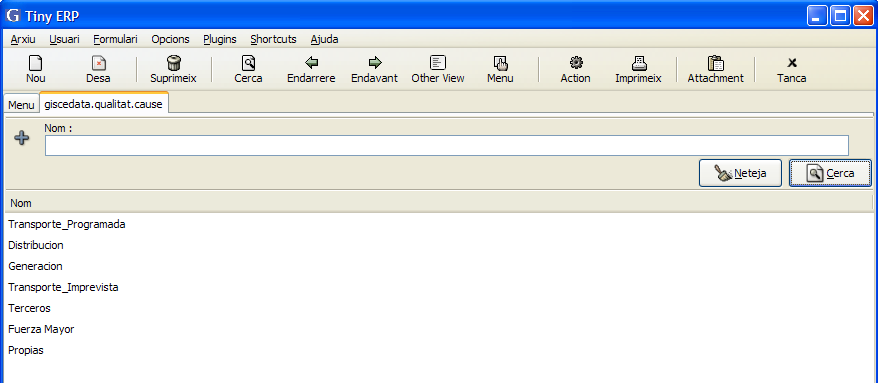

## Informació associada a instal·lacions i clients

En aquest apartat s’estableix la informació mínima que han de contenir les bases
de dades de instal·lacions i de clients.

Un tema a considerar es la periodicitat de l’actualització de la informació
relativa a les potències. El criteri es el de realitzar una actualització
mensual de les dades base pel càlcul dels indicadores del mes corresponent.

Les potencies instal·lades (CT) i contractades (clients MT) necessàries pel
càlcul s’obtindran a partir de les bases de dades tècnica i comercial i
s’actualitzaran, al menys, mensualment.

En els càlculs dels denominadors dels índex es tindran en compte les potencies
de l’últim dia del mes. Els índex anuals es calcularan com la suma algebraica
dels mensuals.

Els temps d’interrupció s’obtenen per diferència dels temps de registre de
maniobra de les incidències. A aquest efecte, només intervenen les maniobres que
afecten a pèrdues i reposicions de subministrament.

El càlcul dels indicadores es realitzarà amb la mateixa periodicitat que
l’actualització de les dades base del càlcul. Si aquestos s’actualitzen
mensualment, el càlcul dels indicadors d’aquell mes, o fracció de mes, es
realitzarà amb les dades base del mes; i per períodes superiors al mes, se
sumaran els respectius indicadors mensuals. En aquest cas es donarà la dada base
de l’últim mes del període considerat.

En el cas d’indicadors que utilitzen la potència afectada per interrupcions, com
es el cas del TIEPI, s’utilitzarà la potència instal·lada en els centres de
transformació i la potència contractada pels clients de MT. La potència
contractada s’obtindrà de la base de dades de clients, i es sumarà a la potència
instal·lada en els centres de transformació d’empresa, presentant-se els
resultats en kVA.

**Informació necessària pel càlcul**
La informació mínima que s’haurà de tenir amb la periodicitat establerta en
relació amb les instal·lacions de l’empresa o de client i el seu nivell
d’agregació, es la següent:

* Relació de tots els CCTT d’empresa i clients de MT connectats en cada tram de
  les diferents línies.
* Potència instal·lada en kVA de cada transformador, per un CT de empresa, o
  potencia màxima contractada en kW, per un CT de client.
* Municipi, tipus de zona (urbana, semiurbana, rural concentrada o rural
  dispersa) i província on està ubicada la instal·lació.    
  En aquelles províncies en que la potència instal·lada de l’empresa
  distribuïdora sigui inferior a 1 % (províncies amb distribució marginal), la
  informació de las interrupcions d’aquests clients es podrà agregar a la de la
  província limítrofa de la qual provingui la línia que els alimenti.

## Metodologia pel càlcul de l'indicador percentil 80 de TIEPI

Percentil 80 del TIEPI: Es el valor del TIEPI que no es superat pel 80 % dels
municipis de l’àmbit provincial, dins de cada tipus de zona.

Recollida de dades: Aquest indicador s’obté a partir de la informació recollida
pel càlcul del TIEPI. No es necessari per tant un procediment específic.

Metodologia pel càlcul: Una vegada que es disposa de la informació del TIEPI
anual a nivell de CT o client de MT, s’agruparà per calcular el TIEPI anual de
cadascun dels municipis existents en una província, desagregats per zones.

En cada zona s’ordenaran els municipis per ordre creixent del TIEPI.

El percentil 80 del TIEPI serà el corresponent al municipi que ocupa la posició
del 80 % o la seva immediata superior del total dels municipis ordenats
existents en aquella zona.

En aquelles províncies en las que en la zona urbana només existeixi un municipi,
el percentil 80 del TIEPI serà el propi TIEPI del mateix municipi.

## Metodologia per la obtenció d'informació zonal d'interrupcions en BT

!!! Note
    **Definició**: Una interrupció en baixa tensió es aquella interrupció en el
    subministrament causada per una incidència en la xarxa de BT i que no afecta
    a instal·lacions de tensió superior (centres de transformació).

Als efectes d’aquesta informació, no es consideren interrupcions en baixa tensió
les interrupcions ocasionades per incidències en la xarxa de MT ni aquelles que
tenint el seu origen en la xarxa de BT afecten a un transformador MT/BT d’un CT,
ja que en ambdós casos, es recullen en l’indicador zonal de MT corresponent.

**Recollida de dades**: La recollida de dades associades a les interrupcions en
baixa tensió es farà pel centre d’atenció al client i es completarà degudament
per que pugui ser introduïda en l’aplicació informàtica que gestiona aquesta
informació.

Informació associada a una interrupció: Es comptabilitzaran les interrupcions en
la xarxa de baixa tensió que hagin generat, com a mínim, a un avís de reclamació
per falta de subministrament, agrupant en una sola, totes aquelles que
provinguin d’una mateixa incidència. Cada incidència ha d’assignar-se al seu
corresponent centre de transformació. No obstant lo anterior, aquesta
aproximació no es d’aplicació en aquelles empreses que actualment ja disposen de
sistemes en que la connectivitat client - xarxa es realitzi a nivell de línia de
baixa tensió. En el cas de GISCE-ERP la connectivitat client xarxa es fa a
nivell d’escomesa.

No es comptabilitzaran les interrupcions que tinguin el seu origen en la pròpia
instal·lació del client. El límit entre les instal·lacions de l’empresa
distribuïdora i del client se situa, conforme a la Reglamentació vigent, en la
caixa general de protecció, corresponent aquesta a la instal·lació del client.

Es desagregaran conforme a lo indicat en el següent quadre:

+-----------+-------+------------------+-----------------------------------+
|           |       |                  | Número d'interrupcions            |
| Província |  Zona | Municipi         +-------------+-------------+-------+
|           |       |                  | Imprevistes | Programades | Total |
+-----------+-------+------------------+-------------+-------------+-------+

## Avaluació de la qualitat individual

L’avaluació de la qualitat Individual i el conseqüent descompte en la facturació
dels clients depèn bàsicament del coneixement del punt d’agregació dels
subministraments d’aquests clients i de la possibilitat d’obtenir el registre
d’interrupcions de les instal·lacions des de les que s’alimenta.

Així doncs, el còmput de la qualitat individual implicarà associar a cada
element de xarxa en el que es coneix la relació client - xarxa i per extensió a
tots els clients que depenguin d‘aquest, el registre de les interrupcions
produïdes, discriminant les que tenen dret a descompte en la facturació,
d’aquelles que no en tenen (programades, transport, tercers i força major, així
com les incidències en zones per les que s’estiguin elaborant o executant plans
de millora de qualitat de servei i electrificació i millora de la qualitat en
l’àmbit rural, sempre que hagin estat autoritzats per l’òrgan competent de
l’Administració corresponent).

En el cas de clients amb més d’un circuit d’alimentació i un sol contracte, en
els que el client pot alimentar-se de qualsevol d’ells, es considerarà
interrumpit el subministrament si falta tensió en tots els circuits
simultàniament.

La connectivitat client - xarxa estarà establert al major nivell de detall
conegut de la xarxa en cada cas. La relació client -xarxa estarà fixada, com a
mínim, a nivell de centre de transformació. Aquesta aproximació únicament serà
vàlida durant un període de tres anys, transcorreguts aquests tres anys,  la
connectivitat client – xarxa haurà d’establir-se a nivell de línia de BT, per lo
que es fomentarà la captació dels paràmetres de continuïtat de subministrament a
través del propi equipo de mesura de la energia.

No obstant lo anterior, aquesta aproximació no serà d’aplicació en aquelles
empreses que ja disposin de sistemes que permetin determinar la connectivitat
client - xarxa a nivell de línea de BT. El programa GISCE-ERP_QS permet establir
la connectivitat client – xarxa a nivell d’escomesa.

Una vegada realitzada la simulació d’un interval, i guardats els clients
afectats gracies a la traçabilitat sempre podrem fer la consulta de forma
inversa, a partir de la fitxa de la pòlissa d’un client es podrá saber quines
son les incidències que ha tingut.

Podem accedir al llistat de clients a través del menú "_Empresas → Empresas_",
on podrem accedir a la fitxa d'un client.

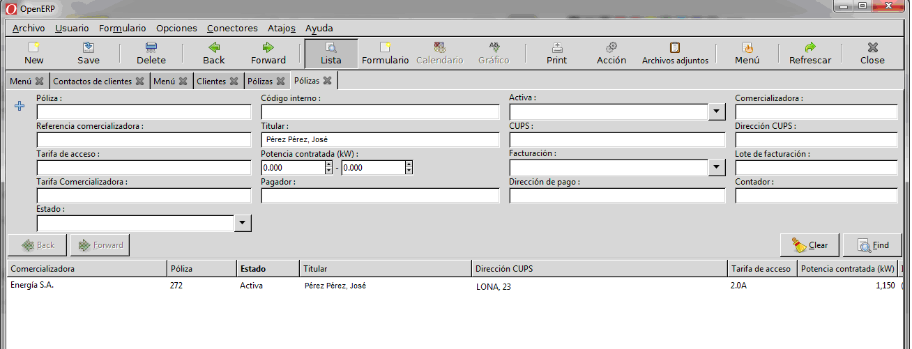

Podem veure les pòlisses del client fent click a les accions "_Como Titular_",
"_Como Pagador_" o "_Como Notificación_" per veure les respectives contractades.
Fent doble clic sobre la pòlissa desitjada apareix les dades d’aquesta i
en la pestanya “_Incidències_” es pot veure totes les incidències que ha tingut,
tal com es mostra en la imatge següent:

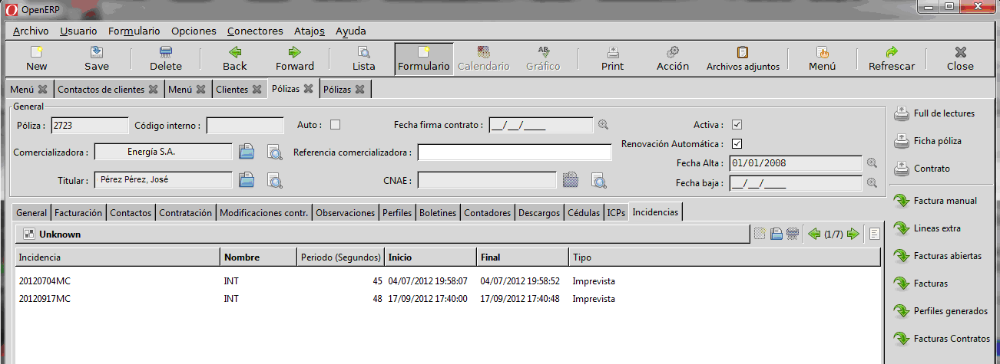

Durant aquesta primera fase de tres anys, les incidències en las xarxes de baixa
tensió s’assignaran al seu corresponent centre de transformació, repartint-se el
temps total i el número total d’aquestes entre els consumidors que s’alimenten
des del centre de transformació, de forma inversament proporcional al número de
sortides de baixa tensió que existeixin en aquest centre de transformació.

El registre de interrupcions en BT per punt d’agregació es el resultat de
superposar en el temps les afectacions de MT del CT (o transformador MT/BT) del
que depèn el punt d’agregació i les afectacions de la seva xarxa de BT. Així
mateix, el registre de interrupcions en MT/AT per punt d’agregació es el
resultat de superposar les afectacions, si es el cas, de les instal·lacions de
MT/AT del que depèn el punt.

La qualitat de les dades topològiques que determinen l’agregació de
instal·lacions afectades per una incidència a un o varis punts d’agregació, així
com l’assignació correcta de clients a cadascun dels punts d’agregació
determinarà fundamentalment la qualitat de la mesura de la qualitat de
subministrament.

Si la relació client –xarxa està a nivell de sortida de BT, aquesta serà la
unitat d’imputació per les interrupcions de BT. En el cas de que es pugui
estimar raonablement l’afectació de les interrupcions a nivell de línia de BT,
la imputació d’aquestes es realitzarà en aquest nivell. Si no fos possible la
imputació es realitzarà a nivell de centre de transformació.

En el caso de subministraments en BT, es pot realitzar el càlcul de les
indemnitzacions anuals en base a la topologia de xarxa que hi hagi en aquell
moment.

## Documentació Suport

En aquest apartat es senyala la documentació quer hauran de conservar les
companyies distribuïdores per suportar la informació continguda en els seus
sistemes, sense prejudici de lo que s’indica en els apartats anteriors.

El sistema elegit per conservar la documentació ha de permetre l’anàlisi per
part  d’un auditor extern, considerant-se vàlid l’emmagatzematge de la
informació en suports magnètics, òptics o similars, sempre que es compleixi el
que s’estableix en els apartats següents.

### Generació d'avisos d'incidències

Les companyies distribuïdores conservaran com a suport els avisos que es generen
amb la data i la hora dels mateixos registrades automàticament que permeti
verificar l’instant de generació de l’avís.

### Dades introduïdes en el sistema de forma manual

Per garantir que les dades introduïdes en el sistema de forma manual puguin ser
auditades, es conservarà el comunicat d’operació o documentació suport
equivalent degudament firmada pel cap de l’equip de treball.

Alternativament es considerarà documentació suport vàlida la informació
introduïda directament en el sistema d’operació per la persona responsable i/o
degudament autoritzada per aquesta tasca, sempre i quant el sistema garanteixi
la identificació unívoca de la persona que ha realitzat la introducció de les
dades.

Addicionalment, es considerarà vàlid l’emmagatzematge de la informació en suport
magnètic, òptic o similar i l’escaneig de documents físics. La persona firmant
del document físic o electrònic es responsabilitzarà de la veracitat de la
informació continguda en aquest.

En el cas de documentació relacionada amb maniobres manuals, s’inclourà
clarament els instants de realització de les maniobres, les instal·lacions
afectades, les dades complementaries que s’introdueixin en l’aplicació
informàtica i la identificació del responsable de l’equip de treball, així com
el seu càrrec.

### Modificació de dades

La informació complementaria de la incidència que es recopili (informe
d’operació, autoritzacions per interrupcions programades, tant en la xarxa
pròpia de la distribuïdora como en la del client, probes de causa de tercers o
de força major, etc.) s’haurà de guardar per justificar qualsevol modificació de
temps, afectacions i classificació de la mateixa amb posterioritat al seu
tancament.

Desprès de  que es complimenti la informació de qualitat de servei per una
incidència, es portarà un registre de tots els canvis que afectin als índex de
qualitat de servei. En cada canvi, juntament amb les seves modificacions es
registrarà la data/hora del canvi i la persona que el realitza.

Quan s’hagi calculat els índex per un període, la modificació de incidències
serà restringida a personal autoritzat, quedant igualment tots els canvis
registrats. Després del canvi, els índex sobre els que pugui influir la
incidència seran calculats de nou.

### Classificació de la interrupció com a programada

La classificació d’una interrupció com a programada requerirà conservar la
següent documentació:

* Sol·licitud d’autorització a l’òrgan competent d’energia de l’Administració
  autonòmica corresponent amb una antelació mínima de setanta dos hores a
  l’instant de la interrupció, no computant-se a aquests efectes els dissabtes,
  diumenges o festius.

* Documentació suport que garanteixi que la comunicació individualitzada a
  consumidors als que els subministraments es realitzin a tensions superiors a
  1kV i als establiments que presten serveis declarats essencials per
  informar-los de la data i hora de inicio i final de la interrupció s’ha
  realitzat al menys vint-i-quatre hores abans del moment del tall del
  subministrament degudament justificat i en el seu cas, copia de la
  comunicació. En caso de que s’opti per realitzar trucades telefòniques es
  mantindrà un registre automàtic de trucades realitzades que permeti verificar
  l’instant de realització.

* Referència de l’avís publicat en dos dels mitjans de comunicació escrita de
  major difusió en la província corresponent informant de la data i hora de
  l’inicio i final de la interrupció.

### Classificació de la interrupció com originada per tercers

La classificació de la interrupció como originada per tercers exigirà conservar
alguns dels següents documents:

* Document firmat per un tercer (empresa transportista, altra empresa
  distribuïdora, client, productor, etc.) responsabilitzant-se de la incidència
  o documento notarial o document emès per una Administració competent en la
  matèria o autoritat governativa responsabilitzant de la incidència a un
  tercer. En caso de no disposar d’aquest document també es consideraran vàlida
  qualsevol prova (denuncia davant instancia policial, prova pericial,
  fotografies, vídeo, etc.) que permeti assignar la causa a tercers.

* Denuncia davant de l’autoritat corresponent ratificant el fet pels casos
  d’accident causat per tercers, vandalisme o terrorisme.

* Autorització de vaga emesa per l’autoritat competent i documentació firmada
  pel responsable tècnic de la instal·lació afectada per la interrupció
  assenyalant la relació “causa efecte” existent entre la vaga i la interrupció,
  quan la interrupció es degui a una vaga legal.

### Classificació de la interrupció com originada per forca Major

La classificació de la interrupció com originada per força major exigirà
conservar documentació que acrediti que la interrupció ha estat motivada per una
de les causes acceptades como tales per l’Administració competent. Es
consideraran como causa de força major:

* Fenòmens atmosfèrics que superen els límits que estableix el Reglament de
  Riscos Extraordinaris per definir el seu caràcter extraordinari. Per poder
  provar aquesta circumstancia serà necessari adjuntar els partes meteorològics
  del moment de la incidència.

* Interrupcions causades per sol·licituds dels Serveis de Protecció Civil,
  Policia o qualsevol altre organisme autoritzat. En aquests casos s’haurà de
  sol·licitar un document justificatiu de l’esmentada sol·licitud firmada per
  l’organisme corresponent.

## Sistemes Informàtics

Les companyies distribuïdores mantindran un adequat control i disposaran de
sistemes que permetin la verificació de les següents característiques de la
informació emmagatzemada:

* _Confidencialitat_: L’accés als sistemes estarà restringit a determinades
  persones amb autorització. Es definiran diferents perfils de forma que es
  controli l’accés a la informació, aplicacions, processos i entorno de xarxa,
  garantint la identificació de la persona que introdueixi o modifiqui una data
  i negant l’accés a qualsevol persona sense autorització.

* _Integritat_: Les companyies garantiran la fidelitat i la precisió de la
  informació continguda en els seus sistemes, controlant que no es produeixin
  errors de processos, aplicacions o de gestió, que suposin alteracions de la
  informació.

* _Disponibilitat_: La informació es trobarà accessible per la seva consulta i
  tractament sempre que sigui necessària. Cada companyia mantindrà un sistema
  adequat de recolzament de les seves  dades, mitjançant còpies de seguretat
  periòdiques, de forma que es garanteixi la disponibilitat d’aquestes davant de
  possibles incidències.

Addicionalment la infraestructura tecnològica escollida per implementar els
sistemes informàtics de la companyia garantirà la eficiència de la definició,
desenvolupament, manteniment i operació en els entorns de procés i sistemes
d’aplicacions pels objectius establerts en aquest procediment.

## Model d'informe

La informació amb les dades de qualitat zonal a presentar a les Administracions
competents haurà d’estar prèviament auditada i tindrà el format següent:

+----------------------+--------------+
| Comunitat Autònoma   |  Província   |
+----------------------+--------------+

+-----------+------+-----------------+-----------------------------------+
|           |      |                 | Programadas                       |
| Municipio | Zona | Pot. Ins. (MVA) +------------+--------------+-------+
|           |      |                 | Transporte | Distribución | Total |
+-----------+------+-----------------+------------+--------------+-------+

+-------------------------------------------------------------+
| Imprevistas                                                 |
+------------+------------+----------+--------------+---------+
| Generación | Transporte | Terceros | Fuerza Mayor | Propias |
+------------+------------+----------+--------------+---------+

+----------+
|  Total   |
+----------+
