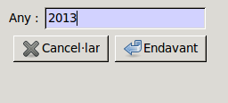
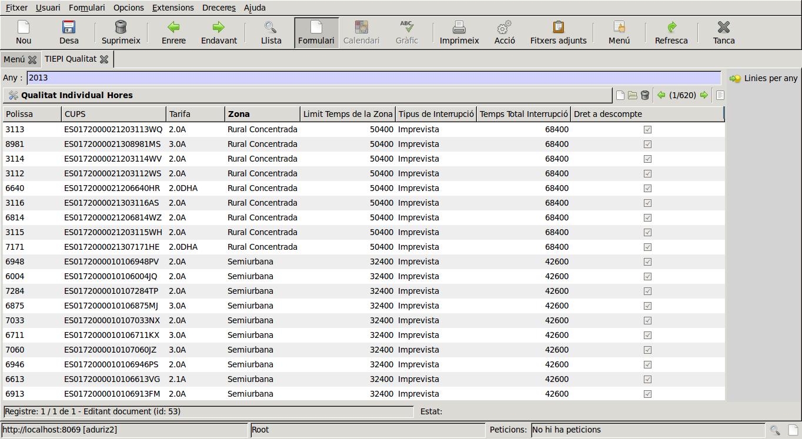
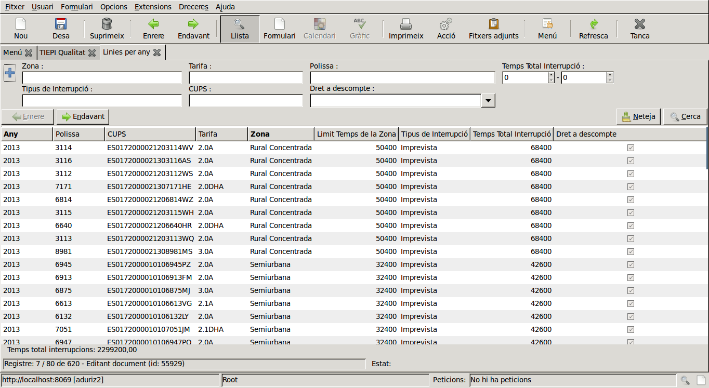
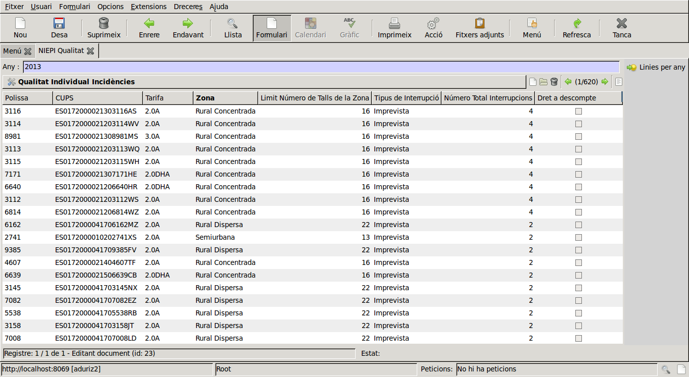
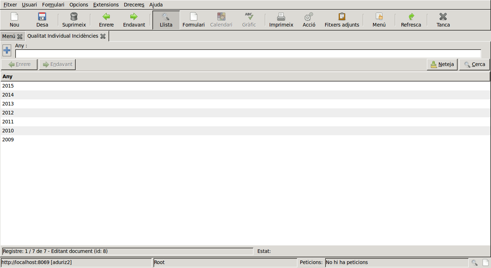
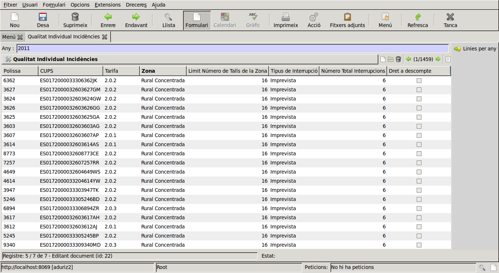

#Documentació del mòdul de qualitat

##Qualitat Individual

A l'apartat de l'ERP de **Qualitat** és on trobarem les funcionalitats per generar i consultar la **Qualitat Individual**.

La **Qualitat Individual** segueix els punts 12 i 13 de la ECO 797.

###Generar Qualitat Individual
Obrirem l'apartat de Qualitat i ens apareixaran cinc carpetes, la de Traçabilitat, Accions, Informes, Conf. Distribuidora i Configuració. Les dues carpetes amb apartats de Qualitat Individual son la de **Accions** i de de **Informes**.

Per generar els valors de qualitat anirem a la carpeta d'Accions i ens trobarem amb dos botons, el de **Qualitat > Accions > Qualitat Individual Hores** i el de **Qualitat > Accions > Qualitat Individual Incidències**.
El de *Hores* ens generarà els valors que conten el temps en segons dels talls per pòlissa, i el de *Incidències* els valors que te en compte el número de talls que ha tingut la pòlissa.

Per generar la llista de la qualitat clicarem sobre el tipus que desitgem, si *hores* o *incidències*, i ens apareixarà una finestra on ens demanarà l'any pel que volem calcular quines pòlisses han sofert incidències, tal i com podem veure a la imatge següent:

A la imatge hem escrit l'any 2013 com a exemple. Cal tenir en compte de que cada cop que es clica el botó s'està generant l'any sencer, o sobreescrivint en el cas que ja existeixi.
Un cop seleccionat l'any cliquem al botó *Següent* i se'ns mostrarà una nova pestanya amb l'any que hem escollit, clicant sobre l'any podrem veure el llistat de les pòlisses com en la imatge següent:

En cada linia del llistat consta de vuit columnes amb els camps:

- *Pòlissa*: el número de pòlissa
- *CUPS*: el número de CUPS associat a la pòlissa
- *Tarifa*: la tarifa contractada,
- *Zona*: el tipus de zona on esta el CUPS
- *Limit Temps de la Zona*: el límit de temps en segons màxim permés a la zona en que es troba el CUPS
- *Tipus de Interrupció*: el tipus de tall que ha tingut la pòlissa,
- *Temps Total Interrupció*: la quantitat total en segons de la duració del tall
- *Dret a descompte*: de si la pòlissa te dret a un descompte o no.

El camp de **Dret a descompte** tindrà un tic de correcte si el **Temps Total Interrupció** és major que el temps de **Limit Temps de la Zona**, d'altre forma sortirà el quadre buit si no es compleix la condició anterior.

!!! warning
	Aquest llistat no té en compte les incidències amb intèrvals inferiors a 3 minuts, ni les incidències que siguin del tipus *Programada*, ni les causes *Transport*, *Tercers* i *Força Major*.

A la part dreta tenim un accés directe que, clicant sobre ell, ens mostra una finestra que ens permet filtrar per varis camps els talls de l'any selecionat, com podem veure a la imatge següent:

Sota de la llista podem observar que ens apareix el sumatori del camp **Temps Total Interupció** en segons, seleccionant varies línies clicant amb el botó de *Ctrl* el sumatori serà de les línies que haguem escollit.

Per generar la **Qualitat individual Incidències** és el mateix procediment que amb les hores però tenint en compte que ara ens mirarem el número de talls que han tingut. Per tant tindrem el camp **Limit Número de Talls de la Zona**, que ens te en compte el límit permés de talls per la zona de la pòlissa i el **Número Total Interrupcions**, el número de talls que ha tigut la pòlissa durant l'any que hem seleccionat. Per tant el camp **Dret a descompte** tindrà el tic si hi han hagut més interrupcions de les que es permet per zona.

A la següent imatge veiem un exemple de l'any 2013 on ens fixem amb el número de talls:

En aquest cas de les incidències també tenim l'accés directe per a poder filtrar i fer el sumatori del número de incidències.

###Informe Qualitat Individual

A la carpeta de **Informes** trobem els accesos per veure els informes de les dues qualitats individuals que hem generat.

Ho explicarem amb l'exemple de la **Qualitat individual Incidències**, però el cas de *Hores* serà exactament igual.

Clicant sobre el botó ens apareix una nova pestanya on hi trobem els anys disponibles per l'informe de qualitat individual, com en la imatge següent:

Clicant sobre un any s'ens mostra una pestanya on ens apareixen totes les pòlisses afectades en el termini de l'any, tal i com surt en l'apartat anterior de generar la qualitat individual.
En aquest cas d'exemple s'ens mostra les incidències del 2011.

