# Introducció

El mòdul de cel·les i elements de tall ens permetrà inventarià totes les cel·les
i elements de tall que tenim a la nostra xarxa de distribució.

# Configuració

Podem trobar totes les opcions de configuració del les cel·les i elements de
tall a través de **Menú > Centres Transformadors > Manteniment > Cel·les i
elements de tall > Configuració**.

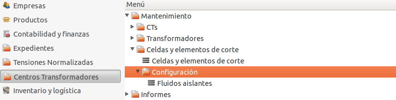

## Fluïds d'aïllament

Podrem donar d'alta tots els fluïds d'aïllament que necessitem a través de
**Menú > Centres Transformadors > Manteniment > Cel·les i elements de tall >
Configuració > Fluïds aïllants**

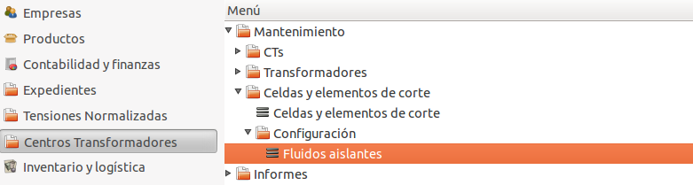

Els fluïds aïllants disposen de dos camps:

  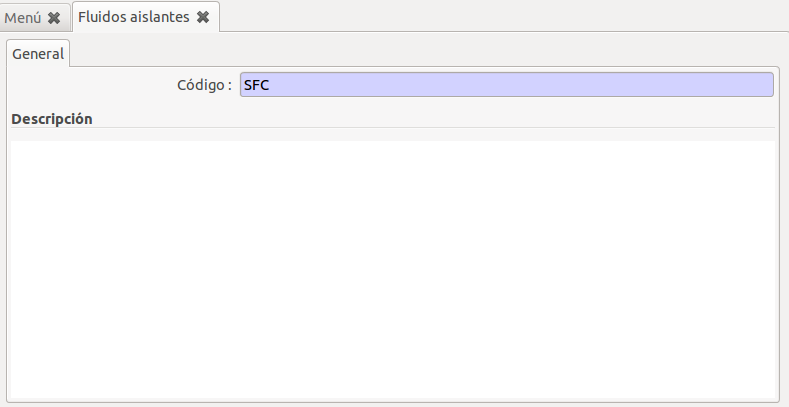

  * **Codi**: El codi d'identificació d'aquest fluïd. (obligatori)
  * **Descripció**: Una descripció d'aquest fluïd.

Aquests registres després es podran seleccionar quan estiguem donant d'alta una
cel·la/element de tall

# Tipus d'element

Podrem donar d'alta tots els tipus d'element que necessitem a través de **Menú >
Centres Transformadors > Manteniment > Cel·les i elements de tall > Configuració
> Tipus elements**

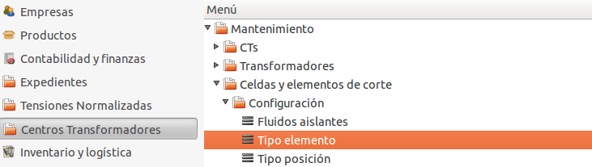

Els tipus d'element disposen de dos camps:

  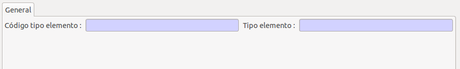

  * **Codi tipus element**: Códi de tipus d'element.
  * **Tipus d'element**: Nom del tipus d'element

# Tipus posició

Podrem donar d'alta tots els tipus de posició que necessitem a través de
**Menú > Centres Transformadors > Manteniment > Cel·les i elements de tall
> Configuració > Tipus de posició**

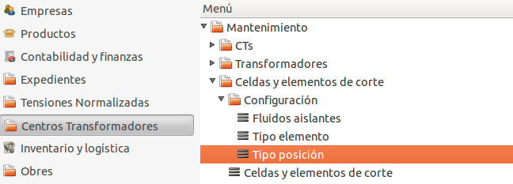

Els tipus de posició disposen de dos camps:

  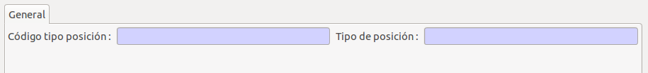

  * **Codi tipus posició**: Códi de tipus de posició.
  * **Tipus de posició**: Nom del tipus de posició

# Llistat de totes les Cel·les i elements de tall

Podem trobar un llistat de totes les cel·les i elements de tall al **Menú >
Centres Transformadors > Manteniment > Cel·les i elements de tall > Cel·les i
elements de tall**

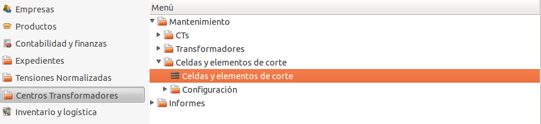

Quan fem doble clic al llistat de totes les cel·les, podem veure un llistat on
es mostraran totes les cel·les i elements de tall que tinguem actives en aquests
moments.

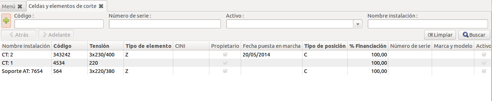

# Crear una nova Cel·la i element de tall

Per crear una nova cel·la i element de tall ho podem fer a través del llistat de
totes les cel·les i elements de tall i després apretar el botó de **Nou**, igual
que es fa amb la resta de registres de l'ERP.

Ens apareixerà un formulari on podem visualitzar tres parts:

  * Apartat general
  * Dades tècniques
  * Dades administratives

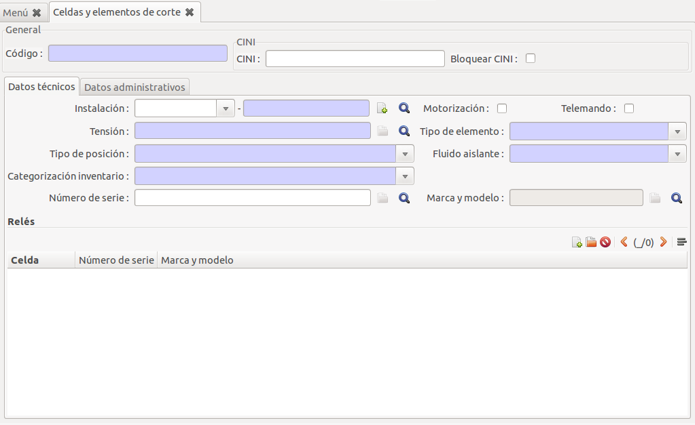

En l'apartat **general** tenim els camps:

  * **Codi**: Ens serveix per identificar el codi de la cel·la i element de tall.
    Aquest codi, ha de ser el mateix codi que s'hagi utilitzat en el sistema GIS.
  * **CINI**: Codi CINI per aquest element.
  * **Bloquejar CINI**: Ens permet un cop introduït el CINI, que no es pugui modificar
    el contingut si no es torna a desactivar aquesta cassella.

En l'aparatat de **dades tècniques** tenim els camps:

  * **Instal·lació**: Ens permet relacionar aquesta cel·la amb una instal·lació.
    Actualment les insatl·lacions suportades són (Centres i Suports AT).
  * **Actiu**: Ens indica si aquesta cel·la i element de tall està activa o no.
    Aquest camp igual que en la resta de registres de l'ERP ens serveix per
    mantenir un històric de registres que actualment no formen part de
    l'actualitat però no els volem eliminar de la base de dades.
  * **Motorització**: Per indicar si aquesta cel·la/element de tall està
    motoritzada.
  * **Telemando**: Per indicar si aquesta cel·la/element de tall està telemanat.
  * **Tensió**: Ens permet seleccionar una tensió que tenim normalitzada a la
    nostra base de dades.
  * **Tipus d'element**: Ens permet seleccionar de quin tipus d'element
    es tracta segons els que haguem pre-configurat. Veure
    [tipus d'element](#tipus-delement).
  * **Tipus de posició**: Ens permet seleccionar quin tipus de posició és segons
    els que haguem pre-configurat. Veure [tipus posició](#tipus-posicio).
  * **Fluïd aïllant**: Ens permet seleccionar quin tipus fluïd aïllant utilitza:
    Les opcions vindran donades segons les que haguem entrat a la configuració
    de fluïds aïllants. Veure [fluïds d'aïllament](#fluids-daillament).
  * **Categorització inventari**: Es pot escollir si aquesta cel·la forma part
    de **L2 + P** o s'ha de tenir en compte com a element de **fiabilitat**.
  * **Número de sèrie**: Ens permet relacionar aquesta cel·la/element de tall
    amb un número de sèrie i producte que tinguem a la base de dades.
  * **Marca i model**: Un cop escollit el número de sèrie ens mostrar el
    producte relacionat amb aquest número de sèrie.
  * **Relés**: Ens permet assignar tots els relés vinculats a aquesta cel·la/
    element de tall. Veure [Formulari relé](#formulari-rele).

En l'apartat de **dades administratives** tenim els camps:

  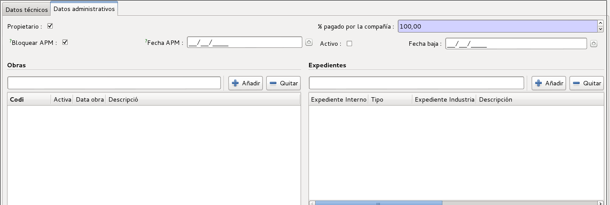

  * **Propietari**: Per indicar si som propietaris o no.
  * **% Pagat per la compañia**: Per indicar quin percentatge ha pagat l'empresa
    per aquest element.
  * **Bloquejar APM**: Permet fixar a una data concreta la *Data APM*. D'aquesta
    forma es permet posar-hi una data fixa i que no es sobreescrigui
    automàticament tal com s'explica a *Data APM*
  * **Data APM**: En quina data es va posar en marxa. Aquest camp
    s'actualitza sol segons la data d'autorització més gran dels expedients
    associats si no es marca el camp *Bloquejar APM*. En aquest cas es pot posar
    una data arbritària.
  * **Actiu**: Per marcar si aquesta cel·la està activa o no. En el cas que no
    estigui activa, no ens apareixerà al llistat a no ser que li diguem
    explícitament que volem veure les cel·les/elements de talls no actius.
  * **Data de baixa**: Per indicar en quina data es va donar de baixa la cel·la/
    element de tall. Aquest camp només és visible quan el camp actiu no està
    activat.
  * **Obres**: Amb quines obres relacionem aquesta cel·la/element de tall.
  * **Expedients**: Amb quins expedients relacionem aquesta cel·la/element de
    tall.

# Visualització des de la fitxa de CTs

També és possible veure totes les cel·les i elements de tall que hi ha a un determinat
centre transformador des de la seva fitxa. Hi ha una pestanya anomenada **Cel·les/Elem. de
tall** que ens les mostrarà. Des d'aquí és possible crear noves cel·les i elements de tall
directament per aquest CT.

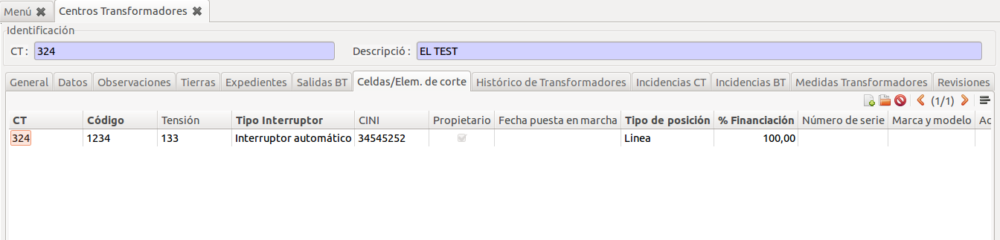

# Visualització des de la fitxa de Suports AT

També és possible veure totes les cel·les i elements de tall que hi ha a un suport
des de la seva fitxa. Hi ha una pestanya anomenada **Cel·les/Elem. de tall** ens
les mostrarà. Des d'aquí és possible crear noves cel·les i elements de tall
directament per aquest suport.

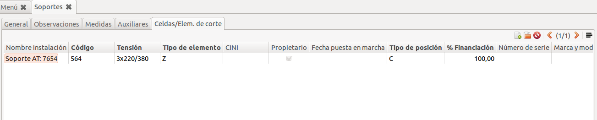

# Visualització des de la fitxa d'una línia AT

També és possible veure totes les cel·les i elements de tall que hi ha a una línia
AT des de la seva fitxa. Les cel·les i elements de tall que es mostraran seran tots
els que estiguin relacionats amb algún suport d'aquesta línia AT. Hi ha una
pestanya anomenada **Cel·les/Elem. de tall** ens les mostrarà. Des d'aquí **no**
és possible crear noves cel·les i elements de tall, per això s'hauria d'anar al
suport concret o des del llistat de cel·les.

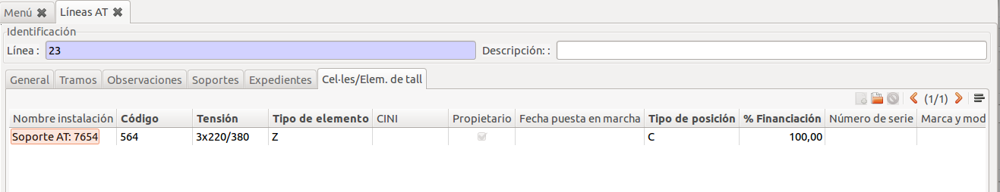

# Llistat de tots els relés

Podem visualitzar tots els relés que tenim entrats a través de **Menú > Centres
Transformadors > Manteniment > Cel·les i elements de tall > Relés**

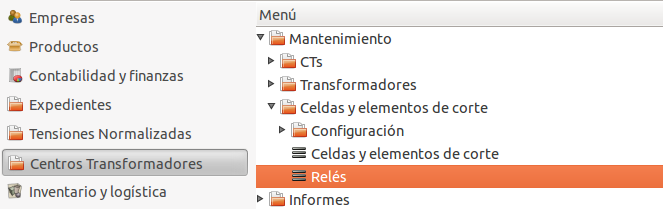

## Formulari relé

El formulari d'un relé disposa de tres camps:

  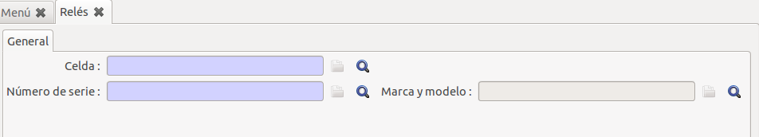

  * **Cel·la**: Aquest camp relaciona el relé amb la cel·la/element de tall on
    està instal·lat. Quan estiguem donant d'alta un relé a una cel·la/element de
    tall que ja estigui creat a base de dades, aquest camp s'omplirà
    automàticament amb el valor de la cel·la que estigueu editant.
  * **Número de sèrie**: Número de sèria d'aquest relé.
  * **Marca i model**: Segons el número de sèrie assignat es mostrarà la marca i
    el model d'aquest relé.

# Condensadors i Reactàncies

Podem accedir a través del menú "_Menú ERP → Centres Transformadors →
Manteniment → Cel·les i elements de tall → Condensadors_"

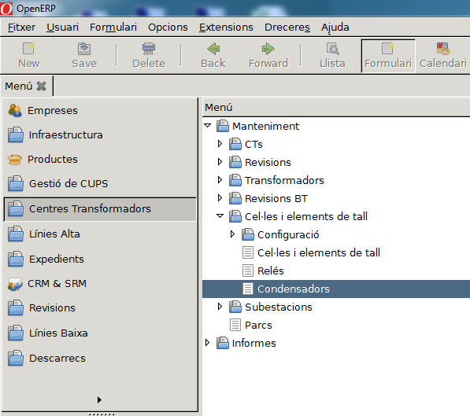

Per crear un nou condensador, cal completar els camps remarcat amb el color blau.

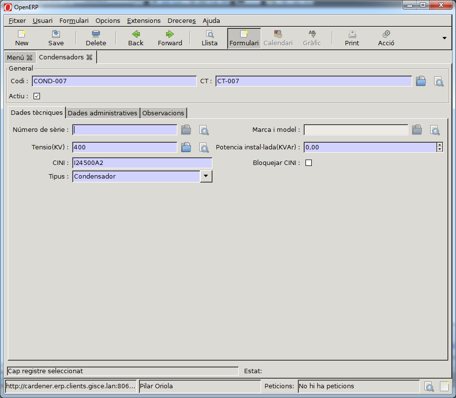

El **Codi** de condensador i reactància que s'entri a l'ERP ha de ser el mateix
que l'**ID** dels blocs utilitzats en el GIS i l'Autocad.

Els blocs a utilitzar són:

|     Condensador-BT       |      Condensador-AT      |     Reactància      |
|:------------------------:|:------------------------:|:-------------------:|

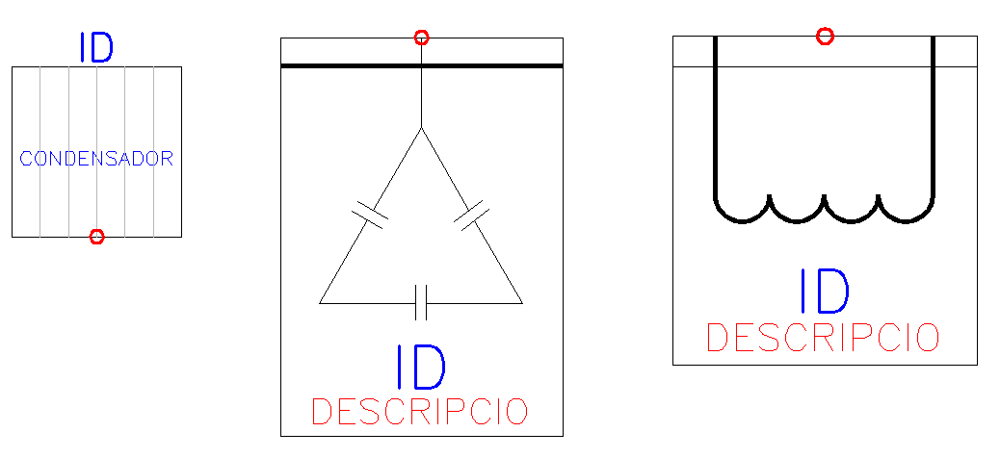

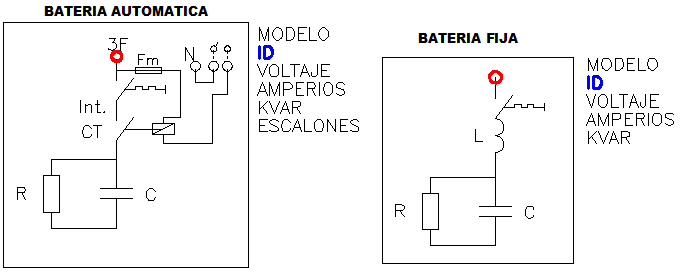

|     Tipus de Condensador    |    CINI     |       Tipus d'Instal·lació       |
|:---------------------------:|:-----------:|:--------------------------------:|
|         Condensador BT      |   I24500A2  | TI-000 (ja que no s'especifica a les taules de TI de la _CNMC_) |
|         Condensador AT      |   I24400A1  |             TI-168               |
|         Reactancia          |   I24401A1  | 				    TI-168               |

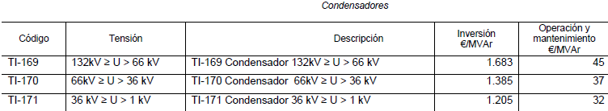

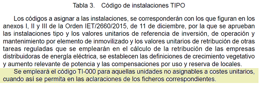

Data APM: Si no la sabem, posem la mateixa que el CT.

Per entrar el **número de sèrie**:

- Obrir amb la lupa i crear un de Nou
- Si sabem el número, el posem. Altrament posem el mateix número que el condensador

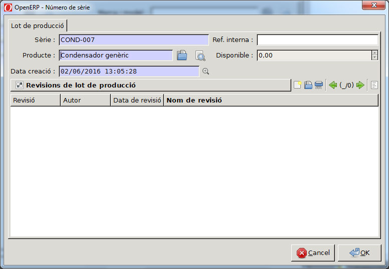

Si el producte "_Condensador Genèric_" no està creat:

- Cal crear un producte Nou
- De la categoria "_Distribució_"
- La resta de camps no són obligatoris

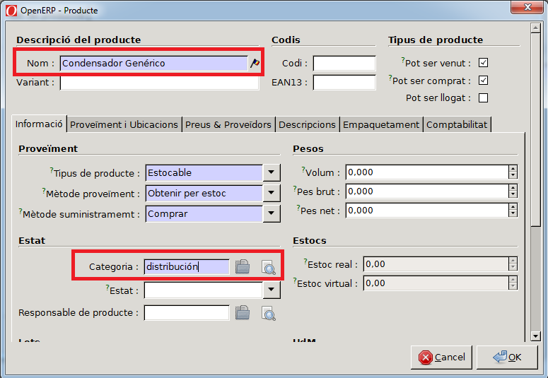
