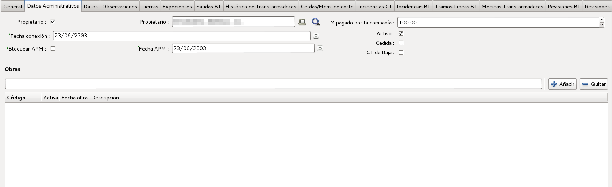

# Documentació del mòdul Centres Transformadors (CT)

## Introducció

El mòdul de centres transformadors ens permet inventariar els Centres
Transformadors i els seus elements més característics

## Submòduls

Dins del mateix mòdul de centres transformadors, disposem de diversos submoduls
per a millor gestió d'aquests. Aquests submòduls son:

* [Cel·les i elements de tall](celdas.md)
* [Subestacions](subestaciones.md)

## Crear un nou Centre Transformador (CT)

Per crear un nou Centre Transformador ho podem fer a través del llistat de
tots els CT's i després apretar el botó de **Nou**, igual que es fa amb la
resta de registres de l'ERP.

Ens apareixerà un formulari on podem visualitzar una capçalera i diferents
parts:

  * General
  * Dades Administratives
  * Dades
  * Observacions
  * Terres
  * Expedients
  * Sortides BT

En l'apartat de **Dades Administratives** tenim els camps:

* **Propietari (check)**: Per indicar si som propietaris o no.
* **Propietari**: Qui és el propietari del CT, habitualment nosaltres mateixos.
* **% Pagat per la companyia**: Per indicar quin percentatge ha pagat l'empresa
    per aquest element.
* **Data Connexió**: Data real de connexió del CT a la xarxa
* **Bloquejar APM**: Permet fixar a una data concreta la *Data APM*. D'aquesta
    forma es permet posar-hi una data fixa i que no es sobreescrigui
    automàticament tal com s'explica a *Data APM*
* **Data APM**: En quina data es va posar en marxa. Aquest camp s'actualitza
    sol segons la data d'autorització més gran dels expedients associats si
    no es marca el camp *Bloquejar APM*. En aquest cas es pot posar
    una data arbritària.
* **Actiu**: Per marcar si aquest CT està actiu o no. En el cas que no
    estigui activa, no ens apareixerà al llistat a no ser que li diguem
    explícitament que volem veure els CTs no actius.
* **Cedida**: Marcat si la instal·lació ha estat cedida a la nostra empresa
* **CT de Baixa**: Indica si el CT està de baixa.
* **Data de baixa**: Per indicar en quina data es va donar de baixa el CT.
    Aquest camp només és visible quan el camp *Ct de Baixa* està activat.
* **Obres**: Amb quines obres relacionem aquest CT.

