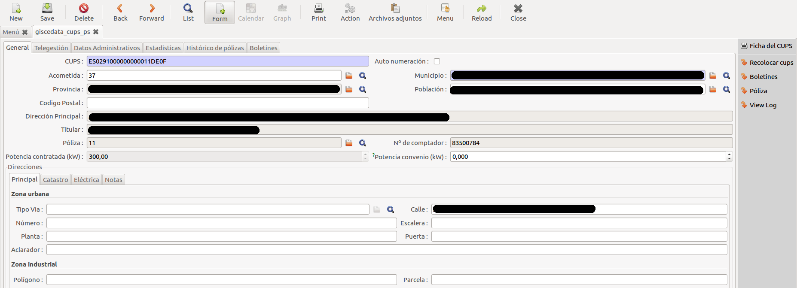

#Punts de Subministre (CUPS)

## Crear un nou CUPS

Si s'ha de crear un nou CUPS perquè l'escomesa es nova o no existeix el CUPS a
la Base de Dades es pot fer des de dos llocs diferents:

1. Des de la mateixa pòlissa sel·leccionant el botó _Nou_ en el camp _CUPS_
2. Des del menú "_Menú → Gestió de CUPS → Manteniment → CUPS → CUPS_" i
   sel·leccionant el botó _Nou_

El codi del CUPS es genera automàticament. Llavors se li ham de cumplimentar els
camps de la pestanya General. El camp Escomesa no s'ha d'emplenar ja que la
associació es fa al Mòdul de GIS.

Els camps ET i Línia tampoc s'han d'emplenar si es té instal·lat el mòdul de GIS.
En cas contrari es poden emplenar manualment.

!!! Note
    En General, a qualsevol formulari: Tots els camps amb **el fons gris**, són
    de només lectura.

!!! Note
    En General, a qualsevol formulari: Tots els camps amb **el fons blau**, són
    obligatoris.

## Eliminar un CUPS

Mai s'ha d'eliminar un CUPS. Quan un CUPS no va a utilitzar-se mai més, s'ha de
desactivar.

## Desactivar un CUPS

En la única circumstància que s'ha de desactivar un CUPS es en el cas que el
punt de subministre desapareixi, s'hagin retirat les línies de subministre i ha
desaparegut la vivenda i no existeix la possibilitat de que es torni a connectar
ningun altre client a aquest mateix punt.

!!! Warning
    El CUPS no es borra en cap cas, només s'haurà de desactivar.

Desmarcant la casella _Actiu_ de la fitxa general del CUPS, aquest ja no
aparaixerà més en els llistats ni en les cerques, i només podrà tornar a ser
localitzat si explícitament es sel·lecciona la opció "_Actiu = No_" en el
filtre.

!!! Note
    En General: Recorda que per buscar un registre **no actiu** s'ha de fer
    seleccionant la opció "_Actiu = No_" en els filtres de sel·lecció.
