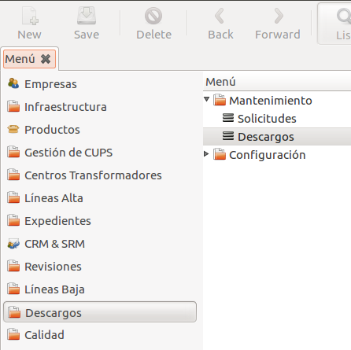
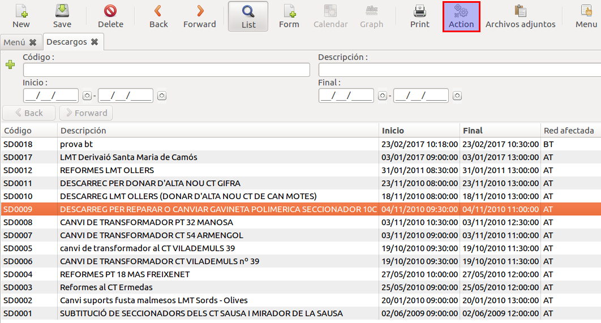
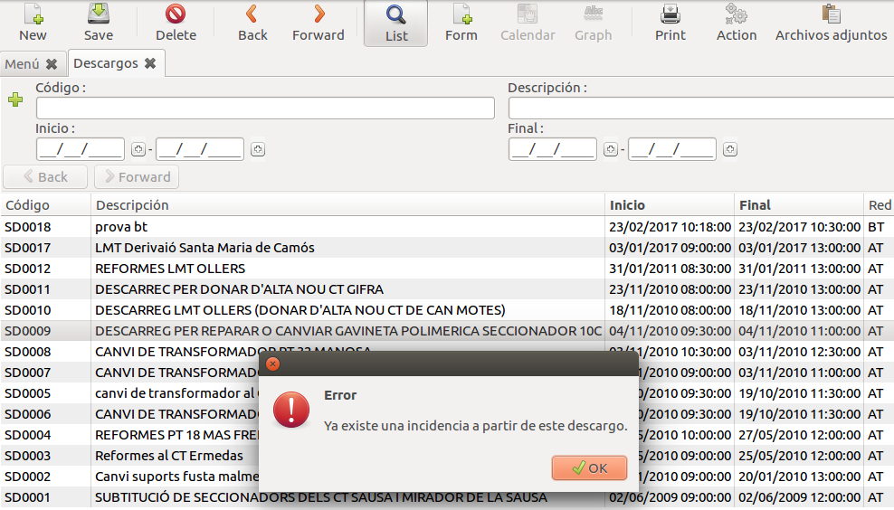
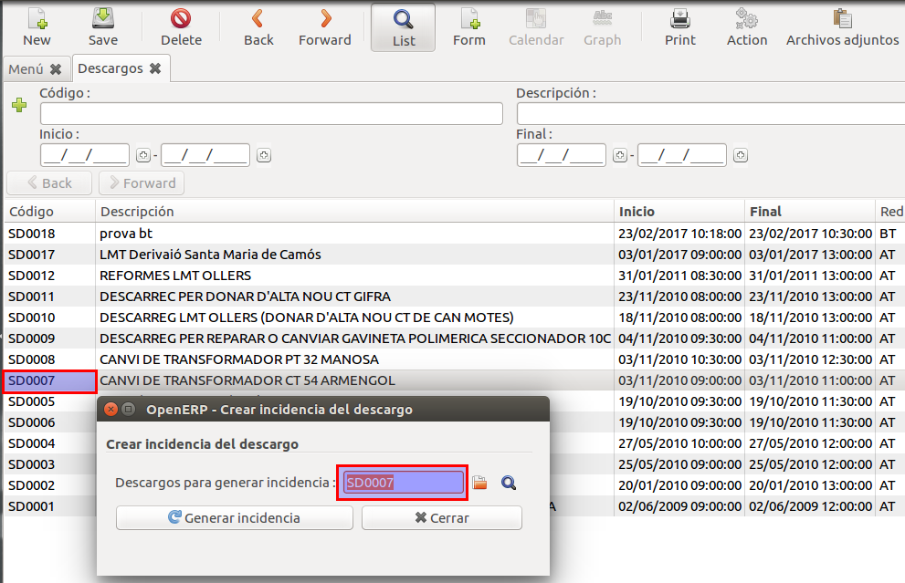
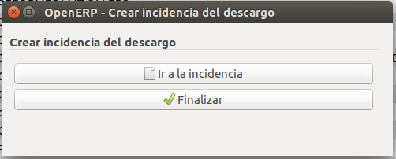
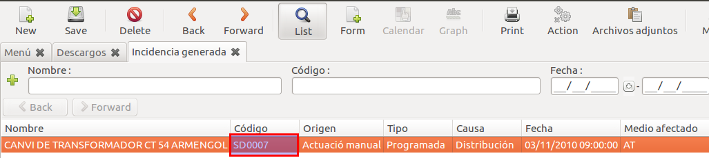
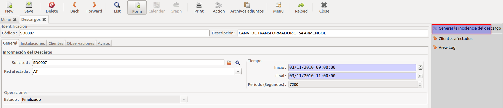

# Descarrecs

## Generar sol·licitud de descàrrec

Per generar una sol·licitud de descàrrec hem d'anar al menú de Descàrrecs/Manteniment/Sol·licituds i crear una nova solicitud.

En el formulari hem de d'omplir:

1. Descripció de la sol·licitud
2. Sol·licitant
3. Cap d'inatal·lació
4. Centre de conttrol
5. Inici
6. Final
7. Xarxa afectada (AT o BT depenent del tipus de descàrrec)

Finalment hem d'enviar la sol·licitud al GIS per fer la simulació prement el boto "Enviar al GIS".

!!! Info "Nota"
    Només es pot assignar com a solicitant els contactes que estiguin com a tipus "Descarrec"

## Generar una incidència a partir d'un descàrrec

Per a generar una incidència a partir d'un descàrrec ho podem fer de dues formes:

1. Des de la llista de descàrrecs.
2. Des de la vista d'un descàrrec.

### Opció 1

1. Anar a la vista de la llista de descàrrecs.

    

2. Seleccionar el descàrrec sobre el qual vulguem realitzar la incidència i clicar el botó action de la barra de menú superior.

    

3. Si el descàrrec no té una incidència creada ens obrirà un assistent per a generar-la. En el cas que ja existís una incidència relacionada amb el descàrrec seleccionat l'ERP ens mostraria un missatge d'error informant-nos sobre això.

    

4. Amb l'assistent obert, comprovem que el codi del descàrrec és el que hem seleccionat de la llista i farem un clic sobre el botó "Generar incidència".

    

5. Quan el procés de generar la incidència hagi finalitzat l'assistent ens mostrara un missatge demanant-nos si voleu obrir la nova incidència creada o si volem finalitzar el procés i tancar l'assistent.

    

    

### Opció 2

1. Anar a la vista de la llista de descàrrecs.

2. Seleccionar el descàrrec sobre el qual vulguem realitzar la incidència i obrir-lo fent doble clic.

3. A la part dreta de la vista veurem una llista d'accions possibles de les quals haurem de clicar la que posa "Generar la incidència del descàrrec". Això ens obrirà l'assistent.

    

4. Un cop obert l'assistent haurem de seguir les mateixes passes que en l'**opció 1** per a generar la incidència.
