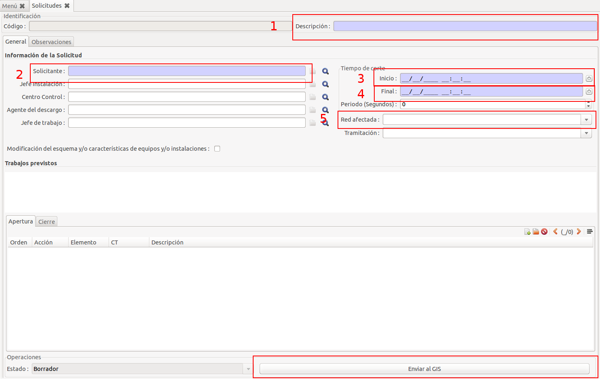

# Descarrecs

## Generar sol·licitud de descàrrec

Per generar una sol·licitud de descàrrec hem d'anar al menú de Descàrrecs/Manteniment/Sol·licituds i crear una nova solicitud.

En el formulari hem de d'omplir:

1. Descripció de la sol·licitud
2. Sol·licitant
3. Inici
4. Final
5. Xarxa afectada (AT o BT depenent del tipus de descàrrec)

Finalment hem d'enviar la sol·licitud al GIS per fer la simulació prement el boto "Enviar al GIS"

