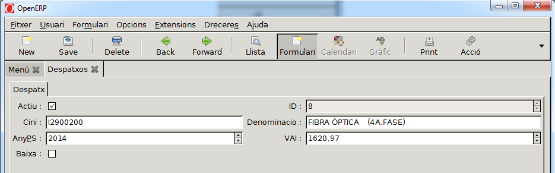

# Despatxos

Despatxos són despeses, factures i inversions fetes per part de l'empresa, com
telegestió, software, concentradors, fibra òptica..., és a dir, tot lo relacionat
i necessari per la distribució i que no siguin instal·lacions; i que solicita la
**CNMC**, _en el Formulari 6 del inventari corresponent a Resolució
[4666](https://www.boe.es/diario_boe/txt.php?id=BOE-A-2016-4666)_

Per entrar les dades corresponents a **Despatxos** a l'ERP cal accedir al menú
"_Menú ERP → Infraestructura → Despatxos_".

Haurem d'entrar els camps definits en l'ERP:

* **Any**: any que figura en la factura
* **Valor de la inversió**: valor invertit, **en EUROS i sense IVA**
* **CINI**: _Código de Identificación Normalizada de instalaciones_
* **Denominació**: breu descripció

