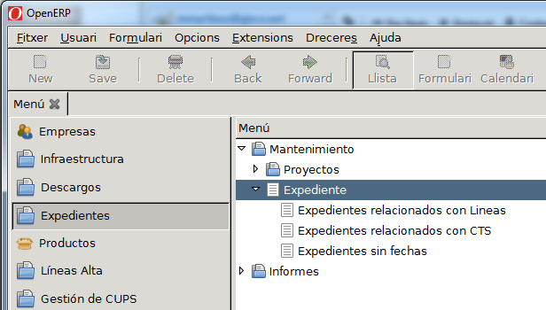
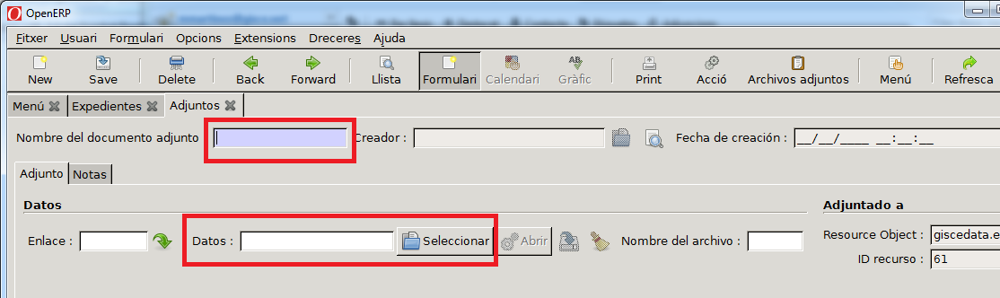

# Expedients

Podem entrar al menú d'Expedients a dins del ERP accedint a "_Menú ERP →
Expedients → Expedients_".

Localitzar en el document d'Acta de posada en servei, o en el certificat final
d'obra o en el certificat d'indústria, les dades mínimes a complementar:

## Entrar un Expedient:

1. Expedient intern: Nombre Identificador de cada empresa
2. Expedient Indústria: Nombre Identificador
3. Data d'autorització: Data en que es va realitzar
4. Descripció: Una breu descripció del tipus d'obra o instal·lació a la que afecta.
5. Tipus: Si es un expedient de CT (Centre Transformador), si es de línia de MT
   (Mitja Tensió) i si afecta a MT i CT.

En la següent imatge es pot veure un exemple de mostra amb diversos camps per
complementar un expedient.

## Adjuntar el document del expedient/acta a l'ERP

1. Escanejar el document
2. Dins de la fitxa del expedient, sel·leccionar la opció "_Fitxers Adjunts_"

    

3. Crear un nou (botó _New_) registre

    

4. Entrar les dades:
    - Nom del document Adjunt
      - _Exemple: "APS LMT CLAMOR FERIAL"_
    - Adjuntar el document escanejat

    
    
    
