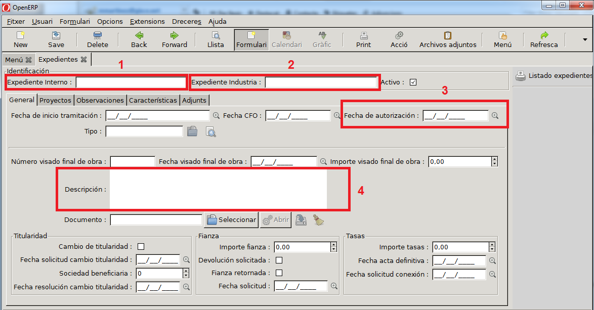
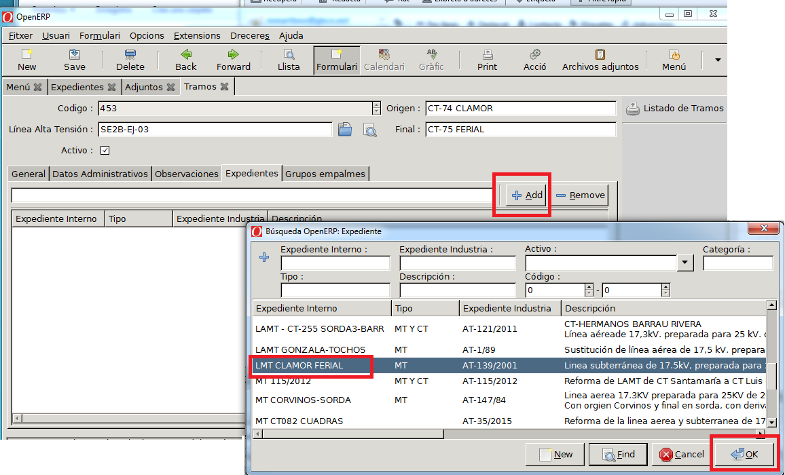

# Expedients

Podem entrar al menú d'Expedients a dins del ERP accedint a "_Menú ERP →
Expedients → Expedients_".

Localitzar en el document d'Acta de posada en servei, o en el certificat final
d'obra o en el certificat d'indústria, les dades mínimes a complementar:

## Entrar un Expedient:

1. Expedient intern: Nombre Identificador de cada empresa
2. Expedient Indústria: Nombre Identificador
3. Data d'autorització: Data en que es va realitzar
4. Descripció: Una breu descripció del tipus d'obra o instal·lació a la que afecta.
5. Tipus: Si es un expedient de CT (Centre Transformador), si es de línia de MT
   (Mitja Tensió) i si afecta a MT i CT.

En la següent imatge es pot veure un exemple de mostra amb diversos camps per
complementar un expedient.

## Adjuntar el document del expedient/acta a l'ERP

1. Escanejar el document
2. Dins de la fitxa del expedient, sel·leccionar la opció "_Fitxers Adjunts_"

    

3. Crear un nou (botó _New_) registre

    

4. Entrar les dades:
    - Nom del document Adjunt.
        - _Exemple: "APS LMT CLAMOR FERIAL"_
    - Adjuntar el document escanejat

    

    

## Assignar un expedient a un centre o línia

### Assignar un expedient a un Centre Transformador

Hem de localitzar el centre transformador a l'ERP, i des de la fitxa del centre
li assignarem l'expedient que li correspon.

1. Entrem des del menú: "_Menú ERP → Centres Transformadors → CT_"

    

2. Localitzem el centre en qüestió, amb l'ajuda de filtres o sel·leccionant-lo
   directament del llistat.

3. Entrar a la fitxa del centre utilitzant el botó "_Vista → Formulari_ " o bé,
   fent doble click.

    

4. Accedim a la pestanya _Expedients._

    

5. Afegim (botó _Add_ ) un nou expedient i sel·leccionem l'expedient del llistat
   que ens apareixerà.   
   La finestra que apareix és el llistat de tots els expedients entrats al ERP,
   al menú expedients.

    

### Assignar un expedient a una línia de Mitja Tensió

!!! note
    Els expedients s'assignen als trams (no a la línia).
    Un expedient pot estar assignat a diversos trams de la línia.

1. Entrar en el menú "_Menú ERP → Línies d'Alta Tensió → Manteniment → Trams →
   Tots els Trams_"

    

2. Localitzem el tram en qüestió, amb l'ajuda de filtres o sel·leccionant-lo
   diremtament del llistat.

3. Entrar a la fitxa del tram utilitzant el botó "_Vista → Formulari_ " o bé,
   fent doble click.

    

4. Accedim a la pestanya _Expedients._

    

5. Afegim (botó _Add_ ) un nou expedient i sel·leccionem l'expedient del llistat
   que ens apareixerà.   
   La finestra que apareix és el llistat de tots els expedients entrats al ERP,
   al menú expedients.

    

## Data APM

Una vegada assignat l'expedient al CT i/o línia, automàticament se li assignarà
la data del expedient al CT i/o línia.

En el cas de voler posar en el centre i/o línia una altra data diferent a la data
del expedient per motius diversos, per exemple: perquè hi ha hagut reformes,
perquè la data real és una altra ...; haruem de:

1. Bloquejar la data APM: a la pestanya de dades administratives.
2. Entrar la data APM que volem deixar.

!!! note
    Poden haver diversos expedients assignats a un mateix centre i/o línia.    
    En aquest cas l'ERP agafarà la **data APM més recent** i la assignarà al
    centre. En cas de voler conservar l'altre data, cal bloquejar la data
    "_Bloquejar APM_ ", com es descriu en el punt anterior.
