# Documentacion de Facturacion

# Veure també

- [Facturacion Contratació](facturacion_contratacion)

## Proces de facturació:

### Lot de facturació

L'apartat _Menu/Facturació/lots de facturació_ és el panell de control per
realitzar les facturacions masives, indica l'estat en que es troba el lot
(**Borrador, obert, tancat**)

El lot de facturació inclou les pólisses que es facturaràn en aquest període.

Una vegada facturada una pólissa activa en un lot de facturació
automàticamente pasa al lot següent.

Una vegada facturada una pòlissa que està de baixa i inactiva en el moment
de facturar-se ja no va al pròxim lot de facturació.

Si una pòlissa es dona de baixa després de haver-se facturat s'ha de comprovar
que no hagi passat al pròxim lot de facturació o sinó en el procés de validació
donarà error per la facturació.

### Facturació en 4 pasos.

#### 1 Obrir:

El botó obrir es el primer pas a realitzar per iniciar la facturació
d'un determinat període. Si s'intenta obrir un lot sense haver tancat
l'anterior apareixerà un error indicant que existeix més d'un lot obert.

Una vegada obert un lot, les pòlisses a facturar passen del estat “borrador”
al estat “obert”.

#### 2 Validar:

El botó validar comprova que totes les pòlisses del lot compleixin
els requisitos per poderse facturar. Si la validació de la pòlissa es correcta
pasa al estat “A punt de facturar”.

Comprovacions que realiza:

* Que els comptadors actius tinguin lectures inicials i finals en cada període.
* Comprova si existen valores de lectures actuales inferiores a les inicials.
  * En el caso que sea debido a un gir del comptador, després de comprovar
    que el gir es correcte es pot marcar la casella “Saltar validació”
    en la fitxa de la pòlissa a facturar.

“Saltar validació” Al entrar en una pòlissa del lot de facturació apareix
la opció “Saltar validació” que permet que encara que apareixi un missatge
en la validació. Es marca aquesta opció i es prem el botó “validar aquesta”
per que passi al estat “A punt de facturar”.

#### 3 Facturar:

Una vegada totes les pòlisses estàn en estat “A punt de facturar” es prem el
botó “Facturar” i comença el procés de facturació.

Al final del procés de facturació s'hauran generat les factures de les pòlisses
del lot en estat “Borrador”. A la vegada, totes les pòlisses del lot han passat
al estat “Facturat”.

Actualitzar: Durante el procés de facturació si es prem aquest botó s'actualitza
la barra de procés indicant el tant per cent de facturació realitzat. Quan es
prem el botó actualitzar i el procés de facturació ha arribat al 100% el lot
de facturació pasa al estat “Tancat”.

#### 4 Obrir factures:

Una vegada revisades, per part del usuari, totes les factures generades en el
lot de facturació pot apretar-se el botó “Obrir factures” per assignar el número
de factura i realitzar els assentaments comptables corresponents.

!!! note
    Des del menú de Lots de facturació pots accedir a les pòlisses directament
    obrint la fitxa. Així si desitjes modificar algúna dada d'una pòlissa pots
    accedir des del propi lot a la pòlissa sense necessitat d'obrir una nova pestanya.

### Menú lateral:

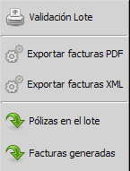

* Validació lot:  Aquesta opció genera un informe en format pdf de les
  incidències trobades en la validació.

* Exportar factures PDF: Genera un fitxer zip amb els pdf de les factures
  de cada comercializadora per al posterior enviament. Es descomprimeix el
  fitxer pdf i s'extreun els diferents fichers per cada comercializadora per
  poder-los enviar.

* Exportar factures XML

* Pòlisses en el lot: Aquesta opció obre una nova pestanya en la que apareix
  el llistat de pòlisses i l'estat en que es troben.

!!! note
    Des del menú de les “pòlisses en el lot” pots accedir a les pòlisses
    directament obrint la fitxa. Així si desitjes modificar algúna dada
    d'una pòlissa pots accedir-hi des de “pòlisses en el lot” a la pòlissa
    sense necessitat de obrir una nova pestanya.

* Factures generades: Aquesta opció obre una nova pestanya en la que apareix
  el llistat de factures generades a partir del lot de facturació.

!!! note
    Utiliza el menú contextual per accedir a les dades de forma ràpida.
    Per exemple: si estàs a qualsevol factura, i et situes sobre del camp de
    la pòlissa prement el botó dret podràs obrir directament una nova
    pestanya amb totes les seves factures.

### Facturació manual:

Per realitzar facturacions eventuals, o de pòlisses que es dònen de baixa i
s'han de facturar fora del lot de facturació s'utilitzarà aquest tipus de facturació.

Des de la fitxa d'una pòlissa s'accedeix al apartat _Factura manual_ per
realitzar una factura que no pot esperar a facturar-se dintre del lot de facturació.

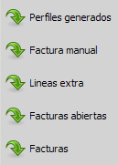

S'accedeix al assistent en el que es indicarà:

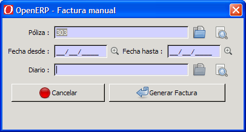

* Pòlissa: Per defecte apareix la pòlissa en la que es troba en aquest moment.

* Data des de, Data fins: Indica l'intèrval que es desitja facturar i facturarà
  les lectures que trobi en aquest intèrval.

* Diari: S'ha de indicar a quin diari es desitja assignar a la factura
  a realitzar. Si es una factura de energia normal s'asignarà al diari _Factures Energía_.

!!! note
    Aquesta factura manual es pot realitzar en qualsevol moment, i la/es
    factura/es que realiza queden en estat _borrador_. Pots utilitzar aquesta
    opció per comprovar si el resultat de la facturació d'aquesta pòlissa es
    l'esperat. (p.e.  si hi ha hagut una _Modificació contractual_ en mig del
    període de facturació i s'han de realitzar 2 factures.) Després pots borrar
    la/es factura/es en estat _borrador_ i la pòlissa seguirà pendent de facturar.
    Tambié es pot utilitzar aquesta opció per fer una simulació de factura (factura pro-forma)

### Estados d'una factura:

* Borrador: Es mostra de color blau i aquesta factura encara no té assignat
  número, i es pot borrar de forma inocua per el sistema.

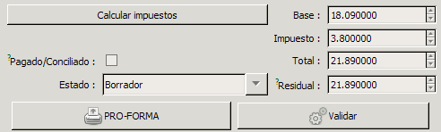

* Obert: Quan es valida una factura de forma individual a través del botó
  _Validar_ dins de la pròpia factura o bé a través del _Lot de facturació /
  Obrir Factures_. S'assigna un número de factura a aquesta i es realitzen
  els assentaments comptables necesaris per poder fer el seguimient del
  cobrament de la mateixa i els informes comptables mensuals, anuals etc.

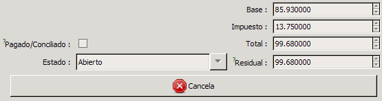

!!! note
    Per saber quines factures estàn pendents de cobrament pots filtrar les
    que estàn en estat 'obert'. Després afegint el filtre de 'Empresa' i el
    de 'data factura'. Es sabràn les factures pendents de cada comercializadora
    en aquest període.

* Realitzar: La factura s'ha cobrat i s'han realitzat internament els
  assentaments comptables necesaris per conciliar la factura. Es fa amb una
  factura individual des de la pròpia factura amb la opció 'Pagar factura'.

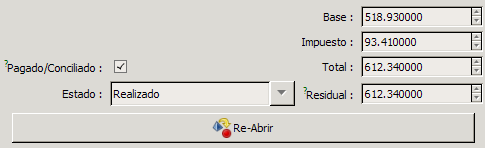

!!! Pregunta
    ¿Com es paga un grupo de factures a la vegada?

!!! Resposta
    S'han de sel·leccionar les factures a cobrar bé a través d'un filtre o bé
    seleccionant-les d'una llista. Després s'ha d'utilitzar l'assistent
    'acció / pagar grup de factures'.

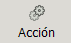

!!! Pregunta
    Si dono per pagada una factura per error, com desfaig el cobrament?

!!! Resposta
    Des de la pròpia factura es selecciona la opció '_Desfer pagament_',
    això passarà la factura de l'estat 'realitzat' al estat 'obert'.

Igualment es pot fer amb un grup de factures des del assistent 'Acció / Desfer pagament'

#### Preguntes més freqüents:

!!! Pregunta
    Quan es generan més de una factura per pòlissa i lot de facturació?

!!! Resposta
    Si no s'han produït modificacions contractuals en el període de facturació
    del lot nomès es genera una factura per pòlissa i lot.

Es generan 2 factures si:

1. La Modificació contractual que es realiza en mitat del període de facturació
   es un 'augment / disminució' de potència, amb o sense canvio de tarifa.
2. La Modificació contractual es per un canvi de comercializadora.

Per veure quantes pòlisses tenen més d'una factura en el període es pot
comprovar des de el lot de facturació filtrant per el camp “Factures Generades”.

!!! Pregunta
Si he de borrar una factura en estat “obert” que no es correcta
com la torno a facturar?

!!! Resposta

Si s'ha de tornar a fer una factura perquè al analitzarla quan està en estat
“borrador” s'ha detectat algún error s'ha de:

1. Borrar la factura.
2. Corregir les dades que han produït l'error per als correctes.
3. Tornar al lot de facturació i es trobarà la pòlissa en estat
   “a punt de facturar”. Si es troba en estat “oberta” s'ha de pasar al estat
   “a punt de facturar” amb el botó “validar” des de la pròpia pòlissa del lot.
4. Polsar el botó “facturar aquesta” , una vegada facturades totes les pòlisses
   prement el botó “Actualitzar” aquest passarà al estat “Tancat”

!!! Pregunta
Com comprovo que estàn totes les pòlisses que he de facturar en el lot?

!!! Resposta

1. Totes les pòlisses que estaven en el lot N una vegada facturades passen
   automàticament al lot següent: N+1 les mensuales, N+2 les bimestrales.
2. Les pòlisses que no pateixen modificacions contractuals entre la
   facturació N i la següent no requereixen ninguna comprobació.
3. Anar a **Menú > Gestió de pòlisses > Pòlisses no asignades a ningún lot de
   facturació** i colocar les pòlisses que sortin en el lot de facturació
   que els correspongui. Aquesta operació s'ha de realitzar des de una altra
   pestanya de pòlisses. En aquesta el camp “lot de facturació” no es editable
   ja que el filtre es que estigui buit.
4. S'ha de comprovar que el número de pòlisses en el lot es igual al número
   de pòlisses que tenen el mateix lot de facturació. Des de les pòlisses
   filtrant per el camp lot de facturació i sumant les pòlisses ACTIVES i
   les NO ACTIVES ha de ser igual al número de pòlisses en el lot.
   Totes la pòlisses de “baixa” i “Inactives” que no s'hagin de facturar en
   el lot s'ha de comprobar que el camp lot de facturació sigui l'últim que
   es facturi i no l'actual.
5. Si existeix una pòlissa del lot de facturació que no es pot facturar en
   el procés de validació ja apareixerà l'error.

!!! Pregunta
Una factura en estat “Obert” es pot modificar?

!!! Resposta

1. Una factura en estat obert es pot cancel·lar prement el botó “Cancelar”,
   després pasar al estat “Borrador”.
2. Una vegada en estat borrador els camps passen a ser editables i es poden
   fer les modificacions necessaries.
3. Una vegada modificats els camps necesaris es pot obrir de nou la factura
   amb el botó Validar passant al estat “Obert”

!!! Pregunta
Una factura en estat “Realitzat” es pot modificar?

!!! Resposta

1. Si per error una factura ha passat al estat Realitzat, el primer que s'ha de
   fer es cancel·lar el pagament tal com s'ha indicat anteriorment i passarà
   al estat “Obert”
2. Seguir els pasos indicats en l'apartat anterior.

## Modificacions contractuals

Les modificacions contractuals representen l'històric de modificacions que ha
patit una pòlissa/contracte en tota la vida. Les modificacions contractuals
contenen la mateixa informació que una pòlissa.

Un procés de Modificació contractual té 3 passos dins d'una pòlissa:

1. Botó “Modificació contractual”. Pulsar aquest botó fa que la pòlissa passi
   d'estat “Activa” al estat “Modificació contractual”.
   Per modificar els camps desitjats.
2. Realitzar les modificacions en la pòlissa, todos els camps editables
   son susceptibles de Modificació, bàsicament seràn:
   potència contractada, comercializadora, tarifa d'accés, canvis en la
   pestanya contactes i en la pestanya facturació.
3. El botó “Crear Modificació contractual” permet crear una nova
   Modificació contractual a partir d'una determinada data, o bé sobrescriure
   la actual amb els nous valors, en cas que s'observi algún error en la MD actual.

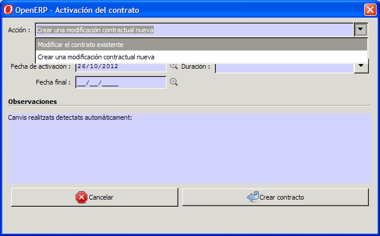

### Crear una Modificació contractual nova
Aquesta opció crea una nova línea de Modificació contractual entre les dates:
data d'activació i data final indicades en el quadre de diàleg.

Siempre existeix la possibilitat de “Desfer Mod. contractual” si no desitjem
guardar ninguna Modificació i deixar la pòlissa tal com estava abans d'iniciar
la Modificació Contractual.

!!! Pregunta
Com es realitza un augment de potència de 5,5 a 10,390?

!!! Resposta

1. Dins de la pòlissa, polsar el botó “Modificació contractual”. Això fa que
   la pòlissa passi de estat “Activa” al estat “Modificació contractual”.
   S'ha de canviar la potència 5,5 per la nova 10,390 (apareixerà un quadre
   de diàleg advertint que la tarifa no concorda amb la nova potencia
   contractada), es canvia la tarifa a 2.1A , es prem el botó generar períodes
   per que apareixi el període de la nova tarifa 2.1A amb la potència contractada.
2. Comptador:  S'ha d'indicar la lectura de tancament de la 2.0A en la data
   dd/mm/aaaa i inicialitzar la nova lectura de la 2.1A que serà la mateixa
   en la data dd/mm/aaaa +1. Això s'ha de fer tant si es canvia de comptador
   com si es mantenen el mateix comptador.
3. Una vegada les dades son les correctes, s'ha de polsar “Crear nou contracte”
   indicant a partir de quina data s'activarà la nova potència contractada.

!!! nota
    Si la data d'inici de la nova Modificació contractual està en mig d'un
    període de facturació, es generaràn dos factures per aquesta pòlissa,
    una per cada període amb la tarifa correspondiente.

!!! Pregunta
En una tarifa 3.X o 6.X com puc indicar potències diferents en cada període?

!!! Resposta

Per poder indicar potències diferents en cada període s'ha de desmarcar
la casella “Autogenerar períodes”

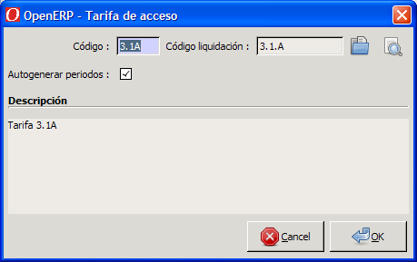

I després editar els períodes de la tarifa dins de la finestra “Potencies”
indicant la potència contractada en cada període.

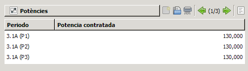

## Llistats de facturació:

Els llistats resum de facturació mensuals es troben en l'apartat:
**Facturació > General > Informes de facturació > Informes resum facturació**.

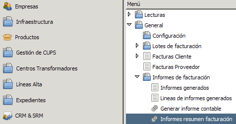

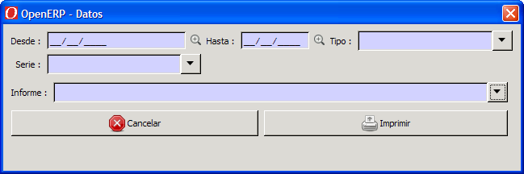

* Des de / Fins a: Indica l'intèrval de data de factura entre els que filtrarà
  el llistat ambdues incloses.

* Tipus: Pot escollir-se entre Mensuals, Bimestrals o Totes

* Serie: En el desplegable apareixen totes les sèries que es poden
  sel·leccionar. En el caso de facturació de energía s'han de seleccionar:
  Seqüència F. Energia, Seqüència F. Energia Abonada o
  Seqüència F. Energia Rectificadora.

* Informes: En aquest desplegable es poden sel·leccionar les diferents formes
  de resums i agrupacions segons convingui.

## Certificat de consums

Aquest informe mostra el consum de totes les factures d'una pólissa concreta
en un període de temps determinat.

Per tal d'imprimir el certificat de relació de consums s'ha d'anar a l'apartat:
**Facturació > General > Informes de facturació > Relació de consums**.

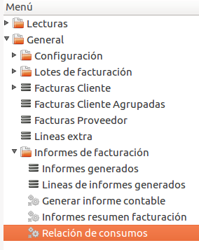

* És necessari introduir un número de pólissa i dues dates per tal d'indicar
quin període temporal ens interessa.

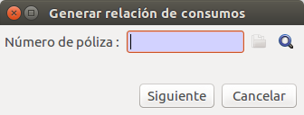

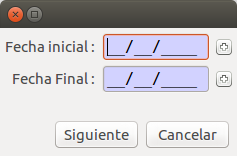

## Exportació factures F1

Per exportar les factures generades en format XML F1 per enviar a les
comercialitzadores hem de fer servir l'assistent accessible des del formulari
del lot de facturació, amb el botó _Exportar factures XML_.

### Exportació de la facturació d'un període

Si volem exportar totes les factures d'una comercialitzadora (o de totes) que
s'han generat a partir d'un lot de facturació, accedirem al lot que volguem, i
al seu formulari trobarem a la columna de la dreta, el botó d'_Exportar
factures XML_, que ens obrirà un assistent.

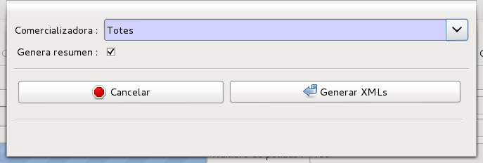

Aquest assistent ens demanarà de quina comercialitzadora volem exportar les
factures, mostrant un desplegable amb les diferents comercialitzadores
facturades en aquest lot. També hi ha l'opció d'exportar-les totes.

Addicionalment, es pot demanar el resum de les factures generades marcant aquesta
opció en l'assistent.

El resultat d'aquest assistent serà un fitxer `.zip`. Si s'han seleccionat
totes les comercialitzadores, contindrà un fitxer `.zip` per cada
comercialitzadora amb les seves factures. Si només se n'ha seleccionat una, les
factures `.xml` de la comercialitzadora seleccionada.

Si s'ha seleccionat la opció de resum es generarà un fitxer CSV `.txt` amb
les dades de totes les factures que s'inclouen en l'XML ordenades per
comercialitzadora.

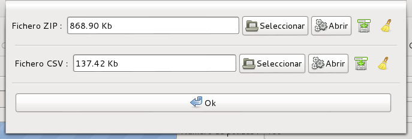

### Exportació manual de factures

També hi ha la opció d'exportar una o múltiples factures seleccionades manualment.

Per exportar només una factura, obrirem la factura que volguem exportar i executarem
l'assistent anomenat _Exportar factura XML_ que trobarem a la columna dreta de la
finestra de la factura.

El resultat d'aquest assistent és un arxiu `.xml` amb la factura en format F1.

Si volem exportar mes d'una factura, podem seleccionar-les en el llistat i
pŕemer el botó _Acció_ i la opció _Exportar factura XML_. El fitxer generat
contrindrà els fitxers `.xml` seguint la mateixa lògica que quan s'exporta
tot un lot (`.zip` o `.xml`) en funció de les comercialitzadores de les
factures generades.

En ambdós casos, es pot generar el CSV resum seleccionant la opció corresponent.

## Facturació amb IESE a distribuidora

Al instal·lar el mòdul de facturació amb IESE a distribuidora haurem de fer ús
de les posicions fiscals, així es passarà a per defecte a cobrar a tothom l'IESE
a no ser que li diguem que forma part de la posició fiscal "Comercialitzadora",
on després aquest impost desapareix.

### Donar d'alta una comercialitzadora per no facturar IESE

Per donar d'alta una comercialitzadora nova ho haurem de fer a través del menú
**Empreses > Empreses > Nova empresa**

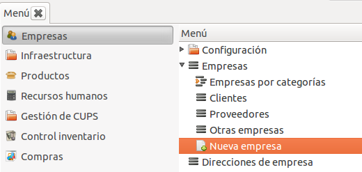

Els camps més importants a emplenar són:

* **Nom**: Nom de la comercialitzadora
* **Codi**: Codi de REE per aquesta comercialitzadora. Després s'utilitzarà en
  fitxers de perfils que s'entreguen a REE.
* **Posició fiscal**: Ens hem d'assegurar de que sigui una posició fiscal del
  tipus "Comercialitzadora". Per això ens assegurem que triem la que posi
  "Régimen nacional YYYY (Comercializadora)" on YYYY és el valor més gran.

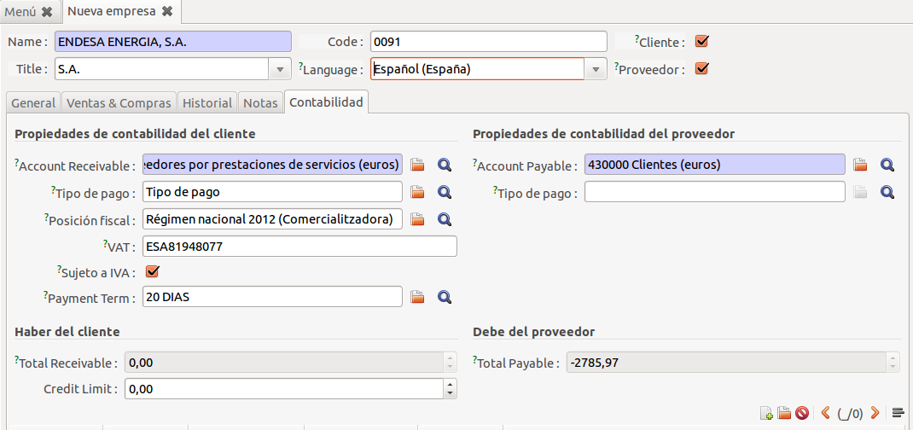

!!! note
    El camp **Posició fiscal** s'utilitza pel cas que a qui vagi destinada
    la factura sigui una comercialitzadora, no se li aplicarà l'IESE, en
    canvi si la factura va a un client final se li aplicarà l'IESE encara
    que siguem una distribuidora.
