# Módulo de Contratación

Dentro de la ficha de la póliza existe la pestaña “Contratación”. En ella se hace todo el proceso para generar una factura de conceptos.

Existen tres diarios para la facturación de contratos:
Facturas contratación.
Facturas contratación Abono.
Facturas contratación Rectificadora.

Cada uno de ellos tiene su propia secuencia que puede personalizarse desde el menú Administración / Configuración / Secuencias.

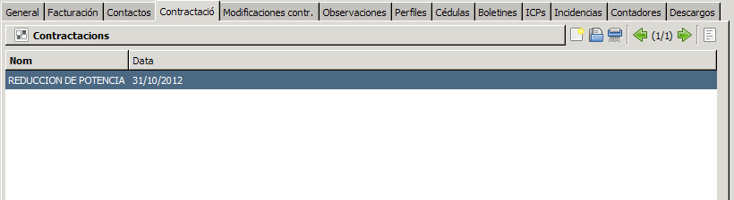

Al instalar el módulo de contratación se instalan también los productos y precios indicados en BOE. La compañía puede crearse una nueva categoría para productos y precios propios.

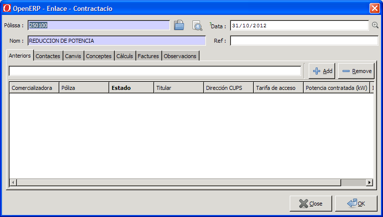

Como punto inicial se debe indicar que las pestañas están puestas en el orden en el cual se deben consultar o ir rellenando.

En la cabecera aparecen 4 campos:

* **Póliza**: esta se rellena automáticamente con la póliza en la que se inicia el proceso de la factura de contratación.
* **Fecha**: La fecha es muy importante por que se utiliza para calcular los precios, que son función del numero de días.
* **Nombre**: El nombre se usa como diferenciador de la contratación en el caso de haber más de una para la misma póliza. Se puede indicar "Modificación", "Alta nueva", "Cambio de titular" “Reducción de potencia”, por ejemplo.
* **Referencia**: La referencia es un campo informativo que permite codificar las facturas, de forma interna (poner referencias externas para usos informativo).

#### Anteriores

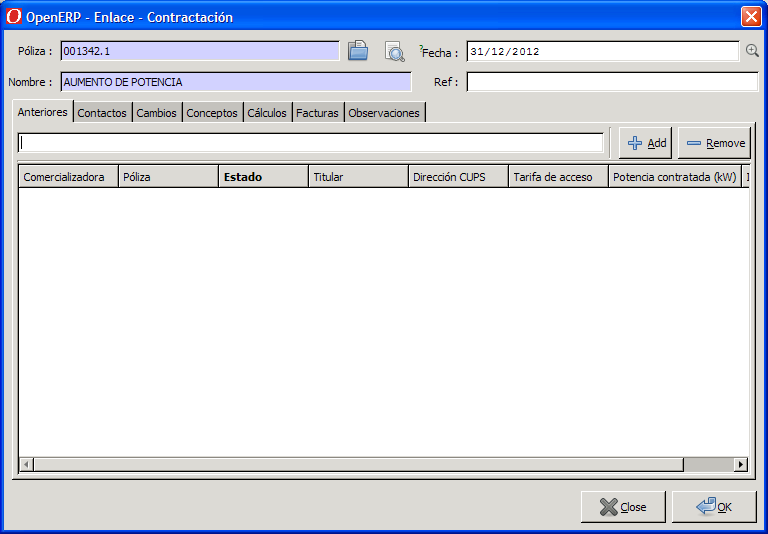

En la pestaña de anteriores, se puede añadir la póliza o pólizas desde las que proviene esta póliza. Puede quedar en blanco en el caso de altas nuevas, tener una en el caso de cambios de titular, o varias en el caso de unificaciones de suministros.
La suma de las potencias se usa para hacer el cálculo diferencial de la potencia resultante para hacer el cálculo de algunos conceptos. Algunos conceptos se calculan siempre por el total de la potencia a contratar y otras por la diferencia.

#### Contactos

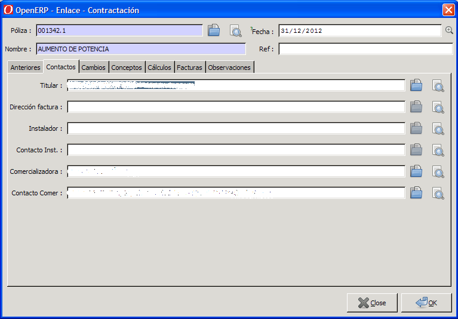

En la pestaña de contactos se ponen diferentes datos para hacer las facturas posteriormente o generar el informe para el instalador.
Titular, y los datos de la comercializadora se alimentan automáticamente de los datos de la póliza aunque se pueden cambiar. (puede pasar que de una póliza hayamos de sacar dos contrataciones, cada una con las facturas a diferentes nombres).
El campo “dirección factura” es obligatorio si la factura se hace al titular, ya que éste es requerido al crear una factura.
Si la factura se emite a la comercializadora el campo obligatorio es “Contacto comer” .
Los datos del instalador son opcionales.

#### Cambios

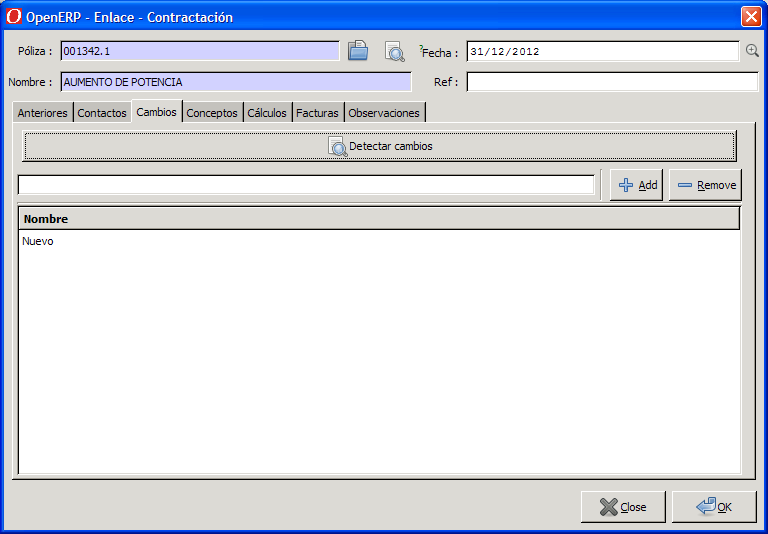

En la pestaña de cambios, si se pulsa el botón "detectar cambios" se detectan cambios de titular, tensión o potencia entre la póliza actual y las anteriores.
Se pueden añadir, si se desea, más cambios manualmente. Los cambios previstos son: Cambio de Titular, de potencia, de tensión, Otros o nuevo.

#### Conceptos

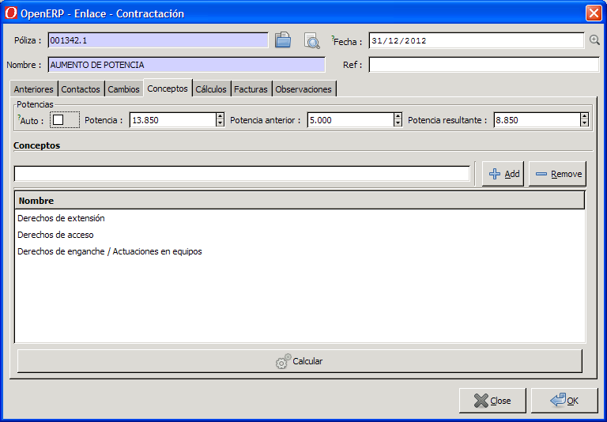

En el apartado Potencia, si está marcada la casilla auto, hace el cálculo de la diferencia entre la potencia de la póliza actual y las anteriores.
Si se desmarca esta casilla, se pueden introducir los datos de potencia actual y anterior manualmente y el programa calcula la diferencia.
En la ventana Conceptos, se pueden añadir manualmente los conceptos que se le desea cobrar.
El botón de Calcular, genera las líneas de los conceptos a cobrar que podemos encontrar a siguiente pestaña, Cálculos.
Cada vez que le damos a calcular, se recalculan todas las líneas marcadas como "auto" dentro de la pestaña Cálculos.
Las líneas manuales no se recalculan.

#### Cálculos

Dentro de la pestaña Cálculos, las líneas que tienen marcado el checkbox “auto” indica que se han calculado automáticamente.
Podemos dar de alta más líneas manualmente para añadir conceptos extra fuera de la contratación habitual.
Una vez generadas todas las líneas se puede imprimir el informe para el instalador pulsando el botón “Informe”.

Generar las facturas: Al pulsar este botón se genera/n la/s factura/s a partir de las líneas de la pestaña Cálculos.

!!! Info "Nota"
    Los diferentes conceptos, van asociados a un tipo de concepto, y éste a un diario de facturación. Los conceptos se pueden asociar a diferentes tipos (por defecto todos están a un solo tipo), y de esta forma generar varias facturas, una por cada tipo.

Esto se puede configurar dentro del menú Gestión de pólizas/ Configuración / contratación/Conceptos. En algún caso cada contratación puede generar 3 facturas diferentes.

Facturar a comercializadora: Si se marca esta opción se genera la/s factura/s a nombre de la comercializadora, y ésta ya repercutirá el coste al cliente.

#### Facturas

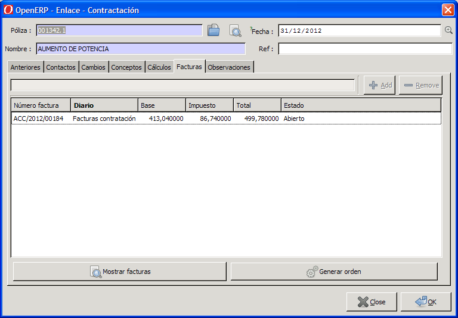

En esta pestaña, quedan enlazadas las facturas que se han generado por esta contratación. Así mismo se puede ver, si ya están cobradas, el estado en que se encuentran, etc...

Si una vez realizado todo el proceso, y generadas las facturas, se detectan errores, no se pueden recalcular las líneas de la contratación.
Para recalcular de nuevo la contratación primero se deben borrar las facturas y después ya se podrá recalcular todo de nuevo. ( véase como borrar facturas dependiendo del estado en que se encuentren).

Si se desea ver todas las facturas de contratación se pueden ver desde Facturación/ General/ Facturas cliente y filtrar por Tipo de Factura / Derechos de contratación.

Mostrar facturas: Este botón lista la/s factura/s en una nueva pestaña de GISCE_ERP.

Generar orden: Este botón genera una orden de trabajo en el CRM para llevar a cabo los trabajos que conlleve esta factura de contratación.

Facturas de Abono y rectificadoras.

El proceso para realizar las facturas de abono con o sin rectificadora se hace como las de abono con o sin rectificadora de energía.
Las facturas de contratación de abono van a al diario Facturas contratación Abono.
Las facturas de contratación rectificadoras van al diario Facturas contratación Rectificadora.

Cada una de ellas tiene su propia secuencia que se puede ver en el apartado Administración/ Configuración/ secuencias/ secuencias.

#### Observaciones

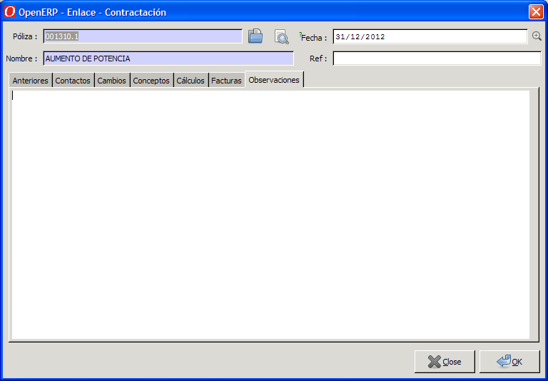

En este apartado se anotaran todas las observaciones sobre la contratación,
( Si existieran derechos de extensión, justificación de los valores facturados, etc.)

**Impresión de facturas de contratación**:

Existe un formato de impresión llamado “Factura genérica” que imprime una factura con encabezamiento personalizable.

Para que el informe de la factura de contratos en pdf tenga el encabezado correcto cada empresa se debe:

1. Ir a Menu/Administración/Usuarios/Arbol de la compañía/ compañías
Entrar en la compañía y en la pestaña **Información general** debe rellenarse los campos **Cabecera del informe** y **pie de pagina 1 de los informes**.
Estos dos textos aparecerán en la parte superior de la factura debajo del nombre de la Empresa.

2. En la factura: El campo **Información adicional** de la pestaña Información adicional de la factura se incluirá en el texto de la factura.

3. En el caso que el pago sea por transferencia debe crearse, si no existe, en la compañía una cuenta corriente marcándola como "por defecto" para que aparezca en la parte inferior del informe de la factura .pdf de la factura. Si no aparecerá "null"

Facturas generales de servicios.

Las menu las empresas deben realizar facturas de trabajos o servicios ofrecidos a sus clientes ( Trabajos de construcción de líneas, reparaciones, etc). Estas facturas se realizan desde:

* **Lista de todas las facturas de derechos de contratación.**

    Para ver un listado completo de las facturas de “Derechos de contratación” se debe hacer desde
    “Facturación/ General / Facturas cliente”
    y filtrar por Tipo de factura: “ Facturas Contratación”

* **Control del pago de facturas.**

    Las facturas una vez emitidas están en estado abierto.
    Para realizar el pago de una o varias factura/s se debe hacer siguiendo el proceso que se indica.

    1. Seleccionar la/s facturas que se desean dar por pagadas, usando los filtros de la lista.
    Si no se resalta ninguna de las facturas de la lista se pagaran todas las facturas de la lista. Si dentro de la lista se hace una selección resaltando algunas de ellas en azul solo se darán por pagadas las resaltadas.

    2. Una vez listada/s la/s factura que se desean dar por pagadas. Se debe pulsar el botón “Acción” y escoger la opción “Pagar grupo de facturas”. En el caso que se desee hacer el pago de una sola factura puede realizarse desde la propia factura pulsando bien el botón “Pagar factura” o bien desde el botón “Acción” “Pagar factura”.
    3. El estado de una factura antes de ser pagada es “Abierto”. Una vez se ha pagado se realizan, de forma automática, los asientos contables necesarios para conciliar los asientos. La factura pasa entonces al estado “ Realizado” y la casilla “Pagado/Conciliado:” aparece marcada. Esto indica que los asientos de la factura han sido conciliados con los asientos del pago/s.

### Assistent per a la reconnexió de pòlisses i generació de factures de reconnexió

Aquest assistent serà llençat en premer el botó `Activar` dins una pòlissa en estat de **tall**.

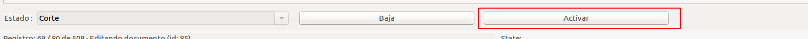

#### Reconnectar una pòlissa

A la primera pantalla mostrarà un missatge amb el número de pòlissa sobre la que procedirem a realitzar la reconnexió.

La casella de selecció amb el missatge **Generar factura de reconnexió** permet
sel·leccionar si a més de la reconnexió, es vol generar una factura de
reconnexió.

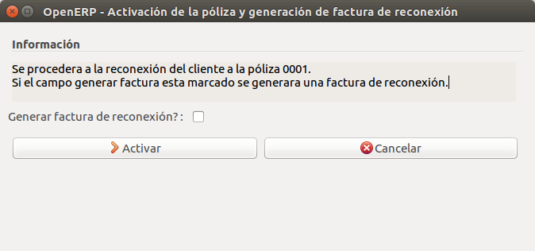

En el cas d'haver seleccionat el requadre, demanarà una data per la
generació de la factura.

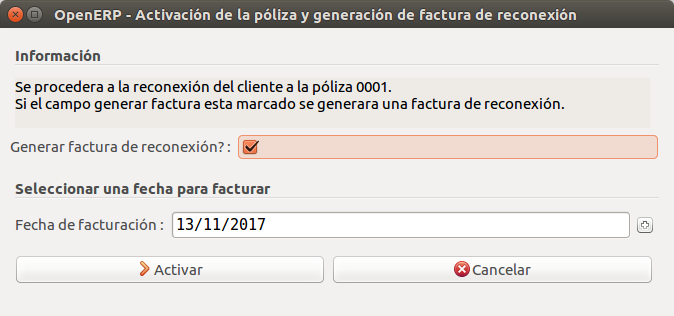

Finalment mostrarà un missatge de confirmació en el qual s'haurà de prèmer
el botó `Ok` per continuar.

Si anteriorment s'havia marcat la casella donara la opció de mostrar la
factura generada altrament es tancarà l'assistent i la pòlissa ja estarà reconnectada.

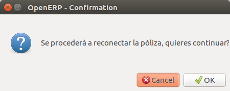

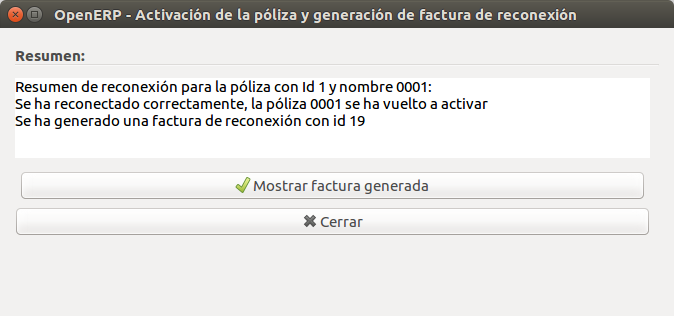

### Assistent per llistar pòlisses sense contractacions (sense facturació de drets)

Aquest assistent permet llistar totes les pòlisses que no tenen cap contractació.

#### Llistar pòlisses sense contractacions

L'assistent el podem localitzar en el menú genèric de pòlisses, en el botó
**Contractes sense facturació de drets**.

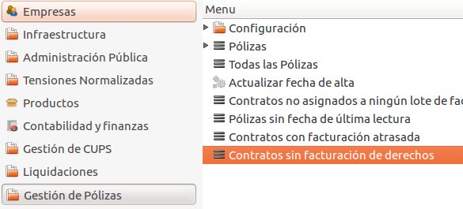

Ens llistarà totes les pòlisses que no tinguin contractacions.

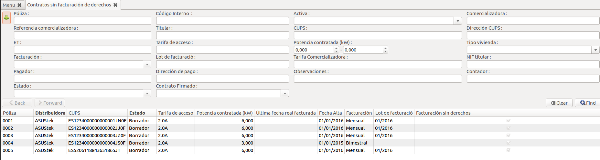
