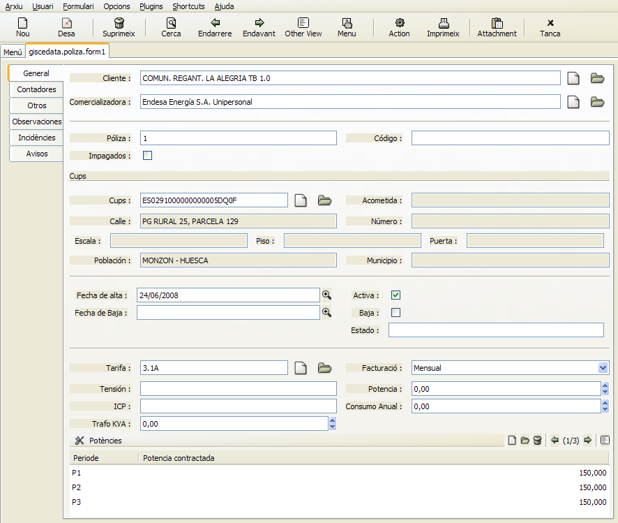
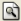
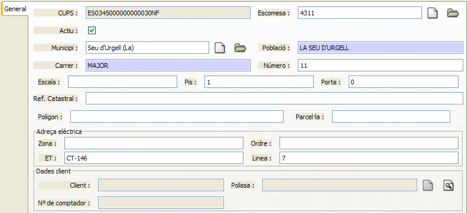
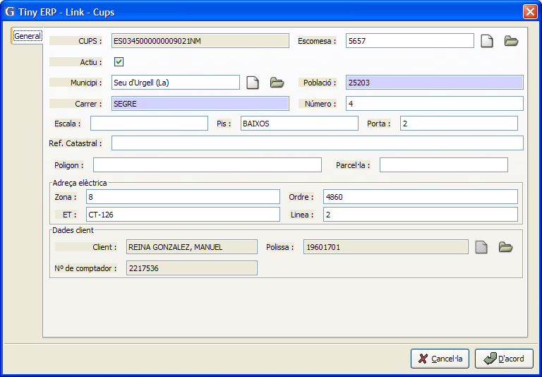
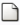
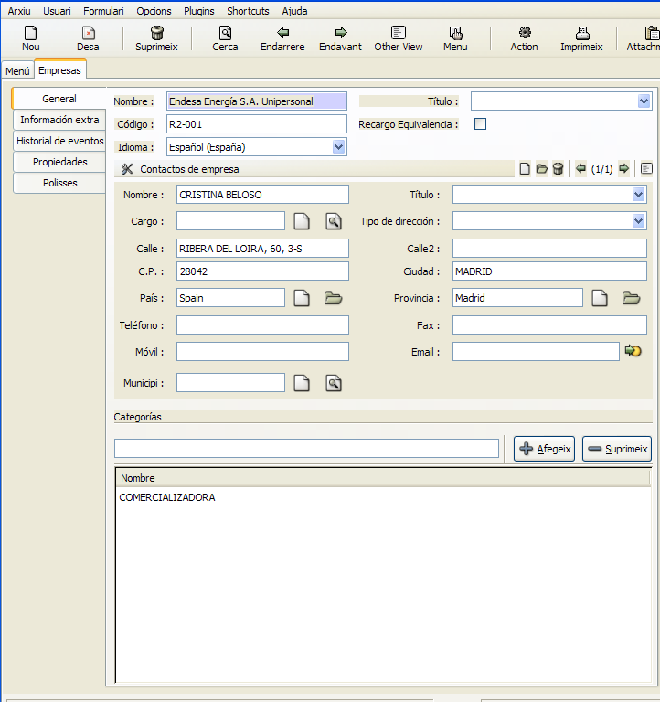

# Fitxa d'una pòlissa

* Client: En aquest camp es buscarà un client del model “empreses”, s'accedeix
  des de **Menú > empreses > empreses**. Apareixen totes les dades del client.
* Comercializadora: Es seleccionarà en el model de “empreses” que es trobin
  en la categoria de “comercializadores” i es seleccionarà la comercializadora
  d'aquest punt de subministrament.
* Pòlissa: en aquest camp s'indicarà el número de la pòlissa del nou client.
* Codi: Camp opcional on es pot indicar un codi del client.

## CUPS

En aquest apartat s'introduiràn les dades del punt de suministro al que es
conecta la nova pòlissa. Pot tractar-se d'un CUPS ja existent o bé
d'un CUPS de nova creació.

Si es trata d'un CUPS existent: es procedeix de la següent forma:

1. Amb la lupa  es sel·lecciona
   el CUPS al que es va a connectar la nova pòlissa.
2. Per localitzar el punt de subministre es poden utilitzar els camps de
   la parte superior de la llista de CUPS per filtrar i localitzar
   la direcció del CUPS.

Aquesta es la fitxa d'un CUPS que està pendent d'associar a un contracte.

Aquesta es la fitxa d'un CUPS associat a un contracte.

Si s'ha de crear un nou CUPS es realitzarà prement el botó 
al costat del camp CUPS o bé accedient a la fitxa de CUPS des del menú “Menu/Ges

Alta d'una comercializadora: Per crear una comercializadora s'ha d'accedir
al menú **Menú > empreses > empreses**, i crear una nova fitxa i asignar-li
la categoria de “comercializadora”.

## Fitxa d'una comercializadora:

En la fitxa de la comercializadora s'ha d'indicar el codi de la
comercializadora i en l'apartat de categories s'ha d'afegir-les a la categoria
de “COMERCIALIZADORA”. Totes les empreses d'aquesta categoria poden escollir-se
como comercializadora d'un punt de subministrament.

