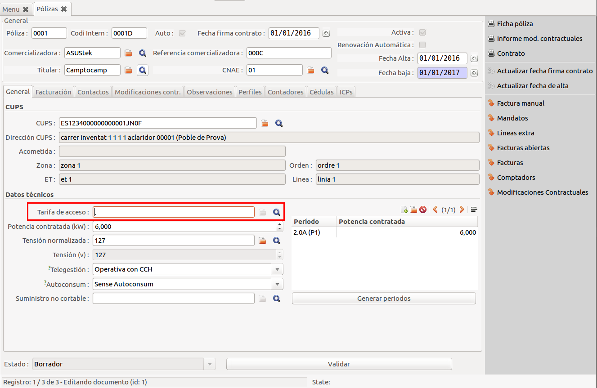

# Facturació de Règim especial

## Creació d'un contracte

Quan es dona d'alta una pòlissa de **Règim especial** hem de seleccionar la
tarifa d'accés que li toca.

Hi ha dues tarifes disponibles:

* Tarifa RE (tipo 3 i 5) RE
* Tarifa RE (tipo 1 i 2) RE12

Si escollim la tarifa **RE** podrem seleccionar el període de facturació
**Anual** en la pestanya **Facturació**

Això el que ens farà és moure la pòlissa en els lots de facturació, segons
haguem indicat.

!!! note
    En el cas que tinguem **facturació anual**, abans de validar la factura per
    tal d'assignar-hi número, s'haurà d'assegurar que existeix el lot de facturació
    del següent any.

## Preus que apliquen

Els preus a aplicar s'actualitzaran amb noves versións del programari a mesura
que surtin els nous preus al BOE corresponent.

S'ha de seleccionar la tarifa de preus: **TARIFAS GENERACIÓN (EUR)** a la pestanya
**Facturación**

## Liquidació CNMC

Les factures de pòlisses de Règim especial funcionen de la mateixa forma que la
resta de factures. Tenen un **període de Liquidaci CNMC** en el qual es liquidaran
els valors d'aquesta factura.

* La tarifa RE liquida amb el codi de CNMC: **603**
* La tarifa RE12 liquida amb el codi de CNMC: **602**

Més informació com generar les liquidacions a la pàgina [liquidació de peatges](liquidacion_peajes)
