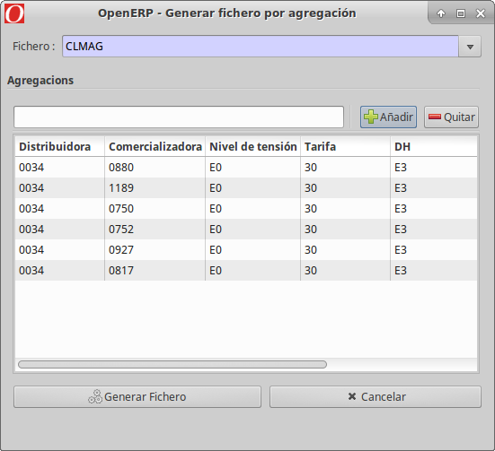
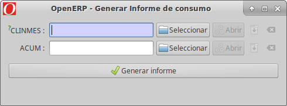

# Eines per al tractament de fitxers de mesures

Algunes eines ens ajuden i fan més fácil el tractament de fitxers d'intercanvi
de mesures. A continuació es nombren i s'en descriuen els detalls:

## Generar fitxer per Agregació

Sovint pot ser útil generar un fitxer amb només una o varies agregacions, i així
no haver de generar-lo per totes, amb el temps d'espera que comportaría.
El següent asistent, permet generar CLMAG, CLMAG5A o CLINME per una o varies
agregacions. Per utilitzar-lo, cal anar al període de mesures concret i
utilitzar l'assistent: "Generar fitxer per agregació". Cal primer triar el tipus
de fitxer que es vol generar, i després afegir-hi l'agregació o agregacions que
es desitjin. Aixó pot anar bé per respondre possibles objeccions que ens posi la
comercialitzadora.

!!! Info "Nota"
    Al triar el tipus de fitxer, només es mostren les agregacions segons el
    tipus que processa aquest fitxer. P.ex: Al seleccionar CLMAG5A, només
    apareixen les tipus 5.

El fitxer es generará en **segon pla**, i s'inclourá com **adjunt en el propi
període de mesures**.

## Informe de consums

En el menú **Mesures REE > Utilitats > Generar informde de consums**, es genera
un full de cálcul amb els consums agregats per tarifa. Per fer-ho, cal importar
els CLINMEs i l'ACUM. Aquest últim s'utilitza per les tarifes 6.1 que van
desagregades.

## Casos de mesures

Durant la generació dels fitxers de mesures, es pot detectar que falten consums
en algun punt concret. Si és així, es crea un cas indicant-ne l'orígen de dades
i el punt.

## Casos de perfilació

Al perfilar, es fan una série de validacions. Si alguna d'aquestes no es compleix,
s'obre un cas. Entre aquestes hi ha per exemple:

* Consum perfilat no coincideix amb el facturat
* Consum negatiu
* Anuladora no troba consum perfilat per anular
* El consum no superi el máxim teóric ((poténcia * 1000) * n_dies)
