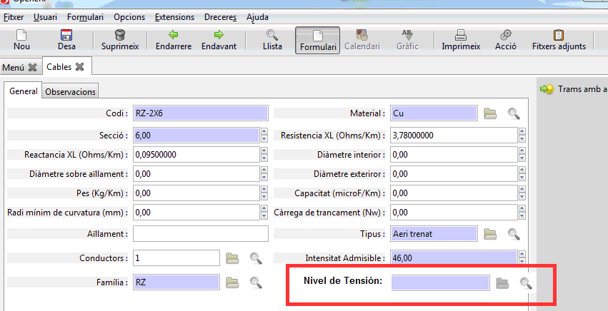
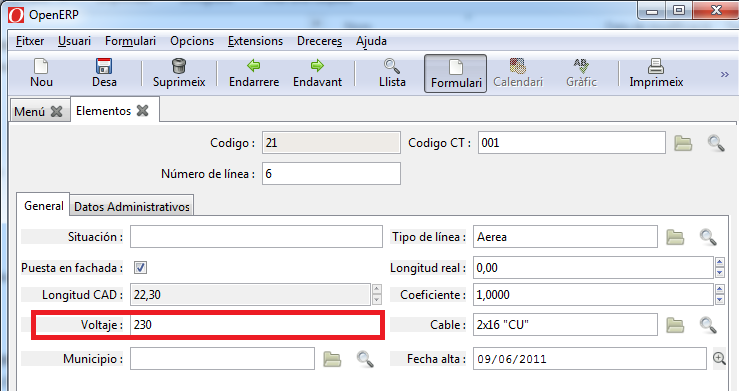
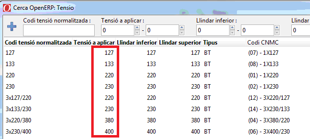
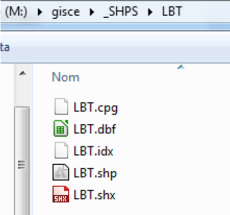

# Documentació del mòdul de Baixa Tensió

## Introducció

El mòdul de baixa tensió ens permet inventariar els elements o línies de baixa
tensió

## Crear un nou element de Baixa Tensió

Per crear un nou Element de Baixa Tensió ho podem fer a través del llistat de
tots els elements BT i després apretar el botó de **Nou**, igual que es fa amb
la resta de registres de l'ERP.

Ens apareixerà un formulari on podem visualitzar una capçalera i diferents
parts:

  * General
  * Dades Administratives

En l'apartat de **Dades Administratives** tenim els camps:

  * **Propietari**: Per indicar si som propietaris o no.
  * **% pagat per la compañia**: Per indicar quin percentatge ha pagat l'empresa
    per aquest element.
  * **Bloquejar APM**: Permet fixar a una data concreta la *Data APM*. D'aquesta
    forma es permet posar-hi una data fixa i que no es sobreescrigui
    automàticament tal com s'explica a *Data APM*
  * **Data APM**: En quina data es va posar en marxa. Aquest camp
    s'actualitza sol segons la data d'autorització més gran dels expedients
    associats si no es marca el camp *Bloquejar APM*. En aquest cas es pot posar
    una data arbritària.
  * **Actiu**: Per marcar si aquest element està actiu o no. En el cas que no
    estigui activa, no ens apareixerà al llistat a no ser que li diguem
    explícitament que volem veure els elements no actius.
  * **Cedida**: Marcat si la instal·lació ha estat cedida a la nostra empresa
  * **Baixa**: Per marcar si aquest element està de baixa.
  * **Data de baixa**: Per indicar en quina data es va donar de baixa l'element.
    Aquest camp només és visible quan el camp *Baixa* està activat.
  * **Obres**: Amb quines obres relacionem aquest element.
  * **Expedients**: Amb quins expedients relacionem aquest element.

## Calcul del voltatge

El voltatge de un Element de Baixa tensió es calcula de la seguent manera:

Si el cable del element de baixa tensió te assignat un nivell tensió 
s'aplicara la "tensió a aplicar" del nivell de tensió assignat.
  
  
  

Altrement s'aplicara el que que marca cuadre de baixa tensió del centre transformador.

!!!Note "Valor del voltatge"
    El camp tensió no es un camp obligatori , pot estar en blanc, buit.
   
## Mètode d'actualització de tipus de línia BT

* 1 tensada sobre poste (1 circuit)
* 4 recolzada sobre façana (1 circuit)
* 7 subterrània (1 circuit)

![Captura de la seleccio del tipus en el ERP]
(_static/lbt/captura_tipus_linia_bt.png)

El procés de càlcul actualitzarà els camps del model de línies BT següents:

**_Tipus de línia_**: aèria o subterrània
línies aèries: **_Posada en façana_**: Si / NO

1. Es genera un fitxer shape lbt.shp des de l’AutoCAD Map amb les noves
   **_eines del G-SHAPE_** del procés d’actualització del nou GIS v3.
   El fitxer shape conté el codi (ID) de cada tram de linia BT i el
   tipus de línia amb que està dibuixat (**_TRAZOS o Continuous_**)

2. Preparar un fitxer ZIP amb els shapes de LBT. **_LBT.zip_**
   i carregar-lo al ERP (NOTA 3)

3. Importar el fitxer **_lbt.shp_** en el ERP com a un procés
   més de l’actualització, des del menú del ERP (NOTA 4)

**1r Criteri** per determinar si la línia es aèria o subterrània:

* Subterrània: si la línia està dibuixada amb tipus de línia **TRAZOS**,
  a totes els posarà 4a posició CINI 7
* Aèria: La línia està dibuixada amb tipus de línia **Continuous**,
  a totes els posarà 4a posició CINI 1

**2n Criteri** per determinar si una línia aèria es
“**Tensada sobre postes**” o “**apoyada sobre fachada**”:

* Si un node de línia està en un radi de 0,55m (NOTA 2) al voltant del punt
  d’inserció d’un suport (NOTA 1), el tram es considera:
  “**Tensada sobre poste**”.
* La resta de trams es consideren de façana i per tant es marcarà
  el camp: “**Puesta sobre fachada**” del ERP i la 4a posició
  del CINI es canviarà a 4.

**NOTES ACLARÀTORIES:**

!!! Info "Nota"
    **NOTA 1. Sel·lecció dels suports**

    Es tindran en compte tots els suports **tan de AT com de BT**, sempre i
    quan siguin del tipus PM\*, PF\*, POR\*, JB\*, PONTS_OBERTS.
    **Es consideraran també com a poste els SM i SM1**, ja que no queden
    grapats en façana.
    Agafem els de AT, per quan hi hagi linies de BT en suport compartit amb AT

    Els TUB no els considerem suports.
    _En la versió 1, els SM, SM1 i TUB no els consideràvem suports._

!!! Info "Nota"
    **NOTA 2. Selecció de LBT “Tensada sobre poste”**

    Es considera "**Tensada sobre poste**" les línies de tipusLinia Aeri i que
    tinguin un node (inici o final de línia) **a menys de 1.1m**
    (_abans era 0.55m_) del punt d’inserció d’un suport dels esmentats
    en l’apartat anterior.

    ![Esquema visual de tensada sobre poste]
    (_static/lbt/esquema_tensada_sobre_poste.png)

    En cas que no es doni la condició anterior s’assignara com a cable en façana

!!! Info "Nota"
    **NOTA 3. Com carregar el SHAPE en el ERP**

    Al menú de GIS > Carregador de fitxers SHP LAT i LBT
    per carregar els ZIPs sempre hi ha d’haver el de LBT i el de LAT

    ![Mostra carrega de fitxers shp utilitzant el ERP]
    (_static/lbt/carrega_fitxers_shp.png)

!!! Info "Nota"
    **NOTA 4. Com actualitzar el tipus de línia en el ERP**

    Al menú de GIS > Assignar tipus LBT

    ![Execució de l'acció d'assignar tipus LBT des del ERP]
    (_static/lbt/assignar_tipus_lbt.png)

    Aquest assistent recalcularà el tipus de línia de LBT

    ![Execució del wizard per realitzar l'acció d'assignar el tipus LBT del ERP]
    (_static/lbt/wizard_assignar_tipus.png)

    Aquest procés actualitzarà automàticament els camps:
    **Tipus de línia**: aèria o subterrània
    marcarà el camp **Posada en façana**: Si / NO

**DECISIONS:**

**1. El cable d’embarrat ha de ser considerat Aeri o subterrani?**

En el dibuix està dibuixat com a Continuo, i fins ara l’hem considerat aeri i de façana.

**2. El cable indefinit ha de ser considerat Aeri o subterrani?**

En el dibuix està com a Continuo, així que de moment es considera aeri i el tipus aeri/façana depèn de on estigui posat.

!!! Info "Nota"
    Els trams de AT, no es recalculen amb el Shape del GIS, tal com es fa en BT,
    ja que les dades s’agafen de les dades entrades en el ERP.

    Si això es vol canviar, hem de tenir en compte que les línies
    de AT subterrànies tenen tipus línia CENTRO2.
