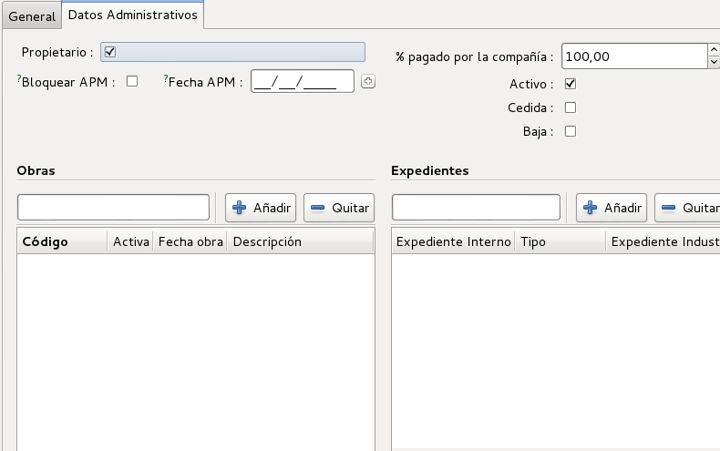

# Documentació del mòdul de Baixa Tensió

## Introducció

El mòdul de baixa tensió ens permet inventariar els elements o línies de baixa
tensió

## Crear un nou element de Baixa Tensió

Per crear un nou Element de Baixa Tensió ho podem fer a través del llistat de
tots els elements BT i després apretar el botó de **Nou**, igual que es fa amb
la resta de registres de l'ERP.

Ens apareixerà un formulari on podem visualitzar una capçalera i diferents
parts:

  * General
  * Dades Administratives

En l'apartat de **Dades Administratives** tenim els camps:

  * **Propietari**: Per indicar si som propietaris o no.
  * **% pagat per la compañia**: Per indicar quin percentatge ha pagat l'empresa
    per aquest element.
  * **Bloquejar APM**: Permet fixar a una data concreta la *Data APM*. D'aquesta
    forma es permet posar-hi una data fixa i que no es sobreescrigui
    automàticament tal com s'explica a *Data APM*
  * **Data APM**: En quina data es va posar en marxa. Aquest camp
    s'actualitza sol segons la data d'autorització més gran dels expedients
    associats si no es marca el camp *Bloquejar APM*. En aquest cas es pot posar
    una data arbritària.
  * **Actiu**: Per marcar si aquest element està actiu o no. En el cas que no
    estigui activa, no ens apareixerà al llistat a no ser que li diguem
    explícitament que volem veure els elements no actius.
  * **Cedida**: Marcat si la instal·lació ha estat cedida a la nostra empresa
  * **Baixa**: Per marcar si aquest element està de baixa.
  * **Data de baixa**: Per indicar en quina data es va donar de baixa l'element.
    Aquest camp només és visible quan el camp *Baixa* està activat.
  * **Obres**: Amb quines obres relacionem aquest element.
  * **Expedients**: Amb quins expedients relacionem aquest element.
