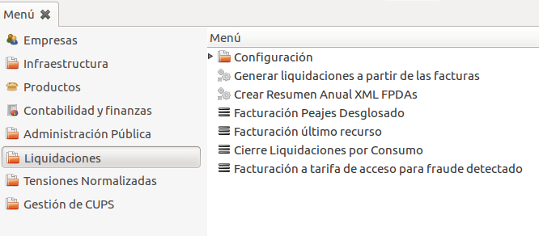
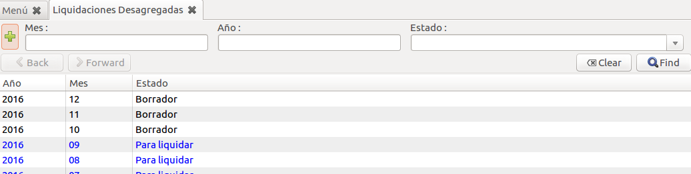
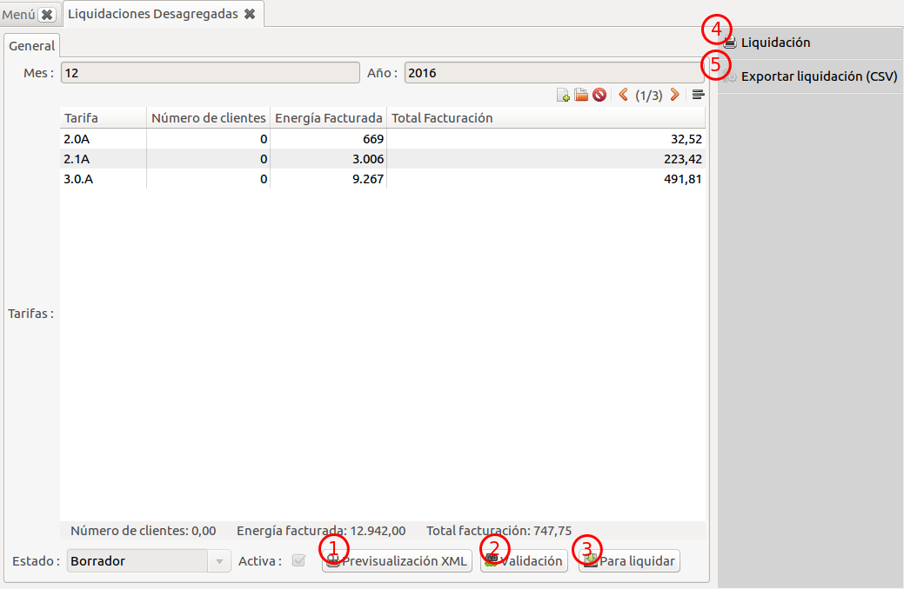
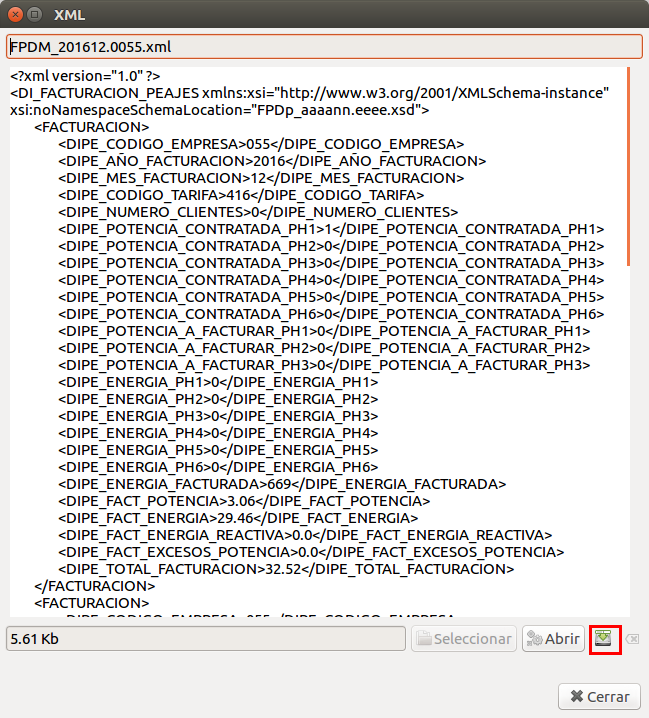
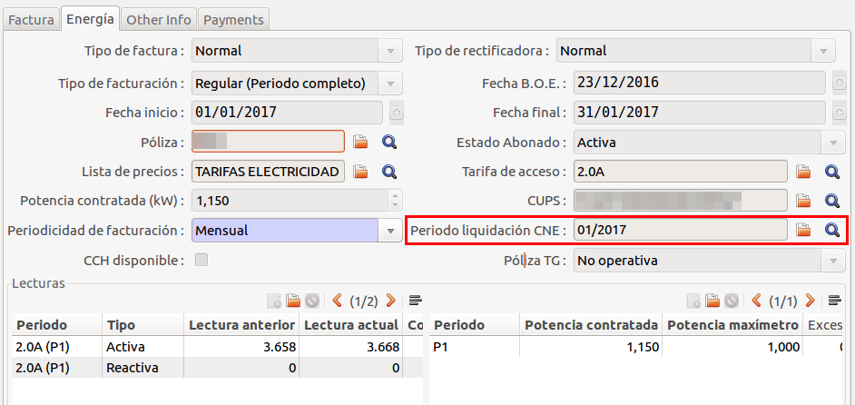
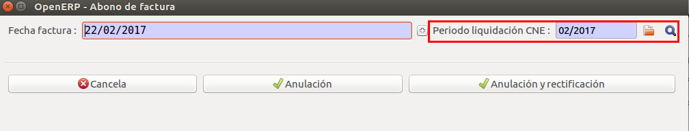
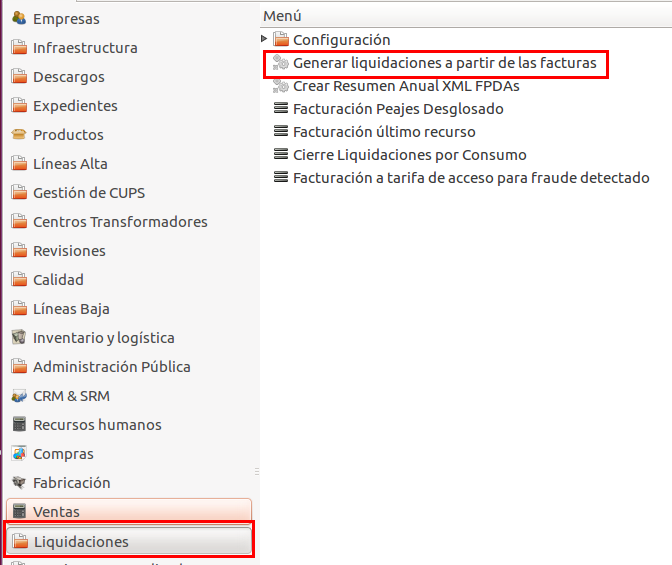
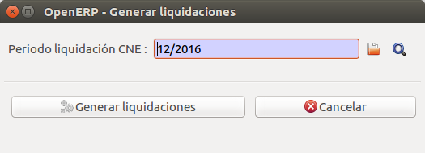
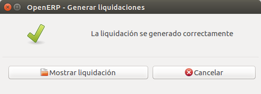

# Liquidació de peatges

El sistema suporta tots els sistemes de liquidació vigents:

* Facturació peatges desglosats
* Facturació últim recurs
* Tancament liquidacions per consum
* Facturació a tarifa d'accés per frau

A través del menú de **Liquidacions** podem llistar les diferents liquidacions.

!!!note
    L'únic sistema que es genera de forma automàtica és el de liquidació per
    facturació de peatges. Veure [Generar les liquidacions després de facturar](#generar-les-liquidacions-despres-de-facturar)

## Llistar liquidacions

Podem veure totes les liquidacions que tenim fetes, anant al menú general de **Liquidacions**
i apretant al sistema de liquidacions que volguem veure.

Per exemple: Les liquidacions de facturació per peatges

En el llistat podem veure totes les liquidacions que tinguem i filtrar per **mes**,
**any** i **estat** de la liquidació.

!!!note
    Al finalitzar l'any es generen totes les liquidacions en estat **esborrany**
    pel pròxim any, per tant ens sortirant totes les liquidacions encara que no
    tinguem facturat encara aquell període.

## Estats d'una liquidació

blockdiag {
  b[label = "Borrador"];
  l[label = "Para liquidar"];
  e[label = "Enviado"];
  c[label = "Cerrado"];
  r[label = "Rectificado"];
  co[label = "Corregido"];
  b -> l -> e -> c;
       l -> r -> co -> e;
       l -> r -> co -> e [folded];
}

## Formulari d'una liquidació

En el formulari d'una liquidació ens surt totes les tarifes que hem facturat amb
les seves corresponents quantitats: número de clients, energia facturada, euros
facturats, etc.

També podem fer vàries accions:

* **(1) Previsualitzar l'XML**: Ens servirà per generar l'XML que hem d'enviar a la CNMC
* **(2) Validació**: Ens passa les mateixes validacions que fa la CNMC
* **(3) Per liquidar**: Podem marcar la liquidació "Per liquidar" i així avançar en
  el [fluxograma d'estats d'una liquidació](#estats-duna-liquidacio)
* **(4) Informe de liquidació**: En el cas que no pugem directament l'XML podem generar
  aquest informe per tal d'entrar les dades.
* **(5) Exportar liquidació (CSV)**: Ens permet exportar en format CSV la liquidació

## Generar XML

Es pot generar l'XML des del formulari d'una liquidació amb el botó **Previsualitzar l'XML**.
Ens mostra l'XML que generarà i només hem d'apretar el botó resaltat a la següent captura de
pantalla:

## Relació factures amb el període de liquidació

Totes les factures d'energia de peatges, tenen un camp que vincula la factura amb
el **període de liquidació CNMC**

Aquest camp s'omple automàticament (si no es força amb un altre valor) al període
de liquidació vigent (dia 16 d'un mes fins al dia 15 del mes següent).

En el cas d'una factura anul·ladora/rectificadora. En el moment de generar-la ens
demanarà a quin període de liquidació la volem assignar.

## Generar les liquidacions després de facturar

Es pot trobar l'assistent per generar la liquidació a través del menú
**Liquidacions > Generar liquidacions a partir de les factures**

L'assistent ens demana quin període volem generar

Aquest asistent agafarà totes les factures que compleixin les següents condicions:

* Estiguin vinculades al diari **ENERGIA.X** (sigui normal, anul·ladora o rectificadora)
* Estiguin vinculades amb el **període de liquidació** que volem generar
* Tinguin l'estat **obert** o **pagat**

Un cop acabada l'agrupació de factures ens mostrarà que ja ha acabat la liquidació
i la podem veure apretant el botó **Mostrar liquidació**

!!!note
    Podem anar regenerant la liquidació tantes vegades com volguem mentres estigui
    en estat **esborrany** que ens confirmarà si volem tornar a generar.
