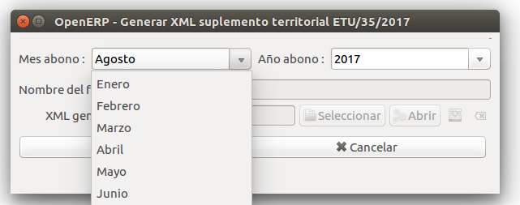
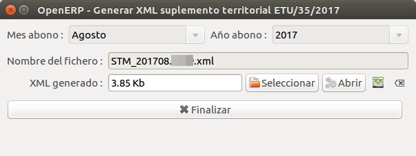

# Liquidació de peatges

El sistema suporta tots els sistemes de liquidació vigents:

* Facturació peatges desglosats
* Facturació últim recurs
* Tancament liquidacions per consum
* Facturació a tarifa d'accés per frau

A través del menú de **Liquidacions** podem llistar les diferents liquidacions.

!!!note
    L'únic sistema que es genera de forma automàtica és el de liquidació per
    facturació de peatges. Veure [Generar les liquidacions després de facturar](#generar-les-liquidacions-despres-de-facturar)

## Llistar liquidacions

Podem veure totes les liquidacions que tenim fetes, anant al menú general de **Liquidacions**
i apretant al sistema de liquidacions que volguem veure.

Per exemple: Les liquidacions de facturació per peatges

En el llistat podem veure totes les liquidacions que tinguem i filtrar per **mes**,
**any** i **estat** de la liquidació.

!!!note
    Al finalitzar l'any es generen totes les liquidacions en estat **esborrany**
    pel pròxim any, per tant ens sortirant totes les liquidacions encara que no
    tinguem facturat encara aquell període.

## Estats d'una liquidació

blockdiag {
  b[label = "Borrador"];
  l[label = "Para liquidar"];
  e[label = "Enviado"];
  c[label = "Cerrado"];
  r[label = "Rectificado"];
  co[label = "Corregido"];
  b -> l -> e -> c;
       l -> r -> co -> e;
       l -> r -> co -> e [folded];
}

## Formulari d'una liquidació

En el formulari d'una liquidació ens surt totes les tarifes que hem facturat amb
les seves corresponents quantitats: número de clients, energia facturada, euros
facturats, etc.

També podem fer vàries accions:

* **(1) Previsualitzar l'XML**: Ens servirà per generar l'XML que hem d'enviar a la CNMC
* **(2) Validació**: Ens passa les mateixes validacions que fa la CNMC
* **(3) Per liquidar**: Podem marcar la liquidació "Per liquidar" i així avançar en
  el [fluxograma d'estats d'una liquidació](#estats-duna-liquidacio)
* **(4) Informe de liquidació**: En el cas que no pugem directament l'XML podem generar
  aquest informe per tal d'entrar les dades.
* **(5) Exportar liquidació (CSV)**: Ens permet exportar en format CSV la liquidació

## Generar XML

Es pot generar l'XML des del formulari d'una liquidació amb el botó **Previsualitzar l'XML**.
Ens mostra l'XML que generarà i només hem d'apretar el botó resaltat a la següent captura de
pantalla:

## Relació factures amb el període de liquidació

Totes les factures d'energia de peatges, tenen un camp que vincula la factura amb
el **període de liquidació CNMC**

Aquest camp s'omple automàticament (si no es força amb un altre valor) al període
de liquidació vigent (dia 16 d'un mes fins al dia 15 del mes següent).

En el cas d'una factura anul·ladora/rectificadora. En el moment de generar-la ens
demanarà a quin període de liquidació la volem assignar.

## Generar les liquidacions després de facturar

Es pot trobar l'assistent per generar la liquidació a través del menú
**Liquidacions > Generar liquidacions a partir de les factures**

L'assistent ens demana quin període volem generar

Aquest asistent agafarà totes les factures que compleixin les següents condicions:

* Estiguin vinculades al diari **ENERGIA.X** (sigui normal, anul·ladora o rectificadora)
* Estiguin vinculades amb el **període de liquidació** que volem generar
* Tinguin l'estat **obert** o **pagat**

Un cop acabada l'agrupació de factures ens mostrarà que ja ha acabat la liquidació
i la podem veure apretant el botó **Mostrar liquidació**

!!!note
    Podem anar regenerant la liquidació tantes vegades com volguem mentres estigui
    en estat **esborrany** que ens confirmarà si volem tornar a generar.

## Generar Liquidacions Suplements Territorials ETU/35/2017

Al [BOE referent a la ETU/35/2017](https://www.boe.es/boe/dias/2017/01/26/pdfs/BOE-A-2017-810.pdf),
s'especifica que serà l'òrgan corresponent (CNMC) el que s'encarregarà de definir
i controlar els ingressos obtinguts per les distribuïdores per aquests regulaments.

Les liquidacions per als Suplements Territorials de la ETU/35/2017 es realitzen
mitjançant un fitxer separat a la resta de liquidacions per informar a la CNMC
únicament d'aquests suplements.

Aquests fitxers s'han de generar una vegada realitzades les factures amb les
regularitzacions dels Suplements Territorials.

Aquestes liquidacions consten de dos fitxers:

- Liquidacions Mensuals: s'han d'anomenar sota el format "STM\__aaaamm_._eeee_.xml"
    - S'han d'enviar mensualment, juntament amb els altres fitxers de liquidacions
- Liquidacions Anuals: s'han d'anomenar sota el format "STA\__aaaamm_._eeee_.xml"
    - S'ha d'enviar una sola vegada quan s'hagin cobrat totes les línies amb
      Suplement Territorial (aproximadament al setembre de 2018)

En el format utilitzat, s'utilitza la següent nomenclatura:

| Nomenclatura | Definició                                                                                                                           |
|:------------:|:------------------------------------------------------------------------------------------------------------------------------------|
|    _aaaa_    | Any corresponent a les liquidacions presentades en el fitxer, cas de les liquidacions anuals correspon a l'any d'entrega del fitxer |
|     _mm_     | Mes corresponent a les liquidacions presentades en el fitxer, cas de les liquidacions anuals correspon al mes d'entrega del fitxer  |
|    _eeee_    | Codi de l'empresa distribuïdora que presenta el fitxer                                                                              |

Aquest mòdul ens facilita dos assistents diferents, un per les liquidacions Mensuals
i un per les liquidacions Anuals. Podem trobar els assistents en l'ERP en la direcció
"**Menú > Liquidacions**"

### Liquidacions Mensuals ETU/35/2017

!!! Note "Fitxer de Referència"
    Aquestes liquidacions es basen en el fitxer "_Especificaciones para el envio
    de información relativo al fichero de suplementos territoriales mensual
    (Grupo BC)_" per a distribuidores en la versió 1.0 compartit per la CNMC
    mitjançant la circular 168-17.

Aquestes liquidacions s'han de generar una vegada generades totes les factures
amb els Suplements Territorials del mes corresponent, de la mateixa manera que es
liquida l'energia facturada (abans del dia 15 del mes).

Utilitzant l'assistent "_Generar XML suplement territorial ETU/35/2017 mensual_",
s'ha de seleccionar el mes a liquidar. Per tal d'ajustar correctament aquest valor,
cal escollir el mes i l'any en els camps de selecció corresponents.

Una vegada sel·leccionat el mes adequat es prem el botó "_Crear_" i es
generarà el fitxer XML amb el format especificat per la CNMC.

Una vegada generat, els camps "Nom del Fitxer" i "Fitxer Generat"
s'actualitzaran permetent mostrar el fitxer en la carpeta que es troba, obrir-lo
o bé guardar-lo en un directori específic.

### Liquidacions Anuals ETU/35/2017

!!! Note "Fitxer de Referència"
    Aquestes liquidacions es basen en el fitxer "_Especificaciones para el envio
    de información relativo al fichero de suplementos territoriales anual
    (Grupo BC)_" per a distribuidores en la versió 1.0 compartit per la CNMC
    mitjançant la circular 168-17.

!!! Danger "Atenció"
    Aquest procés encara està en desenvolupament i estarà disponible properament,
    pel que la informació següent es mostra com a referència fins que s'hagi
    finalitzat el disseny i la implementació d'aquest assistent.

Aquest fitxer de liquidacions s'ha de crear una sola vegada, quan s'hagin generat
totes les factures amb les línies extra del Suplement Territorial corresponent a
l'ordre ETU/35/2017. Això serà aproximadament al setembre del 2018 tot i que no
s'especifica la data límit ni en les reunions de la CNMC ni en el BOE.

Utilitzant l'assistent "_Generar XML suplement territorial ETU/35/2017 anual_",
es buscaran totes les línies de Suplements Territorials i es generarà la liquidació
corresponent a les línies facturades.

!!! Warning "Atenció"
    En aquest cas també cal facilitar les línies que no s'han facturat especificant-ne el
    motiu, tant si és perquè el CUPS està de baixa, com si hi ha hagut un canvi de titular.
    Per tal d'obtenir aquests casos, cal disposar del fitxer CSV que correspon
    a la generació de les línies extra per carregar-lo a l'assistent.
