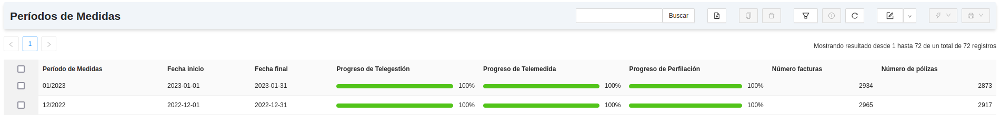
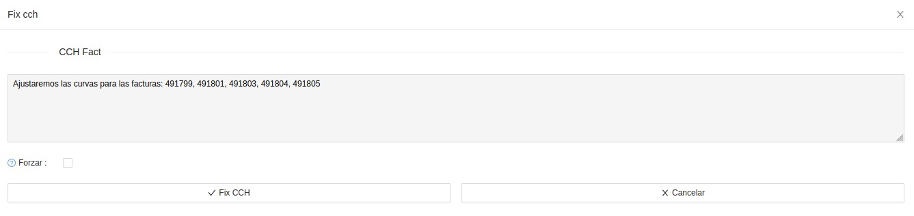
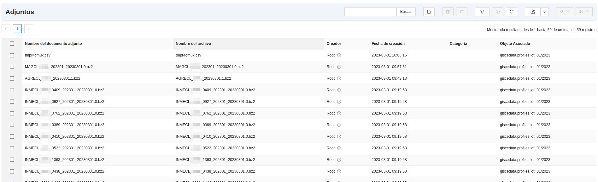

# Mesures REE

## Mòdul de Mesures REE

Aquest mòdul serveix per a la generació de fitxers d'intercanvi de mesures amb
REE, ja siguin d'origen Telegestió, Telemesura o Perfilat.
Inclou generació, processament i validació d'aquests fitxers.

## Menú de Mesures REE

En el menú de Mesures REE que segueix a la imatge, s'hi troben els següents
apartats.

* Perfils: permet visualitzar els perfils horaris generats a filtrar per
factura o CUPS. Aquests es calculen automàticament a l'obrir la factura.

!!! Info "Nota"
    Per tal de desactivar la perfilació automàtica, cal posar la
    variable de configuració `profile_on_invoice_open` a `0`.

* Períodes de Mesures: Mostra l'estat i el progrés dels períodes de mesures.
* Tancaments: Visualitza les dates d'entrega dels fitxers de REE (M+1, M+3...).
* Fitxers Exportats: Generació i emmagatzematge de fitxers desagregats.
* Casos de perfilació: Casos CRM que reporten el comportament al perfilar.
* Casos de mesures: Casos CRM que reporten el comportament al generar els
fitxers de mesures.
* Crear períodes de Mesures: Assistent que permet crear els períodes segons any.
* Generar informe de consums: Assistent per generar un informe del consum per tarifa
* Configuració: Configuració general del mòdul

## Períodes de mesures

Els fitxers de REE, s'entreguen per períodes **a mes complet**. Cada període de
mesures és un mes en concret, el qual engloba les dates, el número de factures i
de contractes i un control del procés de perfilació i d'ajust de corbes de
telegestió i de telemesura.

## Preparació de les dades

Abans de generar els fitxers de mesures, cal comprovar que les dades a incloure
en aquests estan preparades.

Anant a un període de mesures es pot consultar i actualitzar l'estat de cada
col·lecció de dades. Des de **Mesures REE > Períodes de Mesures** es pot
comprovar l'estat de les dades.

Cada origen de dades té una barra que indica el progrés i un botó per
actualitzar-lo. Si els origens no arriben al 100%, cal revisar-los.

Els orígens de dades són els que segueixen:

### Telegestió
Són corbes provinents de contadors telegestionats, corbes reals, que s'hauran
d'entregar sense forats.
Aquestes corbes passen per un procés de validació i d'ajust.

* Procés de validació:
Consisteix en trobar i descartar consums impossibles, hores duplicades, etc. Es
realitza automàticament i diàriament a una certa hora del dia.

* Procés d'ajust (FIX CCH):
El procés d'ajust de la corba s'anomena `fix_cch_fact`. Es fa
automàticament a l'obrir la factura (si és de telegestió). Aquest procés
consisteix en emplenar els forats i ajustar el consum de la corba perquè doni
el consum real.
La mateixa factura indica si la corba té el fix fet, mitjançant el camp
`CCH disponible`.
Per assegurar-se que no ha quedat cap corba sense ajustar-se, existeix un
llistat a:
**Facturació > General > Factures Client > Factures Client CCH no disponible**

Per forçar el fix_cch, es pot utilitzar l'assistent FIX CCH Fact, seleccionant
totes les factures que calguin i fent clic sobre **Acció > FIX CCH FACT again**

### Telemesura

Les dades de telemesura ens poden venir de diversos orígens. Genèricament es
carreguen les corbes de telemesura mitjançant fitxers llegits directament del
comptador per tal de tenir la corba real. Aquesta explicació ve recollida en un
altre apartat d'aquest manual. Aquestes corbes poden arribar pel sistema de
telemesura o ser importades directament a l'ERP mitjançant fitxers d'intercanvi.
És important carregar les corbes abans de facturar. Si el progrés no ha arribat
al 100%, caldrà aplicar el **FIX CCH FACT** com s'explica a l'apartat de
Telegestió.

### Perfil
Quan no es possible disposar de cap dels dos orígens anteriors, cal perfilar
una corba horària mitjançant els coeficients que publica mensualment
REE [Perfils de consum](https://www.ree.es/es/actividades/operacion-del-sistema-electrico/medidas-electricas)
El perfilat es realitza de forma automàtica tan punt s'obre la factura.

!!! Info "Nota"
    Les corbes del Tipus 3 (>50kWh) s'han d'entregar amb corba real.
Per comprovar que totes les factures estan perfilades correctament, cal fixar-se
en la barra de progrés del mateix període de mesures. Per actualitzar aquest
progrés, es necessari utilitzar el botó **Actualitzar Progrés de Perfilació**.

Si el perfilat no arriba al 100%, cal utilitzar el botó **Perfilar** del període
de mesures, per tal que es perfilin totes les factures en estat esborrany del
període.

* Factures del període:
Dins de cada període de mesures descrit en el següent apartat, es disposa d'un
llistat amb totes les factures del període classificades i filtrables per orígen
**(telemesura, telegestió, perfil)**. Cadascún d'aquests orígens, disposa d'un
botó per actualitzar-ne el seu estat, es necessari per tant utilitzar-lo quan
s'ha perfilat o ajustat la corba d'una factura. Les de tipus telegestió i
telemesura comproven el "check" **CCH Disponible** de la factura, i les de
perfil, s'actualitzen a l'estat Finalitzat en el propi procés de perfilació, per
tant, si es vol arribar al 100%, s'han d'ajustar les de tipus telegestió i
telemesura que no estiguin en estat Finalitzat (fix cch) i perfilar les de tipus
perfil, que no estiguin en aquest estat.

## Fitxers REE

Per tal de generar els fitxers de REE, cal dirigir-se a **Mesures REE > Períodes
de mesures > Fitxers REE**.
Aquest mòdul permet la generació i tractament dels següents fitxers:

* AGCL
* CLMAG
* CLMAG5A
* CLINME
* AGCL (publicat per l'operador del sistema)
* AGCLACUM
* AGCLACUM5

Cada fitxer porta associat un botó per tal de procedir a la seva generació. Per
fer-ho, tan sols cal fer-hi clic a sobre. La generació d'aquests no té cap ordre
en concret, però es convenient generar-los d'un a un. Cal recordar que REE
espera primer l'entrega de l'AGCL per tal d'"obrir la pasarela d'entrega per
aquell període en concret" i, seguidament, espera els altres fitxers. Si no es
manté aquest ordre d'entrega, es probable que REE rebutji els fitxers ja que no
s'ha publicat l'inventari d'agregacions d'aquell mes.

A la part esquerra es visualitzen les agregacions que imputen energía en aquest
període en concret. Amb el botó **Generar Nivells d'Agregació**, es creen
aquestes agregacions. A mida que se generin els fitxers, s'aniran omplint les
dates i el consum d'aquestes.

Un cop finalitzi la generació de cada fitxer de mesures, aquest quedarà com a
fitxer adjunt al període de mesures. Es pot accedir als fitxers directament
per la llista de fitxers del període de mesures, situat a la dreta de la
pantalla com la imatge que segueix, o utilitzant el botó **Adjunts**.

!!! Info "Generació AGCL"
    Per la generació de l'AGCL, es pot fer servir l'AGCL de l'operador del
    sistema del mes passat, que porta l'inventari d'agregacions

## Validacions fitxers REE

### Integritat de fitxers

Una vegada generats aquests fitxers, es pot validar que l'energía imputada en
cadascún d'ells sigui coherent. El CLINME té (o hauría de tenir) a nivell de
CUPS tota l'energía imputada en el CLMAG i el CLMAG5A. Per tant, es aconsellable
realitzar una comprovació de que està repartit equitativament. Aquest procés de
validació agrega l'energía del CLINME i la compara amb el CLMAG o el CLMAG5A
segons el Tipus de punt (ex: els Tipus 3 estaran en el CLMAG). Per tant
l'energía total de cada agregació hauria de ser la mateixa tant en el CLINME
com en el CLMAG/CLMAG5A. Per a realitzar aquesta validació, s'utilitza la
pestanya **Validacions Fitxers REE** i el botó **Comprovar consums**. Es
demanarà per quins fitxers es vol realitzar la comprovació per si es tenen
varies versions generades. Se n'indiquen la data de comprovació i els fitxers
contrastats.

### Validació d'entrega a REE

Per tal de comprovar que el que s'ha entregat i processat a REE, es el mateix
que tenim a l'ERP, es poden importar els fitxers d'inventari i acumulat per fer
aquesta validació. Això pot anar bé per veure possibles agregacions estimades, o
possibles agregacions que no s'hagin publicat. Els fitxers a importar són: AGCL,
AGCLACUM i AGCLACUM5. Per fer-ho, cal utilitzar el botó Importar fitxers de
validacions i seleccionar els fitxers tal com la imatge que segueix.

Es poden importar els 3 fitxers alhora, o importar-los un a un. La única
restricció es que mínim s'ha **d'importar o haver importat l'AGCL**, que és
l'inventari d'agregacions. Un cop importats, es marquen les possibles
diferencies entre les taules de nivells d'agregació i nivells d'agregació REE.

