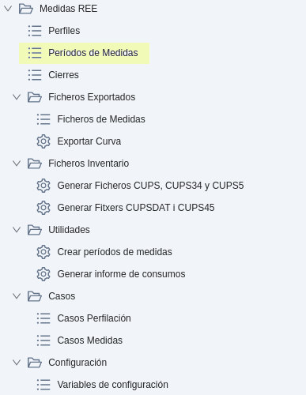
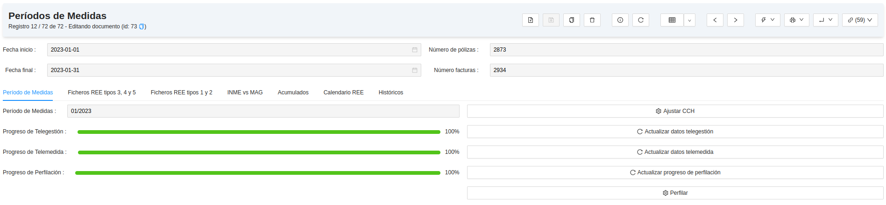
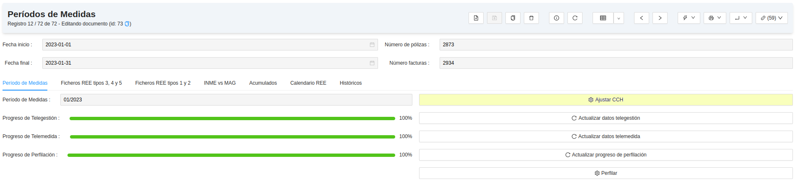
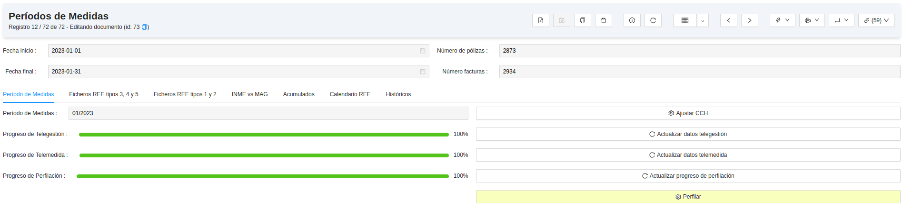

# Mesures REE

## Mòdul de Mesures REE

Aquest mòdul serveix per a la generació de fitxers d'intercanvi de mesures amb
REE, ja siguin aquestes d'origen Telegestió, Telemesura o Perfilat.

Per tant, aquest mòdul inclou eines d'anàlisi, de generació, de processament i de validació d'aquests fitxers.

## Menú de Mesures REE

En el menú de Mesures REE que segueix a la imatge, s'hi troben els següents
apartats.

### Mesures REE
* **Perfils:** Permet visualitzar els perfils horaris generats a filtrar per
factura o CUPS. Aquests es calculen automàticament a l'obrir la factura si el comptador
no té tecnologia de Telemesura ni de Telegestió.

!!! Info "Nota"
    Per tal de desactivar la perfilació automàtica al obrir les factures, cal ajustar la
    variable de configuració `profile_on_invoice_open` a `0`.

* **Períodes de Mesures:** Mostra l'estat i el progrés dels períodes de mesures.
* **Tancaments:** Visualitza les dates d'entrega dels fitxers de REE.

### Fitxers Exportats
* **Fitxers de Mesures:** Generació i emmagatzematge de fitxers desagregats (`F1` o `P1`).
* **Exportar Corba:** Assistent per a exportar corbes desagregades (`F1` o `P1`) per una o totes les Comercialitzadores.

### Fitxers Inventari
* **Generar Fitxers `CUPS`, `CUPS34` i `CUPS5`:** Generació de fitxers d'inventari dels CUPS (fitxers vigents fins a 31 de desembre de 2022).
* **Generar Fitxers `CUPSDAT` i `CUPS45`:** Generació de fitxers d'inventari dels CUPS.

### Utilitats
* **Crear períodes de mesures:** Assistent que permet crear els períodes de mesures dels 12 mesos d'un any.
* **Generar informe de consums:** Assistent per a generar un informe de consum per tarifa a partir de fitxers `CLINMES` i `ACUM`.

### Casos
* **Casos perfilació:** Casos CRM que reporten el comportament al perfilar factures.
* **Casos mesures:** Casos CRM que reporten el comportament al generar els
fitxers de mesures `INMECL` i `MAGCL`.

### Configuració
* Variables de configuració: Configuració general del mòdul.

## Períodes de mesures

Els fitxers de REE, s'entreguen per períodes **a mes complet**. Cada període de
mesures és un mes en concret, el qual engloba les dates, el número de factures i
de contractes i un control del procés de perfilació i d'ajust de corbes de
telegestió i de telemesura.

### Preparació de les dades

Abans de generar els fitxers de mesures, cal comprovar que les dades a incloure
en aquests estan preparades.

Anant a un període de mesures es pot consultar i actualitzar l'estat de cada
col·lecció de dades. Des de **Mesures REE > Períodes de Mesures** es pot
comprovar l'estat de les dades.

Cada origen de dades té una barra que indica el progrés i, a la seva dreta, un botó per
actualitzar-lo. Així es pot saber el percentatge de preparació de les dades abans de generar
fitxers de mesures. Aquest és el percentatge de les factures que ja tenen la mesura apunt.

Si els origens no arriben al 100%, cal revisar-los. Si el progrés de les 
barres de `Telegestió` o `Telemesura` no arriben al 100%, es pot fer servir el botó 
**Ajustar CCH** per a que es recorrin totes les factures amb aquests dos orígens i s'intentin
ajustar les seves corbes. Si és la barra `Perfilació` la que no arriba al 100%, es pot fer
servir el botó **Perfilar** per a recorrer les factures amb origen "Perfil" per a que s'intentin
perfilar. Aquests dos processos es fan en segon pla, i van avançant i ajustant/perfilant les factures,
així que passats uns instants de fer-los servir, es pot tornar a actualitzar el progrés per a veure si ha avançat.

A continuació s'expliquen amb detall els tres orígens de dades de les mesures:

#### Telegestió
Són corbes provinents de comptadors telegestionats (habitualment `PRIME`), i per tant són corbes reals que s'hauran
d'entregar sense forats. Aquestes corbes passen per un procés de validació i d'ajust.

* **Procés de validació:**
Consisteix en trobar i descartar consums impossibles, hores duplicades, etc. Es
realitza automàticament i diàriament a certes hores del dia, segons s'hagi configurat en el servidor de l'ERP. És
possible que l'automatisme de validació no deixi tota la corba validada, per exemple, si hi ha bits de control (`BC`)
informats pel comptador, així que es recomana revisar sovint si les corbes es van validant. Aquesta explicació s'ampliarà
en un altre apartat d'aquest manual.

* **Procés d'ajust (FIX CCH):**
El procés d'ajust de la corba s'anomena `fix_cch_fact`. Es fa
automàticament a l'obrir la factura (si te comptador telegestionat). Aquest procés
consisteix en emplenar els forats i ajustar el consum de la corba perquè doni
el consum real.
La mateixa factura indica si la corba té el fix fet, mitjançant el camp
`CCH disponible`, a la pestanya **Energia**.
Per assegurar-se que no ha quedat cap corba sense ajustar-se, existeix un
llistat a:
**Facturació > General > Factures Client > Factures Client CCH no disponible**

Per a forçar l'ajust d'una o més factures, es pot utilitzar l'assistent `Ajustar CCH Fact (FIX)`, seleccionant
totes les factures que calguin i fent clic sobre **Acció > Ajustar CCH Fact (FIX)**. 

També es pot obtar per fer servir
el botó **Ajustar CCH** des del període de mesures, que ja recorrerà totes les factures pendents d'origen `Telemesura`
i `Telegestió` i intentarà ajustar-ne la corba des de les seves factures.

#### Telemesura

Les dades de telemesura ens poden venir de diversos orígens. Genèricament es
carreguen les corbes de telemesura mitjançant fitxers llegits directament del
comptador per tal de tenir la corba real. Aquesta explicació ve recollida en un
altre apartat d'aquest manual. Aquestes corbes poden arribar pel sistema de
telemesura o ser importades directament a l'ERP mitjançant fitxers d'intercanvi (`TPL`, `P1D`, o altres).
És important carregar i validar les corbes abans de facturar. 

Si el progrés no ha arribat al 100%, caldrà aplicar el **FIX CCH FACT** com s'explica a l'apartat de Telegestió.

#### Perfil
Quan no és possible disposar de cap dels dos orígens anteriors, cal perfilar
una corba horària mitjançant els coeficients que publica mensualment
REE [Perfils de consum](https://www.ree.es/es/actividades/operacion-del-sistema-electrico/medidas-electricas)
El perfilat es realitza de forma automàtica tan punt s'obre la factura.

!!! Info "Nota"
    Les corbes del Tipus 1 i 2 (>450kWh) s'han d'entregar amb corba real.
    Per a comprovar que totes les factures estan perfilades correctament, cal fixar-se
    en la barra de progrés de `Perfilació`del mateix període de mesures. Recordeu que per a actualitzar aquest
    progrés, es necessari utilitzar el botó **Actualitzar progrés de perfilació**.

Si el perfilat no arriba al 100%, cal utilitzar el botó **Perfilar** com s'explica a l'apartat de Preparació de les dades.

### Factures del període
Dins de cada període de mesures descrit en el següent apartat, es disposa d'un llistat amb totes les factures del 
període classificades i filtrables per orígen **(`telemesura`, `telegestió` o `perfil`)**. Les factures s'afegiran al
període de mesures en el moment d'obrir-se (sempre i quan els períodes de mesures estiguin creats, i aquests es creen com
a part dels procediments de canvi d'any). Al obrir una factura, aquesta s'afegirà al llistat de factures del període de
cada període de mesures pel qual la factura contingui dies (per exemple, una factura de client amb consum de l'1 de gener
al 3 de febrer, s'afegirà als períodes de mesures de gener i de febrer). Des de l'enllaç **Factures del periode** es
poden llistar totes les factures asignades al període de mesures, el seu origen i el seu estat (`esborrany` si no estan
preparades lse seves mesures i `finalitzat` si ja estan preparades). Les factures s'afegeixen sempre en estat `esborrany`
als períodes de mesurse.

Com s'explica a l'apartat de Preparació de les dades, cadascún d'aquests orígens, disposa d'un botó per actualitzar-ne el 
seu progrés. És necessari per tant utilitzar-lo després d'haver perfilat o ajustat corbes de factures del període. 
Les factures de tipus `telegestió` i `telemesura` comproven el "check" `CCH disponible` de la factura, i les de tipus 
`perfil`, s'actualitzen a l'estat  `Finalitzat` un cop han estat perfilades. Per tant, si es vol arribar al 100% 
d'integritat de les dades, s'han d'ajustar  les factures en estat `esborrany` de tipus `telegestió` i `telemesura` 
(ajustant la CCH) i perfilar les factures en estat `esborrany` de tipus `perfil`.

!!! Info "Nota"
    Les factures amb 0 kWh d'energia sempre quedaran en estat `esborrany` ja que no es perfilaran ni s'ajustaran.

Si no s'aconsegueix de cap manera arribar al 100% d'alguna de les barres de progrés, es pot accedir al llistat `Factures 
del periode` i filtrar pel tipus d'origen i per estat `esborrany`. Un cop aplicat el filtre, es poden revisar una per 
una les factures, per a detectar i corregir problemes relacionats amb la configuració del contracte i/o del comptador
(per exemple que hi hagi un comptador amb tecnologia PRIME que no tingui marcada la casella `Comptador TG`, que un
comptador telemesurat o telegestionat no tingui registrador, que el producte de magatzem d'un comptador telegestionat no
estigui correcte, etc.). Un cop revisada i corregida l'errat,a es pot tornar a provar d'ajustar la factura corresponent.

## Fitxers REE

Per tal de generar els fitxers de REE, cal dirigir-se a **Mesures REE > Períodes
de mesures > Fitxers REE tipus 3, 4 i 5**. Aquest mòdul permet la generació i el tractament de diversos tipus de fitxers.

### Fitxers de Mesures

Aquests són els fitxers principals que cal entregar a REE per a imputar el consum dels nostres clients a les Comercialitzadores.

* **MAGCL**: Dades horàries d'energia d'agregacions de clients de Tipus 4 i 5. Es genera un únic fitxer pel període de mesures.
* **INMECL**: Acumulat mensual d'energia de clients de tipus 4 i 5 desagregats. Es genera un fitxer per cada Comercialitzador actiu en el període de mesures.
* **AGRECL**: Alta, baixa i modificació d'agregacions de clients tipus 4 i 5.

Per a més detalls sobre els fitxers, el seu format, i el seu contingut, podeu consultar la versió més
recent del document `Ficheros para el intercambio de información de
medida` que es publica i es va revisant a REE.

### Fitxers d'inventari

Es manté per històric un botó per a generar els fitxers d'inventari antics a mes natural.
Com que l'ERP ja genera i publica automàticament els inventaris de CUPS diàriament si així s'ha configurat,
cada dia s'envia un `CUPSDAT` i un `CUPS45` al Concentrador Secundari. Així que aquests fitxers, tret de per
tornar a presentar períodes de mesures antics, ja no cal generar-los.

* **CUPS34**: Inventari mensual de CUPS de tipus 3 i 4 (vigents només fins a desembre de 2022).
* **CUPS5**: Inventari mensual de CUPS de tipus 5 (vigents només fins a desembre de 2022).

### Fitxers de corba

* **F5D**: Aquest assistent permet generar els fitxers `F5D` "tallats" a més natural. No és obligatori si ja
s'han anat publicant al dia els fitxers `F5D` al Concentrador de Corbes.

### Fitxers històrics

Finalment, també trobareu una pestanya **Històrics** amb altres fitxers que ja són antics i que REE no suporta. No
és recomanable generar-los, a menys que es faci un cop ja s'han generat i publicat tots els fitxers vigents al Concentrador
Secundari de Mesures, ja que el format d'aquests fitxers va quedar descontinuat per SIMEL i podria deixar malament
els nivells d'agregació del període després d'haver-los generat.

* **AGCL**
* **CLMAG**
* **CLMAG5A**
* **CLINME**

### Procediment per a generar els fitxers de mesures

En primer lloc, cal fer clic al botó **Generar nivells d'agregació**. Això farà que l'ERP crei a la consola de l'esquerra
els nivells d'agregació que calculi que estan vigents en el període, a partir de l'històric de contractes existent. Aquests
nivells d'agregació quedaran en blau (no validats), ja que no tindran les dates de vigència, el consum ni la generació omplerts.
Aquests valors s'ompliran tan bon punt s'hagin generat els propis fitxers de mesures, que actualitzaran els nivells d'agregació
durant el seu procés de generació.

Cada fitxer de mesures porta associat un botó per tal de procedir a la seva generació. Per
fer-ho, tan sols cal fer-hi clic a sobre. És indiferent si es genera primer el fitxer `MAGCL` o els fitxers `INMECL`, però 
sí és recomanable generar-los d'un en un, ja que tots dos tipus de fitxers actualitzaran els nivells d'agregació i fer-los
al mateix temps podria donar lloc a col·lisions. Si un mateix fitxer es genera diverses vegades, es fa servir un sistema de
versionat, així que es podrà saber quin és el més recent perquè just al final del nom s'indicarà amb un valor enter (0 per a
la primera versió, 1 per a la següent, etc.). Si s'envien diversos fitxers amb el mateix nom, a REE predominarà el que tingui
el versionat més alt.

Cal recordar també que REE espera primer l'entrega del fitxer `AGRECL` per tal de "obrir la pasarela d'entrega" per
aquell període en concret i, seguidament, espera els altres fitxers (els `INMECL` i el `MAGCL`). El fitxer `AGRECL` és
l'encarregat d'actualitzar l'inventari d'agregacions actives a REE i, si no es comunica o no s'espera a rebre la resposta de
REE després d'enviar-lo, es podrien comunicar errors (.BAD2) als fitxers `INMECL` i `MAGCL` si s'hi ha comunicat consum d'una
agregació que encara no figura a l'inventari de REE. Així doncs, el fitxer `AGRECL` és el darrer que generem (abans tenim
que haver generat els nivells d'agregació i haver-los omplert amb les dates, els consums i la generació mitjançant la generació
dels fitxers `INMECL` i `MAGCL`), però al mateix temps és també el primer fitxer que comunicarem al Concentrador Secundari de
Mesures. 

Com a mínim de tant en tant, és recomanable generar el fitxer `AGRECL` adjuntant al seu assistent el fitxer `AGRECLOS` més
recent que hagi publicat l'Operador del Sistema al Concentrador Secundari de Mesures pel període de mesures en qüestió. 
Això farà que el fitxer no noḿes tingui
en compte durant la seva generació els canvis als nivells d'agregació respecte el periode anterior sino també l'inventari que
consta a REE. Així s'evitarà que no s'hagi notificat alguna baixa o fins i tot s'evitarà notificar dos cops una que ja es va
comunicar amb anterioritat. L'ús d'un fitxer `AGRECLOS` no és obligatori, però sí recomanable.

Un cop finalitzi la generació de cada fitxer de mesures, aquest quedarà com a fitxer adjunt al període de mesures. 
Es pot accedir als fitxers directament per la consola de la dreta, sota al pestanya **Fitxers REE tipus 3, 4 i 5** del
període de mesures, o bé des de l'enllaç **Adjunts**, que és més pràctic per a poder descarregar-los de forma massiva si
es seleccionen tots els que es vol descarregar i es fa servir l'acció de l'assistent **Attachment ZIP**, descarregant d'una
única vegada en un fitxer comprimit tots els fitxers desitjats.

Recordeu que s'espera que les Mesures es publiquin en `M+2` a partir de gener de 2023. Antigament es publicaven a `M+3`.
Es segueix tenint la possibilitat de revisar-les i publicar-les novament en `M+7`. 

!!! Info "Nota"
    Podeu consultar les dates dels tancaments al llistat **Tancaments**, però és més accessible tenir-los
    controlats des de la pestanya **Calendari REE** que trobareu a tots els períodes de Mesures. Si els tancaments d'aquesta
    pestanya encara no tenen data, la podeu obtenir amb el botó **Obtenir calendari de REE**.

### Procediments per a validar els fitxers de mesures

#### Comprovació de la integritat dels fitxers

Una vegada generats els fitxers `INMECL` i `MAGCL`, es pot validar que l'energía imputada en
cadascún d'ells sigui coherent. Els fitxers `INMECL` han de tenir a nivell de
CUPS tota l'energía imputada en el fitxer `MAGCL`. Per tant, es aconsellable
realitzar una comprovació de que està repartit equitativament. Aquest procés de
validació agrega l'energía dels fitxers `INMECL` i la compara amb la del `MAGCL`
segons el seu nivell d'agregació. Per tant, l'energía total de cada agregació hauria de ser la mateixa tant en el `INMECL`
com en el `MAGCL` per a cada nivell d'agregació. 

Per a realitzar aquesta validació, s'utilitza la
pestanya **INME vs MAG** i el botó **Comprovar consums**. Es
demanarà per quins fitxers es vol realitzar la comprovació per si es tenen
varies versions generades. Se n'indiquen la data de comprovació i els fitxers
contrastats. Caldrà seleccionar un `MAGCL` i tots els `INMECL` (aconsellablement els de la versió més recent).

Com a resultat, a la consola de nivells d'agregació, apareixerà una línea per a cada agregació i la seva comparativa entre
l'energia publicada als fitxers `INMECL` i l'energia publicada al fitxer `MAGCL`. Per anar bé, totes les línies tindrien que
tenir 0 kWh de diferència, tant a consum com a generació.

#### Validació d'entrega a REE

Per tal de comprovar que el que s'ha entregat i processat a REE és el mateix
que tenim a l'ERP, es poden importar els fitxers d'inventari i acumulat per fer
aquesta validació. Això pot anar bé per veure possibles agregacions estimades, o
possibles agregacions que no s'hagin publicat. Els fitxers a importar són: `MAGLACUM` i `INMECLOS`. 
Des de la pestanya **Acumulats** podreu veure dues consoles per a poder fer aquests contrastos.

Per a fer les comparatives, es poden fer servir els botons **Importar fitxer MAGLACUM** i **Importar fitxer INMECLOS**.
Recomanem treballar més amb el fitxer `MAGCLACUM`, ja que només generarà una línea per a cada nivell d'agregació, mentre que
el fitxer `INMECLOS` generarà una per cada línia dels fitxers `INMECL`. El fitxer `INMECLOS` ens pot donar més detall
a l'hora de trobar un desquadrament entre els nostres nivells d'agregació i les mesures que finalment ens imputa REE.

Es recomana també fer servir la versió més recent publicada per l'Operador del Sistema per a ambdós fitxers.
