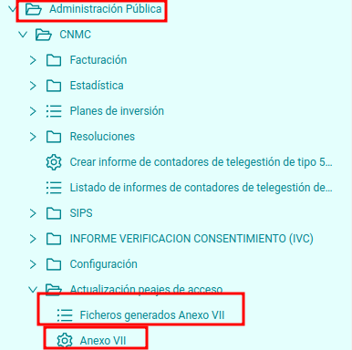
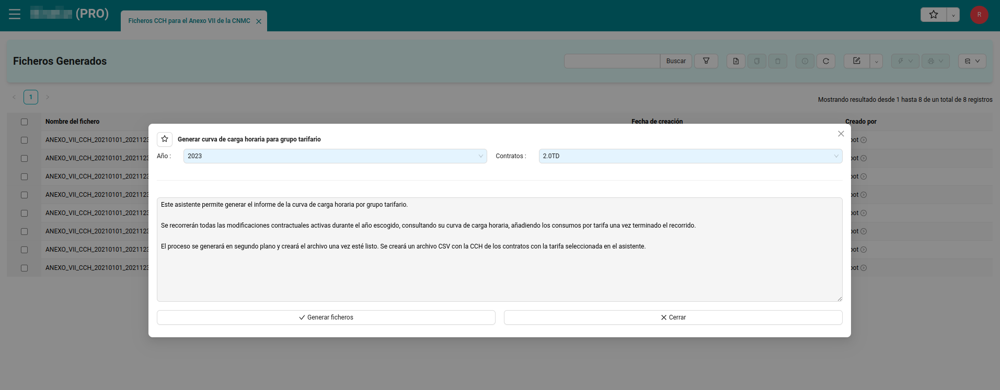
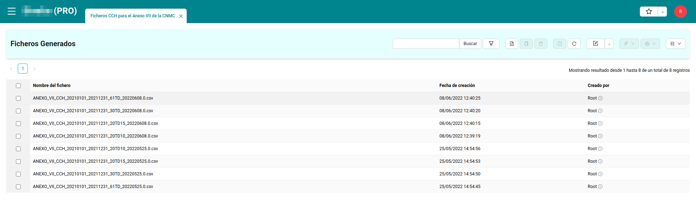
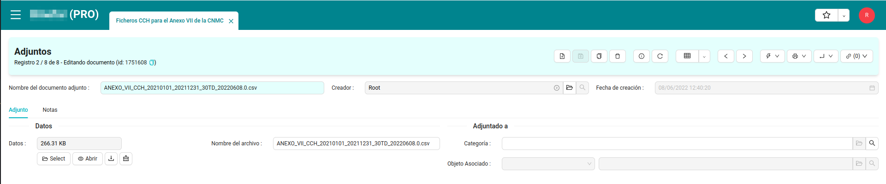
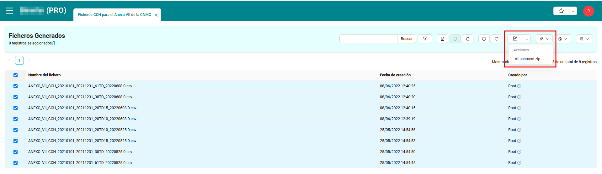

# Mesures ANEXO VII

Aquest mòdul implementa la generació a l'ERP de distribuïdora de fitxers per a complementar `Anexo VII` de la CNMC.

Aquests són **informes de corbes de càrrega horària (CCH)**, agrupats per les diferents tarifes d'accés, que la Distribuïdora enviarà a la "Comisión Nacional de los Mercados y la Competencia (CNMC)" amb una periodicitat anual. Els fitxers recullen les dades de tot l'any anterior.

Aquesta funcionalitat es generarà sempre en segon pla i crearà un fitxer `.csv` una cop estigui llest.

L'usuari serà l'encarregat de publicar l'Anexo VII a la CNMC, omplint-lo amb les dades extretes dels fitxers generats per l'ERP.

## Menú ANEXO VII 

El menú Anexo VII es troba dintre del menú principal `Administració pública > CNMC > Actualització peatjes d'accés`. Aquí trobarem els apartats necessaris per a la
generació dels fitxers i la seva descàrrega.

- Fitxers generats Anexo VII
- Anexo VII

## Anexo VII

Aquí se'ns obrirà un assistent per a poder generar el fitxer.

A l'assistent podem ajustar el següent:

- **Any**: L'any pel qual volem realitzar el fitxer. Ha de ser el que surt per defecte, que serà l'any anterior al vigent en el moment de presnetar l'Anexo VII.

- **Contractes**: El tipus de tarifa d'accés el que volem generar el fitxer. Caldrà generar un fitxer per cada tarifa d'accés per la qual tinguem contractes.

## Llistat de fitxers generats ANEXO VII

Aquí trobarem els fitxers CSV del fitxer Anexo VII que s'hagin generat.

Seleccionat un d'ells, se'ns obrirà un formulari el qual ens permetrà descarregar el fitxer.

També tenim l'opció a través d'un assistent comú, de poder descarregar tots els fitxers seleccionats a l'hora en format `zip`.

