# Mesures Anexo VII

Aquest mòdul implementa la generació a l'ERP de distribuïdora de fitxers per a complimentar l'`Anexo VII` de la CNMC.

Aquests són **informes de corbes de càrrega horària (CCH)**, agrupats per les diferents tarifes d'accés, que la Distribuïdora enviarà a la "Comisión Nacional de los Mercados y la Competencia (CNMC)" amb una periodicitat anual. Els fitxers recullen les dades de tot l'any anterior.

Aquesta funcionalitat es generarà sempre en segon pla i crearà un fitxer `.csv` una cop estigui llest.

L'usuari serà l'encarregat de publicar l'Anexo VII a la CNMC, omplint-lo amb les dades extretes dels fitxers generats per l'ERP.

## Eines disponibles

Les eines es troben dintre del menú principal `Administració pública > CNMC > Actualització peatjes d'accés`. Aquí trobarem els apartats necessaris per a la
generació dels fitxers i la seva descàrrega.

- Lots Anexo VII (Experimental)
- Fitxers generats Anexo VII
- Anexo VII

[ 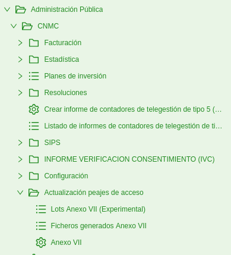](_static/medidas_anexo_VII/menu_anexo_VII.png)

### Anexo VII

L'acció obrirà un assistent per a poder generar els fitxers.

A l'assistent podem ajustar el següent:

- **Any**: L'any pel qual volem realitzar el fitxer. Ha de ser el que surt per defecte, que serà l'any anterior al vigent en el moment de presentar l'Anexo VII.

- **Tarifa**: El tipus de tarifa d'accés pel que volem generar el fitxer. Caldrà generar un fitxer per cada tarifa d'accés per la qual tinguem contractes.

[ 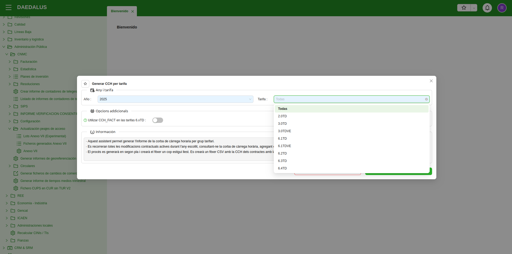](_static/medidas_anexo_VII/wizard_anexo_VII_download.png)

!!! Info "Nota"
    Hi ha una acció `Totes` per a poder llançar, amb una única acció, la generació de fitxers de l'Anexo VII per a totes
    les tarifes d'accés per a les quals hi hagi contractes actius durant l'any seleccionat.

### Llistat de fitxers generats Anexo VII

Aquí trobarem els fitxers CSV del fitxer Anexo VII que s'hagin generat prèviament

[ 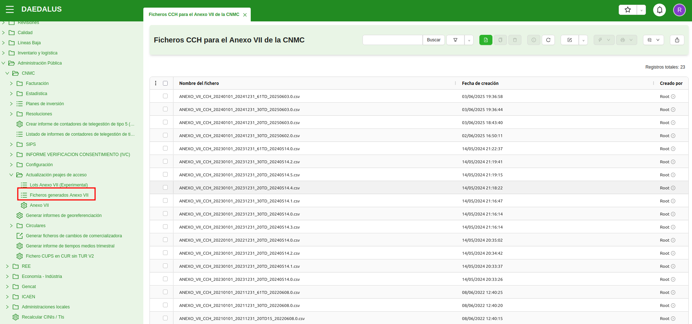](_static/medidas_anexo_VII/list_async_files.png)

Seleccionat un d'ells, se'ns obrirà un formulari el qual ens permetrà descarregar el fitxer.

[ 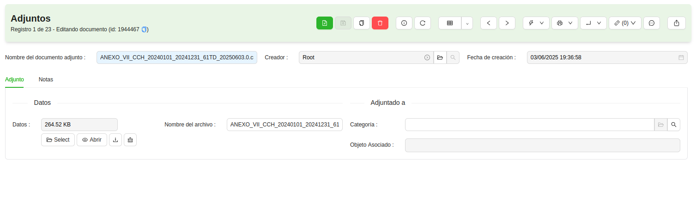](_static/medidas_anexo_VII/async_form_anexo_VII.png)

També tenim l'opció a través d'un assistent comú, de poder descarregar tots els fitxers seleccionats alhora, en format `zip`.

[ 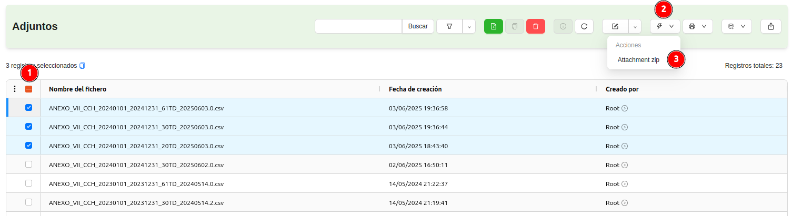](_static/medidas_anexo_VII/wizard_download_all.png)

### Lots Anexo VII (Experimental)

Aquesta nova opció està pensada per a distribuïdores amb un gran volum de CUPS, ja que la generació de fitxers,
especialment els de la tarifa 2.0TD, pot trigar massa hores. Amb aquesta eina, la generació es pot fer de forma gradual,
enlloc de fer-la de cop.

Si es vol fer servir aquesta opció, en primer lloc cal crear un nou lot des del llistat "Lots Anexo VII (Experimental)",
indicant l'any desitjat (per defecte, ja sortirà l'any anterior). Un cop fet tot això, cal desar els canvis.

[ 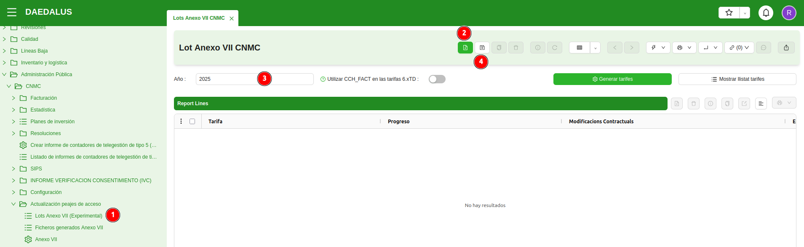](_static/medidas_anexo_VII/lot_anexo_vii.png)

Ja tenint creat el lot, es pot fer clic al botó **Generar tarifes"**".

[ 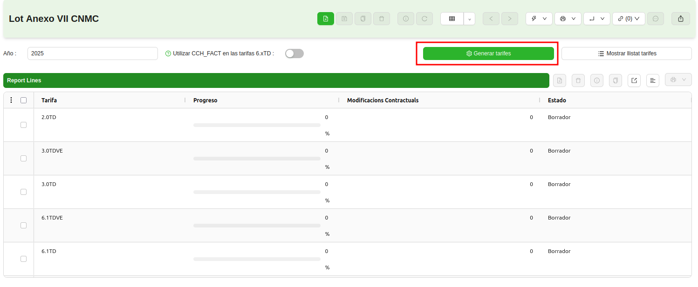](_static/medidas_anexo_VII/generar_tarifas.png)

A continuació, ja serà possible accedir al llistat de tarifes amb el botó **Mostrar llistat tarifes** (o fent doble clic
sobre una en el llistat). Des d'una tarifa, es pot fer clic al botó **Generar lots** per a que l'ERP faci el recompte de
quants contractes (modificacions contractuals) hi ha durant l'any desitjat amb la tarifa d'accés en qüestió. El valor quedarà
guardat al camp **Modificacions Contractuals**.

Un cop s'han creat els lots, es pot fer clic a **Calcular Lots**. Això llançarà un procés en segon pla que anirà recorrent
tots els lots generats de modificacions contractuals per a la tarifa d'accés, i n'anirà obtenint la corba de càrrega horària.

[ 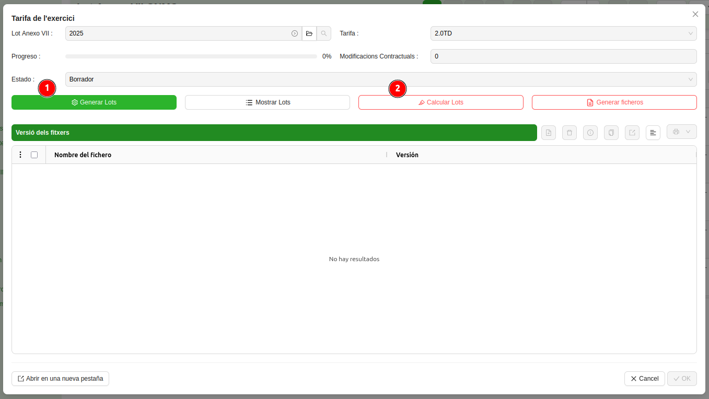](_static/medidas_anexo_VII/generar_lotes.png)

!!! Info "Nota"
    Les tarifes d'accés sense modificacions contractuals, es poden ignorar, ja que no caldrà generar el seu fitxer per
    l'Anexo VII, al no haver-hi consums que informar.

Es pot seguir el progrés del càlcul de cada tarifa d'accés des del llistat, dins del lot de l'Anexo VII.

[ 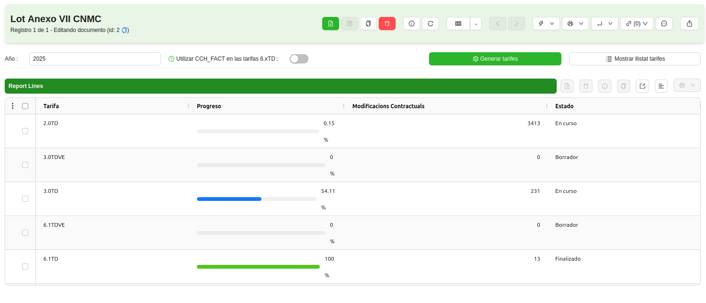](_static/medidas_anexo_VII/progreso_lotes.png)

Un cop el progrés d'una tarifa d'accés arriba al 100%, si s'hi accedeix, es podrà generar el seu fitxer per a l'Anexo VII
amb el botó **Generar Fitxers**.

[ 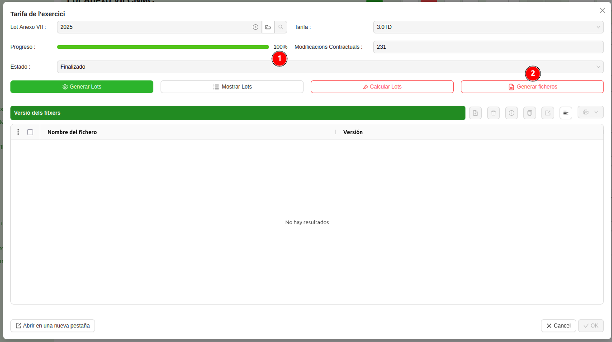](_static/medidas_anexo_VII/generar_ficheros_lotes.png)

Els fitxers generats, queden historitzats al llistat de la tarifa d'accés, dins del lot. Des d'aquests mateixos llistats
es poden descarregar per a la seva publicació.

[ 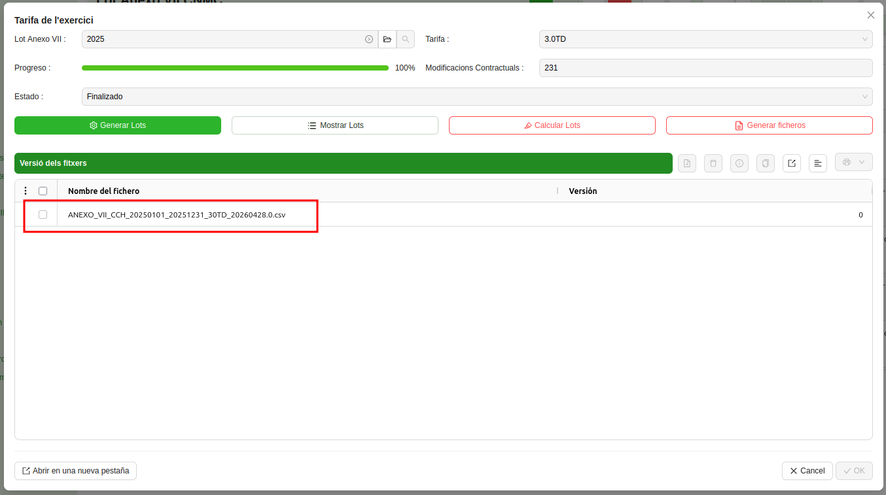](_static/medidas_anexo_VII/ficheros_lotes.png)

Des d'una tarifa d'accés es pot anar al llistat de lots i per a cada un d'ells es pot veure la CCH.

Si es desitja, es pot accedir al llistat de lots de cada tarifa d'accés i marcar-los per a que es recalculin, de manera
que si es torna a clicar el botó **Calcular Lots** s'actualitzaran. Això és útil si hi ha hagut refacturacions recents o
correccions a la CCH d'alguns CUPS.

[ 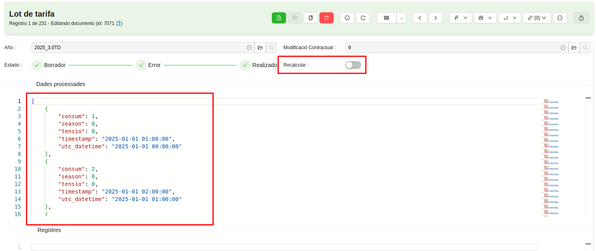](_static/medidas_anexo_VII/recalcular_lotes.png)
