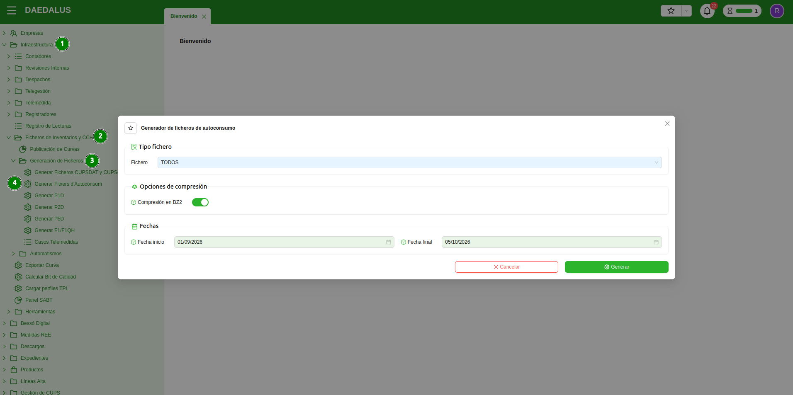
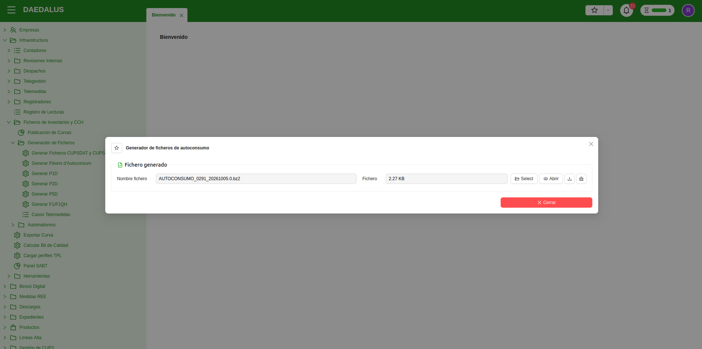

# Inventaris d'Autoconsum

Els fitxers d'inventari d'Autoconsum serveixen per a informar a l'Operador del Sistema de l'històric d'autoconsums que
té una distribuïdora. És amb aquests fitxers que l'Operador del Sistema valida i actualitza els seus propis inventaris.

Per tant, és recomanable mantenir els inventaris al dia, ja que en ells s'informa entre altres coses la
modalitat dels autoconsums, els CUPS associats als mateixos, si hi ha sistemes d'emmagatzematge connectats, etc. Si no
s'informen, els fitxers de mesures poden retornar errors `BAD2` si es detecta energia activa sortint però a l'Operador
del Sistema no consta que el CUPS en qüestió disposi d'autoconsum d'algun tipus.

Els fitxers s'han de generar i s'han de publicar al Concentrador Secundari.

## Generar els fitxers d'autoconsum

Generar fitxers d'inventari d'autoconsum a l'ERP de distribuïdora és molt senzill. Només cal invocar l'assistent
**Generar Fitxers d'Autoconsum**.

El trobareu al menú **Infraestructura > Fitxers d'Inventaris i CCH > Generació de Fitxers**.

Haureu de triar quin tipus de fitxer voleu generar (hi ha una opció per a generar-los tots), el rang de dates i si
voleu el fitxer comprimit en BZ2 o no.

Un cop fet això, es pot llançar la generació del fitxer (que trigarà més o menys segons la mida de la cartera
d'autoconsums de la distribuïdora). En acabar la generació, el fitxer apareixerà a l'assistent per a poder ser
descarregat.

!!! Info "Nota 1"
    Si s'utilitza l'opció **TOTS** per a generar els fitxers, el retorn serà un fitxer comprimit en format ZIP que
    contindrà els fitxers que s'hagin pogut generar i un fitxer de text pla informant dels errors trobats.

!!! Info "Nota 2"
    L'assistent inclourà als fitxers els canvis (altes i baixes) compreses entre el rang de dates. Però és recomanable
    publicar inventaris complets, utilitzant un rang de dates entre l'1 de gener de 2020 (quan va entrar en vigor
    l'autoconsum al sector elèctric) i la data actual.

## Tipus d'inventaris

La Distribuïdora pot generar diferents tipus d'inventari d'autoconsum (segons els tipus d'informació a comunicar).
Els fitxers d'inventari d'autoconsum i els seus formats els podreu trobar al document oficial de REE:
**'Ficheros para el intercambio de información de medida'**.

A continuació es presenten els tipus de fitxers d'inventari d'autoconsum existents:

### Inventaris de la distribuïdora

Els inventaris d'autoconsum de distribuïdora són els que la mateixa distribuïdora generar i publica al Concentrador
Secundari, informant a l'Operador del Sistema dels seus CAU, així com dels CUPS, CIL i emmagatzematges associats als
mateixos.

* **AUTOCONSUMO**: Notifica l'alta, baixa o modificació de les instal·lacions d'autoconsum.
* **CUPSDAT**: Notifica les relacions entre els CUPS i les instal·lacions d'autoconsum.
* **CUPSDAT**: Notifica les relacions entre les instal·lacions de generació i les instal·lacions d'autoconsum.
* **CUPSDAT**: Notifica les relacions entre les instal·lacions d'emmagatzematge i les instal·lacions d'autoconsum.

!!! Info "Nota 3"
    Abans de publicar un fitxer **CUPSCAU**, **CILCAU** o **ALMACENACAU** cal assegurar-se de que l'Operador del Sistema
    ja ha processat correctament un **AUTOCONSUMO** amb tota la informació vigent. Si no es fa així, és possible que els
    fitxers retornin error `BAD2` pels CUPS, CIL o emmagatzematges associats a un CAU que encara no figura a l'inventari
    d'autoconsums de l'Operador del Sistema. Per això, recomanem publicar primer el fitxer **AUTOCONSUMO** i, un cop
    rebut el seu `OK`, publicar la resta de fitxers d'inventari d'autoconsum.

### Inventaris de l'Operador del Sistema

Els inventaris d'autoconsum de l'Operador del Sistema són els que l'Operador del Sistema manté al seu sistema,
actualitzant-ne les dades a partir dels inventaris d'autoconsum que rep de les distribuïdores. Es van republicant
setmanalment (normalment, cada divendres) i es poden consultar des del directori d'entrada del Concentrador Secundari.

* **AUTOCONSUMOOS**: Publicació de l'inventari de les instal·lacions d'autoconsum
* **CUPSCAUOS**: Publicació de les relacions entre els CUPS i les instal·lacions d'autoconsum.
* **CILCAUOS**: Publicació de les relacions entre les instal·lacions de generació i les instal·lacions d'autoconsum.
* **ALMACENACAUOS**: Publicació de les relacions entre les instal·lacions d'emmagatzematge i les instal·lacions d'autoconsum.
