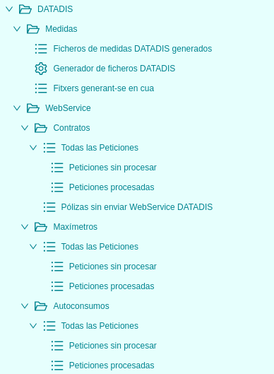

# Mesures REE

## Mòdul de Mesures DATADIS

Aquest mòdul serveix per a la generació de fitxers de **mesures** que es publiquen al Concentrador de **DATADIS**
de ASEME. També inclou una sèrie d'automatismes que permeten la publicació automàtica de dades contractuals, maxímetres i
autoconsums a través de l'**API WebService** de DATADIS d'ASEME.

## Menú de DATADIS

En el menú de DATADIS que segueix a la imatge, s'hi troben els següents apartats.

### Mesures
* **Fitxers de mesures DATADIS generats:** Llistat de fitxers de mesures que s'han generat amb l'assistent que incorpora
aquest mòdul. Els fitxers apareixen ordenats descendentment per data i és possible descarregar-los per a revisar-los i/o
publicar-los al **Concentrador de DATADIS** d'ASEME. És possible filtrar pel nom del fitxer i per dates, si es requereix. També
és possible descarregar múltiples fitxers amb una única acció si es sel·leccionen els fitxers a descarregar en el llistat i
s'utilitza l'acció **Attachment Zip**.

Existeixen tres tipus de fitxers de mesures:

  * **DATADIS_CLMAG**: Dades horàries d'energia d'agregacions de clients tipus 3 i 4. Basat en l'arxiu `CLMAG` que es feia servir
    antigament per a publicar les mesures agregades dels clients de tipus 3 i 4 al Concentrador Secundari de Mesures, avui
    substituït pel fitxer `MAGCL`.
  * **DATADIS_CLMAG5A**: Dades horàries d'energia d'agregacions de clients tipus 5. Basat en el fitxer `CLMAG5A` que es feia servir
   antigament per a publicar les mesures agregades dels clients de tipus 5 al Concentrador Secundari de Mesures, avui
   també reemplaçat pel fitxer `MAGCL`.
  * **DATADIS_AUTOCONSUMO**: Dades horàries de generació d'energia en instal·lacions d'autoconsum, agregades per distribuïdora,
   dia, província i tipus d'autoconsum.

!!! Info "Nota 1"
    DATADIS demana publicar **cada mes abans del dia 15** els fitxers `DATADIS_CLMAG`, `DATADIS_CLMAG5A` i `DATADIS_AUTOCONSUMO` pels periodes 
    **M-2**, **M-3**, **M-7** i **M-9**.
    També demana publicar **cada setmana entre divendres i diumenge** els fitxers `DATADIS_CLMAG` i `DATADIS_CLMAG5A` pels periodes **M-0** i **M-1**.

* **Generador de fitxers DATADIS:** Aquest assistent permet introduïr un rang de dates (ambdues incloses) per a generar
un fitxer de mesures per a publicar a DATADIS. L'assistent és capaç de generar qualsevol dels tres fitxers existents, simplement
triant quin es vol generar al sel·leccionable `Tipus de fitxer`.

Es pot marcar o desmarcar l'opció de comprimir els fitxers en format ".bz2" (l'estàndar d'ASEME). Si es desmarca l'opció, els
fitxers es generaran en format de fitxer pla.

!!! Info "Nota 2"
    Quan es generin fitxers de mesures `DATADIS_CLMAG` i `DATADIS_CLMAG5A` per els periodes **M-0** i **M-1**, cal triar l'opció
    d'utilitzar la corba `Validada`, enlloc de `Facturada`, ja que molt provablement hi haurà subministraments que encara
    no s'hauran facturat i no tindran la corba `CCH_FACT` completa, així que s'utilitza la `CCH_VAL`.

!!! Info "Nota 3"
    Des de desembre de 2023, és possible generar fitxers `DATADIS_CLMAG` i `DATADIS_CLMAG5A` en format diari, a més a més de en
    format mensual. Per a fer-ho, n'hi ha prou amb sel·leccionar com a tipus `Diari` al selector de la part superior de l'assistent
    i introduïr la mateixa data com a data inicial i com a data final. D'aquesta manera, es poden generar els fitxers diaris
    corresponents al dia `D-2` tal com ASEME va especificar a finals de 2023. És recomanable generar fitxers diaris pel període
    `M-0` utilitzant la corba `Validada` enlloc de la `Facturada` donat que molt provablement la CCH encara no estarà ajustada a
    tancaments, al tractar-se de mesures de tan sols uns dies enrere.

Si durant la generació d'un fitxer de mesures es detecten errors, per exemple al intentar obtenir alguna de les dades requerides,
en acabar la generació del fitxer, a més de generar-se i adjuntar-se aquest al llistat de **Fitxers de mesures DATADIS generats**,
també es generarà i adjuntarà al llistat un fitxer amb el mateix nom però afegint la terminació `.errors.txt` al final, on es podran
revisar els errors del fitxer. D'aquesta manera, es poden revisar i corregir dades a l'ERP i tornar a generar els fitxers fins que
aquests es generin sense errors.

* **Fitxers generant-se en cua:** Aquest llistat permet comprovar quantes tasques està duent a terme la cua encarregada de generar
fitxers. Ja que la cua és compartida entre diversos processos, amb aquest llistat es pot comprovar si l'ERP està generant en segon
pla algun fitxer. Es tracta doncs d'una eina útil a l'hora de saber si els fitxers haurien d'haver acabat de processar-se o no.

### WebService

A més a més dels fitxers de mesures `DATADIS_CLMAG`, `DATADIS_CLMAG5A` i `DATADIS_AUTOCONSUM`, el mòdul de DATADIS permet publicar
dades a través d'una **API WebService** que ha disposat DATADIS per a tal de compartir la informació entre Distribuïdores.

Aquestes dades són els **contractes**, els **maxímetres** i els **autoconsums** dels quals disposa la pròpia Distribuïdora. A diferència dels
fitxers de mesures, l'enviament de dades a través de l'API WebService està completament **automatitzat** i tan sols cal configurar
les **credencials d'accés** (usuari i contrasenya) a l'ERP i activar l'automatisme encarregat de cada tipus de dades a publicar, per a que
l'ERP vagi enviant la informació a través de l'API.

No obstant, encara que tot funcioni de forma automàtica, també és possible revisar tant els contractes que encara no han enviat la seva informació a
DATADIS com també les peticions enviades i el seu estat (`Error`, `Enviat` o `Validat`).

Si en el moment de crear-se una sol·licitut d'enviament aquesta falla, queda en estat `Error`; mentre que si s'arriba a publicar-se
sense problemes, queda en estat `Enviat`. 

És possible utilitzar l'assistent **Accions al Sistema DATADIS** tenint una o més sol·licituts d'enviament de dades sel·leccionades,
tant per a publicar les sol·licituts com per, si ja estan en estat `Enviat`, consultar-ne l'estat i saber si DATADIS ja les ha processat,
quedant aquestes en estat `Validat` si és així.

A continuació s'enumeren tots els llistats de sol·licituts d'enviament de dades que es poden consultar.

#### Contractes
* **Totes les Peticions:** Llistat on es mostren totes les sol·licituts d'enviament de dades contractuals, independentment del seu estat.
* **Peticions sense processar:** Llistat on es mostren totes les sol·licituts d'enviament de dades contractuals que encara no tenen estat `Validat`.
* **Peticions processades:** Llistat on es mostren totes les sol·licituts d'enviament de dades contractuals que ja tenen estat `Validat`.
* **Pòlisses sense enviar WebService DATADIS:** Llistat de contractes dels quals encara no s'ha fet enviament de dades a DATADIS. Per anar bé,
en aquest llistat només hi hauria d'haver contractes de `RECORE` o bé contractes molt antics. La resta s'haurien d'informar a DATADIS.

#### Maxímetres
* **Totes les Peticions:** Llistat on es mostren totes les sol·licituts d'enviament de maxímetres, independentment del seu estat.
* **Peticions sense processar:** Llistat on es mostren totes les sol·licituts d'enviament de maxímetres que encara no tenen estat `Validat`.
* **Peticions processades:** Llistat on es mostren totes les sol·licituts d'enviament de maxímetres que ja tenen estat `Validat`.

#### Autoconsums
* **Totes les Peticions:** Llistat on es mostren totes les sol·licituts d'enviament de dades d'autoconsum, independentment del seu estat.
* **Peticions sense processar:** Llistat on es mostren totes les sol·licituts d'enviament de dades d'autoconsum que encara no tenen estat `Validat`.
* **Peticions processades:** Llistat on es mostren totes les sol·licituts d'enviament de dades d'autoconsum que ja tenen estat `Validat`.

!!! Info "Nota 3"
    De tant en tant, ASEME canvia les contrasenyes d'autenticació de l'API WebService per motius de seguretat, comunicant-ho als clients via
    e-mail. Recomanem revisar el correu de tant en tant per si de cas, ja que si no es configuren a l'ERP les noves credencials, els enviaments
    automàtics deixaran de funcionar i la informació publicada quedarà endarrerida. També és una bona pràctica revisar de tant en tant el llistat
    de sol·licituts per a comprovar si se'n van generant de noves i queden, com a mínim, en estat `Enviat`, comprovant que tot funciona correctament.
