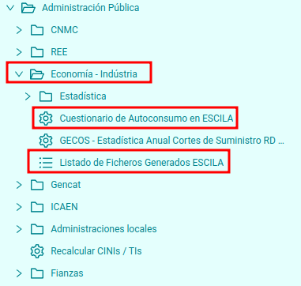
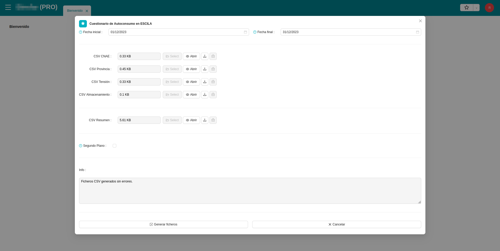
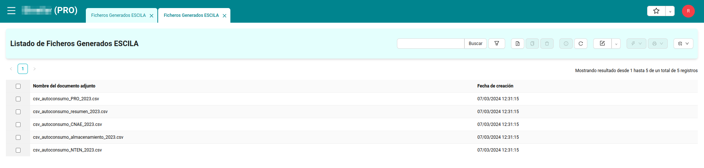
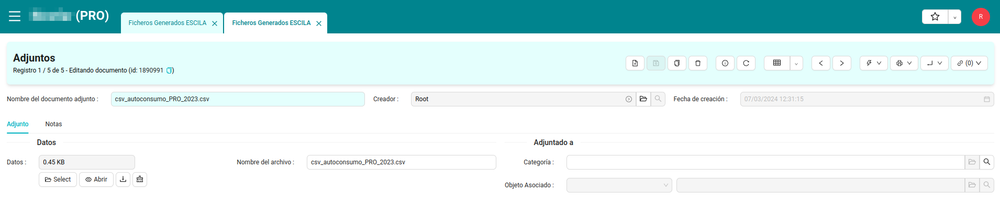
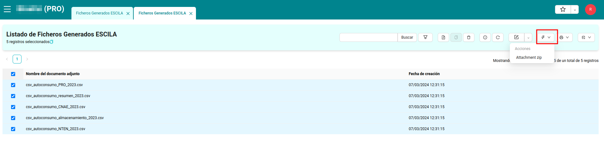

# Mesures ESCILA

Aquest mòdul ens serveix per a la generació de fitxers de mesures ESCILA.

Aquests són qüestionaris de consum d'autoconsum que la Distribuïdora enviarà al Ministeri amb una periodicitat anual.

Els fitxers generats són descarregats pels usuaris i aquests són els encarregats de la seva distribució.

## Menú ESCILA 

En el menú ESCILA es troba dintre de `Administració pública`. Aquí trobarem els apartats necessaris per a la generació dels fitxers i la seva descàrrega.

## Qüestionari d'autoconsum en ESCILA

Aquest ens obre un assistent en el qual podrem seleccionar:

- El rang de dates en les quals volem generar el fitxer.
- **Només si es generen en primer pla**:
    - Un llistat `inputs` indicant una seria de dades referents a cada un dels fitxers a més de l'opció de descarregar-los _(1x1)_.
- Un `checkbox` per determinar si la creació es farà en segon pla _(per defecte: `False`)_.
    - El fet de generar-los en segon pla ens permet:
        - Dur a terme tasques addicionals.
        - Poder recuperar i visualitzar els fitxers després inclús d'haver tancat l'assistent.
- Un camp de text que en el cas de generar els fitxers en primer pla ens indicarà el resultat d'aquest.
    - Si hi ha hagut errors o no i quins han sigut en cas d'haver-n'hi.

## Llistat de fitxers generats ESCILA

Aquí trovarem els fitxers generats en segon pla. 

Seleccionat un d'ells se'ns obrirà un formulari el qual ens permetrà descarregar el fitxer.

També tenim l'opció a través d'un assistent comú, de poder descarregar tots els fitxers seleccionats a l'hora en format `zip`

