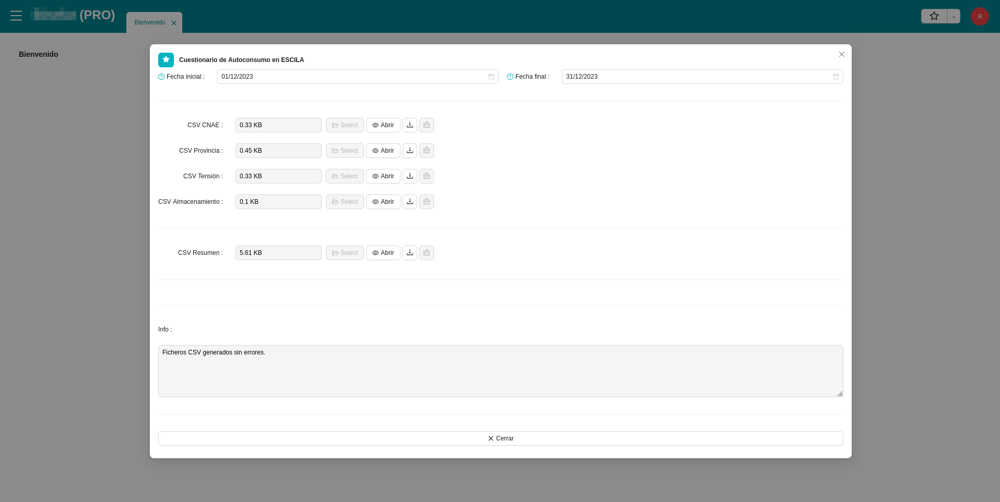

# Mesures ESCILA

Aquest mòdul implementa la generació de fitxers de mesures ESCILA a l'ERP de Distribuïdora.

Aquests són **qüestionaris d'autoconsum** que la Distribuïdora enviarà al Ministerio amb una periodicitat anual. El qüestionari
es sol presentar el mes de març i recull les dades d'autoconsum de tot l'any anterior.

Els fitxers generats són descarregats pels usuaris i aquests són els encarregats d'utilitzar-los per a omplir el qüestionari.

## Menú ESCILA 

El menú ESCILA es troba dintre del menú principal `Administració pública`. Aquí trobarem els apartats necessaris per a la
generació dels fitxers i la seva descàrrega.

## Qüestionari d'autoconsum ESCILA

A l'assistent podem ajustar el següent:

* El rang de dates en les quals volem generar el fitxer. Per defecte, ja ve ajustat amb les dates de l'any anterior.
* Una casella per a determinar si la generació de fitxers es farà o no en segon pla. Generar els fitxers en segon pla permet
tancar l'assistent i seguir treballant amb l'ERP mentre els fitxers es van generant en un procés en paral·lel. Per defecte,
aquesta opció ve desmarcada.

Si els fitxers no es generen en segon pla:

* En acabar el procés, l'assistent mostrarà al camp informatiu el resultat de la generació i els errors trobats durant la 
mateixa.
* També apareixeran els fitxers generats i es podran descarregar un per un de l'assistent. Es genera un CSV per a cada
agregació del qüestionari (per **CNAE**, per **província** i per **tensió**), a més d'un CSV addicional de resum que no cal publicar
però que conté totes les dades a nivell de CAU per si cal revisar-les.

!!! Info "Nota"
    Des de 2024, també s'inclou un CSV amb les dades relatives als **sistemes d'emmagatzematge i bateries**.

Si els fitxers es generen **en segon pla**:

* Es pot tancar l'assistent, ja que els fitxers es continuen generant en un procés independent.
* En acabar la generació dels fitxers, aquests apareixeran al llistat **Llistat de Fitxers Generats ESCILA**. Veure el següent
apartat.

## Llistat de fitxers generats ESCILA

Aquí trobarem els fitxers CSV del qüestionari ESCILA que s'hagin generat en segon pla. 

Seleccionat un d'ells, se'ns obrirà un formulari el qual ens permetrà descarregar el fitxer.

També tenim l'opció a través d'un assistent comú, de poder descarregar tots els fitxers seleccionats a l'hora en format `zip`.

