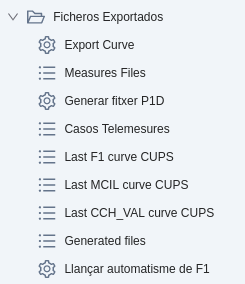
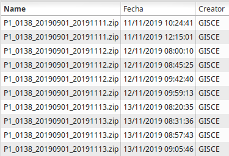

# Mesures REE

## Generació de fitxers de mesures desagregats

L'ERP incorpora eines per a poder generar i publicar fitxers de mesures de forma desagregada, és a dir no a nivell d'agregació
sinó a nivell de CUPS.

Aquestes eines es poden trobar al menú: **Mesures REE > Fitxers Exportats > Exportar Curva**.

A continuació se'n descriuen els detalls:

### Mesures REE
* **Exportar corba:** Aquest assistent és l'eina principal. Permet generar fitxers `F1` i `P1` en el format especificat per REE
per a poder publicar les mesures horaries dels subministraments de Tipus 1, 2 i 3 (més de 50 kW de potència màxima contractada).
* **Fitxers de Mesures:** Aquest llistat mostra els fitxers generats amb l'assistent **Exportar corba**.
* **Generar fitxer P1D:** Aquest assistent permet generar fitxers `P1D`, tant diaris com utilitzant un rang de dates incloses.
* **Casos Telemesures:** Aquest llistat permet revisar els casos CRM oberts a l'hora de generar fitxers, detectant així CUPS pels
quals no s'hagin pogut obtenir els consums horaris. És útil si els fitxers s'han generat en segon pla.
* **Darrera corba F1 dels CUPS**: Aquest llistat permet revisar els CUPS de Tipus 1, 2 i 3 per a comprovar fins a quin dia tenen
publicat el fitxer `F1`.
* **Darrera corba MCIL dels CUPS**: Aquest llistat permet revisar els CUPS de Tipus 3, 4 i 5 amb RECORE o amb autoconsum amb excedents
sense compensació simplificada per a comprovar fins a quin dia tenen publicat el fitxer `MCIL345`.
* **Darrera corba CCH_VAL dels CUPS**: Aquest llistat permet revisar els CUPS per a comprovar fins a quin dia tenen
publicat el fitxer `P5D` (els Tipus 5) o `P1D` (els Tipus 1, 2, 3 i 4 amb autoconsum).
* **Fitxers generats**: Aquest llistat permet revisar els fitxers de mesures generats.
* **Llançar automatisme de F1**: Aquest assistent permet llançar de forma manual l'automatisme que genera i publica els fitxers `F1`
diaris pels CUPS de Tipus 1, 2 i 3. És útil si algun CUPS no s'ha publicat i, després de revisar i corregir problemes al comptador o
a la corba horària, es vol posar al dia sense tenir que esperar a que l'automatisme ho faci l'endemà.

## Fitxers F1

* Codi REE: codi del distribuidor (automàtic)
* Versió del fitxer: versió que s'inclourá un cop exportat el fitxer
* Tipus de fitxer: entre ells F1, P1...
* Dates: data inici i data final incloses (ex: 1 a 31)
* Exportar en background: realitzar la exportació en segon pla. Necessari a
l'exportar grans volums de dades. Els fitxers aniran adjunts al menú Fitxers de
mesures
* Pujar al SFTP Server: exporta el fitxer a cada FTP de cada comercialitzadora
si estan definits
* Comprimir en .bz2: comprimeix el fitxer resultant en .bz2
* Exporta per comercialitadora/es: Exporta només les corbes que pertanyen a
la/les comercialitzadora/es seleccionada/es. Si **es deixa buit**, es farà per
**totes**

Els fitxers anirán adjunts al menú **Mesures REE > Fitxers Exportats > Fitxers de Mesures**.

Dades horàries d'energía de clients tipus 1 i 2.

!!! Info "Nota"
    Es pot utilitzar el "check" per tots els tipus, i es generarà un F1 amb
    tots els tipus, però no és el format per REE.

## Fitxers P1

Dades horàries d'energía de clients tipus 1, 2, 3 i autoconsums tipus 4.

## Fitxers P1D

Dades horàries d'energía de clients tipus 1, 2, 3 i autoconsums tipus 4.

## Fitxers MCIL345 i MEDIDAS

Dades horàries d'energía de clients tipus 1, 2, 3 i autoconsums tipus 4.
