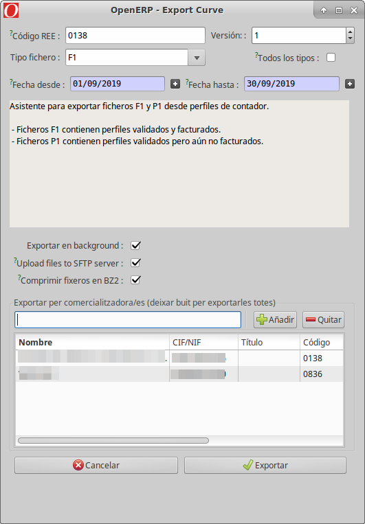

# Generació de fitxers de mesures desagregades

El següent asistent, permet generar fitxers corba, i exportar-los al posible FTP
de la/les comercialitzadores.

Aquest, es pot utilitzar des del menú: **Mesures REE > Fitxers Exportats > Exportar Curva**.
A continuació es descriuen els detalls:

* Codi REE: codi del distribuidor (automàtic)
* Versió del fitxer: versió que s'inclourá un cop exportat el fitxer
* Tipus de fitxer: entre ells F1, P1...
* Dates: data inici i data final incloses (ex: 1 a 31)
* Exportar en background: realitzar la exportació en segon pla. Necessari a
l'exportar grans volums de dades. Els fitxers aniran adjunts al menú Fitxers de
mesures
* Pujar al SFTP Server: exporta el fitxer a cada FTP de cada comercialitzadora
si estan definits
* Comprimir en .bz2: comprimeix el fitxer resultant en .bz2
* Exporta per comercialitadora/es: Exporta només les corbes que pertanyen a
la/les comercialitzadora/es seleccionada/es. Si **es deixa buit**, es farà per
**totes**

Els fitxers anirán adjunts al menú **Mesures REE > Fitxers Exportats > Fitxers de Mesures**.

## F1

Dades horáries d'energía de clients tipus 1 i 2.

!!! Info "Nota"
    Es pot utilitzar el "check" per tots els tipus, i es generará un F1 amb
    tots els tipus, peró no és el format per REE.

## P1

Dades horáries d'energía de clients tipus 1, 2, 3 i autoconsums tipus 4.
