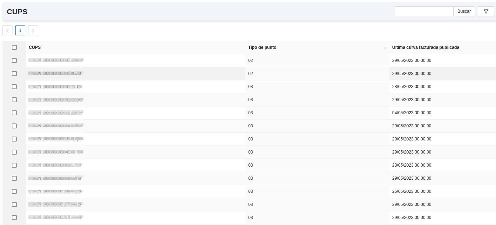
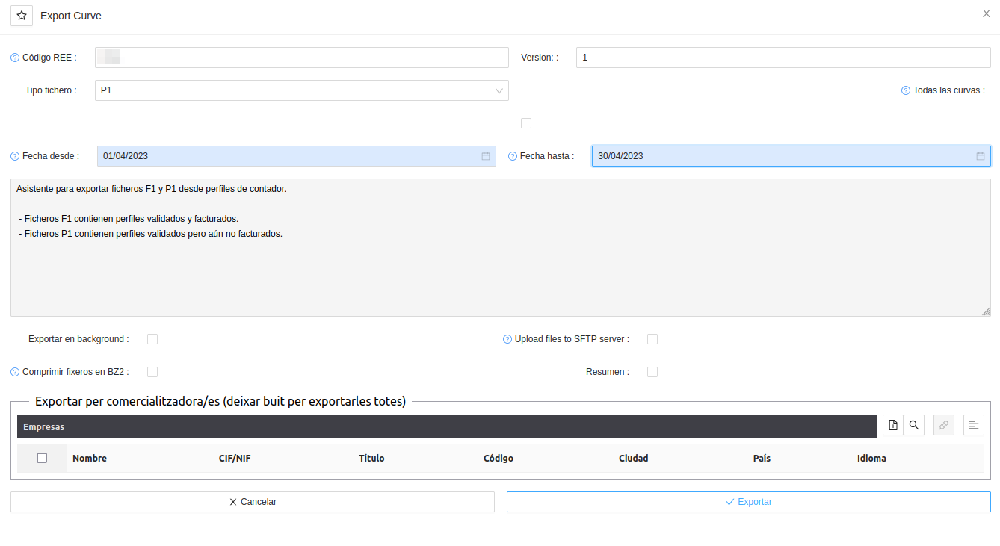
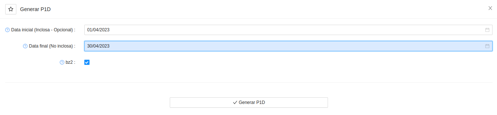

# Mesures REE

## Generació de fitxers de mesures desagregades

L'ERP incorpora eines per a poder generar i publicar fitxers de mesures de forma desagregada, és a dir no a nivell d'agregació
sinó a nivell de CUPS.

Aquestes eines es poden trobar al menú: **Mesures REE > Fitxers Exportats**.

A continuació se'n descriuen els detalls:

### Fitxers Exportats
* **Exportar corba:** Aquest assistent és l'eina principal. Permet generar fitxers `F1` i `P1` en el format especificat per REE
per a poder publicar les mesures horaries dels subministraments de Tipus 1, 2 i 3 (més de 50 kW de potència màxima contractada).
* **Fitxers de Mesures:** Aquest llistat mostra els fitxers generats automàticament per l'ERP. També en permet comprovar l'estat d'enviament.
Així es pot comprovar si els `F1` automàtics es van publicant.
* **Generar fitxer P1D:** Aquest assistent permet generar fitxers `P1D`, tant diaris com utilitzant un rang de dates incloses.
* **Casos Telemesures:** Aquest llistat permet revisar els casos CRM oberts a l'hora de generar fitxers, detectant així CUPS pels
quals no s'hagin pogut obtenir els consums horaris. És útil si els fitxers s'han generat en segon pla.
* **Darrera corba F1 dels CUPS**: Aquest llistat permet revisar els CUPS de Tipus 1, 2 i 3 per a comprovar fins a quin dia tenen
publicat el fitxer `F1`.
* **Darrera corba MCIL dels CUPS**: Aquest llistat permet revisar els CUPS de Tipus 3, 4 i 5 amb RECORE o amb autoconsum amb excedents
sense compensació simplificada per a comprovar fins a quin dia tenen publicat el fitxer `MCIL345`.
* **Darrera corba CCH_VAL dels CUPS**: Aquest llistat permet revisar els CUPS per a comprovar fins a quin dia tenen
publicat el fitxer `P5D` (els Tipus 5) o `P1D` (els Tipus 1, 2, 3 i autoconsums de Tipus 4).
* **Fitxers Generats**: Aquest llistat permet revisar els fitxers de mesures desagregades generats en segon pla.
* **Llançar automatisme de F1**: Aquest assistent permet llançar de forma manual l'automatisme que genera i publica els fitxers `F1`
diaris pels CUPS de Tipus 1, 2 i 3. És útil si algun CUPS no s'ha publicat i, després de revisar i corregir problemes al comptador o
a la corba horària, es vol posar al dia sense tenir que esperar a que l'automatisme ho faci l'endemà.

## Fitxers F1

Els fitxers `F1` comuniquen a l'Operador del Sistema les dades horàries d'energia de punts frontera de clients de Tipus 1, 2 i 3.

L'ERP ja incorpora automatismes que, si es configuren, permeten que cada matí es generin i enviïn els fitxers diaris amb la corba que
es troba als comptadors telemesurats i telegestionats. Però de totes maneres, és possible generar els fitxers de forma manual amb l'assistent
**Mesures REE > Fitxers Exportats > Exportar Corba**.

L'assistent compta amb els següents paràmetres:

* **Codi REE:** Codi de REE del distribuïdor emissor. S'omple automàticament.
* **Versió:** Indica el número de versió del nom del fitxer. Si es generen successius fitxers `F1` un mateix dia, cal anar
incrementant en 1 el número de versió cada nou fitxer, per a que tinguin noms diferents.
* **Tipus de fitxer:** Es pot triar entre fitxer `F1` i `P1`.
* **Dates:** Ajusten el periode de mesures a presentar. Les dates són incloses, per exemple: des de 2023/05/01 fins 2023/05/31.
* **Exportar en segon pla:** Permet realitzar la generació de fitxers en segon pla, deixant l'ERP lliure per a seguir-hi treballant.
Un cop acabada la generació de fitxers, aquests apareixeran al llistat `Fitxers Generats`.
* **Pujar a servidor SFTP:** Si s'activa aquesta opció, cada fitxer F1 es publicarà a l'FTP de la seva Comercialitzadora, si
els servidors SFTP estan degudament configurats a l'ERP.
* **Comprimir fitxers en BZ2:** Si s'activa aquesta opció, els fitxers es comprimiran en format ".bz2", que és l'estàndar de
ASEME. Si no s'activa, els fitxers tindran format de fitxer pla.
* **Resum:** Aquesta opció només es pot utilitzar si els fitxers s'exporten en segon pla. El resum apareixerà al llistat 
`Casos Telemesures` i indicarà el que mostra l'assistent per consola quan es generen els fitxers sense exportar-los en segon pla.
* **Exporta per comercialitadora/es:** Exporta només les corbes que pertanyen a la/les comercialitzadora/es seleccionada/es. 
Si es deixa buit, es farà per a totes,

!!! Info "Nota"
    Existeixen una sèrie d'opcions addicionals que REE no contempla però que s'han anat implementant per a ús particular.
    Una permet generar els fitxers per a tots els Tipus de CUPS i no només pels de Tipus 1, 2 i 3. Una altra permet utilitzar
    corba CCH_VAL si no en troba de CCH_FACT. I una darrera permet decimals en els valors d'energia.

Els fitxers generats es poden revisar des del llistat **Infraestructura > Fitxers Exportats > Fitxers de Mesures**.

A més de poder comprovar la publicació automàtica de `F1` des del llistat **Mesures REE > Fitxers Exportats > Fitxers Generats**,
també es pot anar al llistat **Mesures REE > Fitxers Exportats > Darrera corba F1 dels CUPS**, que es mostra a la següent figura.

Revisant aquest últim llistat de forma freqüent, es poden detectar problemes amb la recepció o validació de corba horària dels CUPS 
que no avancin la seva data de darrera publicació i després d'arreglar el problema es pot llançar manualment l'automatisme o bé
generar un `F1` manualment amb l'assistent `Exportar corba`.

## Fitxers P1

Els fitxers `P1` comuniquen a l'Operador del Sistema les dades horàries d'energia de punts de mesura de clients de Tipus 1, 2, 3
i autoconsums de clients de Tipus 4.

És possible generar els fitxers amb l'assistent **Mesures REE > Fitxers Exportats > Exportar Corba**, seleccionant en aquest cas
com a tipus de fitxer l'opció `P1`.

!!! Info "Nota"
    La generació de fitxers `P1` compta amb menys opcions addicionals que la generació de fitxers `F1`.
    La única opció addicional que permet és la de publicar corba sense validar enlloc de només la validada.

## Fitxers P1D

Els fitxers `P1` comuniquen a l'Operador del Sistema, sense paràmetres de dates, les dades horàries d'energia de punts de mesura 
de clients de Tipus 1, 2, 3 i autoconsums de clients de Tipus 4.

Anàlogament a l'automatització dels fitxers `F1`, és possible configurar i activar un automatisme a l'ERP de Distribuïdora per a que
cada matí publiqui els fitxers `P1D` a l'SFTP de corbes per a que arribin a la CNMC. Però també es poden generar els fitxers de forma
manual amb l'assistent **Mesures REE > Fitxers Exportats > Generar Fitxer P1D**.

Aquest assistent és molt senzill i només cal configurar les dates (si no s'introdueix data inicial, es publicaran els `P1D` de tots els
CUPS des de la seva data de darrera publicació fins ara) i si es vol comprimir en format ".bz2" o no.

!!! Info "Nota"
    El format del `P1D` és el mateix que el del `P1`, però permetent enviar dades
    de més d'un dia en un mateix fitxer.

## Fitxers MCIL345 i MEDIDAS

Hi ha dos fitxers més que habitualment s'envien a l'Operador del Sistema i a la CNMC, comunicant les dades horàries d'energia
per codi CIL: els fitxers `MCIL345` i `MEDIDAS`.

Aquests fitxers es tracten amb detall a l'apartat dels manuals **Mesures de generació**.