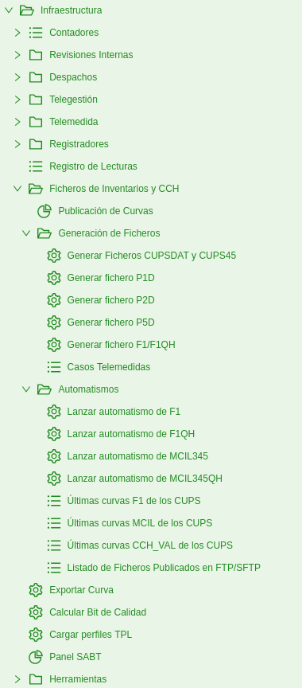
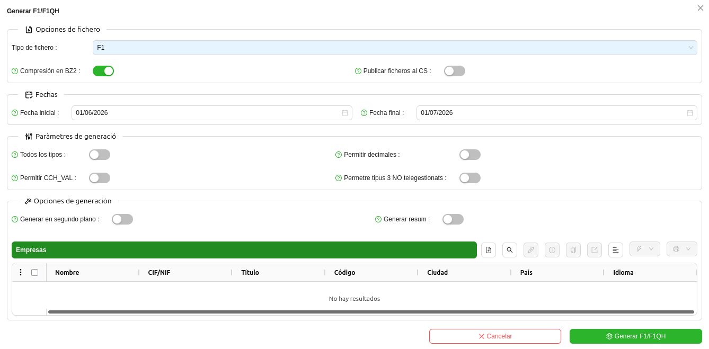
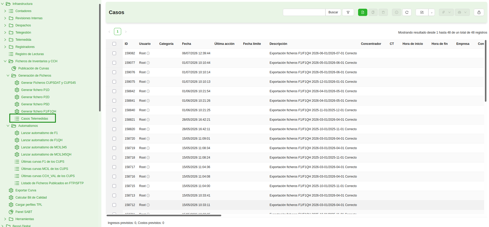
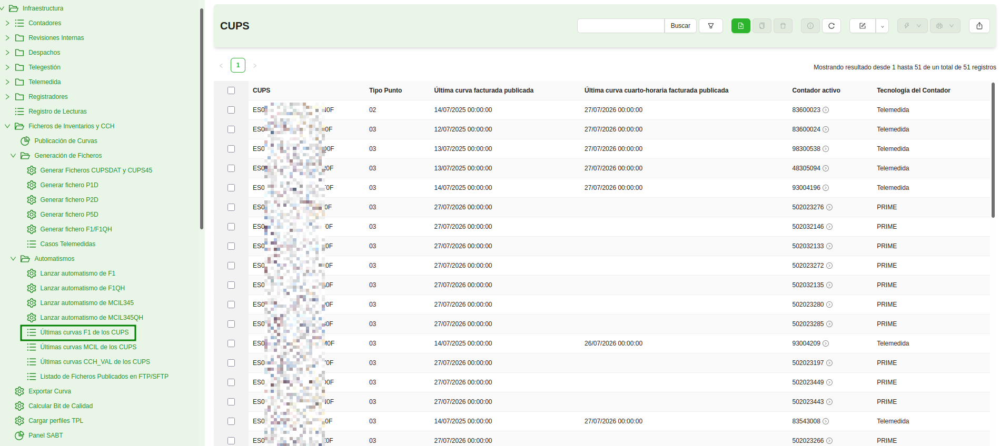
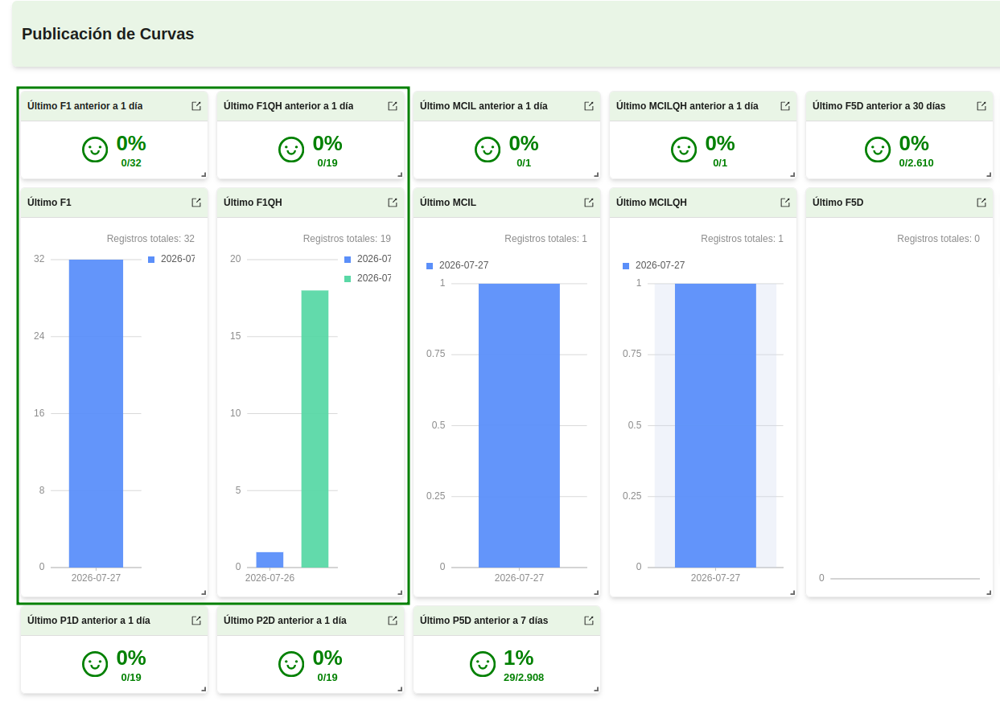
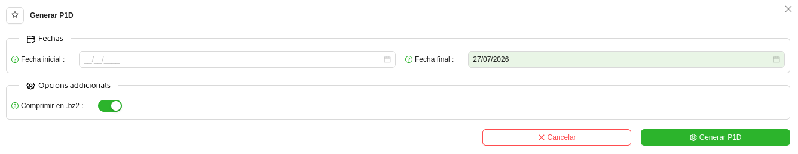
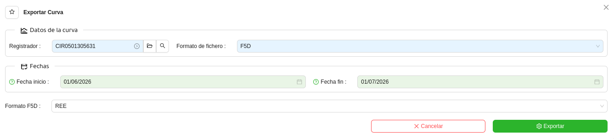

# Mesures REE

## Generació de fitxers de mesures desagregades

L'ERP incorpora eines per a poder generar i publicar fitxers de mesures de forma desagregada, és a dir no a nivell d'agregació
sinó a nivell de CUPS.

Aquestes eines es poden trobar al menú: **Infraestructura > Fitxers d'Inventaris i CCH**.

A continuació se'n descriuen els detalls:

* **Publicació de Corbes:** Drecera per a accedir al panell de Publicació de Corbes, des d'on es pot fer seguiment de les
publicacions automatitzades.

### Generació de Fitxers
* **Generació Fitxers CUPSDAT i CUPS45:** Aquest assistent permet generar els fitxers d'inventaris de CUPS.
* **Generar fitxer P1D:** Aquest assistent permet generar fitxers `P1D`.
* **Generar fitxer P2D:** Aquest assistent permet generar fitxers `P2D`.
* **Generar fitxer P5D:** Aquest assistent permet generar fitxers `P5D`.
* **Generar fitxer F1/F1QH:** Aquest assistent permet generar fitxers `F1` i `F1QH`.
* **Casos Telemesures:** Aquest llistat permet revisar els casos CRM oberts com a resultat de generar fitxers `F1` o `F1QH` en segon pla.

### Automatismes

Els següents assistents són útils si algun CUPS té endarrerida la publicació automàtica d'alguna corba i, després de revisar
i corregir problemes al comptador o a la pròpia corba, es vol posar al dia sense tenir que esperar a que l'automatisme ho faci l'endemà.

* **Llançar automatisme de F1**: Aquest assistent permet llançar de forma manual l'automatisme que genera i publica els fitxers `F1`
diaris pels CUPS de Tipus 3.
* **Llançar automatisme de F1QH**: Aquest assistent permet llançar de forma manual l'automatisme que genera i publica els fitxers `F1QH`
diaris pels CUPS de Tipus 1, 2 i 3.
* **Llançar automatisme de MCIL345**: Aquest assistent permet llançar de forma manual l'automatisme que genera i publica els fitxers `MCIL345`
diaris pels CUPS de Tipus 3, 4 i 5 amb RECORE o amb autoconsum amb excedents sense compensació.
* **Llançar automatisme de MCIL345QH**: Aquest assistent permet llançar de forma manual l'automatisme que genera i publica els fitxers `MCIL345QH`
diaris pels CUPS de Tipus 3, 4 i 5 amb RECORE o amb autoconsum amb excedents sense compensació.

Els següents llistats són per a revisar la data de darrera publicació de corba dels CUPS.

* **Darrera corba F1 dels CUPS**: Aquest llistat permet revisar els CUPS de Tipus 3 per a comprovar fins a quin dia tenen
publicat el fitxer `F1`.
* **Darrera corba MCIL dels CUPS**: Aquest llistat permet revisar els CUPS de Tipus 3, 4 i 5 amb RECORE o amb autoconsum amb excedents
sense compensació simplificada per a comprovar fins a quin dia tenen publicat el fitxer `MCIL345`.
* **Darrera corba CCH_VAL dels CUPS**: Aquest llistat permet revisar els CUPS per a comprovar fins a quin dia tenen
publicat el fitxer `P5D` (els Tipus 5) o `P1D` (els Tipus 1, 2, 3 i autoconsums de Tipus 4).

* **Llistat de Fitxers Publicats en FTP/SFTP:** Aquest llistat serveix per a revisar les darreres publicacions de fitxers a servidors
FTP/SFTP i consultar-ne l'estat.

## Fitxers F1/F1QH

Els fitxers `F1QH` comuniquen a l'Operador del Sistema les dades horàries d'energia de punts frontera de clients de Tipus 1, 2 i 3
que disposen de corba quart-horària (habitualment, els telemesurats). Es fitxers `F1`, en canvi, comuniquen a l'Operador del Sistema
les dades horàries d'energia de punts frontera de clients de Tipus 3 que no disposen de corba quart-horària (habitualment,
els telegestionats).

L'ERP ja incorpora automatismes que, si es configuren, permeten que cada matí es generin i enviïn els fitxers diaris amb la corba que
es troba als comptadors telemesurats i telegestionats. Però de totes maneres, és possible generar els fitxers de forma manual amb l'assistent
**Infraestructura > Fitxers d'Inventaris i CCH > Generació de Fitxers > Generar Fitxer F1/F1QH**.

L'assistent compta amb els següents paràmetres:

### Opcions de fitxer
* **Tipus de fitxer:** Es pot triar entre fitxer `F1` i `F1QH`.

* **Compressió en BZ2:** Si s'activa aquesta opció, els fitxers es comprimiran en format ".bz2", que és l’estàndard de
ASEME. Si no s'activa, els fitxers tindran format de fitxer pla.
* **Publicar fitxer al CS:** Si s'activa aquesta opció, cada fitxer `F1`/`F1QH` es publicarà al Concentrador Secundari
si està configurat a l'ERP.

### Dates
* **Data inicial i Data final:** Ajusten el període de mesures a presentar. La data final és no inclosa, per exemple:
des de 2023/05/01 fins 2023/06/01.

### Paràmetres de generació

Existeixen una sèrie d'opcions addicionals que REE no contempla però que s'han anat implementant per a ús particular. Si
es fan servir, els fitxers resultats no es podran publicar al Concentrador Secundari, ja que la resposta indicarà errors
de format o mesures no esperades.

* **Tots els tipus:** Si s'activa, s'ignora el tipus de punt dels subministraments i s'exportarà la corba per a tots. Pot
ser útil si es volen exportar corbes per a algun propòsit que no sigui publicar-les al Concentrador Secundari (per exemple,
per a comunicar-les a un Comercialitzador).
* **Permetre decimals:** Si s'activa, no s'aplicarà cap arrodoniment a les mesures en kWh.
* **Permetre CCH_VAL:** Si s'activa, es permetrà corba validada (CCH_VAL) enlloc de permetre només corba facturada (CCH_FACT).
* **Permetre tipus 3 no telegestionats:** Si s'activa

### Opcions de generació
* **Generar en segon pla:** Permet realitzar la generació de fitxers en segon pla, deixant l'ERP lliure per a seguir-hi treballant.
Un cop acabada la generació de fitxers, aquests apareixeran al llistat `Casos Telemesures`, adjunts a registres CRM.
* **Generar resum:** Aquesta opció només es pot utilitzar si els fitxers s'exporten en segon pla. El resum apareixerà al llistat
`Casos Telemesures` i indicarà el que mostra l'assistent per consola quan es generen els fitxers sense exportar-los en segon pla.

* **Exporta per comercialitzadora/es:** Exporta només les corbes que pertanyen a la/les comercialitzadora/es seleccionada/es.
Si es deixa buit, es farà per a totes.

Els fitxers generats es poden revisar des del llistat **Infraestructura > Fitxers d'Inventaris i CCH > Generació de Fitxers > Casos Telemesures**.

La publicació automàtica de `F1` i `F1QH` es pot comprovar des del llistat **Infraestructura > Fitxers d'Inventaris
i CCH > Automatismes > Darreres corbes F1 dels CUPS**.

A més a més, també es pot revisar la publicació des del panell de **Publicació de Corbes**, que és més pràctic i llegible.

Revisant aquest últim panell de forma freqüent, es poden detectar problemes amb la recepció o validació de corba dels CUPS
que no avancin la seva data de darrera publicació i després d'arreglar el problema es pot llançar manualment l'automatisme o bé
generar un `F1` o `F1QH` manualment amb l'assistent `Generar fitxer F1/F1QH`.

## Fitxers P1D

Els fitxers `P1D` comuniquen, sense paràmetres de dates, les dades horàries d'energia de punts de mesura de clients de Tipus 1,
2, 3 i autoconsums de clients de Tipus 4.

Anàlogament a l'automatització dels fitxers `F1` i `F1QH`, és possible configurar i activar un automatisme a l'ERP de Distribuïdora per a que
cada matí publiqui els fitxers `P1D` a l'SFTP de corbes per a que arribin a les Comercialitzadores. Però també es poden generar els fitxers de forma
manual amb l'assistent **Infraestructura > Fitxers d'Inventaris i CCH > Generació de Fitxers > Generar Fitxer P1D**.

Aquest assistent és molt senzill i només cal configurar les dates (si no s'introdueix data inicial, es publicaran els `P1D` de tots els
CUPS des de la seva data de darrera publicació fins ara) i si es vol comprimir en format ".bz2" o no.

## Fitxers P2D

Els fitxers `P2D` comuniquen, sense paràmetres de dates, les dades quart-horàries d'energia de punts de mesura de clients de Tipus 1,
2 i 3.

El seu funcionament, a nivell d'automatització i a nivell de generació manual dels fitxers, és idèntic al dels fitxers `P1D`.

## Fitxers P5D

Els fitxers `P5D` comuniquen, sense paràmetres de dates, les dades horàries d'energia de punts de mesura de clients de Tipus
3, 4 i 5 integrats en el sistema de telegestió.

El seu funcionament, a nivell d'automatització i a nivell de generació manual dels fitxers, és idèntic al dels fitxers `P1D`.

## Exportador de corbes genèric

L'ERP compta amb una eina molt potent per a exportar una corba entre dues dates, d'un registrador en particular, triant el
format del fitxer a generar. Trobareu l'assistent a **Infraestructura > Exportar Corba**.

Alguns tipus de fitxers poden fer aparèixer paràmetres addicionals a l’assistent, com un selector per a indicar si es vol
fer servir la CCH_FACT o no, o com un camp de text per a informar el Codi del Punt de Mesura (els `PMEST` i `PMESTQH`).

Aquest assistent és especialment útil quan hi ha la necessitat de publicar una corba en un format específic per a un únic
CUPS. Per exemple, quan es respon a una reclamació d'una Comercialitzadora o quan es torna a publicar una mesura després d'haver
acceptat una Objecció.
