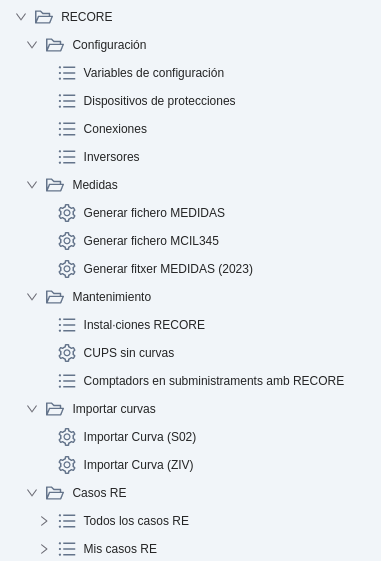
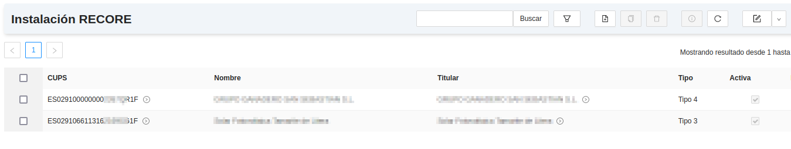
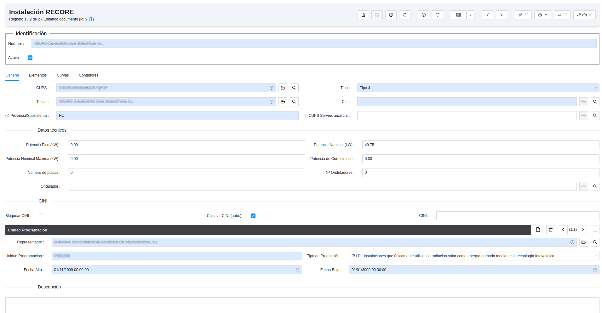
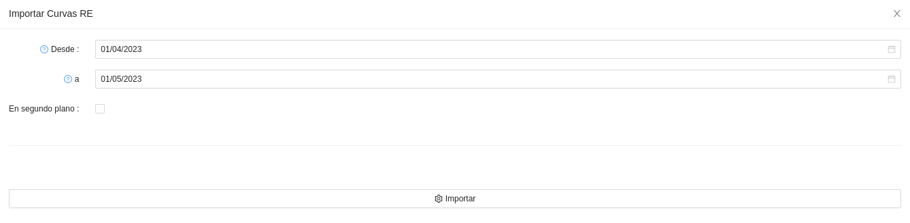
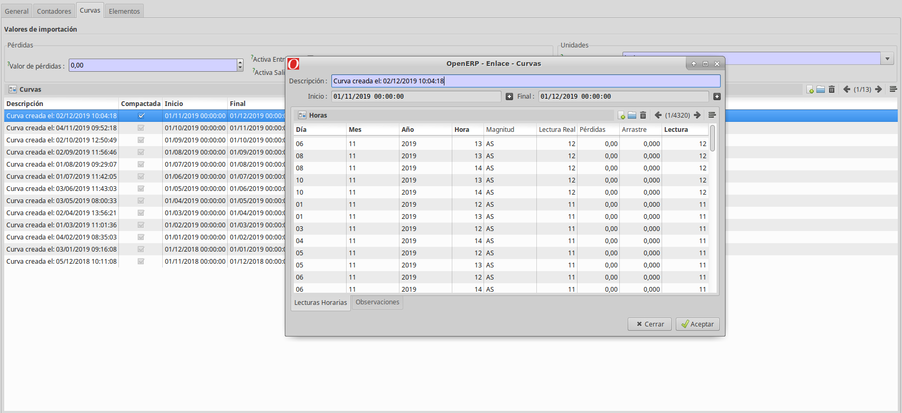
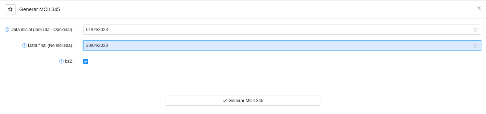
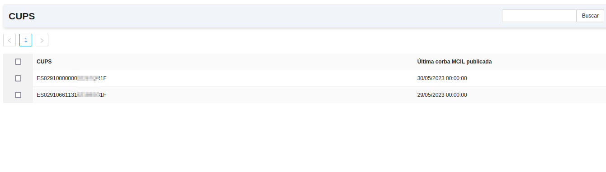
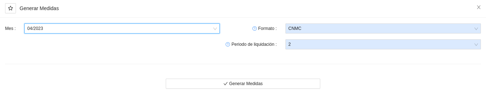
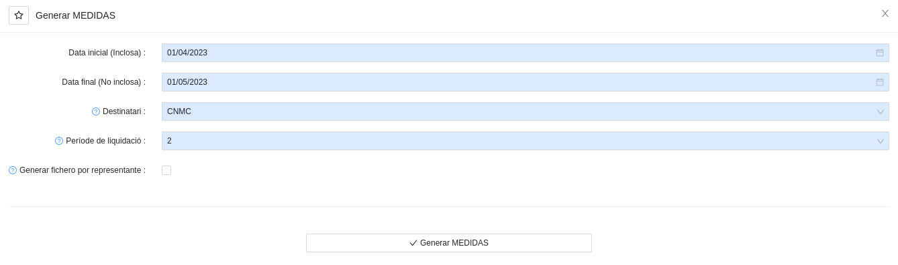

# Mesures REE

## Mesures de Generació

L'ERP incorpora eines per a poder generar i publicar fitxers de mesures de generació de forma desagregada pels CIL, és a dir, 
per a les instal·lacions de RECORE (Renovables, Cogeneració y Residus) i per autoconsums amb excedents sense compensació 
simplificada (autoconsums que venen generació a mercat a través d'un representant).

Totes les eines es troben al menú **Gestió de CUPS > RECORE**.

A continuació se'n descriuen els detalls:

### Configuració
* **Variables de configuració:** Aquest llistat mostra les variables de configuració de l'ERP que fan referència al RECORE.
* **Dispositius de proteccions:** Aquest llistat mostra l'inventari de dispositius de proteccions.
* **Connexions:** Aquest llistat mostra l'inventari de connexions.
* **Inversors:** Aquest llistat mostra l'inventari d'inversors.
### Mesures
* **Generar fitxer MEDIDAS**: Aquest assistent permet generar el fitxer `MEDIDAS` en els formats especificats per REE i per la CNMC.
Requereix haver importat a les instal·lacions de RECORE les corbes abans. Només té en compta els RECORE, però no els autoconsums.
* **Generar fitxer MCIL345**: Aquest assistent permet generar el fitxer `MCIL345` en el format especificat per REE.
Les corbes s'obtenen dels comptadors associats als contractes amb RECORE o amb autoconsum amb excedents sense compensació simplificada.
* **Generar fitxer MEDIDAS (2023)**: Aquest assistent permet generar el fitxer `MEDIDAS` en els formats especificats per REE i per la CNMC.
Les corbes s'obtenen dels comptadors associats als contractes amb RECORE o amb autoconsum amb excedents sense compensació simplificada.
Es preveu la substitució de l'assistent `Generar fitxer MEDIDAS` per aquesta nova versió en un futur proper, ja que és millor.
### Manteniment
* **Instal·lacions RECORE**: Aquest llistat permet revisar les instal·lacions de RECORE.
* **CUPS sense corbes**: Aquest llistat mostra les instal·lacions de RECORE que no tenen la corba importada donat un rang de dates.
* **Comptadors en subministraments amb RECORE**: Aquest llistat mostra els comptadors associats a subministraments amb RECORE.
### Importar corbes
* **Importar Corba (S02):** Aquest assistent permet importar una corba a una instal·lació de RECORE a partir d'un fitxer en format
`S02` del protocol `PRIME`.
* **Importar Corba (ZIV):** Aquest assistent permet importar una corba a una instal·lació de RECORE a partir d'un fitxer en format `Ziverq`.
### Casos RE
* **Tots els casos RE:** Aquest llistat mostra els casos RE que s'hagin obert al importar corbes de generació a instal·lacions de RECORE.
* **Els meus casos RE:** Aquest llistat mostra els casos RE de l'usuari actual.

## Manteniment d'instal·lacions

Des del menú: **Gestió de CUPS > RECORE > Manteniment > Instal·lacions RECORE** accedim a les
instal·lacions de RECORE donades d'alta. Cada instal·lació porta associat un CUPS,
un representant i una unitat de programació entre d'altres paràmetres.

Per a crear-ne una, fem clic sobre el botó nou. A continuació es mostren i s'en descriuen els detalls:

* **Nom:** Nom de la instal·lació.
* **CUPS:** El CUPS associat al RECORE. Cal destacar que els punts de subministre de règim especial, solen acabar
amb la terminació `1F` enlloc de `0F`.
* **Titular:** Titular de la instal·lació de RECORE.
* **Tipo:** Tipus de punt segons la potència nominal (1, 2, 3, 4 o 5)
* **Província/Subsistema:** Codi REE de la província, o del subsistema si es tracta d'un RECORE extra-peninsular.
* **Dades tècniques:** En aquest apartat s'introdueixen les potències, el número de plaques i altres paràmetres tècnics.
    * **Potència Pic** (kW)
    * **Potència Nominal** (kW)
    * **Potència Nominal Màxima** (kW)
    * **Potencia de Curtcircuit** (kW)
    * **Nombre de plaques**
    * **Nombre d'ondul·ladors**
    * **Ondulador**
* **CINI:** Codi d'identificació normalitzada de la instal·lació de RECORE.
* **Unitat de Programació**
    * **Representant:** Nom del representant (cal tenir creat el partner prèviament per a assignar-lo).
    * **Unitat de Programació:** Codi de la Unitat de Programació (associada al representant).
    * **Dates:** Alta i baixa de la Unitat de Programació. Si no hi ha data de baixa, quedarà com a data de baixa l'1 de gener del 3000.
* **Descripció:** Es poden afegir detalls addicionals a la instal·lació de RECORE, tals com dates en que s'han fet canvis.

!!! Info "Nota"
    Tota instal·lació de RECORE requereix un contracte de Serveis Auxiliars associat.

## Preparació de les dades

Abans de generar els fitxers de mesures d'un RECORE, cal preparar-ne les corbes. Es pot fer de diverses formes:

* **Important-la des d'un S02:** Important fitxers corba de tipus `S02.xml`, l'estàndar de corbes del protocol `PRIME` telegestionat.
* **Important-la des d'un fitxer ZiverQ:** Important fitxers corba de tipus `ZiverQ`.
* **Importar des del comptador telegestionat/telemesurat:** Importa directament la corba del
comptador que ens ha arribat o que hem importat del sistema de telegestió i/o telemesura.

Les corbes importades es guarden a la pestaña corbes de cada instal·lació de RECORE.

!!! Info "Nota"
    Si la corba s'importa des del comptador del CUPS associat i aquesta no se troba completa, es perfilarà la generació
    utilitzant els tancaments de generació i els perfils de RECORE publicats per REE, utilitzant els que corresponguin 
    segons la seva zona i tecnologia de generació. D'aquesta manera, es garanteix que la corba que queda a les instal·lacións 
    de RECORE sempre és completa, tot i que pot presentar problemes a l'hora de tornar a publicar mesures de mesos passats,
    com s'explica més endavant.

## Generació de fitxers

Les mesures dels RECORE s'informen amb dos fitxers diferents:

* **MCIL345:** Dades horàries d'energia per codi CIL d'instal·lacions de
  producció d'energia elèctrica a partir de fonts d'energia renovables,
  cogeneració i residus tipus 3, 4 i 5. Es comunica a REE de forma diària des de l'1 de gener de 2023.
* **MEDIDAS:** Dades horàries d'energia per codi CIL d'instal·lacions de
  producció d'energia elèctrica a partir de fonts d'energia renovables,
  cogeneració i residus tipus 3 i 5. Es comunica a REE i a la CNMC de forma mensual en mes M+1. Però a REE va 
  ser substituit pel `MCIL345` des de l'1 de gener de 2023.

!!! Info "Nota"
    La principal diferència entre els fitxers `MCIL345` i `MEDIDAS`, a més a més del receptor, és que el primer inclou
    totes les magnituts (energies activa entrant, activa sortint i les quatre reactives) mentre que el segon tan sols inclou
    les magnituts d'energia sortint (activa sortint i reactives dels quadrants R2 i R3).

### Fitxer MCIL345

L'ERP ja incorpora automatismes que, si es configuren, permeten que cada matí es generin i enviïn els fitxers diaris amb la corba que
es troba als comptadors telemesurats i telegestionats associats a contractes amb RECORE o amb autoconsum amb excedents sense
compensació simplificada. El funcionament d'aquest automatisme és molt similar al dels que publiquen els fitxers `F1` o els fitxers `P1D`,
que es presenten a la secció del manual **Mesures Desagregades**.

Els fitxers `MCIL345` també es poden generar manualment des de l'assistent **Gestió de CUPS > RECORE > Mesures > Generar fitxer MCIL345**.

Aquest assistent és molt senzill i només cal configurar les dates (si no s'introdueix data inicial, es publicaran els `MCIL345` de tots els
CUPS des de la seva data de darrera publicació fins ara) i si es vol comprimir en format ".bz2" o no.

Es pot revisar fins a quina data s'han publicat els fitxers `MCIL345` des del llistat **Infraestructura > Fitxers Exportats > Darrera corba MCIL dels CUPS**.

Revisant aquest últim llistat de forma freqüent, es poden detectar problemes amb la recepció o validació de corba horària dels CUPS 
que no avancin la seva data de darrera publicació. Un cop resolt el problema, es pot generar i publicar manualment un `MCIL345` per a posar-ho tot al dia,
o bé esperar a que l'automatisme ho posi al dia l'endemà.

### Fitxer MEDIDAS

#### Assistent antic per a generar el fitxer MEDIDAS (previ a 2023)

Els fitxers `MEDIDAS` es poden generar des de l'assistent **Gestió de CUPS > RECORE > Mesures > Generar fitxer MEDIDAS**.

En aquest assistent cal ajustar els següents camps abans de prèmer el botó **Generar Mesures**:

* **Mes:** El mes natural pel qual es vol generar el fitxer `MEDIDAS`. Només apareixeran mesos pels quals existeixin corbes
a com a mínim una de les instal·lacións de RECORE.
* **Format:** El format del fitxer sortint. El fitxer `MEDIDAS` té dos formats, el de REE i el de la CNMC. El format de la CNMC
permet valors negatius a la generació (apareixeran en hores en que hi ha més energia entrant que sortint), mentre que el format
de REE limitarà a 0 aquests valors. El format de la CNMC és un fitxer comprimit en ".zip" amb un fitxer ".txt" dins, mentre que
el format de REE és un fitxer pla comprimit en ".bz2".
* **Període de liquidació:** El valor numèric de la liquidació. Per exemple, serà `2` pel mes M-1. Cal ajustar-lo per a que el
nom del fitxer reflecteixi aquest número de liquidació. A l'ajuda d'aquest camp es mostra més informació al respecte.

!!! Info "Nota 1"
    El CIL d'un RECORE es construirà a partir del CUPS que tingui assignada la instal·lació de RECORE, afegint la terminació
    especial 001. Tot i això, mitjançant una variable de configuració es poden establir "conversions" per si hi ha algun CIL
    d'alta a REE que no encaixi amb aquesta construcció habitual.

!!! Info "Nota 2"
    Aquest assistent no exporta les corbes dels autoconsums amb excedents i sense compensació simplificada. Només exporta les
    corbes que s'han carregat prèviament a les instal·lacions de RECORE, amb els mètodes indicats al subapartat anterior.

!!! Info "Nota 3"
    Degut a que aquest assistent requereix importar les corbes a les instal·lacions, si es vol tornar a publicar una mesura
    de fa mesos, caldria tornar-ne a importar la corba a la instal·lació i després generar el fitxer `MEDIDAS`, però això
    pot comportar problemes si la corba del comptador es troba ajustada. Per això, s'ha implementat un nou assistent que
    es presenta al darrer subapartat d'aquesta secció del manual.

#### Assistent nou per a generar el fitxer MEDIDAS (versió de 2023)

Aprofitant que s'implementava la generació del fitxer `MCIL345` per a poder generar i publicar aquest fitxer des de primers
de 2023, es va implementar un nou assistent per a generar el fitxer `MEDIDAS` que segueix exactament la mateixa estratègia.

Amb aquest nou assistent, sí s'inclouen els CIL associats a autoconsums amb excedents sense compensació simplificada i també
es pot tornar a publicar una mesura de fa mesos sense que hi hagi problemes si la corba té ajustos al comptador.

Trobareu l'assistent nou a **Gestió de CUPS > RECORE > Mesures > Generar fitxer MEDIDAS (2023)**.

Els ajustos són pràcticament idèntics als de l'assistent que genera el fitxer `MCIL345`, afegint l'opció de generar el fitxer
agrupant els CIL per representant i que els camps de la data s'introdueixen manualment enlloc de triar-los d'un sel·lector
(data inicial inclosa, data final no inclosa, per exemple: de 2023/04/01 fins 2023/05/01).

!!! Info "Nota"
    Es preveu que a la llarga només s'utilitzi aquest assistent per a generar els fitxers `MEDIDAS`, ja que té molts
    avantatges envers l'assistent antic: inclou no només els RECORE sino també els autoconsums amb excedents a mercat,
    permet republicar mesos anteriors sense tenir problemes si hi ha ajustos a la corba i és més senzill i intuïtiu, al
    no requerir importar les corbes a les instal·lacionsd e RECORE com a pas previ.
