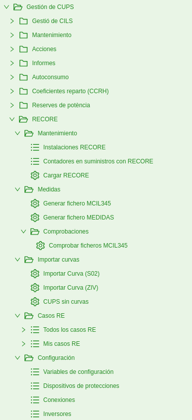
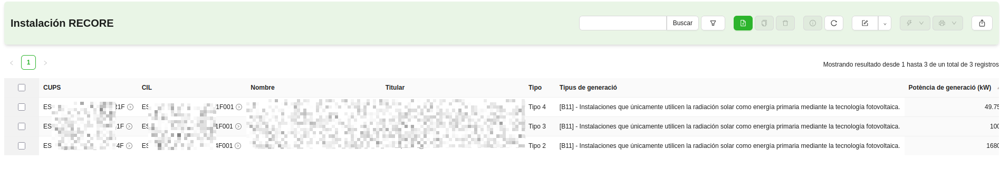
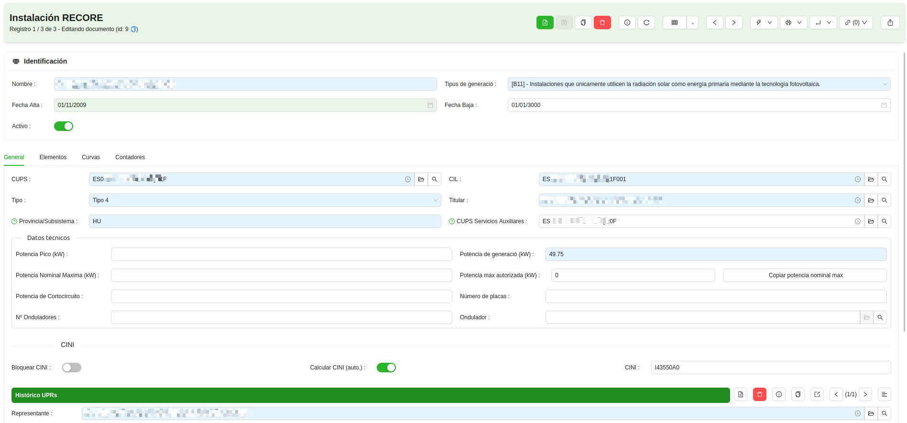
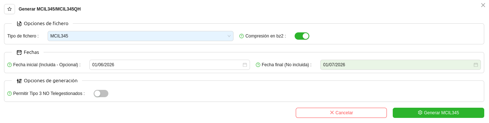
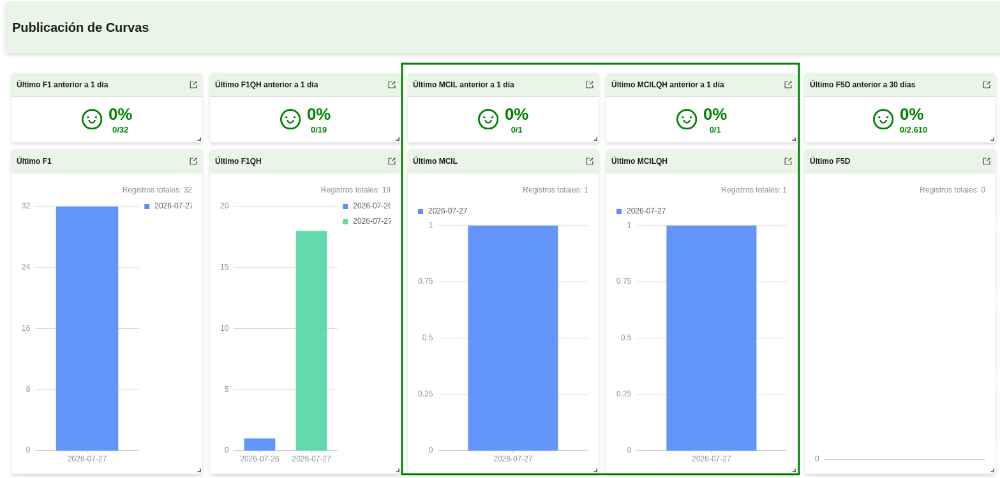
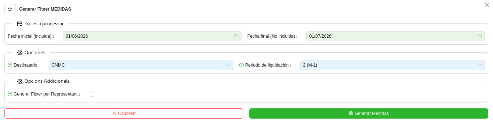

# Mesures REE

## Mesures de Generació

L'ERP incorpora eines per a poder generar i publicar fitxers de mesures de generació de forma desagregada pels CIL, és a dir,
per a les instal·lacions de RECORE (Renovables, Cogeneració i Residus) i per autoconsums amb excedents sense compensació
simplificada (autoconsums que venen generació a mercat a través d'un representant).

Totes les eines es troben al menú **Gestió de CUPS > RECORE**.

A continuació se'n descriuen els detalls:

### Manteniment
* **Instal·lacions RECORE**: Aquest llistat permet revisar les instal·lacions de RECORE.
* **Comptadors en subministraments amb RECORE**: Aquest llistat mostra els comptadors associats a subministraments amb RECORE.
* **Carregar RECORE**: Assistent per a importar instal·lacions de RECORE des de fitxers de REE.

### Mesures
* **Generar fitxer MCIL345**: Aquest assistent permet generar els fitxers `MCIL345` i `MCIL345QH` en el format especificat per REE.
Les corbes s'obtenen dels comptadors associats als contractes amb RECORE o amb autoconsum amb excedents sense compensació simplificada.
* **Generar fitxer MEDIDAS**: Aquest assistent permet generar el fitxer `MEDIDAS` en els formats especificats per la CNMC.
Les corbes s'obtenen dels comptadors associats als contractes amb RECORE o amb autoconsum amb excedents sense compensació simplificada.
* **Comprovar fitxers MCIL345**: Aquest assistent permet importar un fitxer `MCIL345` o `MCIL345QH` i en retorna una anàlisi de
la informació publicada en el fitxer.

### Importar corbes
Aquestes eines no es fan servir des de 2022 i, en algun moment, desapareixeran de l'ERP.

* **Importar Corba (S02):** Aquest assistent permet importar una corba a una instal·lació de RECORE a partir d'un fitxer en format
`S02` del protocol `PRIME`.
* **Importar Corba (ZIV):** Aquest assistent permet importar una corba a una instal·lació de RECORE a partir d'un fitxer en format `Ziverq`.

### Casos RE
* **Tots els casos RE:** Aquest llistat mostra els casos RE que s'hagin obert al importar corbes de generació a instal·lacions de RECORE.
* **Els meus casos RE:** Aquest llistat mostra els casos RE de l'usuari actual.

### Configuració
* **Variables de configuració:** Aquest llistat mostra les variables de configuració de l'ERP que fan referència al RECORE.
* **Dispositius de proteccions:** Aquest llistat mostra l'inventari de dispositius de proteccions.
* **Connexions:** Aquest llistat mostra l'inventari de connexions.
* **Inversors:** Aquest llistat mostra l'inventari d'inversors.

## Manteniment d'instal·lacions

Des del menú: **Gestió de CUPS > RECORE > Manteniment > Instal·lacions RECORE** accedim a les
instal·lacions de RECORE donades d'alta. Cada instal·lació porta associat un CUPS,
un representant i una unitat de programació entre d'altres paràmetres.

Per a crear-ne una, fem clic sobre el botó nou. A continuació es mostren i s'en descriuen els detalls:

* **Nom:** Nom de la instal·lació.
* **Tipus de generació:** Informa el subgrup de generació segons especifica la CNMC (per exemple `B11` per a Fotovoltaica).
* **Dates:** Alta i baixa de la instal·lació. Si no hi ha data de baixa, quedarà com a data de baixa l'1 de gener del 3000.

* **CUPS:** El CUPS associat al RECORE. Cal destacar que els punts de subministre de règim especial, solen acabar
amb la terminació `1F` enlloc de `0F`.
* **CIL:** El CIL associat al RECORE. Sol ser el CUPS amb la terminació `001`.
* **Tipus:** Tipus de punt segons la potència nominal (1, 2, 3, 4 o 5)
* **Titular:** Titular de la instal·lació de RECORE.
* **Província/Subsistema:** Codi REE de la província, o del subsistema si es tracta d'un RECORE extra-peninsular.
* **CUPS Serveis Auxiliars:** El CUPS amb el contracte de Serveis Auxiliars associat al RECORE.

* **Dades tècniques:** En aquest apartat s'introdueixen les potències, el número de plaques i altres paràmetres tècnics.
    * **Potència Pic** (kW)
    * **Potència Nominal** (kW)
    * **Potència Nominal Màxima** (kW)
    * **Potencia de Curtcircuit** (kW)
    * **Nombre de plaques**
    * **Nombre d'ondul·ladors**
    * **Ondulador**
* **CINI:** Codi d'identificació normalitzada de la instal·lació de RECORE.
* **Unitat de Programació**
    * **Representant:** Nom del representant (cal tenir creat el partner prèviament per a assignar-lo).
    * **Unitat de Programació:** Codi de la Unitat de Programació (associada al representant).
    * **Dates:** Alta i baixa de la Unitat de Programació. Si no hi ha data de baixa, quedarà com a data de baixa l'1 de gener del 3000.
* **Descripció:** Es poden afegir detalls addicionals a la instal·lació de RECORE, tals com dates en que s'han fet canvis.

!!! Info "Nota"
    Tota instal·lació de RECORE requereix un contracte de Serveis Auxiliars associat per a facturar els consums.

## Generació de fitxers

Les mesures dels RECORE s'informen amb dos fitxers diferents:

* **MCIL345:** Dades horàries d'energia per codi CIL d'instal·lacions de
  producció d'energia elèctrica a partir de fonts d'energia renovables,
  cogeneració i residus tipus 3, 4 i 5. Es comunica a REE de forma diària des de l'1 de gener de 2023.
* **MCIL345QH:** Dades quart-horàries d'energia per codi CIL d'instal·lacions de
  producció d'energia elèctrica a partir de fonts d'energia renovables,
  cogeneració i residus tipus 3, 4 i 5. Es comunica a REE de forma diària des de l'1 de gener de 2023.
* **MEDIDAS:** Dades horàries d'energia per codi CIL d'instal·lacions de
  producció d'energia elèctrica a partir de fonts d'energia renovables,
  cogeneració i residus tipus 3, 4 i 5. Es comunica a la CNMC de forma mensual en mes M+1.

!!! Info "Nota"
    La principal diferència entre els fitxers `MCIL345` i `MEDIDAS`, a més a més del receptor, és que el primer inclou
    totes les magnituts (energies activa entrant, activa sortint i les quatre reactives) mentre que el segon tan sols inclou
    les magnituts d'energia sortint (activa sortint i reactives dels quadrants R2 i R3).

### Fitxers MCIL345 i MCIL345QH

L'ERP ja incorpora automatismes que, si es configuren, permeten que cada matí es generin i enviïn els fitxers diaris amb la corba que
es troba als comptadors telemesurats i telegestionats associats a contractes amb RECORE o amb autoconsum amb excedents sense
compensació simplificada. El funcionament d'aquest automatisme és molt similar al dels que publiquen els fitxers `F1` o els fitxers `P1D`,
que es presenten a la secció del manual **Mesures Desagregades**.

Els fitxers `MCIL345` i `MCIL345QH` també es poden generar manualment des de l'assistent **Gestió de CUPS > RECORE > Mesures > Generar fitxer MCIL345**.

Aquest assistent és molt senzill i només cal triar el tipus de fitxer, configurar les dates (data final no inclosa) i
si es vol comprimir en format ".bz2" o no.

Es pot revisar fins a quina data s'han publicat els fitxers `MCIL345` i `MCIL345QH` des del panell **Publicació de Corbes**.

Revisant el panell de forma freqüent, es poden detectar problemes amb la recepció o validació de corba horària dels CUPS
que no avancin la seva data de darrera publicació. Un cop resolt el problema, es pot generar i publicar manualment un
`MCIL345` o `MCIL345QH` per a posar-ho tot al dia, o bé esperar a que l'automatisme ho posi al dia l'endemà.

### Fitxer MEDIDAS

Podreu generar els fitxers `MEDIDAS` des de l'assistent **Gestió de CUPS > RECORE > Mesures > Generar fitxer MEDIDAS**.

Els ajustos són pràcticament idèntics als de l'assistent que genera el fitxer `MCIL345` i `MCIL345QH`, afegint l'opció
de generar el fitxer agrupant els CIL per representant i que un selector ens permet triar directament la liquidació,
actualitzant així el rang de dates a utilitzar.

!!! Info "Nota"
    Al selector de liquidacions trobareu una opció per a generar de cop els fitxers per a les liquidacions 2, 3 i 5.
    Això és pràctic a l'hora de publicar els fitxers dels períodes `M-1`, `M-3` i `M-11` al portal de càrrega de la CNMC.
