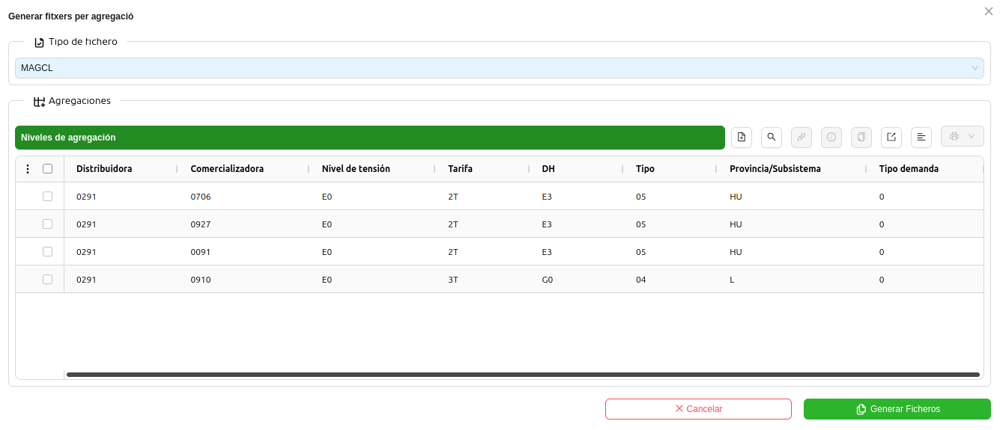
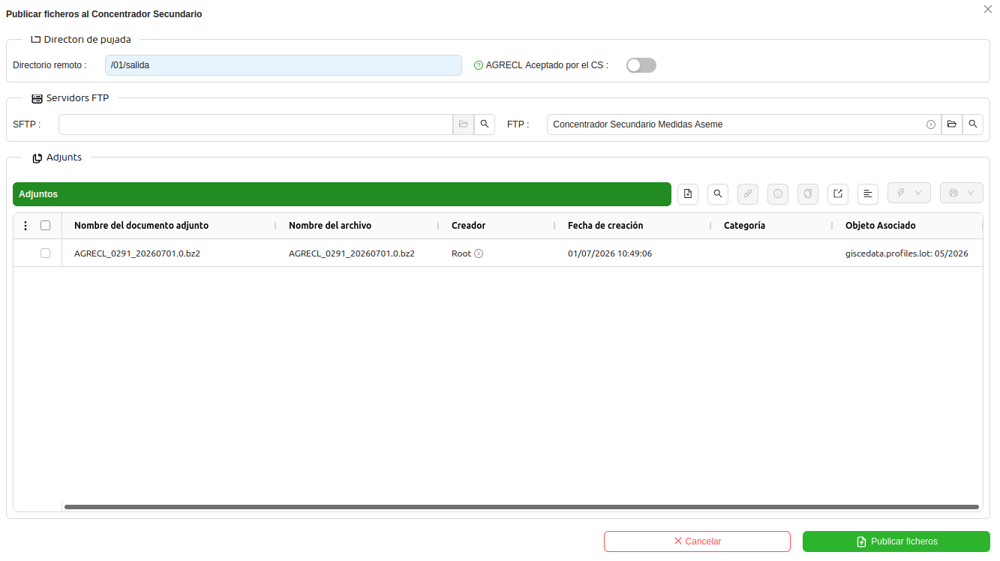
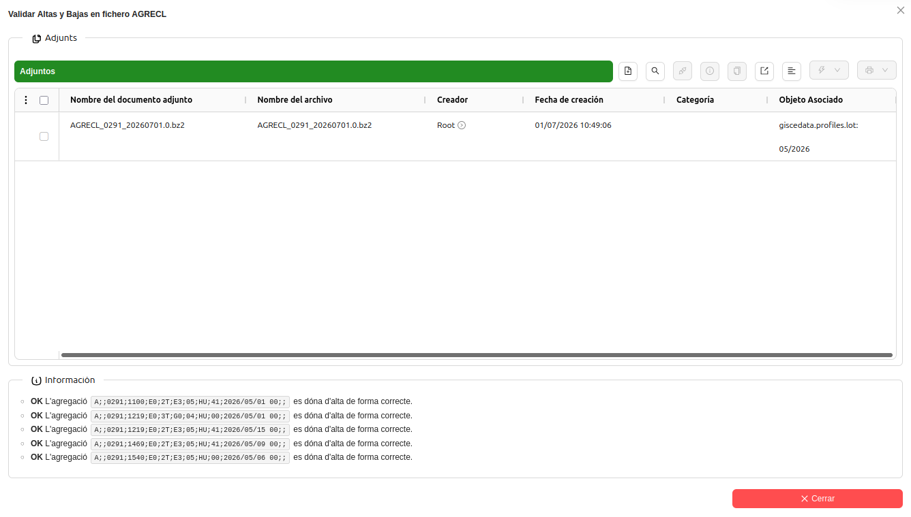
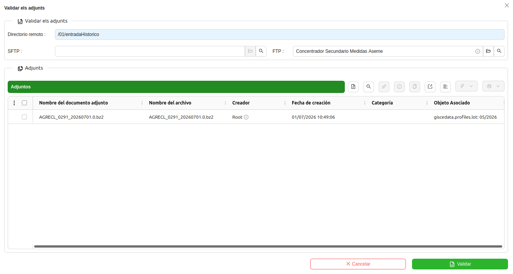
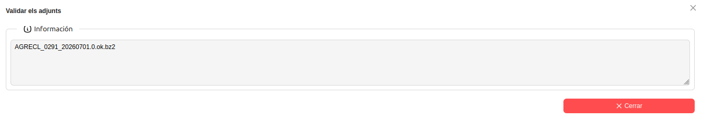
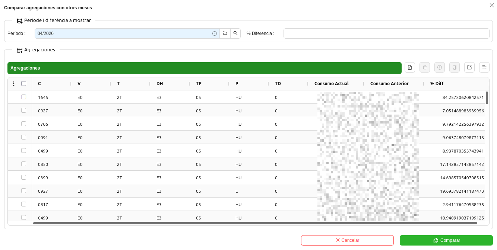

# Eines per al tractament de fitxers de mesures

Algunes eines avançades ens ajuden i fan més fàcil el tractament de fitxers d'intercanvi de mesures. Trobareu aquestes
eines a mode d'assistent o d'enllaç invocable des d'un Període de Mesures.

## Generar fitxer per Agregació

Sovint pot ser útil generar un fitxer amb només una o diverses agregacions, i així no haver de generar-lo per totes,
amb el temps d'espera que comportaria. Per aquest motiu, a les accions d'un període de mesures trobareu l'assistent
**Generar Fitxer per agregació**.

L'assistent permet generar fitxers `MAGCL` i `INMECL` per a una o diverses agregacions. Per utilitzar-lo,
cal primer triar el tipus de fitxer que es vol generar, i després afegir-hi l'agregació o agregacions que
es desitgin. Això pot anar bé per respondre possibles objeccions que ens faci arribar una comercialitzadora.

Els fitxers es generaran en **segon pla**, i s'inclouran com a **adjunt en el propi període de mesures**.

!!! Info "Nota"
    Recordeu que al generar fitxer `MAGCL` o `INMECL`, encara que siguin per a unes agregacions, s'actualitzaran les
    energies als nivells d'agregació corresponents.

## Publicar Fitxer al Concentrador Secundari

Per a estalviar el temps de descarregar els fitxers adjunts en un Període de Mesures i publicar-los amb una eina externa
al servidor FTP/SFTP del Concentrador Secundari, es pot utilitzar l'assistent **Publicar fitxers al CS**.

L'assistent permet triar un servidor FTP o FTP (segons convingui), un directori de sortida i els fitxers a publicar. Això
generarà una sèrie de "pujades de fitxers" al servidor en concret, per a que l'ERP les realitzi en uns instants.

!!! Info "Nota"
    Si es desitja, des del llistat de fitxers per a pujar a FTP/SFTP, es poden seleccionar els fitxers pendents de pujar
    i pujar-los al moment amb l'assistent **Pujar fitxer ara**. Així no cal esperar a la propera execució de l'automatisme
    que puja els fitxers pendents.

## Validar Fitxers AGRECL

Quan s'ha generat un `AGRECL` i hi ha canvis a les agregacions, es pot revisar si és correcte des del llistat de modificacions
contractuals, filtrant per Comercialitzadora i altres camps que ens ajudin a comprovar que és correcte que s'informi una
alta o una baixa a un nivell d'agregació. Per a fer-ho més senzill, es pot utilitzar l'assistent
**Validar Altes i Baixes en fitxer AGRECL**, que permet seleccionar un fitxer `AGRECL` del Període de Mesures i consultar
al moment si és correcte informar o no les altes i baixes.

## Validar Respostes de REE

Per a estalviar el temps de consultar amb una eina externa si hi ha resposta per part del Concentrador Secundari a un fitxer
que s'ha publicat prèviament, es pot utilitzar l'assistent **Validar els adjunts**.

L'assistent permet triar un servidor FTP o FTP (segons convingui), un directori d'entrada i els fitxers a consultar. En
uns instants, l'assistent indicarà a la seva consola d'informació si existeixen fitxers de resposta `.ok`, `.bad` o `.bad2`.

## Comparar consums amb altres mesos

Per fer una comparativa del consum actual amb el consum d'altres mesos, es pot
fer servir l’assistent **Comparar agregacions amb altres mesos** a cada període
de mesures concret.

* Període: automàticament i per defecte escull el mes anterior, però es pot fer
servir el que es vulgui.
* % Diferència: és un topall el qual serveix per a mostrar només les agregacions
on a la diferència l'igualin o el superin

## Casos de mesures

Durant la generació dels fitxers de mesures, es pot detectar que falten consums
en algun punt concret. Si és així, es crea un cas indicant-ne l'origen de dades
i el punt.

Els casos es poden revisar fàcilment des d'un Període de Mesures en concret anant a l'enllaç **Casos de Mesures**. Així
es mostrarà el llistat de casos de mesures, ja filtrat per a fer visibles només els relacionats amb el període de mesures
que s'està consultant.

## Casos de perfilació

Al perfilar, es fan una sèrie de validacions. Si alguna d'aquestes no es compleix,
s'obre un cas. Entre les condicions que poden fer fallar la validació, hi ha per exemple:

* Consum perfilat no coincideix amb el facturat
* Consum negatiu
* Anul·ladora no troba consum perfilat per anul·lar
* El consum supera el màxim teòric ((potència * 1000) * n_dies)
