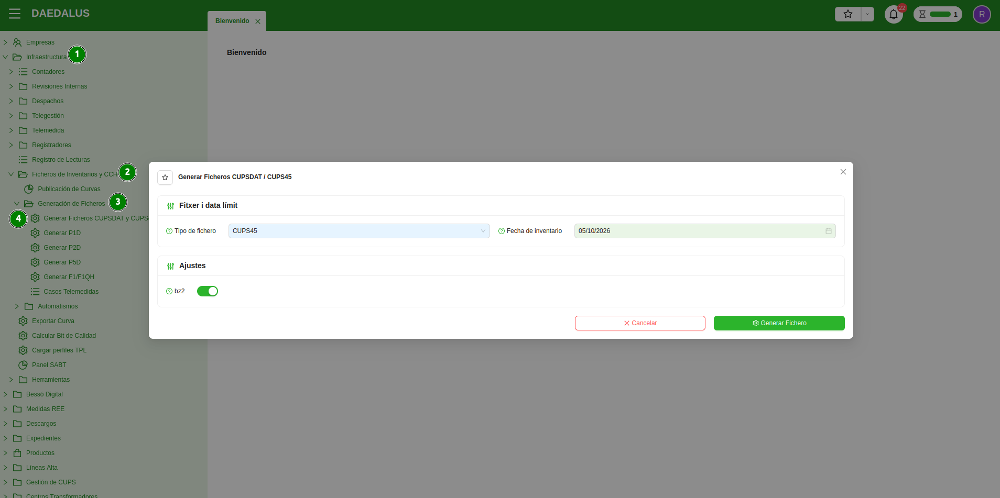
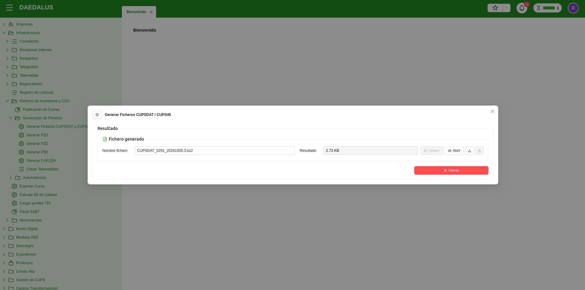

# Inventaris de CUPS

Els fitxers d'inventari de CUPS serveixen per a informar a l'Operador del Sistema de l'històric de CUPS que té una
distribuïdora. És amb aquests fitxers que l'Operador del Sistema valida i actualitza els seus propis inventaris. 

Per tant, és recomanable mantenir els inventaris al dia, ja que en ells s'informa entre altres coses la 
comercialitzadora activa en cada període, si hi ha autoconsums associats, la propietat de l'equip de mesura, etc. Si no
s'informen, els fitxers de mesures poden retornar errors `BAD2` si a l'Operador del Sistema no consten els CUPS pels
quals es publica la mesura.

Els fitxers s'han de generar i s'han de publicar al Concentrador Secundari.

## Generar els fitxers d'inventari

Generar fitxers d'inventari a l'ERP de distribuïdora és molt senzill. Només cal invocar l'assistent 
**Generar Fitxers CUPSDAT i CUPS45**. 

El trobareu al menú **Infraestructura > Fitxers d'Inventaris i CCH > Generació de Fitxers**.

Haureu de triar quin tipus de fitxer voleu generar, la data límit i si voleu el fitxer comprimit en BZ2 o no.

Un cop fet això, es pot llançar la generació del fitxer (que trigarà més o menys segons la mida de la cartera de CUPS de
la distribuïdora). En acabar la generació, el fitxer apareixerà a l'assistent per a poder ser descarregat.

!!! Info "Nota 1"
    Els fitxers contenen un històric de 12 mesos dels CUPS, així que la data límit serveix per a determinar des de
    quina data es retrocedeix fins a 12 mesos. Per defecte, es suggerirà sempre la data vigent com a data d'inventari.

## Tipus d'inventaris

La Distribuïdora pot generar diferents tipus d'inventari (segons els tipus de punt de mesura). Els fitxers d'inventari 
i els seus formats els podreu trobar al document oficial de REE: **'Ficheros para el intercambio de información de medida'**.

A continuació es presenten els tipus de fitxers d'inventari existents:

### Inventaris de la distribuïdora

Els inventaris de distribuïdora són els que la mateixa distribuïdora generar i publica al Concentrador Secundari, 
informant dels seus CUPS a l'Operador del Sistema.

* **CUPS45**: Notifica l'inventari de punts frontera de client de tipus 4 i 5.
* **CUPSDAT**: Notifica l'alta, baixa, modificacions o correccions de punts frontera de client tipus 1, 2 i 3.

### Inventaris de l'Operador del Sistema

Els inventaris de l'Operador del Sistema són els que l'Operador del Sistema manté al seu sistema, actualitzant-ne les 
dades a partir dels inventaris que rep de les distribuïdores. Es van republicant periòdicament i es poden consultar des
del directori d'entrada del Concentrador Secundari.

* **CUPS45OS**: Publicació de l'inventari de punts frontera de client tipus 4 i 5.
* **CUPSDATOS**: Publicació de l'inventari de punts frontera de client tipus 1, 2 i 3.

## Automatismes

L'ERP de distribuïdora compta amb automatismes per a publicar automàticament al Concentrador Secundari els fitxers
**CUPSDAT** i **CUPS45** si així es desitja. D'aquesta manera, el manteniment dels inventaris passa a ser desatès i
només cal revisar de tant en tant a l'entrada del Concentrador Secundari que no hi hagi errors en la publicació.

!!! Info "Nota 2"
    Degut a un error en la manera de processar els fitxers, l'Operador del Sistema considera que totes les línies dels
    fitxers **CUPSDAT** són canvis, abans de comparar si al seu inventari **CUPSDATOS** té la mateixa informació o si
    aquesta és diferent. Això fa que els fitxers **CUPSDAT** rebin resposta amb error `BAD2` de forma habitual. 
    Això és molest i ja s'ha informat de forma reiterada a l'Operador del Sistema, però per ara no hi ha correcció a 
    la manera en que fan el processat.
