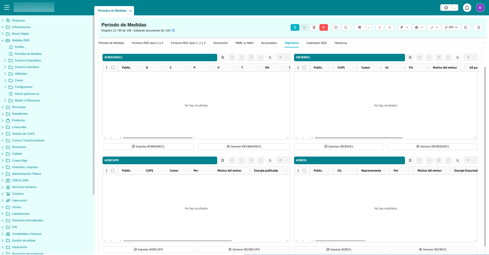
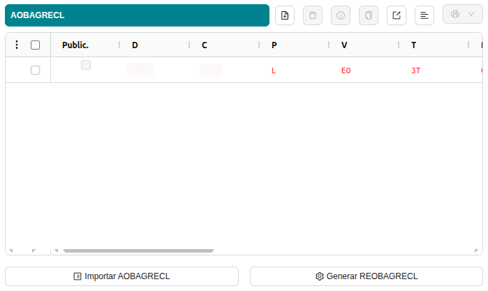
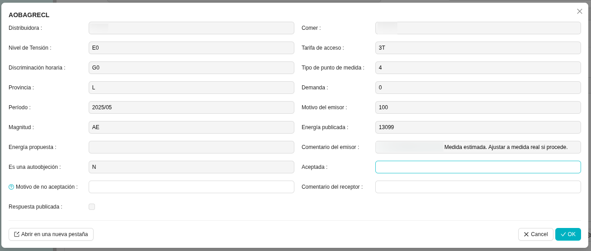
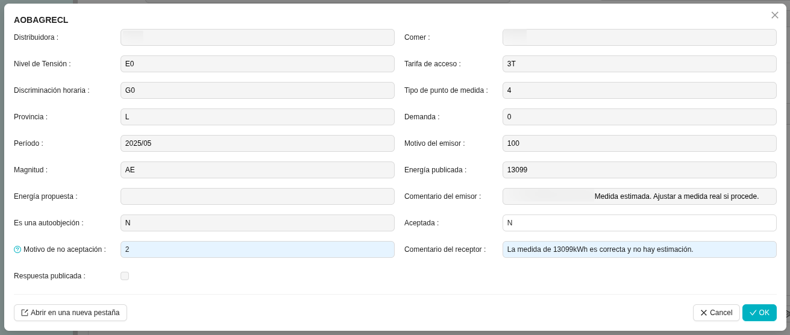
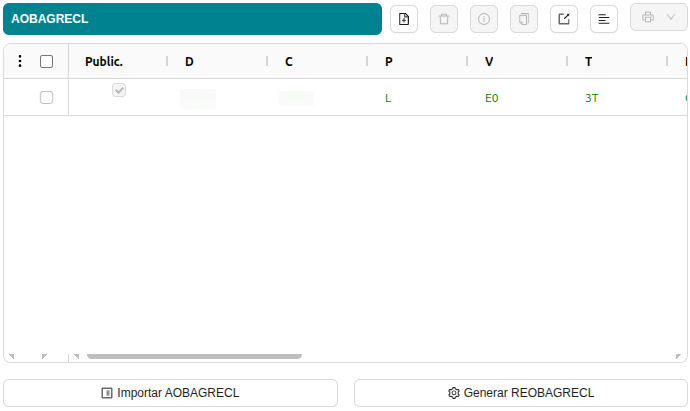

# Tractament d'Objeccions

Els fitxers d'objeccions a la part de la Distribuïdora són els acusaments de rebuda que reben aquestes per part de les Comercialitzadores.
En aquests acusaments, se'ls comunica que les mesures que han imputat a les Comercialitzadores no són correctes.
L'Operador del Sistema recull i valida aquestes objeccions rebudes de la Comercialitzadora i les fa arribar a la Distribuïdora
objectada, la qual haurà de revisar les objeccions i donar-los resposta.

Amb la finalitat de facilitar donar resposta a aquests fitxers d'objeccions, la Distribuïdora
primer haurà de carregar els acusaments de rebuda (o fitxers) als períodes de mesures corresponents pel que 
la Comercialitzadora ha objectat. Per fer-ho, dins l'ERP, caldrà anar a:

**Mesures REE > Períodes de Mesures > XX/XXXX (període MES/ANY)**

## Períodes de Mesures

Un cop haguem seleccionat el període de mesures pel qual se'ns ha objectat, per gestionar les objeccions que hem rebut de 
les Comercialitzadores, anirem a la pestanya "Objeccions" tal com es veu a la captura de pantalla:

!!! Info "Important"
    El primer que haurem de fer abans d'intentar generar cap resposta, és descarregar l'acusament de rebuda (el fitxer) de l'objecció del concentrador 
    secundari corresponent i importar-lo prement el botó que s'escaigui ("Importar XXX") segons el tipus d'objecció a tractar.

## Tractar l'objecció
* **Importar Fitxer d'Objecció:** Un cop importat el fitxer d'objecció, aquest ens apareixerà de color vermell a la taula 
corresponent. Això significa que l'objecció encara no ha sigut tractada però que ja la tenim carregada al sistema.

* **Obrir l'objecció:** Fent doble clic al registre de la taula, se'ns obrirà el formulari de l'objecció amb la informació que conté. 
En aquesta mateixa finestra podrem començar a respondre-la emplenant els camps que el mateix formulari ens permet modificar.

* **Respondre l'objecció:** Un cop emplenats els camps per generar la resposta: 'Acceptada' (S/N), 'Motiu' (0/1/2) i 'Comentari' (amb les observacions 
que creiem necessàries), premerem el botó "OK" i en sortir de l'assistent farem clic a 'Generar REXXX' (Pel nostre exemple, 'Generar REOBAGRECL').

* **Publicar la resposta:** Quan haguem generat el fitxer REOBAGRECL (pel nostre exemple), la línia passarà de vermella a verda. 
Això significa que el fitxer de resposta ja s'ha generat i que el podreu trobar adjunt al període de mesures.

!!! Info "Important"
    La resposta a l'objecció encara no s'ha publicat. Per fer-ho caldrà: o bé pujar la resposta manualment al concentrador secundari corresponent, 
    o bé utilitzar l'assistent 'Publicar fitxers al CS', seleccionar el fitxer de resposta i l'FTP/SFTP on pujar-lo i finalment publicar-lo.

## Tipus d'objeccions

La Distribuïdora pot rebre diferents tipus d'objeccions (agregades, desagregades, per CUPS, per CILs, etc). Tots aquests tipus de fitxers d'objeccions 
i els seus formats els podreu trobar al document oficial de REE: **'Ficheros para el intercambio de información de medida'**.

Un resum dels fitxers d'objeccions que ens podem trobar:

### Agregats
* **OBAGRECL**: Objeccions d'agregacions (clients tipus 4/5)
* **REOBAGRECL**: Resposta a objeccions d'agregacions (clients tipus 4/5)
* **AOBAGRECL**: Justificant de recepció a objeccions d'agregacions (clients tipus 4/5)
* **REVAGRE**: Sol·licitud de revisió de la resolució d'objeccions d'agregacions (clients tipus 4/5)

### Desagregats
* **OBJEINCL**: Objeccions (clients tipus 4/5 desagregats)
* **REOBJEINCL**: Resposta a objeccions (clients tipus 4/5 desagregats)
* **OBCUPS**: Objeccions (clients tipus 1/2 i 3)
* **REOBCUPS**: Resposta a objeccions (clients tipus 1/2 i 3)
* **REVCL**: Sol·licitud de revisió de la resolució d'objeccions (clients tipus 1/2 i 3)
* **OBCIL**: Objeccions de punts frontera d'instal·lacions de producció d'energia elèctrica a partir de fonts d'energia
renovables, cogeneració i residus (RECORE tipus 3/4 i 5)
* **REOBCIL**: Resposta a objeccions de punts frontera d'instal·lacions de producció d'energia elèctrica a partir de
fonts d'energia renovables, cogeneració i residus (RECORE tipus 3/4 i 5)
* **REVCIL**: Sol·licitud de revisió de la resolució d'objeccions de punts frontera d'instal·lacions de producció d'energia
elèctrica a partir de fonts d'energia renovables, cogeneració i residus (RECORE de tipus 3/4 i 5)