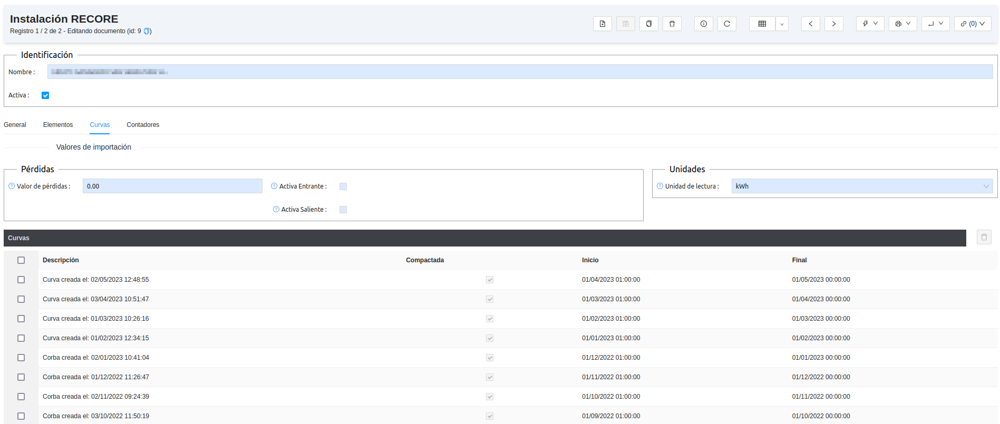

# Règim Especial

## Instal·lacions

Des del menú: **Gestió RE > Instal·lacions > Instal·lacions RE** accedim a les
instal·lacions de RE donades d'alta. Cada instal·lació porta associat un CUPS,
un representant i una unitat de programació entre d'altres.
Per donar d'alta/crear-ne una, fem clic sobre el botó nou.
A continuació es mostren i s'en descriuen els detalls:

* Nom: nom de la instal·lació
* CUPS: cal destacar que els punts de subministre de règim especial, solen acabar
amb la terminació 1F
* Titular: Nom del Titular
* Tipo: tipus d'instal·lació segons potència (1, 2, 3, 4 o 5)
* Provincia: codi REE de Província
* Potències:
  * potència Pic (kW)
  * potència Nominal (kW)
  * Potència Nominal Màxima (kW)
  * Potencia de Cortocircuito
* Unitat de Programació
  * Representant: Nom del representant (cal tenir creat el partner)
  * Unitat de Programació: Codi de la unitat de programació
  * Dates: data d'alta i baixa

## Preparació de les dades

Abans de generar els fitxers de mesures de RE, cal preparar-ne les corbes. Es
pot fer de diverses formes:

* S02: Important fitxers corba de tipus S02.xml
* ZiverQ: Important fitxers corba de tipus ZiverQ
* Importar de les col·leccions TG i TM: Importa directament la corba del
comptador que ens ha arribat o hem importat del sistema de telegestió i/o
telemesura

Les corbes importades es guarden a la pestaña corbes de cada instal·lació

## Generació de fitxers

En el **Administració Pública > REE > Agregacions de Régim Especial** es generen
els fitxers:

* **MAGRE:** Dades horàries d'energia d'agregacions d'instal·lacions de
  producció d'energia elèctrica a partir de fonts d'energia renovables,
  cogeneració i residus tipus 3 i 5.
* **INMERE:** Acumulat mensual d'energia de punts frontera d'instal·lacions de
  producció d'energia elèctrica a partir de fonts d'energia renovables,
  cogeneració de residus tipus 3 i 5 desagregats.
* **MEDIDAS:**: Dades horàries d'energia per codi CIL d'instal·lacions de
  producció d'energia elèctrica a partir de fonts d'energia renovables,
  cogeneració i residus tipus 3 i 5.

!!! Info "Nota 1"
    Un CIL es un CUPS de régim especial amb la terminació 001.

!!! Info "Nota 2"
    Aquests fitxers es poden generar en format comprimit .bz2

Per a més informació, consultar apartats 4.2.12 (MAGRE) i 4.2.13
(INMERE) del document de REE.
