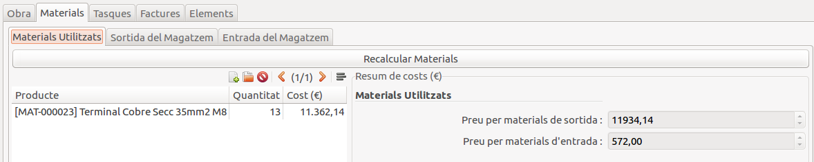

# Gestió d'Obres en elements de la xarxa

Aquest apartat contempla desde la [Gestió de costs](#gestio-de-costs)
fins la [Generació de Fitxers d'Inventari](#generacio-de-fitxers-dinventari).

Alternativament, es pot [Importar les dades des de fitxers](#importacio-de-dades-desde-fitxers)
per tal de generar els fitxers sense portar la comptabilitat en el nostre programa.

## Estats de les obres

Les obres es composen de 4 estats:

|     Estat     | Descripció                                                             |
|:-------------:|:------------------------------------------------------------------------|
|   Esborrany   | Preparar una obra (número, elements afectats, material necessari)      |
|    Oberta     | Obra en procés                                                         |
|    Pendent    | Obra finalitzada. Pendent de recepció de factures o altres costs       |
|  Finalitzada  | Obra finalitzada. Costs estàtics. Repartiment de costs per instalació. |

## Gestió de Costs

En la pàgina principal de la Obra es troba un resum dels diferents costs:

- [Materials](#gestio-de-costs-de-materials)
- [Tasques](#gestio-de-costs-de-treballs)
- [Factures](#gestio-de-costs-de-proveidors)

En la pestanya d'obra a més podem gestionar altres configuracions de la obra:

- Tipus de treball: A escollir entre _MANTENIMENT_ o _INVERSIÓ_.
- Cost Planificat (€): Cost planificat de la obra.
    - Quan el cost total de la obra sobrepassi el 50%, aparaixerà un avís.
    
    - Quan el cost total de la obra sobrepassi el 100%, aparaixerà un avís.
    

### Gestió de costs de Materials

La gestió de costs de materials contemplen els materials utilitzats
en una obra, tant amb sortides de materials en stock com amb
els materials que retornen desde l'obra al magatzem.

En l'apartat de Materials, trobarem tres pestanyes:

- Resum de Costs
- Sortida de materials
- Retorn de materials

Tant la sortida de materials com el retorn de materials
compten amb tres seccions (pestanyes) diferents:

- Comandes. Mostra les comandes relacionades amb l'obra.
- Albarans. Mostra els albarans relacionats amb les comandes anteriors.
- Moviments. Mostra tots els moviments de stock dels albarans anteriors.

Únicament es poden afegir i modificar les comandes.

!!! Tip "Consell"
    Es pot utilitzar els enllaços laterals per accedir a les
    comandes i als albarans.

!!! Tip "Nota"
    Tant la sortida de material com el retorn de material,
    compten pel cost si les comandes estan aprobades o realitzades.
    No es té en compte si els albarans s'han realitzat.

#### Resum de costs de materials

Aquesta pestanya presenta un resum de costs de materials.

Per una banda es troba el desglossament dels costs de materials
mitjançant un breu resum de materials utilitzats.

!!! Note "Nota"
    Cal utilitzar el botó "Actualitzar resum de materials" per
    actualitzar el resum de materials.

Per altra banda, es pot observar el resum de costs pels materials
que surten del magatzem i l'import dels productes que retornen.

### Gestió de costs de Treballs

En la pestanya de gestió de Treballs (Tasques) podem visualitzar les hores
treballades per treballador en un llistat de treballs realitzats.

De forma més genèrica, podem veure l'estat de les tasques de la obra. Que permet
veure el total d'hores previstes i les hores invertides per cada feina desglossada.

Per entrar les hores, es pot utilitzar l'assistent d'entrar hores
(mitjançant el botó "Entrar Hores") o bé, accedir a les tasques de la obra
mitjançant l'enllaç lateral i des del formulari de la tasca,
introduïr les hores pertinents.

!!! Info "Nota"
    Per defecte, el preu hora serà el que tingui configurat l'usuari que realitza
    la tasca (modificable _a posteriori_)

### Gestió de costs de Provïdors

En la pestanya de Proveïdors es troba un enllaç a factures de proveïdor.

Cal introduïr manualment les dades de les factures.
El més important és introduïr els costs de les diferents línies (o una sola
línia amb el total). El nivell de detall a introduïr depén més de l'usuari
gestor de obres.

Per al cálcul únicament utilitzem el cost total de la factura (suma de línies i impostos).

## Gestió d'elements afectats

## Generació de Fitxer d'Inventari

## Importació de dades desde fitxers
