# SECCIÓ DE SOL·LICITUDS DE L'OFICINA VIRTUAL

Dins de l'oficina virtual dels usuaris de la nostra xarxa, independentment de la comercialitzadora que tinguin contractada, poden demanar-nos sol·licituds a través d'una secció:

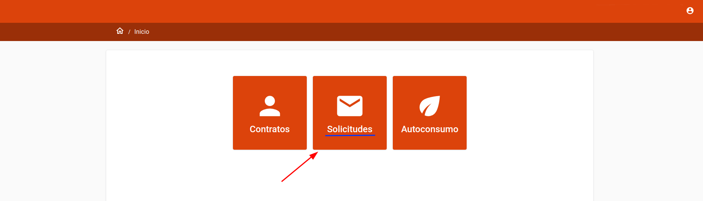

Aquesta secció és editable: podem canviar el missatge, els tipus, i els adjunts. Per fer-ho, s'ha d'accedir al mòdul de CRM de l'ERP:

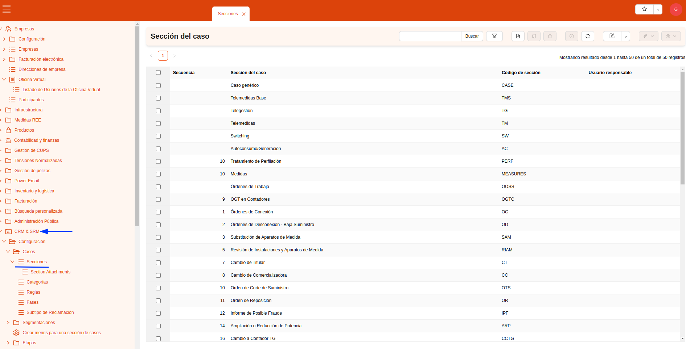

A dins de les seccions, si filtrem a “secció pare” per “sol·licituds”, tindreu el llistat de totes les sol·licituds que hi ha, i podreu entrar a la que vulgueu per editar-la, o crear-ne de noves:

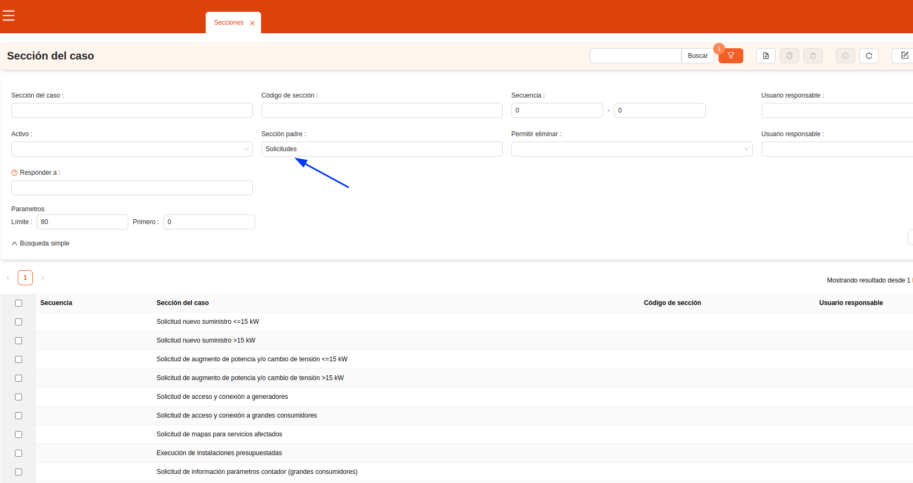

## Configuració de les sol·licituds

Podem crear o editar cada secció de les sol·licituds. Primerament, quin nom volem que apareguin a l'oficina virtual (recordeu que s'ha de traduir):

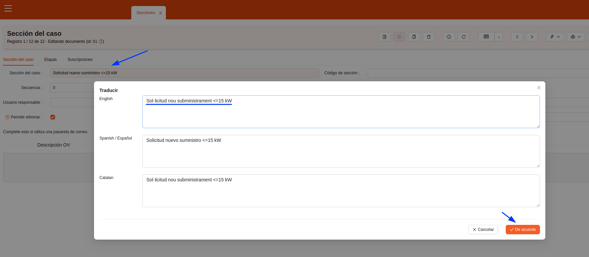

1. El camp **seqüència** és per establir l'ordre dins del desplegable de l'oficina Virtual.
2. El **Codi de secció** és per completar el nom de la secció.
3. El xec **Actiu** serveix perquè aparegui al desplegable de l'OV.
4. La **secció pare** serveix per classificar i trobar fàcilment cada sol·licitud.
5. A la **descripció OV** es pot escriure una descripció perquè surti a l'oficina virtual.

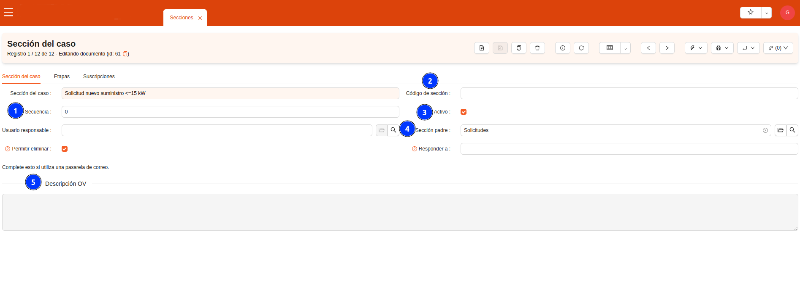

## Com adjuntar els formularis

Per adjuntar els formularis que volem que hi hagi a cada sol·licitud hem d'anar al mòdul de CRM, a “section atracaments”:

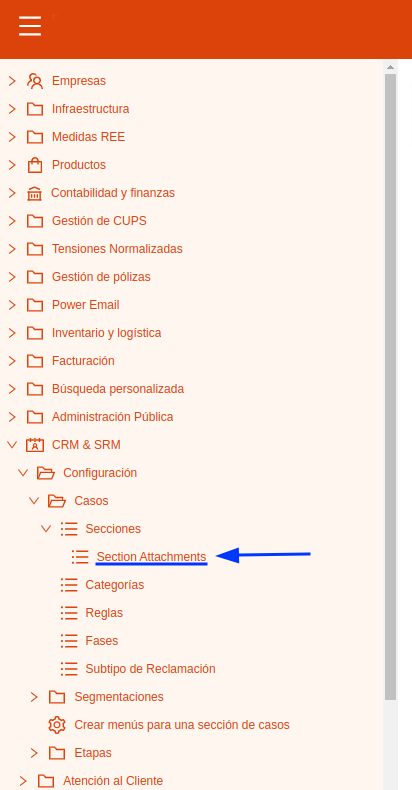

Un cop hàgim guardat la sol·licitud, accedim aquí per poder adjuntar el document. Hem d'omplir el nom de l'adjunt, triar a “file type” de quin tipus d'adjunt es tracta (obligatori omplir per enviar, opcional o informatiu), i a la “secció relacional adjunta”, hem de buscar la sol·licitud on volem que hi hagi aquest adjunt:

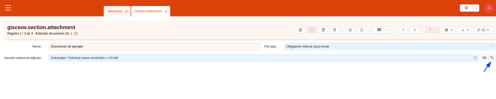

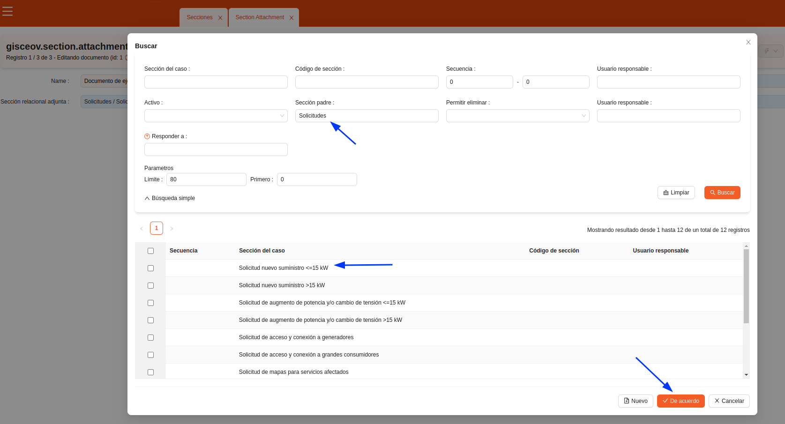

Finalment, anem a la icona dels adjunts, ens obre una nova finestra on posem el nom del document adjunt, i a les “dades” podem anar a buscar el fitxer que s'adjuntarà al cas (sol·licitud):

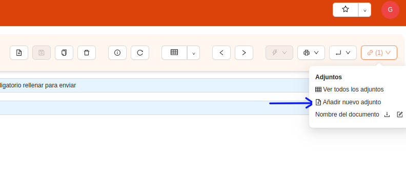

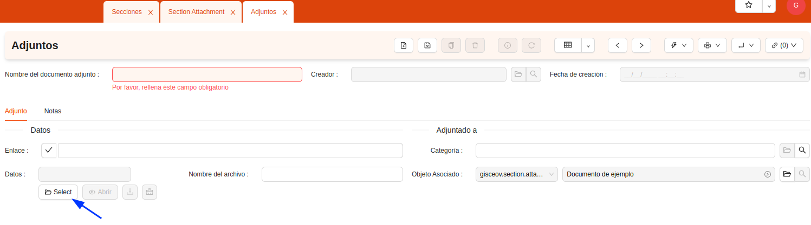

Un cop afegit el document adjunt, l'usuari ja el podrà descarregar de l'oficina virtual, omplir-lo, i tornar-lo a penjar signat. Un cop faci això, en el llistat de casos “sol·licitud” veureu dos adjunts: el document per signar, i el que ha omplert l'usuari. 

## On anar a buscar les sol·licituds omplertes

Quan els usuaris utilitzin la secció de sol·licituds per demanar-nos, els formularis que omplin i ens tornin a adjuntar els trobarem al mòdul CRM, als casos d’atenció client:

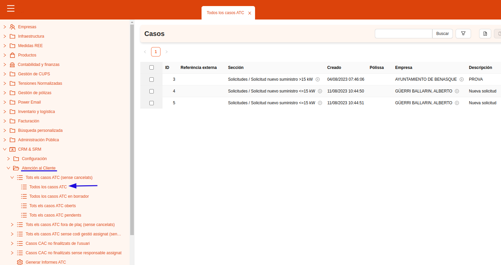

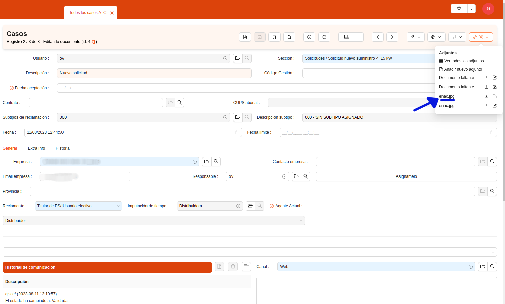

Des d’aquí podreu gestionar aquestes peticions. 